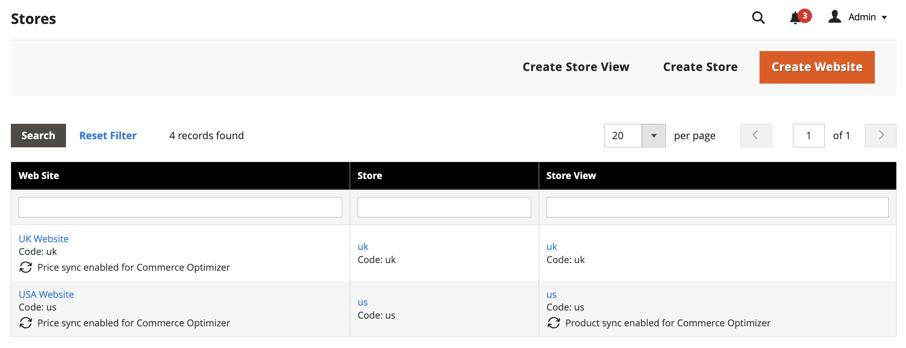
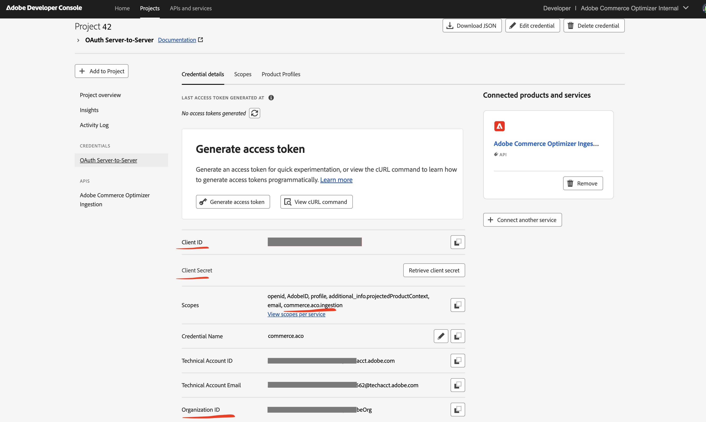

# 開始使用

安裝並設定Adobe Commerce Optimizer Connector以將您的Adobe Commerce目錄資料與[!DNL Adobe Commerce Optimizer]同步，然後監視資料同步狀態，以確保您的店面為最新狀態。

{{aco-integration-environment-alignment}}

## 使用整合的需求

* Adobe Commerce 2.4.7+

   * PHP 8.2、8.3或8.4
   * Composer 2.x

* 具有已布建沙箱執行個體的[!DNL Adobe Commerce Optimizer]授權。

* [驗證金鑰](https://experienceleague.adobe.com/zh-hant/docs/commerce-operations/installation-guide/prerequisites/authentication-keys)，以使用Composer下載Commerce Connector中繼套件。

* 管理員存取[Adobe Commerce Optimizer沙箱執行個體](../optimizer/get-started.md)。

設定整合的Adobe Commerce使用者必須具備：

* Adobe Commerce管理員的管理員存取權。

* [對Adobe Commerce應用程式伺服器的命令列存取權](https://experienceleague.adobe.com/zh-hant/docs/commerce-on-cloud/user-guide/project/user-access)。

* 開發人員存取已布建[!DNL Adobe Commerce Optimizer]專案的[IMS組織](https://experienceleague.adobe.com/zh-hant/docs/core-services/interface/administration/organizations？)。

>[!BEGINSHADEBOX]

## 先決條件

如果您已安裝下列任何擴充功能，請在安裝Adobe Commerce Optimizer Connector前解除安裝它們：

* Adobe Commerce即時搜尋(`magento/live-search`)
* Adobe Commerce產品建議(`magento/product-recommendations`)
* Adobe Commerce目錄服務(`magento/catalog-service`， `magento/catalog-service-installer`)
* 資料管理儀表板(`magento-catalog-sync-admin`)

與這些擴充功能相關聯的資料仍可在Commerce資料庫中使用。 但是，當聯結器啟用時，它不會匯出到[!DNL Adobe Commerce Optimizer]。 若要在啟用聯結器後實作這些擴充功能所提供的搜尋和銷售功能，請從[[!DNL Adobe Commerce Optimizer] 管理UI](https://experienceleague.adobe.com/zh-hant/docs/commerce/optimizer/overview#quick-tour)進行設定。

>[!IMPORTANT]
>
>如果在啟用聯結器之前未移除這些擴充功能，您可能會看到設定畫面中斷、[!DNL Adobe Commerce Optimizer]中的重複資料（因為相同的資料會從聯結器和現有的擴充功能匯出），以及記錄中的401或403錯誤（因為擴充功能和聯結器驗證連線服務的方式發生衝突）。

>[!ENDSHADEBOX]

## 設定步驟

請依照下列步驟啟用聯結器，並開始將資料從Commerce同步至您的Adobe Commerce Optimizer執行個體。

1. **[使用Composer安裝Adobe Commerce Optimizer聯結器套件](#install-the-adobe-commerce-optimizer-connector-package)**，以將您的Commerce執行個體連線至[!DNL Adobe Commerce Optimizer]。

1. **[自訂管理員的資料匯出設定](#customize-the-commerce-scopes-export-configuration)**。

1. **[啟用 [!DNL Adobe Commerce Optimizer] 整合](#enable-the-adobe-commerce-optimizer-integration)**。

1. **[確認資料同步處理正在運作](#verify-that-the-data-sync-is-working)**。


## 安裝Adobe Commerce Optimizer聯結器套件 {#install-the-adobe-commerce-optimizer-connector-package}

Adobe Commerce Optimizer Connector是以撰寫器中繼資料的形式提供，適用於具有[!DNL Adobe Commerce Optimizer]的有效授權的所有Commerce商家。

### 安裝步驟

1. 使用撰寫器新增`adobe-commerce/commerce-data-export-aco-adapter`模組：

   ```shell
   composer require adobe-commerce/commerce-data-export-aco-adapter
   ```

1. 將變更部署至您的Adobe Commerce中繼環境。

部署完成後，Commerce Optimizer管理功能表會提供Commerce選項。 按一下&#x200B;**[!UICONTROL Commerce Optimizer]**，直接從Commerce管理員開啟您的Commerce Optimizer執行個體。

>[!NOTE]
>
>如需詳細的擴充功能安裝指示，請參閱下列指南：
>
>在雲端基礎結構上的Adobe Commerce上[安裝擴充功能](https://experienceleague.adobe.com/zh-hant/docs/commerce-on-cloud/user-guide/configure-store/extensions)
>
>[在Adobe Commerce內部部署安裝擴充功能](https://experienceleague.adobe.com/zh-hant/docs/commerce-operations/installation-guide/tutorials/extensions)

## 自訂Commerce範圍匯出設定

依預設，所有Commerce範圍（網站、客戶群組和商店檢視）的目錄資料同步已啟用。 您可以根據業務需求自訂匯出設定，以僅同步特定範圍的資料。 例如，如果您有多個共用相同語言的存放區檢視，您可以選擇只匯出其中一個存放區檢視的資料，並在[!DNL Adobe Commerce Optimizer]中作為多個目錄檢視的[目錄來源](../optimizer/setup/catalog-source.md)。

>[!IMPORTANT]
>
>變更匯出設定會觸發完整的重新編列索引，這可能需要相當長的時間，視您的目錄大小而定。 Adobe建議先設定Commerce範圍以同步至Commerce Optimizer，再啟用整合併開始初始資料同步。


下表說明會在每個範圍層級匯出哪些資料：

| 範圍 | 資料已匯出 | 附註 |
|----------------------------| --------------- |-------|
| 網站與客戶群組 | 價格與價格手冊 | 每組價格會使用命名慣例`<website>::<SHA1 of customer group ID>`匯出為[價格簿](../optimizer/setup/pricebooks.md)。 包括網站的所有客戶群組。 |
| 存放區檢視 | 產品和產品屬性 | 每個存放區檢視都會在[!DNL Adobe Commerce Optimizer]中建立個別的[目錄來源](../optimizer/setup/catalog-source.md)。 |

{width="600" zoomable="yes"}

**若要變更網站或商店檢視的設定：**

1. 在Commerce管理員中，導覽至「**[!UICONTROL Stores]** > [!UICONTROL Settings] > **[!UICONTROL All Stores]**」。

1. 選取您要設定的網站或商店檢視。

1. 在&#x200B;**[!DNL Adobe Commerce Optimizer]匯出程式設定**&#x200B;中，視需要使用核取方塊來啟用或停用資料同步處理。

   {width="500" zoomable="yes"}

1. 儲存您的變更。

### 啟用和停用行為

| 動作 | 結果 |
| -------- | -------- |
| 停用商店檢視 | 目錄來源仍保留在[!DNL Adobe Commerce Optimizer]中，但已移除所有資料。 |
| 停用然後重新啟用存放區檢視 | 相同的目錄來源會以完整資料重新同步重新填入。 |

## 啟用[!DNL Adobe Commerce Optimizer]整合

>[!IMPORTANT]
>
>完成設定後，資料同步處理就會在背景開始。 視目錄大小而定，資料同步程式可能需要幾分鐘到數小時的時間。

### 取得必要的連線詳細資料

從[Adobe Developer Console](https://developer.adobe.com/console)，建立啟用[!DNL Adobe Commerce Optimizer]內嵌服務的新專案，並產生OAuth伺服器對伺服器認證。 如需詳細指示，請參閱&#x200B;*銷售開發人員指南*&#x200B;中的[取得IMS認證](https://developer.adobe.com/commerce/services/optimizer/data-ingestion/authentication/#obtain-ims-credentials)。

從證明資料頁面儲存下列值：

* **組織識別碼** (`org_id`)
* **使用者端識別碼** (`client_id`)
* **使用者端密碼** (`client_secret`)

{width="500" zoomable="yes"}

### 取得[!DNL Adobe Commerce Optimizer]執行個體詳細資料

從[!DNL Adobe Commerce Optimizer]執行個體[[!DNL Instance details] 頁面](../optimizer/get-started.md#manage-instances)上的&#x200B;_[!DNL Instance Id]_&#x200B;欄位或用來存取執行個體的URL取得_&#x200B;租使用者識別碼&#x200B;_。 例如，在`https://experience.adobe.com/#/@<your organization>/in:<tenant ID>/commerce-optimizer-studio/home`中。

1. 從Commerce Admin中，選取&#x200B;**[!UICONTROL Adobe Commerce Optimizer]**&#x200B;以顯示包含指示的設定頁面。

   ![[!DNL Adobe Commerce Optimizer]設定頁面](/help/aco-connector/assets/aco-connector-admin-installation.png){width="500" zoomable="yes"}

1. 從命令列，[使用SSH](https://experienceleague.adobe.com/zh-hant/docs/commerce-on-cloud/user-guide/develop/secure-connections)連線至Commerce中繼環境。

1. 執行下列Commerce CLI命令來設定整合，將預留位置值取代為Commerce Optimizer專案的值：

```terminal
bin/magento aco:config:init --org_id=your-org --tenant_id=your-tenant --client_id=your-client-id --client_secret=your-secret
```

1. 返回Commerce管理員並選取[!UICONTROL Adobe Commerce Optimizer]選項，以驗證連線。

   當您按一下選項時，它會在新索引標籤中開啟[!DNL Adobe Commerce Optimizer] UI。

## 確認資料同步處理運作正常

您可以從Admin中可用的[資料摘要同步狀態](https://experienceleague.adobe.com/zh-hant/docs/commerce-admin/systems/data-transfer/data-sync/data-feed-sync-status)頁面監視及驗證同步是否正常運作。

1. **在Commerce管理員中檢查同步狀態：**

   前往&#x200B;**[!UICONTROL System]** > [!UICONTROL Data Transfer] > **[!UICONTROL Data Feed Sync Status]**。

   ![具有摘要專案狀態報告的[資料摘要同步處理狀態]頁面](./assets/data-feed-sync-status.png){width="500" zoomable="yes"}

   同步執行時，摘要資料會顯示已成功傳送的記錄。 選取摘要以檢視詳細資料或疑難排解同步問題。

1. **確認資料已送達Commerce Optimizer：**

   從[!DNL Adobe Commerce Optimizer]功能表選取&#x200B;**[!UICONTROL Data Sync]**。

   {width="500" zoomable="yes"}

   確認已出現預期的產品、價格和屬性。

>[!TIP]
>
>如果您有任何資料同步問題，請參閱&#x200B;*SaaS資料匯出*&#x200B;檔案中的[疑難排解](/help/data-export/troubleshooting-logging.md)一節。

## 後續步驟

1. **設定[!DNL Adobe Commerce Optimizer]目錄檢視與原則**

   在[!DNL Adobe Commerce Optimizer] UI中建立目錄檢視和原則。 請注意，價格簿是從Adobe Commerce客戶群組自動建立的。 如需指示，請參閱&#x200B;*Commerce Optimizer使用手冊*&#x200B;中的[目錄檢視](../optimizer/setup/catalog-view.md)和[原則](../optimizer/setup/policies.md)檔案。

1. **在Edge Delivery Services上設定Commerce店面**

   依照[店面設定檔案](https://experienceleague.adobe.com/developer/commerce/storefront/setup/?lang=zh-Hant)將您的店面連線到[!DNL Adobe Commerce Optimizer]執行個體，並開始提供個人化的商務體驗。


