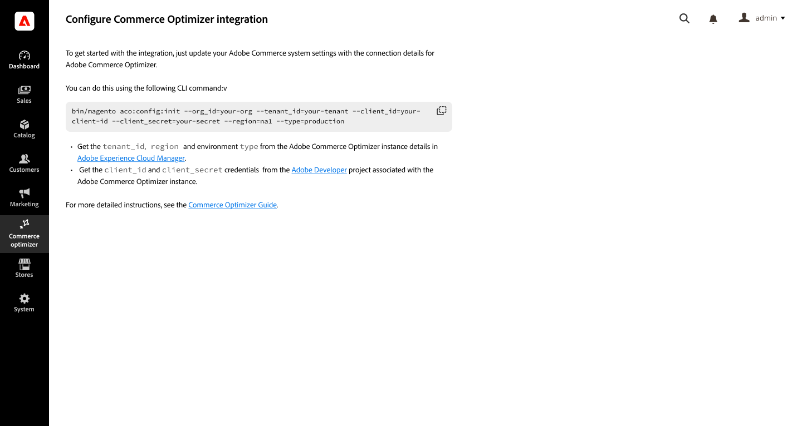

# Commerce的Adobe Commerce Optimizer Connector

Adobe Commerce Connector是整合橋接器，可在雲端或內部部署的現有Adobe Commerce Cloud與Adobe Commerce Optimizer可撰寫目錄資料模型之間，同步目錄和定價資料。 此功能可啟用如動態AI搜尋、建議、快速載入Headless商店對面(包括Edge Delivery Services上的Adobe Commerce商店對面)和即時效能分析等功能。

>[!NOTE]
>
>本檔案說明提早存取開發中的產品，並未反映所有可供一般使用的功能。

## 架構與體驗

Adobe Commerce Connector的運作方式是將Commerce的`website/store/storeview`目錄階層對應至Adobe Commerce Optimizer `channel/policy/source`資料模型。

您不必透過Commerce Admin設定和管理Commerce服務（即時搜尋和產品建議），而是使用[Adobe Commerce Optimizer銷售工具](../optimizer/merchandising/overview.md)來管理產品探索（即時搜尋）和建議（產品建議）規則設定。  Adobe Commerce例項會成為目錄和價格資料的資料來源。 資料在Commerce中更新時，更新會同步至Adobe Commerce Optimizer執行個體。

## 工作流程

聯結器可啟用數個關鍵工作流程：

* **將Commerce目錄資料匯出至Adobe Commerce Optimizer** — 在`website`層級匯出價格和價格簿資料。 產品和產品屬性資料會匯出至`store view`層級。 依預設，所有Commerce範圍（網站和商店檢視）的目錄資料同步已啟用。

  若要啟用此工作流程，請使用Composer安裝`adobe-commerce/commerce-data-export-aco-adapter` PHP擴充功能，然後提供IMS認證以驗證Commerce專案之間的連線。

* **對應Commerce `website/store/storeview`資料以匯出至Adobe Commerce Optimizer**

  您可以選擇自訂Adobe Commerce Optimizer匯出程式設定，以僅匯出特定範圍的資料，方法是從Admin (**[!UICONTROL Stores]** -> [!UICONTROL Settings] -> **[!UICONTROL All Stores]**)中的存放區網格更新匯出程式設定。

* **銷售規則組態與管理**

  聯結器啟用時，產品探索和建議的銷售規則會從Adobe Commerce Optimizer UI定義和管理，而非從Commerce Admin的[!UICONTROL Live Search]和[!UICONTROL Product Recommendations]頁面。

* **在Edge Delivery Services上部署您的Commerce店面**

  在設定與Adobe Commerce Optimizer的整合後，您可以在Edge Delivery服務上設定和部署Commerce店面，以使用Adobe Commerce Optimizer提供的可組合、API導向的架構和模組化元件，提供超快速的效能、擴充能力、順暢的內容製作、整合式個人化，並降低營運成本。

## 使用整合的需求

* Adobe Commerce 2.4.5+

   * PHP 8.1、8.2、8.3或8.4
   * Composer 2.x

* 具有已布建沙箱例項的Adobe Commerce Optimizer授權。

* 存取[repo.magento.com](https://repo.magento.com)以使用Composer下載Commerce Connector中繼資料。

* 管理員存取[Adobe Commerce Optimizer沙箱執行個體](https://experienceleague.adobe.com/en/docs/commerce-learn/tutorials/adobe-commerce-optimizer/create-first-instance)。

設定整合的Adobe Commerce使用者必須具備：

* Adobe Commerce管理員的管理員存取權。

* [對Adobe Commerce應用程式伺服器的命令列存取權](https://experienceleague.adobe.com/en/docs/commerce-on-cloud/user-guide/project/user-access)。

* 開發人員對布建Adobe Commerce Optimizer專案的[IMS組織](https://experienceleague.adobe.com/en/docs/core-services/interface/administration/organizations?)的存取權。

## 開始使用

1. **設定整合**

   1. [安裝Commerce聯結器封裝](#install-the-commerce-connector-package)。

   1. [取得設定Commerce Optimizer連線所需的值](#get-required-values-for-configuring-the-commerce-optimizer-connection)

   1. [啟用Adobe Commerce Optimizer整合](#enable-the-adobe-commerce-optimizer-integration)。

   1. [確認資料同步處理正在運作](#verify-that-the-data-sync-is-working)。

   1. [自訂資料匯出設定](#customize-commerce-data-export-configuration) （選擇性）。

1. **[設定Adobe Commerce Optimizer存放區](#configure-adobe-commerce-optimizer-stores)**

1. **[在Edge Delivery Services上設定Commerce店面](#set-up-a-commerce-storefront-on-edge-delivery-services)**

## 安裝Commerce聯結器套件

擁有Adobe Commerce使用中授權的Commerce商家皆可使用Adobe Commerce Optimizer聯結器撰寫器中繼套件。

### 安裝步驟

1. 使用撰寫器新增`adobe-commerce/commerce-data-export-aco-adapter`模組：

```shell
 composer require adobe-commerce/commerce-data-export-aco-adapter
```

1. 將變更部署至您的Adobe Commerce中繼環境。

部署變更後，可在Commerce Optimizer Admin功能表中使用Commerce Optimizer選項。

>[!NOTE]
>
>如需詳細的擴充功能安裝指示，請參閱下列指南：
>
>在雲端基礎結構上的Adobe Commerce上[安裝擴充功能](https://experienceleague.adobe.com/en/docs/commerce-on-cloud/user-guide/configure-store/extensions)
>
>[安裝擴充功能Adobe Commerce內部部署](https://experienceleague.adobe.com/en/docs/commerce-operations/installation-guide/tutorials/extensions)

## 取得設定Commerce Optimizer連線所需的值

### 取得API認證

>[!NOTE]
>
>如果您在部署了App Builder執行個體的IMS組織中已有Commerce Optimizer開發人員專案，您可以從該專案中的OAUTH伺服器對伺服器憑證取得必要的API憑證和組織ID。

在Adobe Developer主控台中建立新的開發人員專案，以取得API認證，設定Commerce與Commerce Optimizer執行個體之間的整合。 如需指示，請參閱開發人員檔案中的[建立App Builder專案](https://developer.adobe.com/commerce/extensibility/events/project-setup/)。

建立專案後，請從「OAUTH伺服器對伺服器認證」頁面儲存下列值：

* **組織識別碼** (`org_id`)

* **IMS `client_id`和`client_secret`**

### 取得Adobe Commerce Optimizer執行個體詳細資訊

從您的Adobe Commerce Optimizer執行個體詳細資料儲存下列值。

* **例項ID—**&#x200B;您的Adobe Commerce Optimizer例項的唯一識別碼。 也稱為租使用者ID。

  從URL取得執行個體ID以存取您的Adobe Commerce Optimizer執行個體。 例如，在URL `https://na1-sandbox.admin.commerce.adobe.com/1234567890abcdef`中，執行個體識別碼為`1234567890abcdef`。

* **地區 — &#x200B;** 託管Adobe Commerce Optimizer沙箱例項的區域。

  從Adobe Commerce Optimizer URL取得地區。 例如，在URL `https://na1-sandbox.admin.commerce.adobe.com/1234567890abcdef`中，區域是`na1`。

## 啟用Adobe Commerce Optimizer整合

>[!IMPORTANT]
>
>資料同步處理會隨著您執行設定命令而開始。 依預設，所有Commerce範圍（網站和商店檢視）的目錄資料同步已啟用。 視目錄大小而定，資料同步程式可能需要數小時。

使用您在上一步收集的API憑證和執行個體詳細資訊，您現在可以設定Commerce和Adobe Commerce Optimizer執行個體之間的整合。

1. 從Commerce Admin中，選取&#x200B;**[!UICONTROL Adobe Commerce Optimizer]**&#x200B;以顯示包含指示的設定頁面。

   

1. 從命令列，[使用SSH](https://experienceleague.adobe.com/en/docs/commerce-on-cloud/user-guide/develop/secure-connections)連線至Commerce中繼環境。

1. 執行下列Commerce CLI命令來設定整合，將預留位置值取代為Commerce Optimizer專案的值：

```terminal
bin/magento aco:config:init --org_id=<<your_org_id>> --tenant_id=<<your_tenant_id>> --client_id=<<your_client_id>> --client_secret=<<your_client_secret>> --region=<<na1>> --type=sandbox
```

1. 返回Commerce管理員並選取[!UICONTROL Adobe Commerce Optimizer]選項，以驗證連線。

   當您按一下選項時，它會在新標籤中開啟Adobe Commerce Optimizer UI。

## 確認資料同步處理運作正常

您可以透過Commerce Admin和Commerce Optimizer檢查資料同步處理。

* **[資料摘要同步狀態頁面](https://experienceleague.adobe.com/en/docs/commerce-admin/systems/data-transfer/data-sync/data-feed-sync-status.md)**&#x200B;會顯示從Commerce到Adobe Commerce Optimizer的目錄資料同步處理進度。

* Adobe Commerce Optimizer中的&#x200B;**[[!UICONTROL Data Sync]頁面](https://experienceleague.adobe.com/en/docs/commerce/optimizer/setup/data-sync)**&#x200B;會顯示從您的Commerce執行個體傳輸的目錄資料。

1. 確認目錄資料是否從Commerce流向Commerce Optimizer：

   從Commerce Admin中，選取[!UICONTROL Data Feed Sync Status] **&#x200B; > [!UICONTROL System] > [!UICONTROL Data Transfer]以開啟&#x200B;**&#x200B;[!UICONTROL Data Feed Sync Status]**&#x200B;頁面。

   ![具有摘要專案狀態報告的[資料摘要同步處理狀態]頁面](./assets/data-feed-sync-status.png)

   如果資料同步處理已開始，摘要資料會顯示已成功傳送的記錄。 您也可以檢視每個摘要的詳細資料，以檢視同步問題和疑難排解。

1. 確認Adobe Commerce Optimizer正在接收目錄資料：

   從Commerce Optimizer功能表中選取&#x200B;**[!UICONTROL Data Sync]**&#x200B;以開啟[資料同步]頁面。

   

### 疑難排解

如果資料同步處理尚未開始，請確定目錄索引有效。 如果索引無效，請從Commerce CLI執行以下命令，重新索引目錄資料：

```terminal
bin/magento indexer:reindex" catalog indexer re-index CLI command to start PaaS to ACO catalog data synchronization.
```

## 自訂Commerce資料匯出設定

您可以選擇自訂Adobe Commerce Optimizer匯出程式設定，以僅匯出特定範圍的資料，方法是從Admin (**[!UICONTROL Stores]** -> [!UICONTROL Settings] -> **[!UICONTROL All Stores]**)中的存放區網格更新匯出程式設定。

* 在`website`層級，停用匯出工具設定會停止將價格與價格簿資料匯出至Adobe Commerce Optimizer。

* 在`storeview`層級，停用匯出工具設定會停止將產品和產品屬性匯出至Adobe Commerce Optimizer。

當組態變更時，對應的索引會失效，以觸發受影響圖元的重新匯出。

## 設定Adobe Commerce Optimizer存放區

透過建立目錄檢視和原則來設定Adobe Commerce Optimizer存放區&#x200B;。 請參閱Adobe Commerce Optimizer指南中的[建立目錄檢視](https://experienceleague.adobe.com/en/docs/commerce/optimizer/setup/catalog-view)。

請注意，價格簿是從Adobe Commerce客戶群組自動建立的。

## 在Edge Delivery Services上設定Commerce店面

本節提供設定Commerce店面所需步驟的整體概觀。 詳細資訊可在[Adobe Commerce店面] (https://experienceleague.adobe.com/developer/commerce/storefront/)檔案網站中取得。

1. 使用[網站建立者工具](https://da.live/app/adobe-commerce/storefront-tools/tools/site-creator/site-creator)複製Adobe Commerce店面樣板並部署到EDS。

1. [設定本機開發環境](https://experienceleague.adobe.com/developer/commerce/storefront/get-started/create-storefront/#set-up-local-environment)。

1. [安裝GraphQL Storefront相容性套件](https://experienceleague.adobe.com/developer/commerce/storefront/setup/configuration/storefront-compatibility/install/)。&#x200B;

1. [在雲端環境中設定Commerce執行個體的CORS標頭](#configure-cors-headers-for-commerce-instance)。

1. [將店面連線至Commerce資料來源](#connect-the-storefront-to-commerce-data-sources)。

### 設定Commerce例項的CORS標題

若要允許將GraphQL請求從Edge Delivery Services (EDS)店面傳送到雲端或內部部署環境中的Adobe Commerce，請使用下列其中一個選項，將特定的跨原始資源共用(CORS)標題新增到Adobe Commerce GraphQL端點&#x200B;。

1. 將跨原始資源共用(CORS)標頭新增至Adobe Commerce GraphQL端點&#x200B;。

   **選項1：實作Adobe Commerce foundation的PHP自訂模組，以便能夠新增CORS標頭。&#x200B;**

   **選項2：安裝協力廠商社群模組graycore/magento2-cors&#x200B;** — 請參閱[Adobe Commerce店面](https://experienceleague.adobe.com/developer/commerce/storefront/setup/configuration/cors-setup/)檔案中的&#x200B;*CORS設定*。

1. 將下列CORS變數新增至雲端執行個體`app.yaml`環境設定檔案上的Commerce：

   * `CONFIG__DEFAULT__WEB__GRAPHQL__CORS_ALLOWED_HEADERS: *`
   * `CONFIG__DEFAULT__WEB__GRAPHQL__CORS_ALLOWED_ORIGINS: *`

### 將店面連線至Commerce資料來源

在店面樣板程式碼的GitHub存放庫中，使用以下引數更新店面設定檔案`config.json`：

* `"commerce-core-endpoint": "Commerce cloud instance GraphQL endpoint"`

* `"commerce-endpoint": "Commerce Optimizer instance GraphQL endpoint"` — 從[Commerce Optimizer執行個體詳細資訊頁面](https://experienceleague.adobe.com/en/docs/commerce/optimizer/get-started#get-instance-details)取得此值&#x200B;

* `"AC-Environment-Id": "Customer organization ID"` — 從[Commerce雲端專案](https://experienceleague.adobe.com/en/docs/commerce-on-cloud/user-guide/project/overview#project-overview)取得此值

* `"AC-View-ID": "Catalog view ID in Commerce Optimizer Admin"` — 從Adobe Commerce Optimizer管理員取得此值。

* `"AC-Price-Book-ID": "base::b6589fc6ab0dc82cf12099d1c2d40ab994e8410c"` — 從Adobe Commerce Optimizer管理員取得此值&#x200B;。

* `"AC-Source-Locale": "Catalog source – Store View code from Commerce cloud instance"`

如需詳細資訊，請參閱[Adobe Commerce店面](https://experienceleague.adobe.com/developer/commerce/storefront/setup/configuration/commerce-configuration/)檔案中的&#x200B;*店面設定*。


