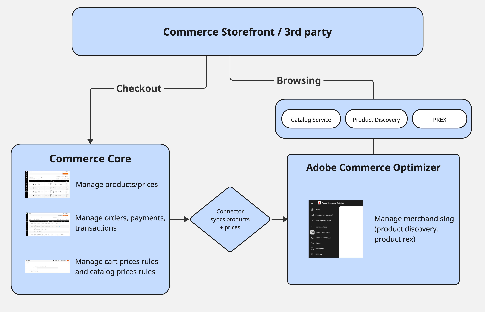

# Adobe Commerce Optimizer聯結器

Adobe Commerce Optimizer聯結器是Adobe Commerce （雲端或內部部署）與Adobe Commerce Optimizer之間的原生第一方整合。 它會將Adobe Commerce商店的目錄和定價資料同步到Commerce Optimizer中，以便您可以：

- 支援&#x200B;**AI驅動的產品探索與建議**
- 執行&#x200B;**高效能Headless店面** （包括Edge Delivery支援的Commerce店面）
- 在單一位置分析&#x200B;**個之前和之後的**&#x200B;個KPI和資料同步健康狀態

Commerce會保留您產品、價格和目錄結構的記錄系統。 Commerce Optimizer成為您的體驗和銷售層，可為任何連線的店面或頻道提供快速且相關的結果。

## 主要優點 {#key-benefits}

| 優點 | 這對您有何意義 |
| --- | --- |
| **沒有要建置的自訂聯結器** | 使用支援的第一方整合，而非撰寫及維護客製化摘要和指令碼。 |
| 使用Commerce Optimizer **更快的價值取得時間** | 在現有的Adobe Commerce部署上開啟AI 搜尋、建議和Headless商店前面。 |
| **與Commerce領域對齊** | 自動將網站、商店檢視和客戶群組對應至Commerce Optimizer目錄結構（目錄來源和價格手冊）。 |
| **作業可見度** | 從專用的資料摘要同步狀態檢視中監視摘要健康狀態、上次同步時間和每個SKU的狀態。 |
| **通往SaaS的未來可用路徑** | 提供從PaaS到Adobe Commerce as a Cloud Service + Optimizer的低風險現代化路徑，無需重新平台。 |

## 聯結器架構 {#connector-architecture}

下圖說明聯結器的端對端架構，包括Adobe Commerce、Commerce Optimizer以及商店和結帳系統。

{width="700" zoomable="yes"}

在此架構中：

- Adobe Commerce （雲端或內部部署）是記錄和摘要製作者
- 聯結器會匯出目錄、價格和類別摘要
- Commerce Optimizer會將摘要資料內嵌並標準化至目錄來源、價格手冊和目錄檢視中
- 店面（Edge Delivery上的Commerce店面或自訂Headless組建）呼叫Commerce Optimizer GraphQL API以進行探索和推薦，並呼叫Commerce或其他連線的第三方平台以進行購物車和結帳作業

## 聯結器如何與Adobe Commerce搭配運作

Adobe Commerce Optimizer Connector的運作方式是使用您現有的Commerce範圍（網站和商店檢視）和客戶細分來填入Commerce Optimizer目錄模型：

{width="750" zoomable="yes"}

- **存放區檢視→目錄來源** — 每個存放區檢視在Commerce Optimizer中會變成個別的目錄Source。 該來源包含當地語系化的產品屬性以及任何商店檢視特有的資料
- **網站→價格手冊** — 每個Commerce網站都會對應至Commerce Optimizer中的一或多個價格手冊。 網站訂價與客戶群組訂價匯出為價格簿與價格輸入項
- **客戶群組→價格變體** — Commerce客戶群組定價會在相關的價格手冊中顯示為其他專案

Commerce Optimizer擷取資料後，您可以設定：

- **Commerce Optimizer中的目錄檢視與原則** （用於建立地區、品牌或客戶特定的子集）
- **產品探索** （搜尋、Facet、銷售規則）
- **產品建議**

當您啟用聯結器時，Adobe Commerce執行個體會保留目錄和價格資料的記錄系統。 當您在Commerce中更新資料時，聯結器會將這些更新同步到[!DNL Adobe Commerce Optimizer]執行個體。

>[!NOTE]
>
>如需設定Commerce Optimizer的詳細資訊，請參閱[[!DNL Adobe Commerce Optimizer] 銷售工具](../optimizer/overview.md#quick-tour)。

## 典型工作流程 {#typical-workflows}

這些工作流程說明團隊如何設定和使用Adobe Commerce Optimizer Connector。 如需有關如何設定整合及啟用這些工作流程的詳細資訊，請參閱[開始使用](get-started.md)。

### 初始設定 {#initial-setup}

1. **使用撰寫器在Adobe Commerce中安裝聯結器套件**：

   `composer require adobe-commerce/commerce-data-export-aco-adapter`

1. **在Commerce Admin中或透過CLI設定驗證和環境詳細資料**：

   ```terminal
   bin/magento aco:config:init \
     --org_id=<your-org> \
     --tenant_id=<your-tenant> \
     --client_id=<your-client-id> \
     --client_secret=<your-secret> \
     --region=na1 \
     --type=production
   ```

1. **將Commerce範圍對應至Commerce Optimizer：**

   - 確認哪些網站和商店檢視必須位於範圍內
   - 確保客戶群組和價格規則如預期般模型

1. **驗證連線能力：**

   - 執行測試同步，並確認目錄來源、價格手冊和初始產品出現在Commerce Optimizer中
   - 使用Commerce中的資料摘要同步狀態頁面和Commerce Optimizer中的資料同步儀表板進行驗證

### 進行中的資料同步 {#ongoing-sync}

在初始設定後，聯結器支援：

- **完整目錄同步**&#x200B;以進行初始移轉或大型結構變更
- 當產品或價格變更時，針對持續更新進行&#x200B;**差異同步**
- 針對目標摘要（包括截至v1.0.12的類別） **重新同步命令**：

   - `bin/magento saas:resync --feed=products`
   - `bin/magento saas:resync --feed=prices`
   - `bin/magento saas:resync --feed=categories`

### 設定銷售與店面 {#merchandising-storefronts}

在Commerce Optimizer提供Commerce資料後，請使用Commerce Optimizer Studio將銷售和店面體驗連結至您的同步目錄。

**若要設定銷售與店面：**

1. 在Commerce Optimizer Studio中&#x200B;**建立目錄檢視與原則**：

   - 依品牌、地區、客戶區段或管道篩選目錄
   - 根據店面或合作夥伴強制執行資料存取規則

1. 在Optimizer UI中&#x200B;**設定產品探索和建議**：

   - 建立銷售規則、Facet、同義字和建議單位
   - 聯結器會將所有搜尋和建議設定解除安裝到Commerce Optimizer （Commerce管理員中的即時搜尋規則和產品建議不再適用於這些流程）

1. **連線店面**&#x200B;至Commerce Optimizer：

   - 對於由Edge Delivery Services支援的Commerce店面，請設定店面使用正確的Optimizer租使用者和目錄檢視，並透過Merchandising API呼叫搜尋和建議端點
   - 若是協力廠商店面，請使用Optimizer公用API或SDK進行搜尋和建議呼叫

   >[!NOTE]
   >
   >如需協力廠商整合的範例，請參閱[適用於Commerce Optimizer的Salesforce Commerce Connector](../optimizer/developer/salesforce-connector.md)。

1. **在您的現有平台上維護簽出**：

   - 在Adobe Commerce或第三方平台中保留購物車、結帳、訂單管理和客戶帳戶
   - 與外部結帳系統整合時，使用App Builder和API Mesh進行購物車移交

## 支援的情況 {#supported-scenarios}

聯結器是專為具有Adobe Commerce雲端及內部部署的B2C商戶所設計，這些商戶想要採用Commerce Optimizer而不需要重建後端。

**常見使用案例：**

- **僅更新店面**
保留您現有的Commerce後端，將PLP/Search/PDP移至Commerce Optimizer支援的Edge Delivery店面

- **正在縮放目錄和搜尋效能**
將繁重的目錄索引和搜尋工作解除安裝至Commerce Optimizer的SaaS服務，同時在Commerce中維持產品和價格所有權

- **遞增SaaS採用**
使用聯結器作為邁向Adobe Commerce as a Cloud Service + Optimizer的墊腳石，並提供相容的可撰寫的Commerce目錄

## 責任與實作必要條件 {#responsibilities-prerequisites}

Commerce是產品、定價和客戶群組的真實來源。 在Commerce中進行變更；聯結器會將其同步至Commerce Optimizer。

**Commerce Optimizer負責：**

- 目錄模型（目錄來源、價格簿、目錄檢視、原則）
- 產品探索和建議
- 店面量度、資料同步控制面板和成功量度報表

**聯結器不是：**

- 修改Commerce購物車、結帳或訂購流程
- 自動布建店面專案（Commerce Storefront / Edge Delivery工具控點）

**開始之前：**

- 確認Commerce符合最低版本和服務聯結器需求。 如需詳細資訊，請參閱[開始使用](get-started.md#prerequisites)。
- 確定您擁有IMS組織存取權、[!DNL Adobe Commerce Optimizer]執行個體，以及必要的認證和區域詳細資料。

## 相關檔案 {#related-documentation}

- 設定整合併啟用關鍵工作流程： [開始使用Adobe Commerce Optimizer聯結器](get-started.md)
- 瞭解Commerce Optimizer概念和架構： [什麼是Adobe Commerce Optimizer？](../optimizer/overview.md)
