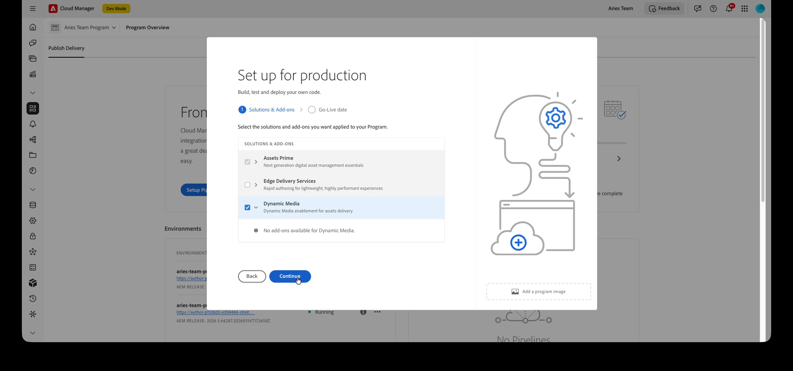

# 設定AEM Assets專案

本主題說明如何設定您的AEM Assets專案，好讓Commerce名稱空間、中繼資料結構描述和[!UICONTROL Commerce]索引標籤可在AEM編寫環境中使用。 如需這些資源的背景資訊，請參閱[AEM Assets中的Commerce中繼資料](../metadata.md)。

您有兩個選項可設定AEM Assets專案：

* [!BADGE 建議]{type=Positive} **自助上線** — 在AEM版本`2026.5.26309`和更新版本上，透過設定環境變數並啟用具有OpenAPI功能的Dynamic Media來啟用Cloud Manager中的整合。 不需要部署自訂程式碼。 請參閱[啟用Commerce整合（自助服務）](#enable-aem-commerce-self-service)。

* **手動設定** — 透過Cloud Manager管道部署`assets-commerce`套件。 當您必須部署自訂套件程式碼時，或如果您使用`2026.5.26309`之前的AEM版本，請使用這些手動步驟。 請參閱[手動安裝assets-commerce套件](#install-the-assets-commerce-package-manually)。

>[!TIP]
>
>您可以從右上角功能表檢視目前的AEM版本： **[!UICONTROL Help]** > **[!UICONTROL About AEM]**。

## 啟用Commerce整合（自助服務） {#enable-aem-commerce-self-service}

[!BADGE 支援]{type=Informative tooltip="支援"} AEM版本`2026.5.26309`和更新版本。

在支援的AEM發行版本中，您無需部署任何自訂程式碼，即可從Cloud Manager啟用Commerce整合。 當您在Author服務上啟用整合時，會自動布建Commerce名稱空間、中繼資料結構描述和&#x200B;**[!UICONTROL Commerce]**&#x200B;標籤。

### 自助服務必要條件

* [使用計畫和部署管理員角色存取AEM Cloud Manager計畫和環境](https://experienceleague.adobe.com/zh-hant/docs/experience-manager-cloud-service/content/onboarding/journey/cloud-manager#access-sysadmin-bo)。

* 發行版本`2026.5.26309`或更新版本的AEM程式。

* 您的Commerce執行個體的&#x200B;**IMS組織ID**。

  您的Commerce執行個體和AEM Assets編寫環境都必須位於相同的IMS組織中。

### 步驟1：建立方案和環境

在Cloud Manager中建立方案是一個精靈過程 — 方案及其環境會跨多個步驟進行配置，並在最後儲存在一起。

1. 在Cloud Manager中，選取&#x200B;**[!UICONTROL Add Program]**。

1. 選擇&#x200B;**[!UICONTROL Set up for production]**，輸入程式名稱，然後選取&#x200B;**[!UICONTROL Continue]**。

1. 在&#x200B;**[!UICONTROL Solutions & Add-ons]**&#x200B;步驟中，選取專案所需的解決方案和附加元件，包括&#x200B;**[!UICONTROL Dynamic Media]**，然後選取&#x200B;**[!UICONTROL Continue]**。

   {width="600" zoomable="yes"}

1. 在&#x200B;**[!UICONTROL Add Environment]**&#x200B;步驟中，輸入&#x200B;**生產**&#x200B;和&#x200B;**暫存**&#x200B;環境的名稱，然後選取區域。

   {width="600" zoomable="yes"}

1. 選取&#x200B;**[!UICONTROL Save]**&#x200B;以建立方案及其環境。

### 步驟2：啟用Commerce整合變數

在Cloud Manager中，開啟您在步驟1建立的環境，然後：

1. 選取&#x200B;**[!UICONTROL Configuration]**&#x200B;標籤。

1. 使用下列值新增環境變數，然後選取&#x200B;**[!UICONTROL Add]**&#x200B;和&#x200B;**[!UICONTROL Save]**：

   | 欄位 | 值 |
   |---|---|
   | 名稱 | `COMMERCE_INTEGRATION_ENABLED` |
   | 值 | `true` |
   | 已套用服務 | 作者 |
   | 型別 | 變數 |

   {width="600" zoomable="yes"}

   環境將更新以套用設定。 等到環境狀態回到&#x200B;**[!UICONTROL Running]**。

### 步驟3：使用OpenAPI功能啟動Dynamic Media

1. 在環境&#x200B;**[!UICONTROL General]**&#x200B;索引標籤上，找出&#x200B;**[!UICONTROL Dynamic Media]**。

1. 在&#x200B;*可用的OpenAPI功能旁*，選取&#x200B;**[!UICONTROL Click to activate]**。

   ![顯示Dynamic Media OpenAPI啟用連結的[環境一般]索引標籤](../assets/aem-cloud-manager-dynamic-media-activate.png){width="600" zoomable="yes"}

   啟動會在背景執行。 完成時，環境已準備好進行Commerce整合。

   >[!NOTE]
   >
   > 如果&#x200B;**[!UICONTROL Click to activate]**&#x200B;無法使用，請開啟支援票證以啟用具有OpenAPI功能的Dynamic Media。

### 步驟4：驗證設定

切換至&#x200B;**AEM Assets作者環境**&#x200B;並開啟任何資產。 編輯其屬性，並確認預設中繼資料結構描述包含&#x200B;**[!UICONTROL Commerce]**&#x200B;標籤，且&#x200B;**[!UICONTROL Product Data]**&#x200B;和&#x200B;**[!UICONTROL Eligible for Commerce]**&#x200B;欄位可見。

## 手動安裝assets-commerce套件

>[!NOTE]
>
> 如果您使用`2026.5.26309`之前的AEM發行版本，請使用此手動方法來部署自訂套件程式碼。 在支援的發行版本上，請改用[啟用Commerce整合（自助服務）](#enable-aem-commerce-self-service)。

### 先決條件

若要將`assets-commerce`封裝程式碼部署至AEM Assets as a Cloud Service AEM環境，您需要下列資源和許可權：

* [存取具有計畫和部署管理員角色的AEM Assets Cloud Manager計畫和環境](https://experienceleague.adobe.com/zh-hant/docs/experience-manager-cloud-service/content/onboarding/journey/cloud-manager#access-sysadmin-bo)。

* [本機AEM開發環境](https://experienceleague.adobe.com/zh-hant/docs/experience-manager-learn/cloud-service/local-development-environment-set-up/overview)，而且熟悉AEM本機開發程式。

* 瞭解[AEM專案結構](https://experienceleague.adobe.com/zh-hant/docs/experience-manager-cloud-service/content/implementing/developing/aem-project-content-package-structure)以及如何使用Cloud Manager部署自訂內容套件。

* 您的Commerce執行個體的&#x200B;**IMS組織ID**。 您的Commerce執行個體和AEM Assets編寫環境都必須位於相同的IMS組織中。

* 若要啟用[具有OpenAPI功能的Dynamic Media](https://experienceleague.adobe.com/zh-hant/docs/experience-manager-cloud-service/content/assets/dynamicmedia/dynamic-media-open-apis/dynamic-media-open-apis-overview#enable-dynamic-media-open-apis)：

>[!BEGINTABS]

>[!TAB 產品視覺效果]

[!BADGE 僅限SaaS]{type=Positive url="https://experienceleague.adobe.com/zh-hant/docs/commerce/user-guides/product-solutions" tooltip="僅適用於Adobe Commerce as a Cloud Service和Adobe Commerce Optimizer專案（Adobe管理的SaaS基礎結構）。"}具備OpenAPI功能的Dynamic Media是自助式，提供AEM Assets所支援的產品視覺效果。

1. 導覽至您的Cloud Manager。

1. 選取所需的環境。

1. 啟用&#x200B;**具有OpenAPI功能的Dynamic Media**。

   如果&#x200B;**具有OpenAPI功能的Dynamic Media**&#x200B;按鈕未啟用，請開啟支援票證。

>[!TAB AEM Assets]

[!BADGE 僅限PaaS]{type=Informative tooltip="僅適用於雲端專案上的Adobe Commerce （Adobe管理的PaaS基礎結構）。"}在AEM as a Cloud Service上，提交包含此資訊的Adobe支援票證：

* 標題：啟用Dynamic Media OpenAPI以將Adobe Commerce與AEM Assets完全整合

   * 支援票證的內容：

      * **[!UICONTROL AEM Program ID]**
      * **[!UICONTROL Adobe Commerce URL]**
      * **[!UICONTROL AEM Environment ID]**
      * **[!UICONTROL IMS Org ID]**

提交支援票證後，Adobe會在您的雲端服務環境中啟用具有OpenAPI功能的Dynamic Media，並共用詳細資訊（例如IMS使用者端ID），以便您繼續整合。

>[!ENDTABS]

### 安裝步驟

1. 導覽至AEM Cloud Manager、選取方案，然後[建立您要與Adobe Commerce整合的生產和中繼環境](https://experienceleague.adobe.com/zh-hant/docs/experience-manager-cloud-service/content/onboarding/journey/create-environments#creating-environments)。

1. [複製所選程式的Adobe受管理Git存放庫](https://experienceleague.adobe.com/zh-hant/docs/experience-manager-cloud-service/content/sites/administering/site-creation/quick-site/retrieve-access#repo-access)。

   {width="600" zoomable="yes"}

   在Cloud Manager **管道**&#x200B;中，選取&#x200B;**[!UICONTROL Access Repo Info]**&#x200B;以開啟&#x200B;**[!UICONTROL Repository Info]**。 複製&#x200B;**[!UICONTROL URL]**&#x200B;或&#x200B;**[!UICONTROL Git command line]**&#x200B;值，視需要產生存取密碼，然後使用您的Git使用者端在本機複製。

1. 從GitHub下載[AEM Assets Commerce存放庫](https://github.com/ankumalh/assets-commerce)的封裝程式碼。

1. 從您的[本機AEM開發環境](https://experienceleague.adobe.com/zh-hant/docs/experience-manager-learn/cloud-service/local-development-environment-set-up/overview)，手動將下載的程式碼複製到現有的Adobe受管理存放庫。

1. 在您的專案的所有`filter.xml`和`pom.xml`檔案中，以您的應用程式名稱取代所有出現的&lt;my-app>。

   >[!NOTE]
   >
   > 或者，您可以將自訂程式碼作為&#x200B;**Maven**&#x200B;套件安裝至您的AEM Assets專案設定中。

1. 提交變更，並將本機開發分支推送到Cloud Manager Git存放庫。

1. 設定[部署管道](https://experienceleague.adobe.com/zh-hant/docs/experience-manager-cloud-service/content/sites/administering/site-creation/quick-site/pipeline-setup#create-front-end-pipeline)，或確認您的管道可以將變更部署到選取的環境。

   {width="600" zoomable="yes"}

   當管道存在時，開啟動作功能表(**...**) 至&#x200B;**[!UICONTROL Run]**、**[!UICONTROL Edit]**、**[!UICONTROL View/Edit variables]**&#x200B;或其他動作 — 請參閱以上連結的Cloud Manager管道檔案。

1. 從AEM Cloud Manager [使用管道來部署程式碼，以更新AEM環境](https://experienceleague.adobe.com/zh-hant/docs/experience-manager-cloud-service/content/implementing/using-cloud-manager/deploy-code#deploying-code-with-cloud-manager)。

1. 前往任何資產並編輯其屬性以驗證變更：

   * 預設中繼資料結構描述包含&#x200B;**Commerce**&#x200B;索引標籤。

   * 會顯示產品SKU和`Eligible for Commerce`欄位。

### Commerce索引標籤在屬性中不可見

如果&#x200B;**Commerce**&#x200B;索引標籤未出現在屬性中，您必須在中繼資料結構編輯器中，手動完成下列步驟：

1. 導覽至中繼資料結構編輯器。

1. 選取&#x200B;**編輯**&#x200B;以修改預設的中繼資料結構表單。

1. 建立&#x200B;**Commerce**&#x200B;索引標籤並加以選取。

1. 將&#x200B;**Product**&#x200B;元件拖放至&#x200B;**Commerce**&#x200B;標籤，並將其對應至屬性`commerce:skus`。

1. 選取&#x200B;**顯示角色**&#x200B;和&#x200B;**顯示順序**&#x200B;的核取方塊。

1. 將&#x200B;**checkbox**&#x200B;元件拖放至&#x200B;**Commerce**&#x200B;標籤，並將其對應至屬性`commerce:isCommerce`。 將&#x200B;**是**&#x200B;和&#x200B;**否**&#x200B;定義為選項。

如果您遇到任何其他問題，請建立[支援票證](https://experienceleague.adobe.com/zh-hant/docs/commerce-knowledge-base/kb/help-center-guide/magento-help-center-user-guide#submit-ticket)或聯絡您的AEM Assets整合銷售代表以尋求協助。

## 設定中繼資料設定檔（選用）

在AEM Assets製作環境中，透過建立中繼資料設定檔，設定Commerce資產中繼資料的預設值。 若要自動使用這些預設值，請將新設定檔套用至AEM資產資料夾。 此設定可減少手動步驟，以簡化資產處理。

設定中繼資料設定檔時，您只需要設定下列元件：

* 新增Commerce索引標籤。 此索引標籤會啟用範本新增的Commerce特定組態設定。

* 將`Eligible for Commerce`欄位新增至Commerce索引標籤。

產品資料UI元件會根據範本自動新增。

### 定義中繼資料設定檔

1. 登入Adobe Experience Manager作者環境。

1. 在Adobe Experience Manager工作區中，按一下Adobe Experience Manager圖示以前往AEM Assets的作者內容管理工作區。

   {width="600" zoomable="yes"}

1. 選取槌子圖示，開啟「管理員」工具。

   {width="600" zoomable="yes"}

1. 按一下&#x200B;**[!UICONTROL Metadata Profiles]**&#x200B;開啟設定檔設定頁面。

1. **[!UICONTROL Create]** Commerce整合的中繼資料設定檔。

   {width="600" zoomable="yes"}

1. 新增Commerce中繼資料的索引標籤。

   1. 按一下左側的&#x200B;**[!UICONTROL Settings]**。

   1. 按一下索引標籤區段中的&#x200B;**[!UICONTROL +]**，然後指定&#x200B;**[!UICONTROL Tab Name]**、`Commerce`。

1. 將`Eligible for Commerce`欄位新增至表單。

   {width="600" zoomable="yes"}

   * 按一下&#x200B;**[!UICONTROL Build form]**。

   * 將`Single Line text`欄位拖曳至表單。

   * 按一下&#x200B;**[!UICONTROL Field Label]**&#x200B;新增標籤的`Eligible for Commerce`文字。

   * 在[設定]索引標籤上，將標籤文字新增至&#x200B;**欄位標籤**。

   * 將預留位置文字設定為`yes`。

   * 在&#x200B;**[!UICONTROL Map to Property]**&#x200B;欄位中，複製並貼上下列值

     ```terminal
     ./jcr:content/metadata/commerce:isCommerce
     ```

1. 選填。 若要自動同步處理上傳至AEM Assets環境的已核准Commerce資產，請在`Basic`索引標籤上將&#x200B;_[!UICONTROL Review Status]_&#x200B;欄位的預設值設為`approved`。

1. 儲存更新。

### 將中繼資料設定檔套用至Commerce資產來源檔案夾

1. 從&#x200B;**[!UICONTROL Metadata Profiles]**&#x200B;頁面，選取Commerce整合設定檔。

1. 從動作功能表中選取&#x200B;**[!UICONTROL Apply Metadata Profiles to Folders]**。

1. 選取包含Commerce資產的資料夾。

   建立Commerce資料夾（如果沒有）。

1. 選取&#x200B;**[!UICONTROL Apply]**。

## 後續步驟

* 僅[!BADGE PaaS]{type=Informative tooltip="僅適用於雲端專案上的Adobe Commerce （Adobe管理的PaaS基礎結構）。"} [安裝Adobe Commerce套件](configure-commerce.md)。

* 僅[!BADGE SaaS]{type=Positive url="https://experienceleague.adobe.com/zh-hant/docs/commerce/user-guides/product-solutions" tooltip="僅適用於Adobe Commerce as a Cloud Service和Adobe Commerce Optimizer專案（Adobe管理的SaaS基礎結構）。"} [從管理員設定整合](setup-synchronization.md)。
