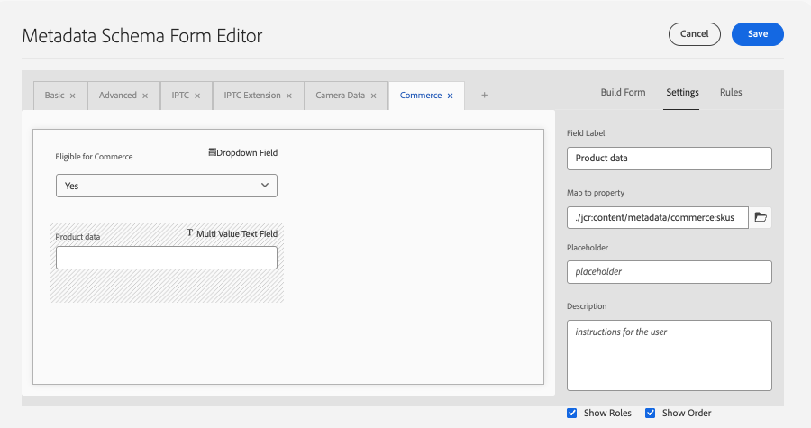

# 設定AEM Assets專案以支援Commerce中繼資料

當您使用AEM Assets as a Digital Asset Management system (DAM) for Commerce時，安裝`assets-commerce`套件可讓您從AEM製作環境管理Commerce產品的影像和影片。

完成下列步驟，以使用必要的套件程式碼和中繼資料設定AEM Assets專案，以便從AEM製作環境管理Commerce資產：

1. [瞭解`assets-commerce`封裝內容](#aem-commerce-assets-commerce-package-contents)

1. [完成安裝步驟以設定AEM Assets專案以支援Commerce中繼資料](#step-1-install-the-assets-commerce-package)

## AEM Commerce assets-commerce套件內容

Adobe提供AEM Commerce套件程式碼`assets-commerce`，用於將Commerce名稱空間和中繼資料結構資源新增至Experience Manager Assets as a Cloud Service環境設定。

此套件程式碼會將下列資源新增至AEM Assets編寫環境：

* [自訂名稱空間](https://github.com/ankumalh/assets-commerce/blob/main/ui.config/jcr_root/apps/commerce/config/org.apache.sling.jcr.repoinit.RepositoryInitializer~commerce-namespaces.cfg.json)，`Commerce`可識別Commerce相關屬性。

   * 具有標籤`Eligible for Commerce`的自訂中繼資料型別`commerce:isCommerce`可標籤與Adobe Commerce專案相關聯的Commerce資產。

   * 自訂中繼資料型別`commerce:skus`與對應的UI元件以新增&#x200B;**[!UICONTROL Product Data]**&#x200B;屬性。 產品資料包含中繼資料屬性，以將Commerce資產與產品SKU建立關聯。

     {width="600" zoomable="yes"}

   * 自訂中繼資料型別`commerce:roles`和`commerce:positions`屬性，用於顯示Commerce中資產的視覺化方式。

   * 替代文字多欄位(_[!UICONTROL Alt texts]_)中繼資料，讓編輯人員可以輸入Commerce存放區檢視程式碼作為關鍵字的替代文字。 這不會變更在目錄中指派產品影像或設定範圍的方式。 檢視AEM Assets中繼資料[&#128279;](#localized-alt-text-in-aem-assets-metadata)中的替代文字。

* 中繼資料結構表單具有Commerce索引標籤，其中包含用於標籤Commerce資產的`Eligible for Commerce`和`Product Data`欄位。 此表單也提供在AEM Assets UI中顯示或隱藏`roles`和`position`欄位的選項。

  AEM Assets中繼資料結構表單的{width="600" zoomable="yes"}

* [範例已標籤並核准Commerce資產](https://github.com/ankumalh/assets-commerce/blob/main/ui.content/src/main/content/jcr_root/content/dam/wknd/en/activities/hiking/equipment_6.jpg/.content.xml) `equipment_6.jpg`，以支援初始資產同步化。 只有已核准的Commerce資產才能從AEM Assets同步到Adobe Commerce。

>[!NOTE]
>
> 請參閱GitHub上的[readme](https://github.com/ankumalh/assets-commerce)頁面，以取得有關&#x200B;**AEM Commerce封裝程式碼**&#x200B;的詳細資訊。

## AEM Assets中繼資料中的替代文字

當您編輯符合資格的影像時，_[!UICONTROL Alt texts]_&#x200B;多欄位可在&#x200B;**[!UICONTROL Commerce]**&#x200B;索引標籤上的AEM Assets資產中繼資料編輯器中使用。

>[!IMPORTANT]
>
> 每個商店的檢視行為僅適用於替代文字。 AEM Assets整合不會針對每個Adobe Commerce商店檢視同步處理不同的產品影像。 來自AEM的產品影像會持續同步至Commerce，並且其相簿指派行為與此版發行前相同。

多欄位在每個Commerce存放區檢視中都包含一列。 每一列有兩個輸入：

* **[!UICONTROL Store View Code]** — 存放區檢視識別碼（例如`default`或`en_US`）。

* **[!UICONTROL Alt Text]** — 該商店檢視的替代文字，限製為255個字元。

選取&#x200B;**[!UICONTROL Add]**&#x200B;為其他存放區檢視新增更多列。 若要移除列，請選取該列上的&#x200B;**[!UICONTROL Delete]**&#x200B;圖示以將其移除。

{width="600" zoomable="yes"}

當您儲存時，如果任何資料列有空白的&#x200B;_[!UICONTROL Store View Code]_，或如果兩個資料列使用相同的存放區檢視代碼（不區分大小寫），使用者端驗證會封鎖提交。

替代文字專案會保留在JCR資產中繼資料中，作為兩個索引對齊的`String[]`屬性：

* `commerce:altTextStoreViews`：儲存每一列的檢視程式碼。
* `commerce:altTextValues`：在與`commerce:altTextStoreViews`中的每個專案相同的索引處比對替代文字。

當這些資產同步至Adobe Commerce時，每個商店的檢視替代文字會寫入產品媒體收藏館，以取得相符的商店檢視代碼。 基礎影像對應不會變更。

## 先決條件

您需要下列資源和許可權，才能將`assets-commerce`套件程式碼部署至AEM Assets as a Cloud Service AEM環境：

* [存取具有計畫和部署管理員角色的AEM Assets Cloud Manager計畫和環境](https://experienceleague.adobe.com/zh-hant/docs/experience-manager-cloud-service/content/onboarding/journey/cloud-manager#access-sysadmin-bo)。

* [本機AEM開發環境](https://experienceleague.adobe.com/zh-hant/docs/experience-manager-learn/cloud-service/local-development-environment-set-up/overview)，而且熟悉AEM本機開發程式。

* 瞭解[AEM專案結構](https://experienceleague.adobe.com/zh-hant/docs/experience-manager-cloud-service/content/implementing/developing/aem-project-content-package-structure)以及如何使用Cloud Manager部署自訂內容套件。

* 您的Commerce執行個體的&#x200B;**IMS組織ID**。 您的Commerce執行個體和AEM Assets編寫環境都必須位於相同的IMS組織中。

* 若要啟用[具有OpenAPI功能的Dynamic Media](https://experienceleague.adobe.com/zh-hant/docs/experience-manager-cloud-service/content/assets/dynamicmedia/dynamic-media-open-apis/dynamic-media-open-apis-overview#enable-dynamic-media-open-apis)：

>[!BEGINTABS]

>[!TAB 產品視覺效果]

[!BADGE 僅限SaaS]{type=Positive url="https://experienceleague.adobe.com/zh-hant/docs/commerce/user-guides/product-solutions" tooltip="僅適用於Adobe Commerce as a Cloud Service和Adobe Commerce Optimizer專案（Adobe管理的SaaS基礎結構）。"}具備OpenAPI功能的Dynamic Media是自助式，提供AEM Assets所支援的產品視覺效果。

1. 導覽至您的Cloud Manager。

1. 選取所需的環境。

1. 啟用&#x200B;**具有OpenAPI功能的Dynamic Media**。

   如果&#x200B;**具有OpenAPI功能的Dynamic Media**&#x200B;按鈕未啟用，請開啟支援票證。

>[!TAB AEM Assets]

[!BADGE 僅限PaaS]{type=Informative tooltip="僅適用於雲端專案上的Adobe Commerce （Adobe管理的PaaS基礎結構）。"}在AEM as a Cloud Service上，提交包含下列資訊的Adobe支援票證：

* Title：啟用Dynamic Media OpenAPI以將Adobe Commerce與AEM Assets完全整合

   * 支援票證的內容：

      * **[!UICONTROL AEM Program ID]**
      * **[!UICONTROL Adobe Commerce URL]**
      * **[!UICONTROL AEM Environment ID]**
      * **[!UICONTROL IMS Org ID]**

提交支援票證後，Adobe會在您的雲端服務環境中啟用具有OpenAPI功能的Dynamic Media，並共用詳細資訊（例如IMS使用者端ID），以便您繼續整合。

>[!ENDTABS]

## 步驟1：安裝assets-commerce套件

1. 導覽至AEM Cloud Manager、選取方案，然後[建立您要與Adobe Commerce整合的生產和中繼環境](https://experienceleague.adobe.com/zh-hant/docs/experience-manager-cloud-service/content/onboarding/journey/create-environments#creating-environments)。

1. 設定[部署管道](https://experienceleague.adobe.com/zh-hant/docs/experience-manager-cloud-service/content/sites/administering/site-creation/quick-site/pipeline-setup#create-front-end-pipeline)，或確認您的管道可以將變更部署到選取的環境。

1. [複製所選程式的Adobe受管理Git存放庫](https://experienceleague.adobe.com/zh-hant/docs/experience-manager-cloud-service/content/sites/administering/site-creation/quick-site/retrieve-access#repo-access)。

1. 從GitHub下載[AEM Assets Commerce存放庫](https://github.com/ankumalh/assets-commerce)的封裝程式碼。

1. 從您的[本機AEM開發環境](https://experienceleague.adobe.com/zh-hant/docs/experience-manager-learn/cloud-service/local-development-environment-set-up/overview)，手動將下載的程式碼複製到現有的Adobe受管理存放庫。

1. 在您的專案的所有`filter.xml`和`pom.xml`檔案中，以您的應用程式名稱取代所有出現的`<my-app>`。

   >[!NOTE]
   >
   > 或者，您可以將自訂程式碼作為&#x200B;**Maven**&#x200B;套件安裝至您的AEM Assets專案設定中。

1. 提交變更，並將本機開發分支推送到Cloud Manager Git存放庫。

1. 從AEM Cloud Manager [使用管道來部署程式碼，以更新AEM環境](https://experienceleague.adobe.com/zh-hant/docs/experience-manager-cloud-service/content/implementing/using-cloud-manager/deploy-code#deploying-code-with-cloud-manager)。

1. 前往任何資產並編輯其屬性以驗證變更：

   * 預設中繼資料結構描述包含&#x200B;**Commerce**&#x200B;索引標籤。

   * 會顯示產品SKU和`Eligible for Commerce`欄位。

### Commerce索引標籤在屬性中不可見

如果&#x200B;**Commerce**&#x200B;索引標籤未出現在屬性中，您必須在中繼資料結構描述編輯器中手動建立一個。

1. 導覽至中繼資料結構編輯器。

1. 選取&#x200B;**編輯**&#x200B;以修改預設的中繼資料結構表單。

1. 建立&#x200B;**Commerce**&#x200B;索引標籤並加以選取。

1. 將&#x200B;**Product**&#x200B;元件拖放至&#x200B;**Commerce**&#x200B;標籤，並將其對應至屬性`commerce:skus`。

1. 選取&#x200B;**顯示角色**&#x200B;和&#x200B;**顯示順序**&#x200B;的核取方塊。

1. 將&#x200B;**checkbox**&#x200B;元件拖放至&#x200B;**Commerce**&#x200B;標籤，並將其對應至屬性`commerce:isCommerce`。 將&#x200B;**是**&#x200B;和&#x200B;**否**&#x200B;定義為選項。

如果您遇到任何其他問題，請建立[支援票證](https://experienceleague.adobe.com/docs/commerce-knowledge-base/kb/help-center-guide/magento-help-center-user-guide.html?lang=zh-Hant#submit-ticket)或聯絡您的AEM Assets整合銷售代表以尋求協助。

## 步驟2：選擇性。 設定中繼資料設定檔

在AEM Assets製作環境中，透過建立中繼資料設定檔，設定Commerce資產中繼資料的預設值。 然後，將新設定檔套用至AEM資產資料夾，以自動使用這些預設值。 此設定可減少手動步驟，以簡化資產處理。

設定中繼資料設定檔時，您只需要設定下列元件：

* 新增Commerce索引標籤。 此索引標籤會啟用範本新增的Commerce特定組態設定。

* 將`Eligible for Commerce`欄位新增至Commerce索引標籤。

產品資料UI元件會根據範本自動新增。

### 定義中繼資料設定檔

1. 登入Adobe Experience Manager作者環境。

1. 在Adobe Experience Manager工作區中，按一下Adobe Experience Manager圖示以前往AEM Assets的作者內容管理工作區。

   {width="600" zoomable="yes"}

1. 選取槌子圖示，開啟「管理員」工具。

   {width="600" zoomable="yes"}

1. 按一下&#x200B;**[!UICONTROL Metadata Profiles]**&#x200B;開啟設定檔設定頁面。

1. **[!UICONTROL Create]** Commerce整合的中繼資料設定檔。

   {width="600" zoomable="yes"}

1. 新增Commerce中繼資料的索引標籤。

   1. 按一下左側的&#x200B;**[!UICONTROL Settings]**。

   1. 按一下索引標籤區段中的&#x200B;**[!UICONTROL +]**，然後指定&#x200B;**[!UICONTROL Tab Name]**、`Commerce`。

1. 將`Eligible for Commerce`欄位新增至表單。

   {width="600" zoomable="yes"}

   * 按一下&#x200B;**[!UICONTROL Build form]**。

   * 將`Single Line text`欄位拖曳至表單。

   * 按一下&#x200B;**[!UICONTROL Field Label]**&#x200B;新增標籤的`Eligible for Commerce`文字。

   * 在[設定]索引標籤上，將標籤文字新增至&#x200B;**欄位標籤**。

   * 將預留位置文字設定為`yes`。

   * 在&#x200B;**[!UICONTROL Map to Property]**&#x200B;欄位中，複製並貼上下列值

     ```terminal
     ./jcr:content/metadata/commerce:isCommerce
     ```

1. 選填。 若要自動同步處理上傳至AEM Assets環境的已核准Commerce資產，請在`Basic`索引標籤上將&#x200B;_[!UICONTROL Review Status]_&#x200B;欄位的預設值設為`approved`。

1. 儲存更新。

### 將中繼資料設定檔套用至Commerce資產來源檔案夾

1. 從&#x200B;**[!UICONTROL Metadata Profiles]**&#x200B;頁面，選取Commerce整合設定檔。

1. 從動作功能表中選取&#x200B;**[!UICONTROL Apply Metadata Profiles to Folders]**。

1. 選取包含Commerce資產的資料夾。

   建立Commerce資料夾（如果沒有）。

1. 選取&#x200B;**[!UICONTROL Apply]**。

## 後續步驟

* 僅[!BADGE PaaS]{type=Informative tooltip="僅適用於雲端專案上的Adobe Commerce （Adobe管理的PaaS基礎結構）。"} [安裝Adobe Commerce套件](configure-commerce.md)。

* 僅[!BADGE SaaS]{type=Positive url="https://experienceleague.adobe.com/zh-hant/docs/commerce/user-guides/product-solutions" tooltip="僅適用於Adobe Commerce as a Cloud Service和Adobe Commerce Optimizer專案（Adobe管理的SaaS基礎結構）。"} [從管理員設定整合](setup-synchronization.md)。
