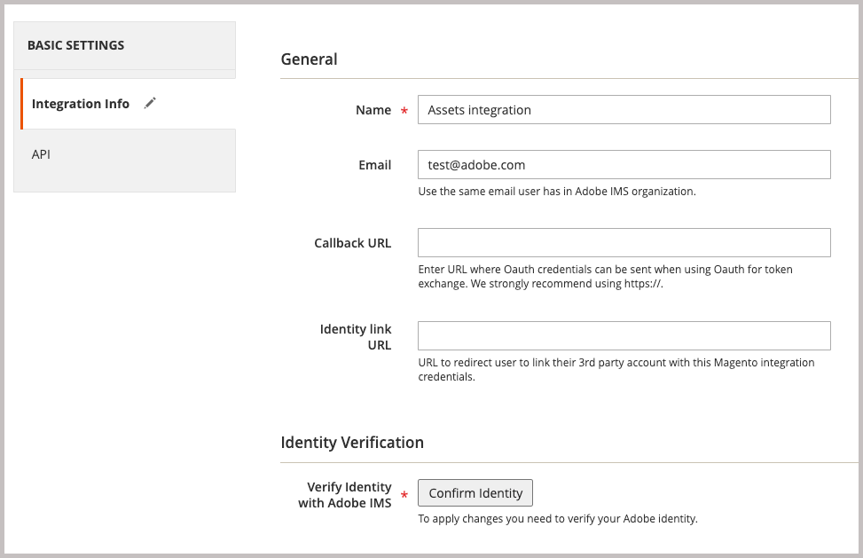
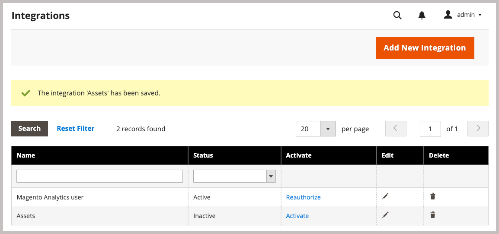

# 安裝Adobe Commerce套件

Commerce的這項整合可讓您在Adobe Commerce和Adobe Experience Manager Assets (AEM Assets)之間同步資產。 擴充功能提供一套工具和服務，用於管理兩個平台上的產品影像、視訊和其他媒體資產。

安裝`aem-assets-integration` PHP擴充功能，將此擴充功能新增至Commerce環境。 您也需要啟用適用於Commerce的Adobe I/O Events，並產生Adobe Commerce和Adobe Experience Manager Assets之間通訊和工作流程所需的認證。

**存取需求**

您需要下列角色和許可權，才能啟用Commerce與AEM Assets的整合。

- [Commerce cloud專案管理員](https://experienceleague.adobe.com/en/docs/commerce-cloud-service/user-guide/project/user-access) — 安裝必要的擴充功能，並從管理員或命令列設定Commerce應用程式伺服器。

   - 存取[repo.magento.com](https://repo.magento.com/admin/dashboard)以安裝擴充功能。

     如需金鑰產生與取得必要許可權，請參閱[取得您的驗證金鑰](https://experienceleague.adobe.com/en/docs/commerce-operations/installation-guide/prerequisites/authentication-keys)。 如需雲端安裝，請參閱[雲端基礎結構上的Commerce指南](https://experienceleague.adobe.com/en/docs/commerce-cloud-service/user-guide/develop/authentication-keys)

- [Commerce管理員](https://experienceleague.adobe.com/en/docs/commerce-admin/start/guide-overview) — 更新存放區設定並管理Commerce使用者帳戶。

>[!TIP]
>
> Adobe Commerce可設定為使用[Adobe IMS驗證](https://experienceleague.adobe.com/en/docs/commerce-admin/start/admin/ims/adobe-ims-config)。

## 安裝和設定工作流程

安裝Adobe Commerce套件，並完成下列作業準備Commerce環境：

1. [安裝Commerce擴充功能的AEM Assets整合(`aem-assets-integration`)](#install-the-aem-assets-integration-extension)。

1. [設定Commerce Services聯結器](#configure-the-commerce-services-connector)，以連線您的Adobe Commerce執行個體，並使用可在Adobe Commerce和AEM Assets之間傳輸資料的服務。

1. [設定適用於Commerce的Adobe I/O Events](#configure-adobe-io-events-for-commerce)

1. [取得API存取的驗證認證](#get-authentication-credentials-for-api-access)

## 安裝AEM Assets整合擴充功能

在具有AEM Assets 2.4.5+版本的Adobe Commerce執行個體上安裝最新版本的Adobe Commerce整合擴充功能(`aem-assets-integration`)。 擴充功能會從[repo.magento.com](https://repo.magento.com/admin/dashboard)存放庫以撰寫器中繼資料的形式傳送。

>[!BEGINTABS]

>[!TAB 雲端基礎結構]

使用此方法在Commerce Cloud執行個體上安裝[!DNL AEM Assets Integration]擴充功能。

1. 在本機工作站上，變更至雲端基礎結構專案上Adobe Commerce的專案目錄。

   >[!NOTE]
   >
   >如需有關在本機管理Commerce專案環境的資訊，請參閱《雲端基礎結構使用手冊》中[Adobe Commerce的](https://experienceleague.adobe.com/en/docs/commerce-cloud-service/user-guide/develop/cli-branches)使用CLI管理分支&#x200B;__。

1. 檢視環境分支，以使用Adobe Commerce Cloud CLI進行更新。

   ```shell
   magento-cloud environment:checkout <environment-id>
   ```

1. 新增Commerce擴充功能的AEM Assets整合。

   ```shell
   composer require "magento/aem-assets-integration" "<version-tbd>" --no-update
   ```

1. 更新套件相依性。

   ```shell
   composer update "magento/aem-assets-integration"
   ```

1. 認可並推播對`composer.json`和`composer.lock`檔案的程式碼變更。

1. 新增、認可並將`composer.json`和`composer.lock`檔案的程式碼變更推播到雲端環境。

   ```shell
   git add -A
   git commit -m "Install AEM Assets Integration extension for Adobe Commerce"
   git push origin <branch-name>
   ```

   推送更新會啟動[Commerce雲端部署程式](https://experienceleague.adobe.com/en/docs/commerce-cloud-service/user-guide/develop/deploy/process)以套用變更。 從[部署記錄](https://experienceleague.adobe.com/en/docs/commerce-cloud-service/user-guide/develop/test/log-locations#deploy-log)檢查部署狀態。

>[!TAB 內部部署]

使用此方法來安裝內部部署執行個體的[!DNL AEM Assets Integration]延伸模組。

1. 使用Composer將適用於Commerce的AEM Assets整合擴充功能新增至您的專案：

   ```shell
   composer require "magento/aem-assets-integration" --no-update
   ```

1. 更新相依性並安裝擴充功能：

   ```shell
   composer update  "magento/aem-assets-integration"
   ```

1. 升級Adobe Commerce：

   ```shell
   bin/magento setup:upgrade
   ```

1. 清除快取：

   ```shell
   bin/magento cache:clean
   ```

>[!TIP]
>
> 部署到生產環境時，請考慮不清除已編譯的程式碼以節省時間。 進行變更前，請務必備份您的系統。

>[!ENDTABS]

## 設定Commerce服務聯結器

>[!NOTE]
>
> Commerce服務聯結器設定是使用[Adobe Commerce SaaS服務](https://experienceleague.adobe.com/en/docs/commerce/user-guides/integration-services/saas#availableservices)所需的一次性程式。 如果您已設定其他服務的聯結器，您可以選取「**[!UICONTROL Systems]** > [!UICONTROL Services] > **[!UICONTROL Commerce Services Connector]**」，從Commerce管理員檢視現有設定。

若要在您的Adobe Commerce執行個體與啟用AEM Assets整合的服務之間傳輸資料，請從管理員(**[!UICONTROL System]** > [!UICONTROL Services] > **[!UICONTROL Commerce Services Connector]**)設定Commerce服務聯結器。

{width="600" zoomable="yes"}

在設定中提供下列值

- 用於驗證的生產和沙箱API金鑰
- 安全雲端儲存空間的資料空間名稱（SaaS識別碼）
- 布建Commerce和AEM Assets環境的IMS組織ID

如需詳細指示，請觀看[Commerce Services Connector設定影片](https://experienceleague.adobe.com/en/docs/commerce-learn/tutorials/admin/adobe-commerce-services/configure-adobe-commerce-services-connector#configuration-faqs)，請參閱[Commerce Services Connector](../../landing/saas.md#organizationid)檔案。

儲存組態時，系統會為您的環境產生SaaS專案和資料庫ID。 若要在Adobe Commerce和AEM Assets之間啟用資產同步，需使用這些值。

## 設定適用於Commerce的Adobe I/O Events

AEM Assets整合使用Adobe I/O Events服務在Commerce執行個體和Experience Cloud之間傳送自訂事件資料。 事件資料可用來協調AEM Assets整合的工作流程。

設定Adobe I/O Events之前，請先確認Commerce專案的RabbitMQ和cron工作設定：

- 確保RabbitMQ已啟用且正在監聽事件。
   - 內部部署Adobe Commerce的[RabbitMQ設定](https://experienceleague.adobe.com/en/docs/commerce-cloud-service/user-guide/configure/service/rabbitmq)
   - 雲端基礎結構上Adobe Commerce的[RabbitMQ設定](https://experienceleague.adobe.com/en/docs/commerce-cloud-service/user-guide/configure/service/rabbitmq)
   - 確認[cron工作已啟用](https://developer.adobe.com/commerce/extensibility/events/configure-commerce/#check-cron-and-message-queue-configuration)。 AEM Assets整合的通訊和工作流程需要Cron工作。

>[!NOTE]
>
> 針對Commerce 2.4.5版上的專案，您必須[安裝Adobe I/O模組](https://developer.adobe.com/commerce/extensibility/events/installation/#install-adobe-io-modules-on-commerce)。 在Commerce 2.4.6+版中，這些模組會自動載入。 針對Commerce的AEM Assets整合，您只需要安裝模組。 不需要App Builder設定。


### 啟用Commerce事件架構

從Commerce管理員啟用事件架構。

>[!NOTE]
>
>只有當您打算使用自訂比對策略，在App Builder和Commerce之間同步資產時，才需要AEM Assets設定。

1. 從Admin移至&#x200B;**[!UICONTROL Stores]** > [!UICONTROL Settings] > **[!UICONTROL Configuration]** > **[!UICONTROL Adobe Services]** > **Adobe I/O Events**。

1. 展開&#x200B;**[!UICONTROL Commerce events]**。

1. 將&#x200B;**[!UICONTROL Enabled]**&#x200B;設為`Yes`。

   {width="600" zoomable="yes"}

1. 在&#x200B;**[!UICONTROL Merchant ID]**&#x200B;中輸入商家公司名稱，並在&#x200B;**[!UICONTROL Environment ID]**&#x200B;欄位中輸入環境名稱。 設定這些值時，只能使用英數字元和底線。

>[!BEGINSHADEBOX]

**設定自訂VCL以封鎖要求**

如果您使用自訂VCL程式碼片段來封鎖未知的傳入要求，您可能需要包含HTTP標頭`X-Ims-Org-Idheader`，以允許來自Commerce服務的AEM Assets整合的傳入連線。

>[!TIP]
>
> 您可以使用Fastly CDN模組來建立Edge ACL，其中包含您要封鎖的IP位址清單。

下列自訂VCL程式碼片段程式碼（JSON格式）顯示`X-Ims-Org-Id`要求標頭的範例。

```json
{
  "name": "blockbyuseragent",
  "dynamic": "0",
  "type": "recv",
  "priority": "5",
  "content": "if ( req.http.X-ims-org ~ \"<YOUR-IMS-ORG>\" ) {error 405 \"Not allowed\";}"
}
```

根據此範例建立程式碼片段之前，請檢閱值以判斷是否需要進行任何變更：

- `name`： VCL程式碼片段的名稱。 此範例使用名稱`blockbyuseragent`。

- `dynamic`：設定程式碼片段版本。 此範例使用`0`。 如需詳細的資料模型資訊，請參閱[Fastly VCL程式碼片段](https://www.fastly.com/documentation/reference/api/vcl-services/snippet/)。

- `type`：指定VCL程式碼片段的型別，這會決定程式碼片段在產生的VCL程式碼中的位置。 此範例使用`recv`。 如需程式碼片段型別的清單，請參閱[Fastly VCL程式碼片段參考](https://www.fastly.com/documentation/reference/api/#api-section-snippet)。

- `priority`：決定VCL程式碼片段何時執行。 此範例使用優先順序`5`立即執行，並檢查管理員要求是否來自允許的IP位址。

- `content`：要執行的VCL程式碼片段，會檢查使用者端IP位址。 如果IP位在Edge ACL中，則會封鎖整個網站的存取權，並產生`405 Not allowed`錯誤。 允許存取所有其他使用者端IP位址。

如需使用VCL片段封鎖傳入要求的詳細資訊，請參閱[雲端基礎結構上的Commerce](https://experienceleague.adobe.com/en/docs/commerce-cloud-service/user-guide/cdn/custom-vcl-snippets/fastly-vcl-blocking)中的&#x200B;_封鎖要求的自訂VCL_。

>[!ENDSHADEBOX]

## 取得API存取的驗證認證

Commerce的AEM Assets整合需要OAuth驗證認證，才能允許API存取Commerce執行個體。 使用AEM Assets整合管理資產時，需要這些憑證才能驗證API請求。

您可以將整合新增至Commerce執行個體並加以啟用，以產生憑證。

### 將整合新增至Commerce環境

1. 從Admin，移至&#x200B;**系統** >擴充功能> **整合**，然後按一下&#x200B;**新增整合**。

1. 輸入整合的相關資訊。

   在&#x200B;**一般**&#x200B;區段中，僅指定整合&#x200B;**名稱**&#x200B;和&#x200B;**電子郵件**。 Adobe IMS帳戶使用此電子郵件，其可存取部署Commerce和Experience Manager Assets的組織。

   適用於Commerce管理員設定的{width="600" zoomable="yes"}

1. 按一下&#x200B;**確認身分**&#x200B;以驗證您的身分。

   系統會使用您的Adobe ID向Experience Cloud進行驗證，以驗證您的身分。

1. 設定API資源。

   1. 從左側面板，按一下&#x200B;**[!UICONTROL API]**。

   1. 選取外部媒體資源&#x200B;**[!UICONTROL Catalog > Inventory > Products > External Media]**。

      API資源的{width="600" zoomable="yes"}

1. 按一下&#x200B;**[!UICONTROL Save]**。

### 產生OAuth認證

在整合頁面上，按一下Assets整合的&#x200B;**啟動**&#x200B;以產生OAuth驗證認證。 您需要這些憑證才能透過Assets規則引擎服務註冊Commerce專案，以及提交API請求來管理Adobe Commerce與AEM Assets之間的資產。

1. 在整合頁面中，按一下&#x200B;**[!UICONTROL Activate]**&#x200B;產生認證。

   {width="600" zoomable="yes"}

1. 如果您打算使用API，請儲存消費者金鑰的認證和存取Token ，以在API使用者端中設定驗證。

   {width="600" zoomable="yes"}

1. 按一下&#x200B;**[!UICONTROL Done]**。

>[!NOTE]
>
>您也可以使用Adobe Commerce API產生驗證認證。 如需此程式的詳細資訊，以及Adobe Commerce的OAuth型驗證詳細資訊，請參閱Adobe Developer檔案中的[OAuth型驗證](https://developer.adobe.com/commerce/webapi/get-started/authentication/gs-authentication-oauth/)。

## 下一步

- [從Commerce管理員設定整合](setup-synchronization.md)
