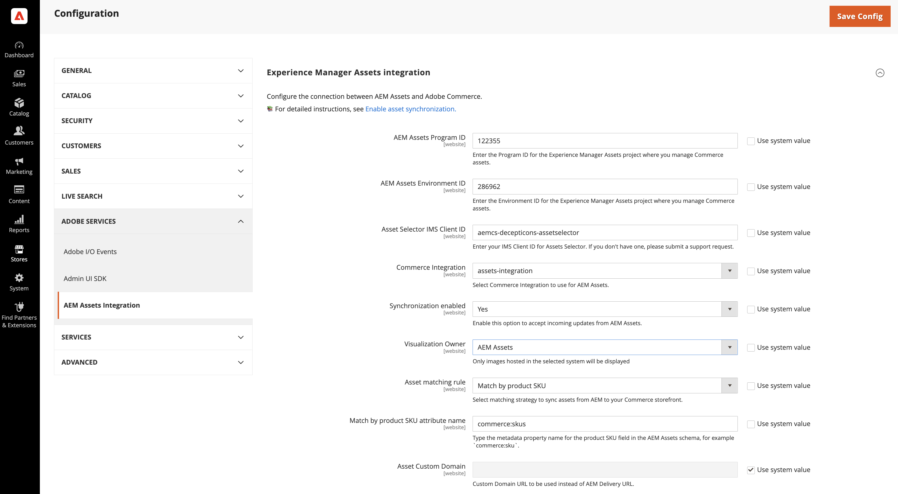
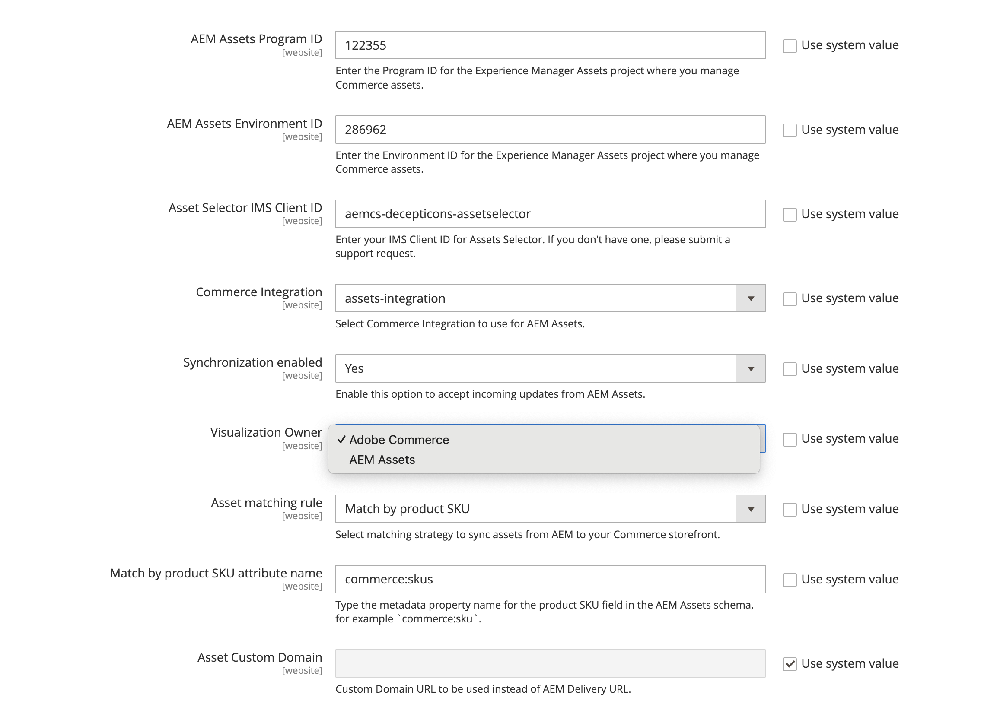

# 設定整合

將Commerce連線至AEM Assets執行個體，並選取資產同步的比對策略，以設定整合。

識別AEM Assets專案後，選取在Adobe Commerce和AEM Assets之間同步資產的相符規則。

* **[!UICONTROL Match by product SKU]** — 符合資產中繼資料中的SKU與[Commerce產品SKU](https://experienceleague.adobe.com/en/docs/commerce-operations/implementation-playbook/glossary#sku)的預設規則，以確保資產與正確的產品相關聯。

* **[!UICONTROL Custom match]** — 符合規則，適用於需要自訂比對邏輯的較複雜案例或特定業務需求。 實作自訂比對需要在Adobe Developer App Builder中開發自訂程式碼，以定義資產與產品的比對方式。 即將推出更多詳細資料……

對於初始設定，請使用預設的&#x200B;*依產品SKU比對*&#x200B;規則。

## 先決條件

* [設定AEM Assets專案](configure-aem.md)

* 僅[!BADGE PaaS]{type=Informative tooltip="僅適用於雲端專案上的Adobe Commerce (Adobe管理的PaaS基礎結構)。"} [安裝Adobe Commerce套件](configure-commerce.md)以新增擴充功能，並產生使用擴充功能所需的認證和連線。

* 請依照[啟用Dynamic Media Open API](https://experienceleague.adobe.com/en/docs/experience-manager-cloud-service/content/assets/dynamicmedia/dynamic-media-open-apis/dynamic-media-open-apis-overview#enable-dynamic-media-open-apis)主題中所述的步驟操作。 包含支援團隊的下列資訊：

   * **[!UICONTROL AEM Program ID]**
   * **[!UICONTROL Adobe Commerce URL]**
   * **[!UICONTROL AEM Environment ID]**，
   * 您想要連線至Commerce的AEM Assets編寫環境的&#x200B;**[!UICONTROL IMS Org ID]**。

## 設定連線

1. 取得[AEM Assets製作環境](https://experienceleague.adobe.com/en/docs/experience-manager-cloud-service/content/sites/authoring/quick-start)專案和環境識別碼。

   1. 開啟AEM Cloud Manager並選取&#x200B;**[!UICONTROL Assets]**。

   1. 從URL複製並儲存專案和環境ID：  `https://author-p[Program ID]-e[EnvironmentID].adobeaemcloud.com/`

1. 從「Commerce管理員」開啟AEM Assets整合設定。

   1. 移至「**[!UICONTROL Store]** >設定> **[!UICONTROL ADOBE SERVICES]** > **[!UICONTROL AEM Assets Integration]**」。

      {width="600" zoomable="yes"}

>[!INFO]
>
> AEM Assets整合僅支援全域（預設）範圍內的設定。 不支援網站層級設定。 當您嘗試在網站層級設定整合時，系統會忽略網站層級的設定，改用全域設定值。

1. 進入AEM Assets環境&#x200B;**[!UICONTROL Program ID]**&#x200B;和&#x200B;**[!UICONTROL Environment ID]**。

   從&#x200B;*[!UICONTROL Use system value]*&#x200B;中移除選取專案，以編輯設定值。

1. 輸入&#x200B;**[!UICONTROL Asset Selector IMS Client ID]**。

   如需「資產選擇器」的詳細資訊，請參閱[手動選取資產](../synchronize/asset-selector-integration.md)

1. [!BADGE 僅限PaaS]{type=Informative tooltip="僅適用於雲端專案上的Adobe Commerce (Adobe管理的PaaS基礎結構)。"}選取[[!UICONTROL Commerce integration]](configure-commerce.md#add-the-integration-to-the-commerce-environment)以驗證Commerce與資產比對服務之間的要求。

1. 將&#x200B;**[!UICONTROL Commerce integration]**&#x200B;設為`assets-integration`以選取要與AEM Assets搭配使用的Commerce整合。

1. 將&#x200B;**[!UICONTROL Synchronization enabled]**&#x200B;設為`Yes`以允許Commerce接受來自AEM Assets的傳入更新。

   啟用整合後，可使用其他設定選項來指定資產比對條件。

1. 從&#x200B;**[!UICONTROL Asset matching rule]**&#x200B;下拉式清單中選取其中一個資產比對規則以進行資產同步。

   * 選取&#x200B;**[!UICONTROL Match by SKU]**&#x200B;預設自動比對[的](../synchronize/default-match.md)，
   * 選取&#x200B;**[!UICONTROL Custom match]**&#x200B;進行[自訂自動比對](../synchronize/custom-match.md) (需要[Adobe Developer App Builder](https://experienceleague.adobe.com/en/docs/commerce-learn/tutorials/adobe-developer-app-builder/introduction-to-app-builder)。)

1. 新增在[欄位中為AEM Assets產品SKU定義的](configure-aem.md#configure-metadata)Commerce中繼資料欄位名稱&#x200B;**[!UICONTROL Match by product SKU attribute name]**，預設為`commerce:skus`。

1. 選取&#x200B;**[!UICONTROL Save Config]**&#x200B;以套用更新並啟動資產同步處理。

   設定更新會觸發初始同步流程，允許Commerce接受來自AEM Assets的傳入更新。 同步所需的時間取決於資產數量和特定配置。 整合利用自動化程式，將同步所需的時間減至最少。

### 同步SLA

此整合可保證以下同步處理效能等級：

* `< 5 minutes for 99% of updates`

* `< 30 minutes for 99.9% of updates`

這可確保產品頁面一律顯示最新影像，讓店面內容保持精確且美觀。

### 設定視覺效果擁有者

**視覺化擁有者**&#x200B;設定會決定要提供整合中產品影像的系統：

* Adobe Commerce — 使用Commerce中託管的影像。
* AEM Assets — 使用與AEM同步的影像。

管理員會顯示該擁有者的可用影像，而其餘影像則會呈現灰色，並以&#x200B;**隱藏**&#x200B;標籤顯示。

如需影像顯示行為的詳細資訊，請參閱[設定影像詳細資料](https://experienceleague.adobe.com/en/docs/commerce-admin/catalog/products/digital-assets/product-image#set-image-details){target=_blank}主題。

>[!TIP]
>
> 從Commerce移轉至AEM Assets期間，請將&#x200B;**視覺效果擁有者**&#x200B;設定為Commerce以避免影像連結失效。 所有產品成功與AEM Assets同步後，請切換至AEM Assets擁有者以完成轉變。 這可確保整個程式中的連續影像可用性。

1. 導覽至「**[!UICONTROL Store]** >設定> **[!UICONTROL ADOBE SERVICES]** > **[!UICONTROL AEM Assets Integration]**」。

   {width="400" zoomable="yes"}

1. 選取&#x200B;**視覺化擁有者**&#x200B;來源以顯示影像。

1. 按一下&#x200B;**[!UICONTROL Save Config]**&#x200B;以套用更新並啟動資產同步處理。

### 選填。 設定自訂網域URL

如果AEM Assets as a Cloud Service專案已使用[自訂網域名稱](https://experienceleague.adobe.com/zh-hant/docs/experience-manager-cloud-service/content/implementing/using-cloud-manager/custom-domain-names/add-custom-domain-name){target=_blank}設定，您必須將網域名稱新增到Commerce存放區設定，好讓Commerce的AEM Assets整合能夠使用它。

1. 導覽至「**[!UICONTROL Store]** >設定> **[!UICONTROL ADOBE SERVICES]** > **[!UICONTROL AEM Assets Integration]**」。

   {width="700" zoomable="yes"}

1. 將&#x200B;**自訂網域URL**&#x200B;新增至&#x200B;**[!UICONTROL Asset Custom Domain]**&#x200B;欄位。

1. 按一下&#x200B;**[!UICONTROL Save Config]**&#x200B;以套用更新並啟動資產同步處理。

## 下一步

[管理Commerce資產](../manage-assets.md)
