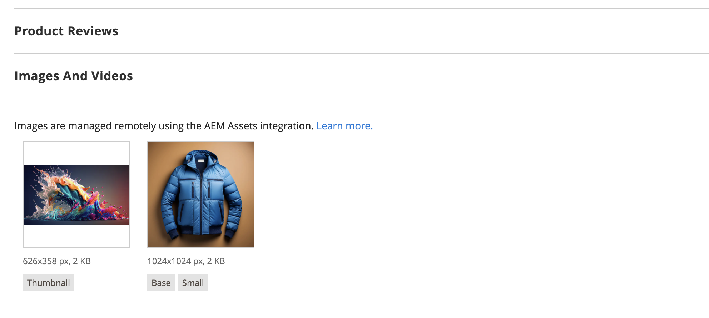
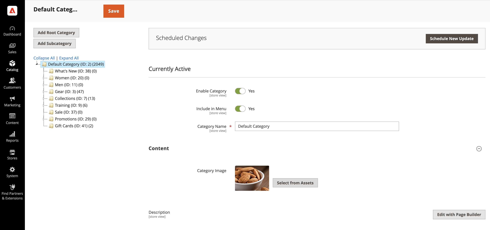
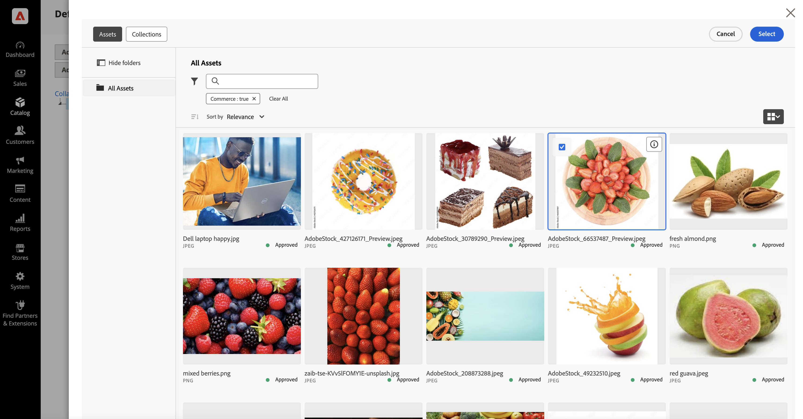
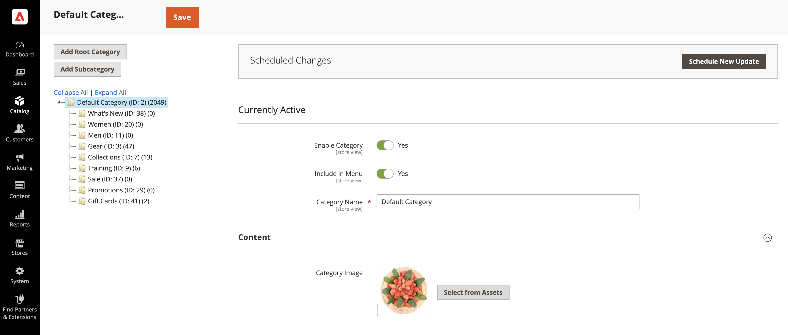

# 管理Commerce媒體資產

<!--In ACAP-844, this topic was linked to from the Commerce Admin products images and videos when the Assets integration is enabled. If the URL to the topic changes, be sure to add a redirect.-->

在Commerce的AEM Assets整合啟用後，您可以管理下列媒體型別：

* 產品影像
* 內容影像
* 產品影片
* 類別影像

## 產品影像

啟用整合後，影像管理可在數位資產管理系統(DAM)中集中管理。 接著Adobe Commerce就會成為重要的參與管道，確保各店面只會使用獲得核准的高品質影像。 此設定可增強品牌一致性、將手動工作減到最少，並簡化內容更新，讓商家無須在Adobe Commerce中手動上傳或管理影像。

### 在Adobe Commerce中檢視產品影像

系統會根據預先設定的比對規則，自動從AEM Assets提取產品影像：

1. 在&#x200B;_管理員_&#x200B;側邊欄上，瀏覽至&#x200B;**[!UICONTROL Catalog]** > **[!UICONTROL Products]**。

1. 選取產品。

1. 開啟&#x200B;**影像和影片**&#x200B;區段。

   {width="600" zoomable="yes"}

   >[!NOTE]
   >
   > 訊息會指出整合已啟用，使這成為&#x200B;**唯讀**&#x200B;區段，因為影像管理集中於DAM中。

### 在AEM Assets中管理產品影像

若要管理產品相關影像，所有變更必須直接在&#x200B;**AEM Assets**&#x200B;中進行。 此程式已完全自動化，可確保將任何變更同步至Adobe Commerce，無需手動干預。

### 同步SLA

如需此主題的詳細資訊，請檢視[同步SLA](get-started/setup-synchronization.md#synchronization-sla)。

## 內容影像

Adobe Commerce為未使用CMS (Adobe Experience Manager)工具集的商家提供Page Builder做為&#x200B;**內容管理系統(AEM)**。 為了增強內容建立功能，我們的整合採用[AEM Asset Selector](synchronize/asset-selector-integration.md)，讓行銷人員可直接從&#x200B;**DAM**&#x200B;順暢存取及內嵌影像。 如此可確保內容建立時只使用經過核准且高品質的影像，而無須在Adobe Commerce中備援儲存空間。

### 在頁面產生器中使用AEM資產選擇器

僅[!BADGE PaaS]{type=Informative tooltip="僅適用於雲端專案上的Adobe Commerce (Adobe管理的PaaS基礎結構)。"}若要使用&#x200B;**AEM資產選擇器**&#x200B;嵌入影像：

1. 使用&#x200B;**頁面產生器**&#x200B;導覽至`content enrichment`Adobe Commerce Admin **中支援**&#x200B;的任何區段。

1. 開啟[頁面產生器](https://developer.adobe.com/commerce/frontend-core/page-builder/){target=_blank}。

   將會提供名為&#x200B;**AEM資產**&#x200B;的新媒體型別。

1. 將AEM資產媒體型別拖放至內容區塊中。

1. 出現提示時，提供存取DAM的認證。

1. 從DAM選取影像，並將其直接插入內容中。

與選取影像的關聯將會儲存到Adobe Commerce中，做為指向&#x200B;**Dynamic Media**&#x200B;的直接URL，確保：

* 影像檔案不需要儲存在Adobe Commerce中。

* 行銷人員專門處理來自DAM的已核准資產。

* 內容在所有客戶接觸點上保持一致且為最新狀態。

>[!TIP]
>
> [DA.live （檔案製作）](https://experienceleague.adobe.com/developer/commerce/storefront/merchants/storefront-builder/?lang=zh-Hant#dalive-document-authoring){target=_blank}也提供資產選擇器以擴充資料。

## 產品影片

Adobe Commerce是數位資產的重要參與管道。 啟用AEM Assets整合後，視訊管理會集中於&#x200B;**DAM**&#x200B;中，確保各商務店面的一致性、法規遵循及最佳化傳送。

### 管理產品影片

1. 在&#x200B;_管理員_&#x200B;側邊欄上，瀏覽至&#x200B;**[!UICONTROL Catalog]** > **[!UICONTROL Products]**。

1. 選取產品。

1. 開啟&#x200B;**影像和影片**&#x200B;區段。

   {width="600" zoomable="yes"}

   >[!NOTE]
   >
   > 訊息指出整合已啟用，使此區段&#x200B;**成為唯讀**，因為視訊是在AEM Assets中控制。

### 在AEM Assets中關聯影片

1. 在AEM Assets中，導覽至您要與產品相關聯的影片。

1. 將影片連結至Adobe Commerce中的一或多個產品。

1. 整合會自動同步關聯，直接在店面顯示Dynamic Media視訊播放器。 如此一來，商家就不需要管理視訊播放設定。

### 僅支援API優先視訊

目前，整合可透過API支援影片，讓合作夥伴能以程式設計方式擷取影片。

>[!WARNING]
>
> 依預設，視訊尚未整合至現有的Adobe Commerce店面解決方案。

這項整合可確保商戶能以可擴充且最佳化的方式輕鬆管理產品影片，同時利用AEM Assets和Dynamic Media實現順暢的傳送。

### 同步SLA

如需此主題的詳細資訊，請檢視[同步SLA](get-started/setup-synchronization.md#synchronization-sla)。

## 類別影像

Adobe Commerce可讓商家將影像與產品類別建立關聯，協助建立吸引目光的店面。 AEM Assets整合採用AEM Asset Selector，讓行銷人員可直接從&#x200B;**數位資產管理系統(DAM)**&#x200B;順暢地選取資產。 如此可確保僅使用已核准的影像，無需將其儲存在Adobe Commerce中，進而維護所有參與管道的一致性和效率。

### 針對類別影像使用AEM Asset Selector

設定[AEM Asset Selector](synchronize/asset-selector-integration.md)後，您就可以用它來將資產新增至目錄類別內容。

1. 在&#x200B;_管理員_&#x200B;側邊欄上，瀏覽至&#x200B;**[!UICONTROL Catalog]** > **[!UICONTROL Categories]**。

1. 選取要更新的類別。

1. 展開擴充選擇器&#x200B;**[!UICONTROL Content]**。

1. 在&#x200B;**[!UICONTROL Content]**&#x200B;區段中，找出與類別相關聯的&#x200B;*影像欄位*。

   {width="600" zoomable="yes"}

1. 按一下&#x200B;**[!UICONTROL Select from Assets]**&#x200B;以變更類別影像。

   {width="600" zoomable="yes"}

1. 從「AEM資產選擇器」中選擇影像。

   {width="600" zoomable="yes"}

1. 按一下&#x200B;**[!UICONTROL Save]**&#x200B;並繼續。

   如需建立類別的詳細資訊，請參閱[Commerce Catalog Management Guide](https://experienceleague.adobe.com/zh-hant/docs/commerce-admin/catalog/categories/create/category-create#step-3-complete-the-category-content)中的&#x200B;**完成類別內容**。

## 更新資產

當您在AEM Assets中更新並核准資產後，系統會自動使用自動比對功能將更新傳送至Adobe Commerce。 此程式會在資產核準時觸發。 為確保包括所有最終變更和中繼資料更新，在核准資產之前，請務必重新處理資產。

如需詳細資訊，請參閱下列AEM Assets檔案。

* [正在重新處理數位資產](https://experienceleague.adobe.com/zh-hant/docs/experience-manager-cloud-service/content/assets/manage/reprocessing)

* [核准資產](https://experienceleague.adobe.com/zh-hant/docs/experience-manager-cloud-service/content/assets/dynamicmedia/dynamic-media-open-apis/approve-assets)
