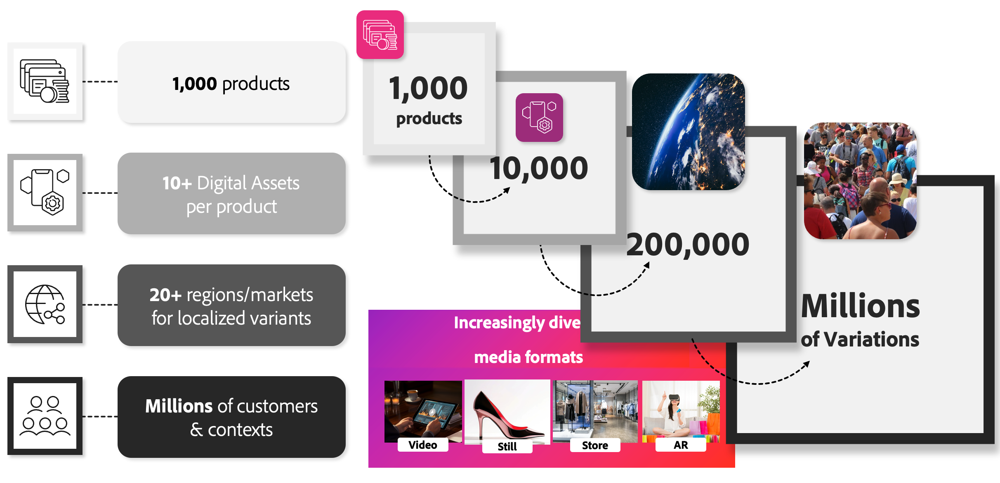

# 適用於Commerce的AEM Assets整合

在行銷預算受壓之際，對個人化內容的需求迅速增加。 受地區、季節和特定區段需求的驅動，零售商和品牌正在努力跟上產品影像變化需求的增長。

以包含1,000種產品的retailer為例。 即使未將屬性變數列入考量，在考慮不同地區、客戶區段和個人化工作時，所需的數位資產數量也會大幅增加。 這可能會導致大量的資產變數，高達數百萬個。

{width="700" zoomable="yes"}

AEM Assets整合可自動化資產管理工作流程，解決此難題。 整合可根據SKU或其他關鍵屬性，確保數位資產（例如產品影像和行銷內容）動態連結至適當的銷售實體，包括Adobe Commerce中的產品和類別。 此程式可透過啟用以下功能來簡化作業並提高效率：

* **順暢的安裝和設定** — 銷售團隊和開發人員可以使用熟悉的Adobe工具和工作流程快速設定整合。

* **動態資產更新** — 產品影像和行銷資產會自動反映AEM Assets的最新變更，保持店面正確且相關。

* **簡化的目錄管理** — 自動化資產重新整理和清理，將手動工作減至最少，並確保產品目錄維持一致且妥善維護。

## 使用整合的需求

若要將此整合與產品視覺效果或AEM Assets搭配運用，企業必須符合下列要求：

>[!BEGINTABS]

>[!TAB 產品視覺效果]

[!BADGE 僅限SaaS]{type=Positive url="https://experienceleague.adobe.com/zh-hant/docs/commerce/user-guides/product-solutions" tooltip="僅適用於Adobe Commerce as a Cloud Service和Adobe Commerce Optimizer專案(Adobe管理的SaaS基礎結構)。"}適用於Adobe Commerce、AEM Assets支援的產品視覺效果以及[AEM Dynamic Media](https://experienceleague.adobe.com/zh-hant/docs/experience-manager-65/content/assets/dynamic/administering-dynamic-media)的有效授權（這些授權隨[!DNL Adobe Commerce as a Cloud Service]和[!DNL Adobe Commerce Optimizer]一起提供立即可用）。

>[!TAB AEM Assets]

[!BADGE 僅限SaaS]{type=Positive url="https://experienceleague.adobe.com/zh-hant/docs/commerce/user-guides/product-solutions" tooltip="僅適用於Adobe Commerce as a Cloud Service和Adobe Commerce Optimizer專案(Adobe管理的SaaS基礎結構)。"}個Adobe Commerce、Adobe Experience Manager Assets和[AEM Dynamic Media](https://experienceleague.adobe.com/zh-hant/docs/experience-manager-65/content/assets/dynamic/administering-dynamic-media)的有效授權。

僅[!BADGE PaaS]{type=Informative tooltip="僅適用於雲端專案上的Adobe Commerce (Adobe管理的PaaS基礎結構)。"} Adobe Commerce 2.4.5+

* PHP 8.1、8.2、8.3和8.4

* Composer 2.x

僅[!BADGE SaaS]{type=Positive url="https://experienceleague.adobe.com/zh-hant/docs/commerce/user-guides/product-solutions" tooltip="僅適用於Adobe Commerce as a Cloud Service和Adobe Commerce Optimizer專案(Adobe管理的SaaS基礎結構)。"} Adobe Experience Manager已布建[Adobe Experience Manager Assets as a Cloud Service](https://experienceleague.adobe.com/zh-hant/docs/experience-manager-cloud-service/content/assets/overview)

>[!ENDTABS]

設定整合的Adobe Commerce使用者必須擁有布建AEM Assets專案的[IMS組織](https://experienceleague.adobe.com/zh-hant/docs/core-services/interface/administration/organizations#concept_EA8AEE5B02CF46ACBDAD6A8508646255)的存取權。

>[!BEGINSHADEBOX]

## 主要業務優點

 **無額外費用** — 此整合免費提供給符合授權要求的商家。

 **正式Adobe解決方案** — 由Adobe開發、維護及完全支援，確保穩定性並與未來的平台增強功能保持一致。

 **Adobe Managed支援模型** — 協助和疑難排解直接由Adobe處理，讓您完全安心，並簡化問題解決方案。

 **Adobe Storefront Builder功能** — 數位資產管理(DAM)解決方案允許使用[Storefront Builder](https://experienceleague.adobe.com/developer/commerce/storefront/merchants/storefront-builder/?lang=zh-Hant#userlabs-commerce-genai-product-visuals)上的影像、影片和其他媒體等資產。

>[!ENDSHADEBOX]

觀看此影片，瞭解Adobe Commerce和AEM Assets如何共同簡化內容工作流程：

>[!VIDEO](https://video.tv.adobe.com/v/3447837)

## 後續步驟

啟用Commerce與Experience Manager Assets的整合需要三個步驟：

1. [設定您的AEM Assets專案以支援Commerce中繼資料](get-started/configure-aem.md)。

1. 僅[!BADGE PaaS]{type=Informative tooltip="僅適用於雲端專案上的Adobe Commerce (Adobe管理的PaaS基礎結構)。"} [安裝Adobe Commerce套件](get-started/configure-commerce.md)。

1. [設定整合](get-started/setup-synchronization.md)。

## 支援

如果您需要本指南未涵蓋的資訊或問題，請聯絡您的AEM Assets整合銷售代表，或建立[支援票證](https://experienceleague.adobe.com/docs/commerce-knowledge-base/kb/help-center-guide/magento-help-center-user-guide.html?lang=zh-Hant#submit-ticket)以取得其他協助。
