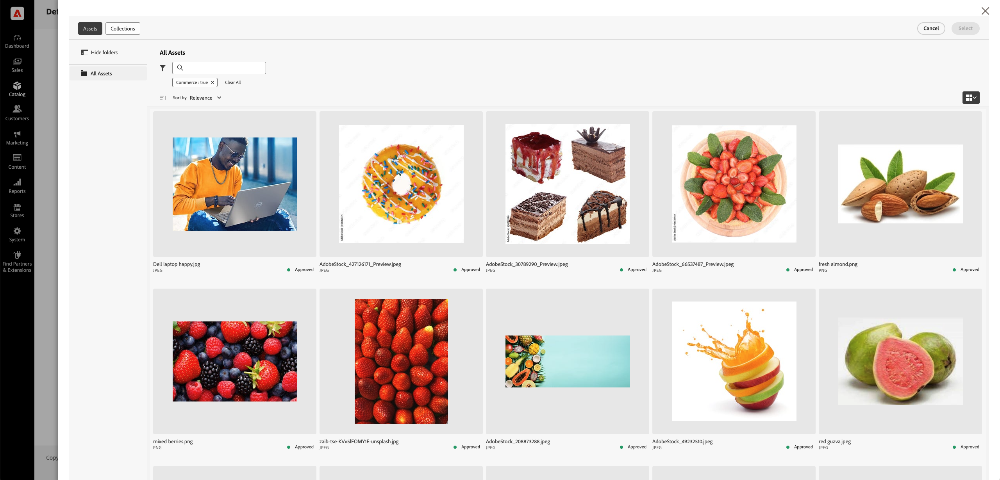

# 手動選取資產

**AEM Asset Selector**&#x200B;可讓行銷人員和銷售人員輕鬆將影像從AEM Assets新增到Adobe Commerce，簡化資產管理程式。 此方法將資產選取限制在[!DNL DAM (Digital Asset Management system)]中稽核和核准者，可確保品牌一致性和法規遵循。

已在AEM管理員中設定AEM Assets專案的IMS使用者端ID時，即可使用&#x200B;**Commerce資產選擇器**。 請參閱[設定AEM資產選擇器](#configure-the-aem-asset-selector-in-adobe-commerce)。

設定&#x200B;**AEM Asset Selector**&#x200B;整合時，行銷人員和銷售人員可以：

* 輕鬆管理類別影像，確保符合品牌和行銷活動准則。
* [!BADGE 僅限PaaS]{type=Informative tooltip="僅適用於雲端專案上的Adobe Commerce (Adobe管理的PaaS基礎結構)。"}直接在Page Builder中指派資產，以取得視覺效果豐富的內容。
* [!BADGE 僅限SaaS]{type=Positive url="https://experienceleague.adobe.com/en/docs/commerce/user-guides/product-solutions" tooltip="僅適用於Adobe Commerce as a Cloud Service和Adobe Commerce Optimizer專案(Adobe管理的SaaS基礎結構)。"}在Commerce店面中直接指派Assets (由Edge Delivery Services提供技術支援)，以視覺化方式豐富內容。

>[!NOTE]
>
> AEM資產選擇器是AEM資產的前端元件，用於整合AEM Assets與製作應用程式。 如需此元件的詳細資訊，請參閱[AEM as a Cloud Service使用手冊](https://experienceleague.adobe.com/en/docs/experience-manager-cloud-service/content/assets/manage/asset-selector/overview-asset-selector){target=_blank}中的&#x200B;*Micro-Frontend資產選擇器*。

## 主要優點

在AEM管理面板中內嵌Adobe Commerce資產選擇器有幾項主要優點：

* **品牌一致性** — 僅顯示已核准的資產，將店面影像過期或不相容的風險降至最低。

* **效率** — 可讓行銷人員和銷售人員快速指派資產，而不需在不同平台之間切換。

* **簡化的Collaboration** — 允許從DAM直接選取影像，省去手動下載和上傳的麻煩，讓團隊合作更順暢。

* **增強的內容品質** — 確保在產品頁面、類別和頁面產生器中使用高解析度、最佳化的影像。

{width="600" zoomable="yes"}

## 在Adobe Commerce中設定AEM資產選擇器

1. 從Commerce管理員中，導覽至「**[!UICONTROL Store]** >設定> **[!UICONTROL ADOBE SERVICES]** > **[!UICONTROL AEM Assets Integration]**」。

1. 填寫&#x200B;**[!UICONTROL IMS Client ID]**&#x200B;欄位。

1. **儲存**&#x200B;設定。

## 後續步驟

* [使用資產選擇器管理類別影像](../manage-assets.md#category-images)
* [管理頁面產生器內容中的影像](../manage-assets.md#using-aem-asset-selector-in-page-builder)
