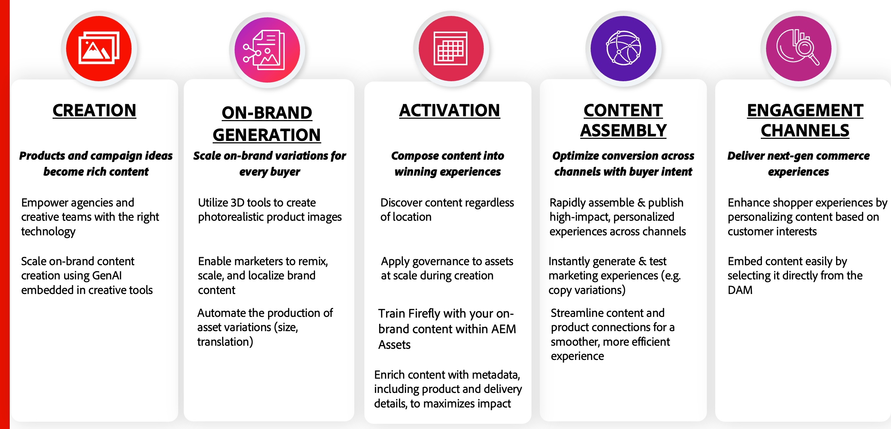

# 維護正確且相關的內容

真正的內容供應包括&#x200B;**建立與生產**、**工作流程與計畫**&#x200B;以及&#x200B;**傳遞與啟用**&#x200B;的主要支柱組合。 這些支柱各自都有價值，並有助於為組織推動重大價值：

{width="600" zoomable="yes"}

電子商務平台是最關鍵的參與管道之一。 確保資產管理系統中的順暢更新，以確保商務店面一律顯示最新的產品資訊。 這對於達成任何&#x200B;**DAM （數位資產管理系統）** &lt;> **Commerce整合**&#x200B;的三個主要目標至關重要：

* 改善新產品上市的&#x200B;**上市時間(TTM)**。

* 消除營運低效並減少手動互動。

* 一律提供符合品牌指引的核准內容，確保品牌一致性。

為了達成這些目標，Commerce的AEM Assets整合已訂閱&#x200B;**Adobe Commerce**&#x200B;和&#x200B;**AEM Assets**&#x200B;事件，以確保內容與商務之間的動態同步。

## Adobe Commerce目錄變更

AEM Assets整合會聆聽在&#x200B;**Admin**&#x200B;中或使用&#x200B;**API**&#x200B;建立產品時觸發的產品建立事件。 觸發時，它會同步來自DAM且與新產品SKU關聯的已核准資產。

將內容建立與目錄管理分離開來，企業便可獲得數個優勢：

* 內容團隊可以獨立運作，確保高品質的資產已準備好投入產品。

* 產品更新保持快速，因為資產建立不會延遲目錄變更，使管理新產品時更靈活。

* 自動化可改善效率和準確性，減少產品資料和相關內容之間的不相符。

>[!NOTE]
>
> PaaS和SaaS中的CSV產品匯入不會觸發更新事件。 使用API進行目錄匯入和更新。

## AEM Assets生命週期變更

整合也會監聽AEM Assets中的資產狀態變更。 由於Adobe Commerce是參與管道，店面只會顯示已核准的資產。

此整合可自動化資產生命週期管理，確保店面內容保持正確且符合品牌規範。

* 只會發佈經過核准的資產，以維護品牌完整性和法規遵循。

* 系統會自動移除過時或不相關的資產，避免出現過時內容。

* 資產核准與產品顯示之間的無縫同步可減少手動工作與延遲。

藉由運用AEM Asset Selector整合，企業得以維持簡化、正確且有效的內容供應變更，進而提升客戶體驗與營運效率。
