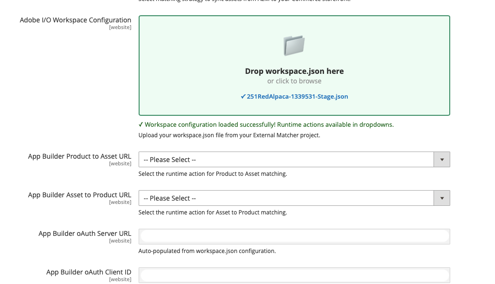

# 自訂自動比對

如果預設的自動比對策略（**OOTB自動比對**）不符合您的特定業務需求，請選取自訂比對選項。 此選項支援使用[Adobe Developer App Builder](https://experienceleague.adobe.com/en/docs/commerce-learn/tutorials/adobe-developer-app-builder/introduction-to-app-builder)來開發自訂符合器應用程式，以處理複雜的符合邏輯，或來自無法將中繼資料填入AEM Assets的協力廠商系統的資產。

## 設定自訂自動比對

1. 從Commerce管理員中，導覽至「**[!UICONTROL Store]** >設定> **[!UICONTROL ADOBE SERVICES]** > **[!UICONTROL AEM Assets Integration]**」。

1. 選取&#x200B;**[!UICONTROL Custom Matcher]**&#x200B;作為比對規則。

1. 當您選取此比對規則時，Admin會顯示其他欄位，以設定&#x200B;**端點**&#x200B;和自訂比對邏輯所需的&#x200B;**驗證引數**。

### workspace.json

**[!UICONTROL Adobe I/O Workspace Configuration]**&#x200B;欄位透過匯入App Builder `workspace.json`設定檔，提供簡化的自訂比對器設定方式。

您可以從`workspace.json`Adobe Developer Console[下載](https://developer.adobe.com/console)檔案。 此檔案包含您App Builder工作區的所有認證和設定詳細資料。

+++範例`workspace.json`

```json
{
  "project": {
    "id": "project_id",
    "name": "project_name",
    "title": "title_name",
    "org": {
      "id": "id",
      "name": "Organization_name",
      "ims_org_id": "ims_id"
    },
    "workspace": {
      "id": "workspace_id",
      "name": "workspace_name_id",
      "title": "workspace_title_id",
      "action_url": "https://action_url.net",
      "app_url": "https://app_url.net",
      "details": {
        "credentials": [
          {
            "id": "credential_id",
            "name": "credential_name_id",
            "integration_type": "oauth_server_to_server",
            "oauth_server_to_server": {
              "client_id": "client_id",
              "client_secrets": ["secret"],
              "technical_account_email": "xx@technical_account_email.com",
              "technical_account_id": "technical_account_id",
              "scopes": [
                "AdobeID",
                "openid",
                "read_organizations",
                "additional_info.projectedProductContext",
                "additional_info.roles",
                "adobeio_api",
                "read_client_secret",
                "manage_client_secrets"
              ]
            }
          }
        ],
        "services": [
          {
            "code": "AdobeIOManagementAPISDK",
            "name": "I/O Management API"
          }
        ],
        "runtime": {
          "namespaces": [
            {
              "name": "namespace_name",
              "auth": "example_auth"
            }
          ]
        },
        "events": {
          "registrations": []
        },
        "mesh": {}
      }
    }
  }
}
```

+++

1. 將您的`workspace.json`檔案從App Builder專案拖放至&#x200B;**[!UICONTROL Adobe I/O Workspace Configuration]**&#x200B;欄位。 或者，您可以按一下瀏覽並選取檔案。

{width="600" zoomable="yes"}

1. 系統自動：

   * 驗證JSON結構
   * 擷取及填入OAuth認證
   * 擷取工作區的可用執行階段動作
   * 填入&#x200B;**[!UICONTROL Product to Asset URL]**&#x200B;和&#x200B;**[!UICONTROL Asset to Product URL]**&#x200B;欄位的下拉式清單選項

1. 從每個流程的下拉式選單中選取適當的執行階段動作。

1. 按一下&#x200B;**[!UICONTROL Save Config]**。

## 自訂比對器API端點

當您使用[App Builder](https://experienceleague.adobe.com/en/docs/commerce-learn/tutorials/adobe-developer-app-builder/introduction-to-app-builder){target=_blank}建置自訂符合專案應用程式時，應用程式必須公開下列端點：

* **App Builder資產至產品URL**&#x200B;端點
* **App Builder產品至資產URL**&#x200B;端點

### App Builder資產至產品URL端點

此端點會擷取與指定資產相關聯的SKU清單：

#### 使用範例

```javascript
const { Core } = require('@adobe/aio-sdk')

async function main(params) {

    // Build your own matching logic here to return the products that map to the assetId
    // var productMatches = [];
    // params.assetId
    // params.eventData.assetMetadata['commerce:isCommerce']
    // params.eventData.assetMetadata['commerce:skus'][i]
    // params.eventData.assetMetadata['commerce:roles']
    // params.eventData.assetMetadata['commerce:positions'][i]
    // ...
    // End of your matching logic

    // Set skip to true if the mapping hasn't changed
    const skipSync = false;

    return {
        statusCode: 200,
        body: {
            asset_id: params.assetId,
            product_matches: [
                {
                    product_sku: "<YOUR-SKU-HERE>",
                    asset_roles: ["thumbnail", "image", "swatch_image", "small_image"],
                    asset_position: 1
                }
            ],
            skip: skipSync
        }
    };
}

exports.main = main;
```

**要求**

```text
POST https://your-app-builder-url/api/v1/web/app-builder-external-rule/asset-to-product
```

| 引數 | 資料型別 | 說明 |
| --- | --- | --- |
| `assetId` | 字串 | 代表更新的資產ID。 |
| `eventData` | 字串 | 傳回與資產ID相關聯的資料裝載。 |

**回應**

```json
{
  "asset_id": "{ASSET_ID}",
  "product_matches": [
    {
      "product_sku": "{PRODUCT_SKU_1}",
      "asset_roles": ["thumbnail", "image"]
    },
    {
      "product_sku": "{PRODUCT_SKU_2}",
      "asset_roles": ["thumbnail"]
    }
  ],
  "skip": false
}
```

| 引數 | 資料型別 | 說明 |
| --- | --- | --- |
| `asset_id` | 字串 | 相符的資產ID。 |
| `product_matches` | 陣列 | 與資產相關聯的產品清單。 |
| `skip` | 布林值 | （選用）當`true`時，規則引擎會略過此資產的同步處理（無產品對應更新）。 當`false`或省略時，正常處理會執行。 請參閱[略過同步處理](#skip-sync-processing)。 |

### App Builder產品至資產URL端點

此端點會擷取與指定SKU相關聯的資產清單：

#### 使用範例

```javascript
const { Core } = require('@adobe/aio-sdk')

async function main(params) {
    // return asset matches for a product
    // Build your own matching logic here to return the assets that map to the productSku
    // var assetMatches = [];
    // params.productSku
    // ...
    // End of your matching logic

    // Set skip to true if the mapping hasn't changed
    const skipSync = false;

    return {
        statusCode: 200,
        body: {
            product_sku: params.productSku,
            asset_matches: [
                {
                    asset_id: "<YOUR-ASSET-ID-HERE>", // urn:aaid:aem:1aa1d5i2-17h8-40a7-a228-e3ur588deee1
                    asset_roles: ["thumbnail", "image", "swatch_image", "small_image"],
                    asset_format: "image", // can be "image" or "video"
                    asset_position: 1
                }
            ],
            skip: skipSync
        }
    };
}

exports.main = main;
```

**要求**

```text
POST https://your-app-builder-url/api/v1/web/app-builder-external-rule/product-to-asset
```

| 引數 | 資料型別 | 說明 |
| --- | --- | --- |
| `productSKU` | 字串 | 代表更新的產品SKU。 |
| `eventData` | 字串 | 傳回與產品SKU相關聯的資料裝載。 |

**回應**

```json
{
  "product_sku": "{PRODUCT_SKU}",
  "asset_matches": [
    {
      "asset_id": "{ASSET_ID_1}",
      "asset_roles": ["thumbnail", "image"],
      "asset_position": 1,
      "asset_format": "image"
    },
    {
      "asset_id": "{ASSET_ID_2}",
      "asset_roles": ["thumbnail"],
      "asset_position": 2,
      "asset_format": "image"
    }
  ],
  "skip": false
}
```

| 引數 | 資料型別 | 說明 |
| --- | --- | --- |
| `product_sku` | 字串 | 相符的產品SKU。 |
| `asset_matches` | 陣列 | 與產品相關聯的資產清單。 |
| `skip` | 布林值 | （選用）當`true`時，規則引擎會略過此產品的同步處理（無資產對應更新）。 當`false`或省略時，正常處理會執行。 請參閱[略過同步處理](#skip-sync-processing)。 |

`asset_matches`引數包含下列屬性：

| 屬性 | 資料型別 | 說明 |
| --- | --- | --- |
| `asset_id` | 字串 | 資產識別碼。 |
| `asset_roles` | 陣列 | 資產角色。 使用支援的[Commerce資產角色](https://experienceleague.adobe.com/en/docs/commerce-admin/catalog/products/digital-assets/product-image#image-roles)，例如`thumbnail`、`image`、`small_image`和`swatch_image`。 |
| `asset_format` | 字串 | 資產格式。 可能的值為`image`和`video`。 |
| `asset_position` | 數字 | 資產在產品相簿中的位置。 |

## 略過同步處理

`skip`引數可讓您的自訂比對器略過特定資產或產品的同步處理。

當您的App Builder應用程式在回應中傳回`"skip": true`時，規則引擎不會傳送該資產或產品的更新或移除API請求給Commerce。 此最佳化可減少不必要的API呼叫並改善效能。
