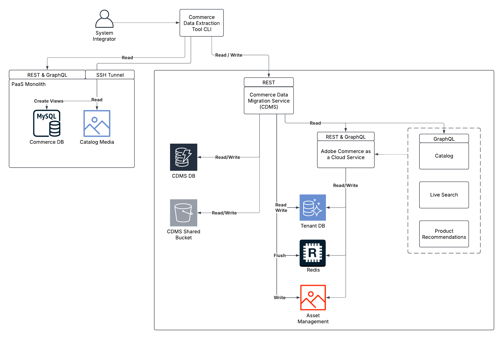

# 大量資料移轉工具

大量資料移轉工具採用分散式架構，可安全且有效率地從PaaS環境移轉至SaaS環境。 此工具是專為解決方案實作者所設計，可將資料從雲端例項上的現有Adobe Commerce (PaaS)移轉至[!DNL Adobe Commerce as a Cloud Service] (SaaS)。 如需移轉程式的詳細資訊，請參閱[移轉概觀](./overview.md)。

>[!NOTE]
>
>大量資料移轉工具僅支援移轉第一方核心商務資料。 目前不支援自訂資料移轉。

下圖詳細說明使用大量資料移轉工具的架構和關鍵元件。



## 移轉工作流程

大量資料移轉工作流程包含下列步驟：

1. 設定新的遷移環境。
1. 從舊系統複製資料。
1. 將您的資料移至新系統。
1. 在新系統中提供您的產品目錄。
1. 確認您的資料已正確移轉。

以下各節會詳細說明這些步驟。

## 存取大量資料移轉工具

大量資料移轉工具的可用性如下：

- **2025年第4季** — 若要存取大量資料移轉工具，請提交支援票證。
- **2025年第4季** — 大量資料移轉工具將可公開使用，並可從此頁面存取。

## 建立目標環境

解決方案實作人員(SI)會建立移轉的目標環境。 此環境用於儲存從來源執行個體移轉的資料。

首先，[建立新的 [!DNL Adobe Commerce as a Cloud Service] (SaaS)執行個體](../getting-started.md#create-an-instance)。

### 設定擷取工具

擷取工具用於從來源例項中擷取資料。

1. 從Adobe提供的連結下載擷取工具。
1. 在擷取工具中設定下列環境變數：
   - 您現有MySQL資料庫的連線詳細資料
   - 您的[!DNL Adobe Commerce as a Cloud Service]執行個體的目標租使用者ID
   - 您的IMS憑證，包括：
      - 使用者端ID
      - 使用者端密碼
      - IMS範圍
      - IMS URL — 基礎URL。 例如，`https://ims-na1.adobelogin.com/`。
      - IMS組織ID

   針對IMS範圍和其他值，請在&#x200B;**Adobe Developer Console**&#x200B;中專案內的[認證](https://developer.adobe.com/console/)區段中選取您的OAuth型別。 在擷取工具隨附的`.example.env`檔案中提供詳細資訊。

### 擷取資料

執行提取工具之前，解決方案實作人員必須使用以下專案建立PaaS資料庫的SSH通道：

```bash
magento-cloud tunnel:open
```

然後執行擷取工具，其將：

1. 連線至PaaS資料庫、分析其結構描述，並將其與SaaS租使用者結構描述詳細資料進行比較。
1. 根據PaaS和SaaS之間的共同結構描述元素產生擷取和轉換計畫。
1. 使用目錄資料管理服務(CDMS)擷取資料。

### 載入資料

執行Adobe提供的載入資料工具。 此工具將：

1. 使用移轉帳戶連線至SaaS租使用者資料庫。
1. 產生載入計畫。
1. 執行計畫，將資料批次移至SaaS租使用者資料庫。
1. 處理目錄媒體並將其傳輸到目標環境。
1. 排清SaaS Redis快取，並讓租使用者的資料庫索引失效。

### 目錄資料擷取

資料載入後，目錄資料會自動從SaaS租使用者資料庫傳輸至目錄服務。

目錄服務會與「即時搜尋」和「產品推薦」共用此資料。 此程式不需要手動介入。 擷取完成後，資料將可用於所有服務。

### 資料完整性驗證

移轉後，CDMS會執行下列自動資料完整性檢查，以確保移轉資料的正確性和完整性：

**API型驗證**

在驗證期間，CDMS會將先前執行之查詢的REST和GraphQL API回應與目標執行個體的對應記錄進行比較。 移轉狀態中會顯示任何差異。

**資料庫層級驗證**

在驗證期間，CDMS會計算擷取的記錄數，並將該數目與載入的記錄數進行比較。

**隨選驗證（選擇性）**

您也可以手動觸發對所有系統記錄的全面驗證：

>[!NOTE]
>
>此程式需要大量資源，應該僅用於沙箱環境。

完整的驗證包括：

- 使用所有預先擷取的REST和GraphQL API回應，完成API型驗證
- 找到任何不一致的詳細報告
