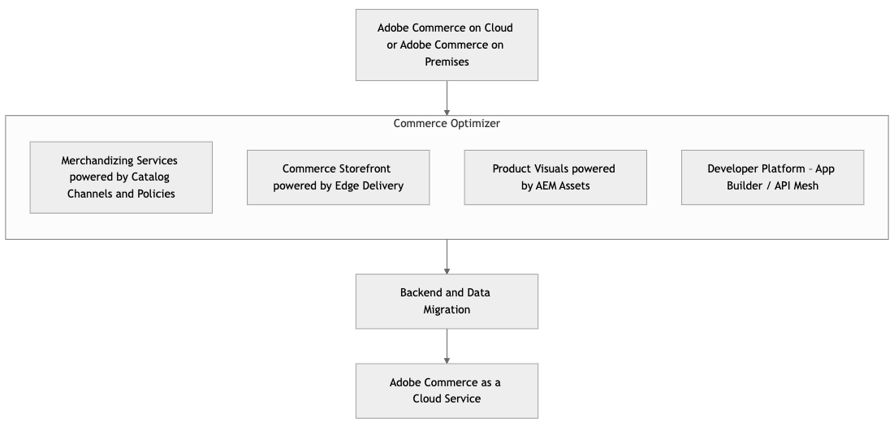

# 移轉至[!DNL Adobe Commerce as a Cloud Service]

{{accs-early-access}}

[!DNL Adobe Commerce as a Cloud Service]提供開發人員從現有Adobe Commerce PaaS實作轉換至新Adobe Commerce as a Cloud Service (SaaS)產品的完整指南。 Adobe Commerce as a Cloud Service代表著完全受管理、無版本SaaS模型的重大轉變，可提供增強的效能、擴充性、簡化的操作，以及與更廣的Adobe Experience Cloud更緊密的整合。

>[!NOTE]
>
>如需移轉工具的詳細資訊，請參閱[大量資料移轉工具](./bulk-data.md)。

## 了解轉換 — 比較PaaS和SaaS

**主要差異**

* 僅[!BADGE PaaS]{type=Informative url="https://experienceleague.adobe.com/en/docs/commerce/user-guides/product-solutions" tooltip="僅適用於雲端專案(Adobe管理的PaaS基礎結構)和內部部署專案的Adobe Commerce 。"} **PaaS （目前）**：商家在Adobe的託管環境中管理應用程式程式碼、升級、修補、基礎架構設定。 [服務(MySQL、Elasticsearch等)的共用職責模型](https://experienceleague.adobe.com/en/docs/commerce-operations/security-and-compliance/shared-responsibility)。
* [!BADGE 僅限SaaS]{type=Positive url="https://experienceleague.adobe.com/en/docs/commerce/user-guides/product-solutions" tooltip="僅適用於Adobe Commerce as a Cloud Service和Adobe Commerce Optimizer專案(Adobe管理的SaaS基礎結構)。"} **SaaS （新增 — [!DNL Adobe Commerce as a Cloud Service]）**： Adobe可完全管理核心應用程式、基礎架構和更新。 商家專注於透過擴充點(API、App Builder、UI SDK)進行自訂。 核心應用程式程式碼已鎖定。

**架構影響**

* **無版本平台**：持續更新表示核心不再有重大版本升級。
* **微服務與API-1}：對API的延伸性與整合依賴性更深。**
* **依預設Headless （選用）**：對分離式店面的強大支援(例如，由Edge Delivery Services支援的Commerce店面)。
* **Edge Delivery Services**：對前端效能和部署的影響。

**新工具與概念**
* 適用於Adobe Developer App Builder的[Adobe Developer App Builder](https://developer.adobe.com/app-builder/)和[API Mesh](https://developer.adobe.com/graphql-mesh-gateway)
* [Commerce Optimizer](../../optimizer/overview.md)
* [Edge Delivery Services](https://experienceleague.adobe.com/developer/commerce/storefront/)
* 使用[Commerce Cloud Manager](../getting-started.md#create-an-instance)進行自助布建

## 移轉路徑

根據您的時間表、店面和自訂，[!DNL Adobe Commerce as a Cloud Service]支援多個移轉路徑。

作為完整移轉的替代方法，[!DNL Adobe Commerce as a Cloud Service]支援使用Commerce Optimizer或增量方式的分階段移轉。

* **累加移轉** — 此方法包含分階段移轉資料、自訂和整合。 此方法適用於有許多自訂的大型商家，他們想要以自己的步調，逐漸將其複雜的自訂和資料轉換到[!DNL Adobe Commerce as a Cloud Service]。

{width="600" zoomable="yes"}

* **Commerce Optimizer** — 此方法可讓您使用Commerce Optimizer作為轉換階段，以您自己的步調將複雜的自訂專案和資料移至[!DNL Adobe Commerce as a Cloud Service]，進行反複移轉。 Commerce Optimizer可讓您存取由目錄管道和原則支援的銷售服務、由Edge Delivery支援的Commerce店面，以及由AEM Assets支援的產品視覺效果。

{width="600" zoomable="yes"}

* **完整移轉** — 此方法需要一次移轉所有資料、自訂和整合。 此方法適用於擁有少量自訂專案，但想要快速轉換至[!DNL Adobe Commerce as a Cloud Service]的小型商家。

下表提供不同店面及設定的移轉程式概覽：

|                    | LUMA店面 | PWA店面 | 由Edge Delivery提供支援的Commerce店面 | Headless |
|--------------------|----------------------------------------|----------------------------------------|------------------------------------------------------|----------------------------------------|
| 資料移轉 | 必填 | 必填 | 必填 | 必填 |
| 店面 | 移轉至Edge Delivery支援的Commerce店面 | 移轉至Edge Delivery支援的Commerce店面或維護 | 沒有影響 | 沒有影響 |
| API網格 | 建立新網格 | 建立新網格或重新設定現有網格 | 建立新網格或重新設定現有網格 | 建立新網格或重新設定現有網格 |
| 整合 | 善用整合入門套件 | 善用整合入門套件 | 善用整合入門套件 | 善用整合入門套件 |
| 自訂 | 移至App Builder &amp; API Mesh | 移至App Builder &amp; API Mesh | 移至App Builder &amp; API Mesh | 移至App Builder &amp; API Mesh |
| Assets管理 | 使用OOTB時需要移轉 | 使用OOTB時需要移轉 | 使用OOTB時需要移轉 | 使用OOTB時需要移轉 |
| 擴充功能 | 移轉至App Builder | 移轉至App Builder | 移轉至App Builder | 移轉至App Builder |

如表所示，每次移轉的緩解措施將包含：

* **資料移轉** — 使用提供的[移轉工具](./bulk-data.md)，將資料從您現有的執行個體移轉至[!DNL Adobe Commerce as a Cloud Service]。
* **店面** — 由Edge Delivery提供支援的現有Commerce店面和Headless店面不需要減輕影響，但Luma店面需要移轉至Edge Delivery提供支援的Commerce店面。 PWA Studio店面可移轉至Edge Delivery支援的Commerce店面，或維持其目前狀態。 Adobe將提供加速器來協助店面遷移。
* **[API網格](https://developer.adobe.com/graphql-mesh-gateway)** — 建立新網格或修改現有網格。 Adobe將提供預先設定的網格，以協助進行此程式。
* **整合** — 所有整合都需要運用[整合入門套件](https://developer.adobe.com/commerce/extensibility/starter-kit/integration/)或[[!DNL Adobe Commerce as a Cloud Service] REST API](https://developer.adobe.com/commerce/webapi/reference/rest/saas/)。
* **自訂** — 所有自訂都必須移至App Builder和API Mesh。
* **Assets管理** — 所有資產管理都需要移轉。 如果您已在使用AEM Assets，則不需要移轉。
* **擴充功能** — 任何處理中的擴充功能都必須重新建立為程式外擴充功能。 到2025年底，Adobe將可存取我們最熱門的擴充功能，以將建置時間縮到最短。

## 移轉階段

下列階段說明移轉至[!DNL Adobe Commerce as a Cloud Service]的必要步驟和考量事項。

### 移轉前評估與規劃

此階段對於將風險降至最低、建立明確的移轉路徑，以及在問題發生之前識別問題都至關重要。

**目前環境的探索與稽核**

**程式碼基底分析：**

* 識別所有自訂模組、主題和覆寫。
* 分析核心程式碼修改，並決定哪些需要重構才能進行移轉。
* 評估協力廠商擴充功能，並判斷與[!DNL Adobe Commerce as a Cloud Service]的相容性。 是否有SaaS相容的替代方案，或者您是否需要建立自訂API整合或App Builder應用程式？
* 識別任何不會移轉的過時程式碼或功能。

**資料稽核：**

* 評估您的資料庫大小和複雜性。
* 識別未使用的資料或表格以進行清理。
* 檢閱現有的資料匯入/匯出程式。

**整合檢閱：**

* 列出與Adobe Commerce整合的所有外部系統（ERP、CRM、PIM、付款閘道、送貨供應商、OMS和任何其他系統）。
* 評估整合方法（API、自訂指令碼和其他方法）。
* 評估與[!DNL Adobe Commerce as a Cloud Service]的API優先方法和App Builder的相容性。

**效能標竿：**

* 記錄目前的Lighthouse分數、頁面載入時間，以及關鍵績效指標(KPI)，這是測量移轉後改善情況的基準。

**安全性組態檢閱：**

* 評估任何自訂WAF規則、IP允許清單和任何其他安全性設定。

**定義移轉範圍與策略：**

* **分階段移轉與一次完整移轉：**&#x200B;評估每種方法的優劣。
* **識別核心業務流程：**&#x200B;優先處理必須先移轉的功能，例如：
   * 複雜的定價規則
   * 在正式下訂單或處理訂單之前套用的自訂商業規則
   * 複雜的稅捐計算
   * 地址驗證
   * 下訂單後觸發的自訂邏輯
* **無頭式與整體式店面：**&#x200B;新店面開發或調整現有店面的決策點。
* **整合策略：**&#x200B;決定如何重新平台化現有的整合(API網格、App Builder、直接API)。
* **資料移轉策略：**&#x200B;決定您要使用完整歷史資料、部分資料或無移轉資料進行移轉。

**團隊整備與訓練：**

* 熟悉[!DNL Adobe Commerce as a Cloud Service]概念、開發工作流程和新工具。
* 參加Adobe App Builder、Edge Delivery Services和[!DNL Adobe Commerce as a Cloud Service]部署管道的實作訓練。

**環境設定與布建：**

* 使用Commerce Cloud管理員布建您的[!DNL Adobe Commerce as a Cloud Service]沙箱和開發環境。

### 增量移轉階段

**策略重構和外部化**

此階段包含移轉的核心，著重於調整您的程式碼基底以符合[!DNL Adobe Commerce as a Cloud Service]雲端原生正規化。 這涉及策略性地採用新的Adobe服務，並將自訂邏輯移出核心Commerce平台。

#### 1.將「處理中」自訂專案和擴充功能移轉至App Builder

這是達成「鎖定的核心」及具前瞻性的解決方案的關鍵階段，是[!DNL Adobe Commerce as a Cloud Service]架構理念的核心。

* **將複雜邏輯外部化至App Builder**：分析您的PaaS程式碼基底中現有的自訂模組和協力廠商擴充功能。 針對複雜的商業邏輯、客製化整合或微服務，這些不需要直接在程式內操控Commerce核心資料模型，請在Adobe Developer App Builder中將其重構並重新平台，作為無伺服器應用程式。
* **運用API Mesh**：針對需要來自多個後端系統(例如您的PaaS Commerce後端、ERP、CRM和自訂App Builder微服務)之資料的情況，請在App Builder中實作API Mesh層。 這會將不同的API整合為單一高效能的GraphQL端點，供您的新店面或其他服務使用，以簡化複雜的資料擷取。
* **事件導向架構**：利用Adobe I/O Events，根據PaaS執行個體中發生的事件（例如產品更新、客戶註冊、訂單狀態變更）或其他連線系統，觸發App Builder動作。 如此可促進非同步通訊、減少緊密的耦合，並增強系統復原能力。

**優點**：此步驟大幅減少與深入內嵌自訂相關的技術債，大幅加快將您的Commerce執行個體轉換為[!DNL Adobe Commerce as a Cloud Service]的速度，增強自訂邏輯的可擴充性和獨立部署性，並加快擴充功能的開發週期。

#### 2.採用以SaaS為基礎的Adobe Commerce銷售服務，並整合目錄資料

這是關鍵的初始整合點，有兩個關於目錄資料管理的選項：

>[!BEGINTABS]

>[!TAB 選項1 — 現有的目錄SaaS服務]

**利用與PaaS後端整合的現有目錄SaaS服務**

此選項可作為過渡步驟，在現有整合的基礎上，讓您的PaaS後端使用[目錄服務](../../catalog-service/guide-overview.md)、[即時搜尋](../../live-search/overview.md)和[產品建議](../../product-recommendations/overview.md)的資料填入Adobe Commerce SaaS服務的現有執行個體。

* **目錄資料同步**：請確定您的Adobe Commerce PaaS執行個體繼續將產品和目錄資料同步至您現有的Adobe Commerce目錄SaaS服務。 這通常會仰賴PaaS執行個體中已建立的聯結器或模組。 目錄SaaS服務仍然是搜尋和銷售功能的權威來源，其資料源自您的PaaS後端。
* **最佳化的API Mesh**：雖然Headless店面(在Edge Delivery Services上)和其他服務可以直接使用目錄SaaS服務的資料，Adobe強烈建議使用API Mesh (在App Builder內)。 API Mesh可以將目錄SaaS服務的API與PaaS後端的其他必要API （例如，交易式資料庫中的即時詳細目錄檢查或未完全複製到目錄SaaS服務的自訂產品屬性）整合到單一高效能GraphQL端點中。 這也允許集中式快取、驗證和回應轉換。
* **整合即時搜尋和產品建議**：設定即時搜尋和產品建議SaaS服務，以直接從您現有的Adobe Commerce目錄SaaS服務[擷取目錄資料](https://experienceleague.adobe.com/en/docs/commerce/live-search/install#configure-the-data)，而您的PaaS後端會填入這些資料。

**優點**：這可善用現有且運作中的Catalog SaaS服務，及其與PaaS後端的整合管道，讓您更快速地前往Headless店面和進階SaaS銷售功能。 但是，它仍保留主要目錄資料來源在PaaS後端上的相依性，不提供新的「可組合目錄資料模型」中固有的多來源彙總功能。 此選項是邁向更完整可撰寫架構的有效基礎。

>[!TAB 選項2 — 可撰寫的目錄資料模型]

**採用新的可撰寫目錄資料模型(CCDM)**

這是策略性、經得起未來考驗的方法，可善用Adobe Commerce Optimizer。 CCDM提供彈性、可擴充且統一的目錄服務，專為多來源資料彙總及動態銷售所設計。

* **資料擷取與統一**
   * 首先，從您現有的Adobe Commerce PaaS執行個體（和/或其他PIM/ERP系統）將產品和目錄資料擷取至新的可撰寫目錄資料模型(CCDM)。
   * 將現有的產品屬性對應至CDM的彈性結構。 優先處理關鍵產品資料以進行初始內嵌。
   * 建立強大的資料管道以進行持續同步。 這可能包括：
      * **事件導向** (透過App Builder)：利用您PaaS執行個體的Adobe I/O Events，觸發公開可用或自訂的Adobe App Builder應用程式。 這些應用程式會透過其API轉換及推送資料變更（建立、更新和刪除）至CCDM。
      * **批次擷取**：對於大型初始載入或定期大量更新，請使用安全檔案傳輸（例如CSV或JSON）至臨時區域，由Adobe Experience Platform (AEP)擷取服務處理至CCDM。
      * **直接API整合** (使用App Builder協調流程)：對於更複雜的情境，App Builder可以充當協調層，對您的PaaS後端進行直接API呼叫、轉換資料，並將其推送至CCDM。
* **目錄檢視和原則定義**：設定目錄檢視（邏輯群組，用於唯一目錄簡報，例如商店檢視、區域和B2B/B2C區段），並在CCDM中定義原則（用於產品簡報、篩選和銷售的規則集）。 如此可讓您動態控制每個管道的產品分類和顯示邏輯。
* **整合即時搜尋和產品建議**：一旦目錄資料出現在CCDM中，請整合Adobe的SaaS式即時搜尋和產品建議服務。 這些利用了Adobe Sensei AI和機器學習模型，提供絕佳的搜尋相關性和個人化建議，並直接使用CCDM的資料。

**優點**：透過將目錄管理和探索抽象化至CCDM及相關的SaaS服務，您可以提升效能、取得AI驅動的銷售功能、大幅減輕舊式後端讀取作業的負載，並啟用漏斗頂端體驗的強大「剝離」。

>[!ENDTABS]

#### 3.在Edge Delivery Services上建立您的店面

隨著銷售資料管道的建立以及外部化的自訂，焦點會轉移至建立您的高效能前端。

* **初始設定**：使用Edge Delivery Services的Adobe Commerce店面樣板設定您的專案。 這是以現代Web技術為基礎的Headless前端。
* **連線到目錄服務和API Mesh**：您的Commerce店面將主要透過GraphQL API使用資料：
   * **選項1**：從現有的目錄SaaS服務（透過API Mesh）取得產品資訊和銷售規則。
   * **選項2**：從CCDM取得產品資訊和銷售規則。
   * 對於來自舊版後端（PaaS執行個體）或自訂App Builder服務（例如即時詳細目錄、自訂產品屬性和忠誠度點顯示）的任何協調資料，從API網格中建立。
* **內容移轉(AEM服務)**：將您現有的靜態內容（例如「關於我們」頁面、部落格和行銷橫幅）移轉到AEM服務，以支援Commerce店面。 運用AEM的內容製作功能，並確保資產已針對Edge Delivery Services最佳化。
* **開發核心UI元件**：使用Edge Delivery Services下拉式元件和自訂React/Vue元件，為產品詳細資料頁面(PDP)、產品清單頁面(PLP)和一般內容頁面建置重要的使用者介面元件。 排定核心商務流程的優先順序。
* **與現有購物車/結帳整合**：最初，Edge Delivery Services店面會協調您與現有Adobe Commerce PaaS （或其他協力廠商平台）的移交，以進行購物車管理和結帳。 這通常涉及：
   * **重新導向**：將使用者重新導向至舊版平台的原生購物車與結帳URL，並傳遞必要的工作階段與購物車識別碼。
   * **直接API互動** (使用App Builder協調流程)：在Edge Delivery Services中建立自訂購物車和結帳UI元件，這些元件會直接與您的PaaS後端的購物車和結帳API互動。 這通常涉及App Builder做為前端後端(BFF)，以協調對多個後端服務（例如PaaS cart、付款閘道和運送計算器）的呼叫。

**優點**：提供超快、SEO最佳化及高度彈性的店面體驗。 此階段可直接提供卓越的客戶體驗，為未來前端創新奠定基礎。

#### 4.資料移轉（分階段程式）

資料移轉是關鍵且多方面的程式，可與重構和店面開發同時執行，以確保資料一致性和完整性。

* **清理並最佳化現有資料**：在大規模移轉之前，請在您現有的PaaS資料庫上執行完整的資料清理、重複資料刪除及驗證。 此主動式步驟對於將舊版資料問題的傳輸減至最少，並確保新環境中的資料品質至關重要。

**大量資料移轉**

大量資料移轉涉及從Adobe Commerce PaaS執行個體取得完整資料傾印、轉換整個資料集，以及一次將資料匯入Adobe Commerce as a Cloud Service。 此方法通常用於初始的資料填入。

* **工具可用性**：將在2025年7月中旬依請求提供客戶用於第一方Commerce大量資料遷移的專用[大量資料遷移工具](./bulk-data.md)。 如果客戶事先需要大量資料移轉的相關協助，Adobe可協助他們依請求傳輸資料。

* **處理序**：
   * **完整資料匯出**：從您的Adobe Commerce PaaS執行個體擷取完整的資料集（例如，產品、類別、客戶帳戶、歷史訂單資料、靜態區塊和頁面內容）。
   * **資料轉換**：套用必要的轉換，使擷取的資料符合新Adobe Commerce as a Cloud Service元件的結構描述需求，包括可撰寫目錄資料模型(CCDM) （若採用）以及任何其他相關的Adobe服務或資料庫。 這可能涉及自訂指令碼或專門的資料對應工具。
   * **初始匯入**：將轉換後的完整資料集匯入Adobe Commerce as a Cloud Service的個別元件。 對於產品和類別資料，這會填入所選的目錄服務（CCDM或現有的目錄SaaS）。 針對客戶和訂單資料，這會填入交易式後端或關聯的服務。
   * **驗證**：嚴格驗證匯入的資料，以確保所有新系統的完整性、正確性和一致性。

**反複資料移轉**

反複資料移轉著重於將增量變更和增量從來源PaaS執行個體同步至新的Cloud Service元件，確保資料新鮮度，以利進行轉換前和轉換後。

* **工具可用性**：專門設計用於反複資料移轉的工具將在2025年下半年推出。

* **處理序**：
   * **差異識別**：建立機制以識別自上次同步以來PaaS環境中重要資料集中的變更（建立、更新及刪除）。 這可能涉及變更資料擷取(CDC)、時間戳記比較或事件型觸發器。
   * **連續同步**：實作健全的機制，以便從PaaS環境連續、增量同步資料至新的Cloud Service元件（例如CCDM和交易式後端）。 這對於維持資料新鮮度以及在轉換期間將停機時間減至最少至關重要。
   * **善用事件**：儘可能利用Adobe I/O Events觸發App Builder動作，即時或近乎即時地從您的PaaS執行個體更新至新服務。 例如，PaaS中的產品更新可能會觸發更新CCDM中對應條目的事件。
   * **API導向更新**：對於非事件導向的資料，請使用排程的API呼叫(透過App Builder或其他整合平台)從PaaS提取變更，並將其推送到新系統。
   * **錯誤處理與監視**：針對所有反複資料管道實作健全的錯誤處理、記錄與監視，以確保在整個處理過程中維持資料完整性。

### 移轉後與持續性作業

**DNS切換與上線：**

* 謹慎規劃DNS轉換作業，將停機時間降到最低。
* 在啟動後立即監視網站健康狀況和效能。

**啟動後作業：**

**正在停用PaaS環境：**

* 在驗證期間之後，安全地封存或刪除舊的PaaS執行個體和資料。

**進行中的開發工作流程：**

* 接受[!DNL Adobe Commerce as a Cloud Service]的無版本特性，它具有持續的小部署而不是大型升級。
* 運用Cloud Manager來管理環境和部署。
* 利用App Builder在不影響核心的情況下擴充功能。

**監視、效能和安全性：**

* 持續監控網站效能、錯誤和安全記錄。
* 運用Adobe的內建安全性功能，並遵循最佳實務。

**訓練與檔案：**

* 在[!DNL Adobe Commerce as a Cloud Service]平台和工作流程上訓練新開發人員和業務使用者。
* 維護自訂整合與流程的最新內部檔案。
