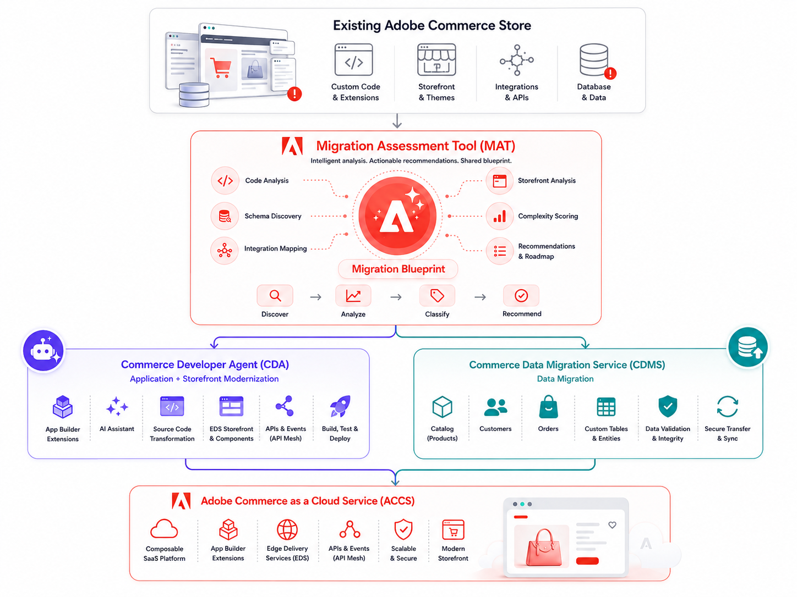

# 移轉至[!DNL Adobe Commerce as a Cloud Service]

本指南可協助開發人員從[!DNL Adobe Commerce on Cloud]或內部部署轉換至[!DNL Adobe Commerce as a Cloud Service] (SaaS)。 此SaaS模型提供增強的效能、擴充性，以及與[!DNL Adobe Experience Cloud]的整合。

>[!NOTE]
>
>如需移轉工具的詳細資訊，請參閱[大量資料移轉工具](./bulk-data/migration-tool.md)。

## 概觀

將已建立的[!DNL Adobe Commerce]存放區移轉至[!DNL Adobe Commerce as a Cloud Service]不僅僅是行動資料。 真正的移轉涵蓋下列領域：

- 應用程式 — 為[!DNL Adobe Commerce on Cloud]或內部部署安裝建置的自訂和擴充功能
- 資料 — 目錄、訂單、客戶和設定
- 店面
- 與外部系統整合

[!DNL Adobe Commerce as a Cloud Service]是無版本SaaS平台，這表示這些區域都不能在不調整的情況下移轉。 自訂已現代化至[!DNL App Builder]個應用程式，在Edge Delivery Services (EDS)上重建店面，將資料移轉至新的[!DNL Adobe Commerce as a Cloud Service]租使用者，並使用SaaS模式重新建立整合。

Adobe不將移轉視為單一整體專案，而是提供建置在[三個移轉工具](#migration-tools-workflow)周圍的整合式移轉工作流程。

此共用工作流程可整合探索、協調工程及傳遞團隊，並提供一致的移轉計畫。

### PaaS和SaaS比較

[!DNL Adobe Commerce on Cloud]或內部部署(PaaS)和[!DNL Adobe Commerce as a Cloud Service] (SaaS)的管理方式以及商家與平台的互動方式不同。

**主要差異**

- 僅[!BADGE 個PaaS]{type=Informative url="https://experienceleague.adobe.com/en/docs/commerce/user-guides/product-solutions" tooltip="僅適用於雲端專案（Adobe管理的PaaS基礎結構）和內部部署專案的Adobe Commerce 。"}
- **[!DNL Adobe Commerce on Cloud Infrastructure]**：商家管理應用程式程式碼、升級、修補和基礎結構設定。
- **[!DNL Adobe Commerce]內部部署**：商家在Adobe的託管環境中管理應用程式程式碼、升級、修補、基礎結構設定。

  >[!NOTE]
  >
  >[服務（MySQL、Elasticsearch等）的共用職責模型](https://experienceleague.adobe.com/en/docs/commerce-operations/security-and-compliance/shared-responsibility)。

- [!BADGE 僅限SaaS]{type=Positive url="https://experienceleague.adobe.com/en/docs/commerce/user-guides/product-solutions" tooltip="僅適用於Adobe Commerce as a Cloud Service和Adobe Commerce Optimizer專案（Adobe管理的SaaS基礎結構）。"} **SaaS （新增 — [!DNL Adobe Commerce as a Cloud Service]）**： Adobe可完全管理核心應用程式、基礎架構和更新。 商家專注於透過擴充點(API、App Builder、UI SDK)進行自訂。 核心應用程式程式碼已鎖定。

**架構影響**

- **無版本平台**：持續更新表示核心不再有重大版本升級。
- **微服務與API-1}：對API的延伸性與整合依賴性更深。**
- **依預設Headless （選用）**：對分離式店面的強大支援（例如，由Edge Delivery Services支援的Commerce店面）。
- **Edge Delivery Services**：對前端效能和部署的影響。

**新工具和概念**

- 適用於Adobe Developer App Builder的[Adobe Developer App Builder](https://developer.adobe.com/app-builder/)和[API Mesh](https://developer.adobe.com/graphql-mesh-gateway/)
- [Commerce Optimizer](../../optimizer/overview.md)
- [Edge Delivery Services](https://experienceleague.adobe.com/developer/commerce/storefront/)
- 使用[Commerce Cloud Manager](../getting-started.md#create-an-instance)進行自助布建

### 移轉歷程

移轉會經歷下列階段：

- **評估** — 分析現有的實作，並考慮下列專案：庫存自訂、整合、店面特性和資料結構。 分析之後，使用移轉建議、複雜性評分和投入估計來建立藍圖。
- **更新應用程式並移轉資料** — 將業務資料移轉到[!DNL Adobe Commerce as a Cloud Service]時，以[!DNL App Builder]應用程式重新建置自訂專案。
- **更新店面** — 在Edge Delivery Services (EDS)上為Commerce重建店面。
- **切換並運作** — 將流量切換至[!DNL Adobe Commerce as a Cloud Service]、淘汰舊系統，並轉換至進行中的作業。

移轉通常是反複的，而非線性的。 組織可以評估多個環境、驗證建議、逐步匯入最新內容，並在最終生產轉換之前調整實作計畫。

### 移轉工具工作流程

以下每個工作流程都有各自的工具。 將兩套工具搭配使用，完成移轉程式，整個移轉程式都會以移轉評估作業為共同藍圖。

| 工作流程 | 工具 | 說明 |
| --- | --- | --- |
| [評估](#migration-assessment-tool) | **移轉評估工具** | AI導向的現有實作評估，其中清查自訂模組、協力廠商擴充功能、整合、店面觀察、資料庫結構、自訂表格、移轉建議、複雜性評分和現代化工作預估值。 |
| [應用程式與店面現代化](#code-and-storefront-migration-commerce-developer-mcp) | **Commerce開發人員MCP** | AI輔助的Commerce應用程式現代化、加速自訂移轉至[!DNL App Builder]、支援店面轉換至Edge Delivery Services (EDS)，以及透過工程團隊檢閱和驗證的實作，引導開發人員完成更廣泛的應用程式現代化歷程。 |
| [資料移轉](#data-migration-commerce-data-migration-service) | **Commerce資料移轉服務** | 將目錄、客戶和訂單資料的擷取、載入及完整性驗證至[!DNL Adobe Commerce as a Cloud Service]。 |

這些曲目不是獨立的。 以正確的順序搭配使用，將重複作業減至最少。

- **先執行評估** — 執行評估會先識別不支援的自訂、估計移轉工作量、公開資料移轉考量，並在實作開始前強調整合相依性。 此評估會成為應用程式現代化和資料移轉工作流程所使用的移轉藍圖。
- **應用程式現代化** - Commerce開發人員MCP會使用移轉評估，來決定要現代化的自訂專案以及更新方式。 然後MCP會產生對應的[!DNL App Builder]應用程式和店面元件。
- **資料移轉** — 資料移轉範圍設定問卷會擷取評估所呈現的範圍、磁碟區和自訂表格。
- **自訂和協力廠商資料** — 評估期間會識別協力廠商擴充功能保留在自訂資料表中的資料，但標準資料移轉不會處理這些資料，因此需要[!DNL App Builder]自訂。

店面現代化不只是UI移轉。 除了移轉業務功能以外，您還需要考量體驗架構、可重複使用的元件現代化、效能最佳化以及Edge Delivery Services模式的採用。

整合會在移轉評估中評估，但其實施會根據情況而有所不同。 整合可運用[!DNL App Builder]、[!DNL API Mesh]、Adobe I/O Events和[!DNL Adobe Commerce as a Cloud Service] API。

這些移轉工具會以移轉評估為中心，持續擴充並維護統一的移轉工作流程。

### 後續步驟

當您準備進行移轉時，請先建立評估。 移轉評估會建立計畫，其餘的移轉工作如下。

移轉評估工具和Commerce開發人員MCP會使用AI來協助您探索、規劃和實施。 和任何工程工作流程一樣，作為標準架構、測試和品質保證流程的一部分，您的團隊應仔細審查和驗證AI產生的建議和實作。

## 移轉評估工具

在開始開發或移轉之前，您必須先考慮移轉的大小，並決定需要開發的專案。 [!DNL Adobe Commerce on Cloud]或內部部署上的[!DNL Adobe Commerce]存放區可能有自訂模組、整合、店面自訂和資料結構，在有人分析實作之前，這些可能不太明顯。 移轉評估工具會自動掃描您的程式碼基底，以識別這些要開發的專案。

### 評估概觀

移轉評估工具會對現有的實作執行AI評估，並產生結構化的現代化評估和[!DNL Adobe Commerce as a Cloud Service]移轉藍圖。 此外也能評估應用程式自訂、整合、資料結構、店面特性，以及影響現代化的其他實施細節，藉此建立移轉的完整檢視。 它將探索變成快速、可重複的流程，讓您在進行履約承諾之前先評估工作量、風險及排序。

移轉評估工具產生的評估不只是一份報告。 此評估會成為共用的移轉成品，在整個移轉生命週期中協助規劃、實作和驗證。 作為移轉歷程的第一階段，其發現範圍涵蓋了後續的應用程式現代化和資料移轉工作。

如需移轉評估報告中包含哪些專案以及如何使用的詳細資訊，請參閱[移轉評估](./assessment.md)。

### 評估階段

評估會針對現有的實作執行，並透過一系列自動化階段進行：

- **詳細目錄** — 將實作編目。 包括：自訂模組、Composer相依性、協力廠商擴充功能、設定、店面元件（若適用）、檔案、擴充性點、事件、外掛程式、API、cron工作、佇列、資料庫結構描述和自訂資料庫表格。
- **分析** — 執行靜態分析，以識別存放區自訂、與標準[!DNL Adobe Commerce]安裝的差異，以及這些自訂在應用程式間如何互動。
- **分類** — 使用AI來解譯每個自訂、彙總自訂的用途、群組相關功能、識別實作模式，以及提供內容相關的移轉建議。
- **對應和推薦** — 將每個功能對應到其[!DNL Adobe Commerce as a Cloud Service]對等功能，包括：預設功能、[!DNL App Builder]應用程式或Adobe服務。 然後，評估會建議現代化路徑，並評估複雜性、相依性和實施工作。
- **報告** — 產生規劃移轉執行的可匯出藍圖，讓您向利害關係人傳達風險。 此外也會識別優先順序、相依性、技術債務和實作風險。

### 評估值

評估的價值是您在認可開發細節之前可以擁有的可信度。 此評估不會使用一般的範圍設定實務來預估移轉，而是會提供對實作的實證式瞭解。 這包括哪些自訂專案可輕鬆移轉、哪些需要重新設計，以及哪些專案可完全淘汰。 評估會定期顯示過時或未使用的功能，讓您減少技術債。

每則建議都包含支援證據以及回到基礎實作的引文，讓架構師和工程師在規劃期間進行驗證。 由於每項評估都遵循相同的方法，因此您可以使用一致的評分和計畫架構來比較多項開發需求。

評估不僅僅是起點。 下游移轉工具會使用評估的結果，以加速實施並維持與已核准移轉計畫的一致性。 自訂分析成為應用程式現代化的藍圖，而資料評估則通過分析資料庫大小、實體詳細目錄和自訂表格來限定資料移轉工作。

### 評估範圍

移轉評估工具著重於瞭解完整的移轉環境。 它會分析自訂模組、外掛程式、事件、API、cron工作、佇列、與外部系統的整合、店面特性，以及這些自訂所依賴的資料庫架構。 此評估會將發現的內容與可用的[!DNL Adobe Commerce as a Cloud Service]功能對應，並識別應使用[!DNL App Builder]將功能現代化，或重新設計以符合SaaS架構的位置。

評估更像是一種規劃工具，而非執行工具。 它可識別應現代化的專案、評估實施複雜性，並提供建議。 實作決策和架構驗證仍是Adobe、合作夥伴和客戶工程團隊之間的合作活動。

協力廠商擴充功能儲存於自訂表格中的資料，會作為移轉考量呈現。 標準資料移轉不會自動移轉此資料。 可能需要自訂[!DNL App Builder]應用程式來支援這些案例。 如需詳細資訊，請參閱[資料移轉指南](#data-migration-commerce-data-migration-service)。

此評估可為店面自訂和資料移轉工作流程提供分析：

- 程式碼和店面移轉 — 評估的應用程式分析成為Commerce開發人員MCP的藍圖
- 資料移轉 — 評估的實體清查、資料庫特性分析和自訂表格分析確立了Commerce資料移轉服務的範圍。

您也可以隨著應用程式的發展重新執行評估。 這可讓您的團隊驗證補救工作、衡量現代化進度，並在整個參與過程中持續調整移轉計畫。

### 後續步驟

每個[!DNL Adobe Commerce as a Cloud Service]移轉都應該從評估開始。 在開始實作前，您可以以低成本建立範圍、減少不確定性，並建立共用的移轉藍圖。

如需評估工具和下游開發人員工作流程的詳細資訊，請參閱[Adobe Commerce開發人員MCP](https://developer.adobe.com/commerce/extensibility/developer-agent/)。

## 程式碼和店面移轉（Commerce開發人員MCP）

在[!DNL Adobe Commerce on Cloud]中或內部部署自訂可以使用程式內PHP — 在應用程式內執行的模組、外掛程式和事件觀察程式。 [!DNL Adobe Commerce as a Cloud Service]是無版本SaaS平台，且該模型不再適用。 自訂會以透過事件和API與Commerce整合的流程外[!DNL Adobe Developer App Builder]應用程式執行。 針對此架構將商店自訂功能現代化，通常是[!DNL Adobe Commerce as a Cloud Service]移轉中最重大的工程作業。

### 程式碼移轉概觀

從移轉評估開始，Commerce Developer MCP提供對話式IDE體驗，將舊版PHP自訂更新為[!DNL App Builder]應用程式。 此外也提供在Edge Delivery Services (EDS)上重建店面的協助。 Commerce開發人員MCP直接使用移轉評估工具的結果，可減少手動解譯、維持可追蹤性，並確保整個程式的一致性，藉此讓實施作業符合已核准的移轉藍圖。

雖然移轉是主要使用案例，但Commerce開發人員MCP是設計為[!DNL Adobe Commerce]的完整AI開發代理程式。 MCP支援現代化、新開發、作業工作流程及[!DNL Adobe Commerce as a Cloud Service]的所有更新。 如此優異的彈性可讓團隊在移轉後繼續建置及擴充Commerce應用程式。

### Commerce開發人員MCP

Commerce Developer MCP會使用[移轉評估](#migration-assessment-tool)中的發現，透過反複的開發工作流程，將識別的自訂轉換成[!DNL App Builder]個應用程式。 使用這些工具進行開發時，請考量下列准則：

- **從藍圖開始** - Commerce開發人員MCP會使用其識別的自訂、建議和移轉優先順序作為實施規劃的基礎，來使用移轉評估。

- **規劃每個自訂** — 對於每個自訂，Commerce Developer MCP都會開發一個規格，說明建議的[!DNL Adobe Commerce as a Cloud Service]架構、必要的整合模式，以及轉換至程式外應用程式所需的任何重新設計。

- **共同建置** -Commerce開發人員MCP不會先產生程式碼，而是透過規劃實作、討論架構、產生和調整程式碼、驗證建議的模式以及提供部署指引，在整個開發生命週期中協助您。 開發人員可以透過自然語言反複地調整產生的實作，讓專案詳細資料在整個現代化工作中共同進化。

  - 產生的實作旨在加速傳送，同時讓工程團隊保持完全可檢視、可測試及可擴充性。

- **整合與部署** - Commerce開發人員MCP會透過適當的整合模式將應用程式連線至Commerce、協助部署工作流程，並在部署之前根據建議的架構模式來驗證實作，進而改善一致性並減少重複工作。

  - Commerce開發人員MCP包含[!DNL Adobe Commerce App Builder] MCP，直接在您的開發工作流程中提供網域知識、實作模式、架構指引、內容相關的產品專業知識，以及驗證的編碼實務。 無論開發人員是直接與Adobe開發人員MCP合作，還是與其他代理程式（例如Claude、Cursor或Copilot）結合，這都能確保MCP建議與Commerce的最佳實務保持一致。

### 店面現代化

在前端，Commerce開發人員MCP使用Adobe Commerce樣板、下拉式元件和EDS區塊，將Commerce的Edge Delivery Services (EDS)上的[店面](https://experienceleague.adobe.com/developer/commerce/storefront/)現代化。

Commerce開發人員MCP會根據Commerce範本載入現有的店面專案。 透過以下方式將您的店面現代化：

- 產生回應式EDS區塊
- 產生Commerce感知的頁面資料（首頁、PLP、PDP、購物車、結帳、帳戶）
- 構成和延伸下拉式元件
- 將設計轉換為EDS實作
- 將舊版整體式店面轉換為可組合的EDS區塊架構

MCP也可協助：

- 元件現代化
- 可重複使用的區塊構成
- 體驗最佳化
- 符合目前的Edge Delivery Services最佳實務

### 開發人員MCP值

從處理中的PHP自訂移至可組合的[!DNL App Builder]應用程式，代表重大的架構轉變。 Commerce開發人員MCP會將[!DNL Adobe Commerce]知識、[!DNL App Builder]實作模式及產品最佳實務直接內嵌至開發工作流程，以縮小差距。

納入此內容可改善傳送速度和工程品質的一致性。 團隊可以更快地實現應用程式的現代化，同時按照一致的架構指導產生實施。

透過內嵌建議的實作模式，Commerce Developer MCP減少了對個人專業知識的依賴，並幫助組織跨專案一致地擴展現代化工作。

移轉程式也是改善現有實作的良機。 團隊可以簡化舊有的自訂功能、淘汰過時的功能、採用SaaS功能，以及現代化應用程式架構，而不是將歷史技術債務向前推移。

由於Commerce開發人員MCP會直接使用移轉評估，因此所有現代化工作都會將可追蹤性維持在原始評估，確保實施作業與已核准的移轉藍圖保持一致。

Commerce開發人員MCP也鼓勵模組化[!DNL App Builder]應用程式，隨著業務需求的變化而獨立演化，藉以促進可撰寫的應用程式設計。

### 開發人員MCP範圍

在後端，Commerce開發人員MCP將PHP模組、外掛程式和事件觀察者轉換為[!DNL App Builder]應用程式，並透過建立整合模式來連線他們與Adobe Commerce，藉以現代化自訂和整合層。 它也能加快結帳、付款和管理UI的開發速度。

前端，Commerce開發人員MCP [在Edge Delivery Services上更新Commerce店面](#storefront-modernization)。

MCP不會處理資料移轉。 商務資料是透過[Commerce資料移轉服務](#data-migration-commerce-data-migration-service)移轉。 MCP支援當商業邏輯或自訂表格需要應用程式現代化時所需的[!DNL App Builder]應用程式。

### 後續步驟

一旦移轉評估工具藍圖確立移轉範圍和優先順序，程式碼和店面現代化程式就會開始。

如需如何安裝及使用MCP的詳細資訊，請參閱[Commerce開發人員MCP](https://developer.adobe.com/commerce/extensibility/developer-agent/)檔案。

## 資料移轉（Commerce資料移轉服務）

移轉至[!DNL Adobe Commerce as a Cloud Service]可能需要移轉多年的資料，包括：目錄、訂單、客戶和設定。

Commerce資料移轉服務以單一、可重複的自動化程式取代手動移轉。 它可讓複雜的資料庫移轉更可預測且更有效率。

### Commerce資料移轉服務

移轉使用引導式工作流程，由Docker命令列工具(`./bin/console migration`)驅動。 系統整合商或操作員會針對來源存放區執行此工作流程。

核心資料移轉已自動化，但大多數移轉都涉及非標準結構描述、擴充功能和邊緣案例，因此所有移轉都從來源存放區的[評估](#migration-assessment-tool)開始。 在驗證認證和連線能力、註冊移轉並建立驗證基準線後，您就可以繼續進行資料移轉。

移轉服務工具會執行下列資料管理步驟：

1. **擷取和轉換** — 同時從來源擷取所有相關資料，並為[!DNL Adobe Commerce as a Cloud Service]重新設定其形狀。 系統會篩選掉不相容的資料，並重新對應自訂屬性和其他結構。
1. **載入** — 將擷取的資料傳輸至Commerce資料移轉服務。 服務會將資料載入到[!DNL Adobe Commerce as a Cloud Service]，然後重建索引，並擷取目錄。
1. **驗證** — 比較資料庫層級的來源資料與目標資料。 然後，該服務會透過店面GraphQL和管理員REST API驗證即時記錄的範例以驗證資料。
1. **報告** — 將每個步驟的結果合併為最終移轉報告。

這些資料移動階段需要維護期間，但在準備階段中，存放區會維持運作，將停機時間降至最低。

### 移轉服務價值

Commerce資料移轉服務使用證據來保留資料完整性。 每次移轉都會透過比較來源和目標資料，以及透過API驗證即時記錄的範例來驗證。 無法完全對應至[!DNL Adobe Commerce as a Cloud Service]的資料（例如自訂屬性）會在擷取期間自動篩選並重新對應。

移轉服務是針對企業規模資料庫所設計。 資料移轉會以非同步方式分割和處理，讓大型目錄和廣泛的訂單記錄能夠可靠移轉。 隨著管道的增長，多個移轉可同時執行。 如果移轉中斷，則會從最後一個完成的階段繼續，並偵測及自動重試停頓的工作。

透過下列方式將停機時間降到最低：

- 大部分工作會在存放區保持上線狀態時執行，這表示只有最終轉換需要維護時段。
- 資料移轉會使用高效率的直接SQL讀取和寫入，並略過不需要移轉的表格和記錄。

由於移轉涉及透過Adobe基礎架構移動生產資料，因此整個路徑都是安全的：

- 所有上傳在到達目標之前都會掃描是否有惡意程式碼
- 輸入層會驗證檔案型別並封鎖不安全的資料庫作業
- 每個請求都使用Adobe IMS和閘道簽名驗證進行驗證

Commerce資料移轉服務在世界各地進行生產，並已提供多個企業級移轉。

### 自訂和第三方資料

移轉服務僅支援第一方核心商務資料。 移轉服務不會處理自訂的第三方實體。

第三方資料可以根據具體情況遷移，這需要Docker提取工具進行相應的自訂。 建立自訂工具之後，可以從來源擷取資料，並寫入[!DNL App Builder]或協力廠商資料庫。

由於每個擴充功能對其資料的模型不同，因此在決定來源和目標儲存體的結構描述和位置後，才能設計第三方資料的移轉路徑。 應儘早識別第三方資料移轉，以便提供設定範圍的時間。

### 後續步驟

準備移轉時，請完成[資料移轉範圍設定問卷](../assets/data-migration-scoping-questionnaire.xlsx)，它需要來源拓撲、實體範圍、磁碟區、相容性限制、轉換機制，以及規劃移轉所需的任何[自訂表格](#custom-and-third-party-data)。 完成此問卷可讓Adobe評估您的環境並規劃移轉時段。

檢閱[大量資料移轉工具指南](bulk-data/migration-tool.md)檔案，以進一步瞭解工作流程、支援的資料和驗證。

準備來源環境的系統整合經銷商也可以使用標準[Adobe Commerce Cloud CLI](https://experienceleague.adobe.com/en/docs/commerce-on-cloud/user-guide/dev-tools/cloud-cli/cloud-cli-overview)和[Adobe Developer Console](https://developer.adobe.com)作為IMS認證。
