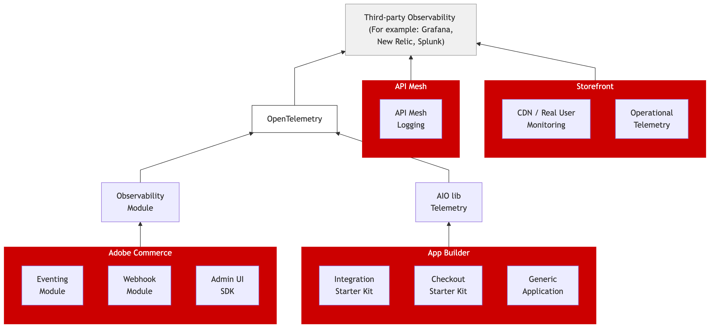

# 可觀察性

可觀察性是作業[!DNL Adobe Commerce as a Cloud Service]的重要方面。 它包含遙測資料（包括量度、記錄和追蹤）的收集、處理和視覺化，以便您監視應用程式健康狀態、診斷效能問題，並最佳化Commerce平台及其整合的可靠性。

## [!DNL Adobe Commerce as a Cloud Service]

### 可觀察性概觀

可觀察性可讓您瞭解Adobe Commerce店面以及所有連線的App Builder應用程式的健全狀況和效能。 透過收集您商業生態系統的遙測資料，您可以：

* **追蹤量度**，例如API回應時間、請求和錯誤率，以及資源使用率，以監視即時效能和即時趨勢。
* **將應用程式、基礎結構、CDN和整合的記錄檔**&#x200B;集中至單一檢視，以加速疑難排解。
* **追蹤要求**&#x200B;從前端流過Commerce和連線應用程式的端對端追蹤要求，協助您在瓶頸和失敗影響客戶之前找出它們。

這些功能可共同協助您快速找出並解決問題、最佳化效能，並確保為客戶提供可靠的體驗。 [可觀察性概觀](https://developer.adobe.com/commerce/extensibility/observability/)說明[!DNL Adobe Commerce as a Cloud Service]如何使用OpenTelemetry在事件、webhook和App Builder應用程式間統一此遙測集合。

{width="600" zoomable="yes"}

Adobe Commerce透過OpenTelemetry支援下列可觀察性工具：

* Elasticsearch
* Grafana
* 耶格
* New Relic
* Prometheus
* Splunk
* Zipkin

### 設定訂閱

[在[!UICONTROL Admin]中或透過REST API設定可觀察性訂閱](https://developer.adobe.com/commerce/extensibility/observability/configuration/)，以將記錄、量度或追蹤路由到任何OpenTelemetry相容的端點。 每個訂閱都會鎖定特定元件（webhook、事件或[!UICONTROL Admin UI SDK]）。

### 可觀察性REST API

[可觀察性REST API](https://developer.adobe.com/commerce/extensibility/observability/api/)提供以程式設計方式建立、擷取、更新和刪除可觀察性訂閱的端點。 使用這些端點可自動執行個體的設定。

## Adobe Developer App Builder

### App Builder檢測

[在 [!DNL App Builder]](https://developer.adobe.com/commerce/extensibility/observability/app-builder/)中實作可觀察性，以將追蹤內容從Commerce傳播至您的[!DNL App Builder]動作，讓來自兩個系統的記錄與追蹤在您的observability平台中相互關聯。 涵蓋webhook式與事件式整合的檢測。

[!DNL App Builder]也提供內建工具來[管理應用程式記錄檔](https://developer.adobe.com/app-builder/docs/guides/app_builder_guides/application_logging/logging)，包括CLI和Developer Console存取，以及記錄檔轉送至外部解決方案，例如Splunk、Azure和New Relic。

### 遙測程式庫

[`@adobe/aio-lib-telemetry`](https://github.com/adobe/aio-lib-telemetry/blob/main/docs/usage.md)程式庫是App Builder動作用來發出與OpenTelemetry相容的記錄檔和追蹤的程式庫。 涵蓋安裝、設定和匯出工具設定。

### 本機開發和測試

[在部署之前，先在本機測試可觀察性設定](https://developer.adobe.com/commerce/extensibility/observability/local-development/)。 使用[!DNL Grafana]進行視覺效果和通道轉送（例如，[!DNL Ngrok]）以接收來自您開發電腦上遠端Commerce執行個體的遙測。

## [!DNL API Mesh]

### API Mesh記錄

[API Mesh記錄](https://developer.adobe.com/graphql-mesh-gateway/mesh/advanced/logging/)可讓您使用Ray ID來監視及偵錯流經您Mesh的請求。 大量匯出記錄檔或將記錄檔轉送至[!DNL New Relic]等平台，以進行集中分析。

## 店面

### CDN和即時使用者監控

[Proxy Real User Monitoring (RUM)](https://experienceleague.adobe.com/developer/commerce/storefront/setup/configuration/content-delivery-network/?lang=zh-Hant#proxy-rum-through-the-origin-to-avoid-a-tls-handshake)透過CDN來源收集資料，以消除額外的TLS交握並改善前端效能測量。

## 可觀察性影片

下列影片提供[!DNL Adobe Commerce as a Cloud Service]中可觀察性方案的高階概觀：

* [App Builder可觀察性影片](https://experienceleague.adobe.com/zh-hant/docs/commerce-learn/tutorials/observability/overview){target="_blank"}
* [API Mesh影片](https://experienceleague.adobe.com/zh-hant/docs/commerce-learn/tutorials/extensibility/api-mesh/getting-started-api-mesh){target="_blank"}
