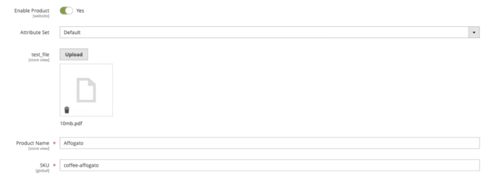

# 將檔案新增至產品

[!DNL Adobe Commerce as a Cloud Service]支援「檔案」[產品屬性輸入型別](https://experienceleague.adobe.com/zh-hant/docs/commerce-admin/catalog/product-attributes/attributes-input-types){target="_blank"}，可讓商家將檔案（例如PDF、手冊、憑證和資料表）直接附加至產品。 檔案儲存在Amazon S3媒體儲存空間，並可使用GraphQL透過店面或使用REST API的整合進行存取。

上傳檔案至產品檔案屬性的方式有三種：

* [管理UI](#upload-files-through-the-admin) — 在產品編輯頁面上手動上傳檔案。
* [REST API](#upload-through-the-rest-api) — 使用S3預先簽署的URL，透過REST API上傳檔案。
* [產品匯入](#upload-through-product-import) — 以CSV格式提供外部URL，以大量匯入檔案。

## 先決條件

上傳檔案之前，您必須建立檔案屬性並將其指派給屬性集。

* [建立檔案屬性](https://experienceleague.adobe.com/zh-hant/docs/commerce-admin/catalog/product-attributes/create/attribute-product-create){target="_blank"} — 將&#x200B;**[!UICONTROL Catalog Input Type for Store Owner]**&#x200B;設為&#x200B;**[!UICONTROL File]**。

* [將屬性指派給屬性集](https://experienceleague.adobe.com/zh-hant/docs/commerce-admin/catalog/product-attributes/create/attribute-sets#create-an-attribute-set){target="_blank"} — 將新的檔案屬性拖曳到所要的群組中。

* 在[產品檔案屬性](https://experienceleague.adobe.com/zh-hant/docs/commerce-admin/config/catalog/product-file-attributes)組態中設定允許的檔案型別和大小。

## 透過管理員上傳檔案

在您[建立檔案屬性](https://experienceleague.adobe.com/zh-hant/docs/commerce-admin/catalog/product-attributes/create/attribute-product-create){target="_blank"}並將其指派給屬性集之後，您可以直接從產品編輯頁面上傳檔案。

1. 在&#x200B;_管理員_&#x200B;側邊欄上，移至&#x200B;**[!UICONTROL Catalog]** > **[!UICONTROL Products]**。

1. 開啟您要編輯的產品。

1. 找到檔案屬性欄位，然後按一下&#x200B;**[!UICONTROL Upload]**&#x200B;以選取檔案。

在Admin{width="600" zoomable="yes"}上傳檔案按鈕

1. 按一下&#x200B;**[!UICONTROL Save]**。

若要取代檔案，請刪除現有檔案並上傳新檔案。 上傳的檔案會儲存在Amazon S3媒體儲存空間。

## 透過REST API上傳

使用[S3預先簽署的URL流程](https://developer.adobe.com/commerce/webapi/rest/saas-integrations/s3-uploads/){target="_blank"}，以程式設計方式透過REST API上傳檔案。 此過程對產品檔案屬性的運作方式與其他媒體型別（例如類別影像和客戶屬性檔案）相同。

此程式包含四個步驟：

1. 呼叫具有檔案名稱及產品檔案屬性`POST V1/media/initiate-upload`的`media_resource_type`。
1. 使用傳回的預簽署URL將檔案`PUT`直接傳給Amazon S3。
1. 呼叫`POST V1/media/finish-upload`以確認上傳。
1. 透過`PUT /V1/products/{sku}`將傳回的金鑰指派給產品的檔案屬性，並將金鑰傳遞為[自訂屬性](https://developer.adobe.com/commerce/webapi/rest/modules/custom-attributes/)值。

## 透過產品匯入上傳

您可以使用[匯入API](https://developer.adobe.com/commerce/webapi/rest/modules/import/){target="_blank"}或管理員匯入UI，大量附加檔案至產品。 產品檔案屬性僅支援從外部URL匯入，其方式與產品影像匯入[的](https://experienceleague.adobe.com/zh-hant/docs/commerce-admin/systems/data-transfer/import/data-import-product-images#method-2-import-images-from-external-server){target="_blank"}方法2相同。 Commerce會從提供的URL下載檔案，並將其儲存至S3媒體儲存空間。

>[!NOTE]
>
>[!DNL Adobe Commerce as a Cloud Service]不支援從本機伺服器路徑（方法1）匯入檔案，因為沒有直接的檔案系統存取權。

### 在專用欄中提供URL

使用屬性代碼作為CSV欄標題，使用完整URL作為值。 例如，如果屬性代碼為`file_upload`，CSV會如下所示：

```csv
sku,name,file_upload
ADB112,"My Product",https://example.com/files/manual.pdf
```

### 在`additional_attributes`中提供URL

或者，將檔案屬性包含在`additional_attributes`欄中：

```csv
sku,name,additional_attributes
ADB112,"My Product",file_upload=https://example.com/files/manual.pdf
```

在這兩種情況下，URL都必須可公開存取，且副檔名和大小必須符合[設定的限制](https://experienceleague.adobe.com/zh-hant/docs/commerce-admin/config/catalog/product-file-attributes){target="_blank"}。

## 透過GraphQL擷取檔案

在[!DNL Adobe Commerce as a Cloud Service]中，[目錄服務GraphQL](https://developer.adobe.com/commerce/webapi/graphql/schema/catalog-service/queries/products/){target="_blank"}端點會提供產品資料。 檔案屬性出現在`attributes`上的`ProductView`欄位中，`value`包含檔案的完整公用URL：

```graphql
{
  products(skus: ["ADB112"]) {
    sku
    name
    attributes(roles: []) {
      name
      label
      value
    }
  }
}
```

回應包含檔案屬性及其公用URL：

```json
{
  "data": {
    "products": [
      {
        "sku": "ADB112",
        "name": "Example product",
        "attributes": [
          {
            "name": "file",
            "label": "FILE",
            "value": "https://<host>/media/catalog/product_file/manual.pdf",
          }
        ]
      }
    ]
  }
}
```

>[!NOTE]
>
>此查詢需要`Magento-Website-Code`和`Magento-Store-View-Code`標頭。 如需詳細資訊，請參閱[目錄服務產品查詢](https://developer.adobe.com/commerce/webapi/graphql/schema/catalog-service/queries/products/){target="_blank"}。

## 透過REST API擷取檔案

透過[REST API](https://developer.adobe.com/commerce/webapi/reference/rest/saas/){target="_blank"} (`GET /V1/products/{sku}`)擷取產品時，檔案屬性會出現在`custom_attributes`陣列中，其檔案名稱為值：

```json
{
  "custom_attributes": [
    {
      "attribute_code": "file_upload",
      "value": "manual_7aa0b2d63f6d3dbf.pdf"
    }
  ]
}
```
