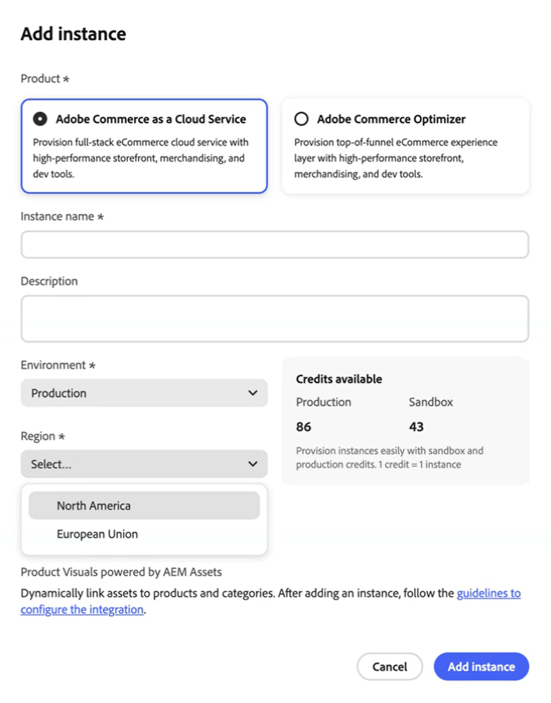

# 發行說明

下列發行說明包含[!DNL Adobe Commerce as a Cloud Service]的更新。 如需其他產品的發行資訊，請參閱[Adobe Commerce Optimizer](../optimizer/release-notes.md)或[Adobe Commerce內部部署與雲端上的Adobe Commerce](https://experienceleague.adobe.com/zh-hant/docs/commerce-operations/release/notes/overview)。

## 2025年8月

**發行日期**： 2025年8月28日

>[!BEGINSHADEBOX]

### 歐盟區域現已推出

現已推出客戶IMS組織的歐盟地區(eu1)支援。 在Cloud Manager中&#x200B;**新增Commerce SaaS執行個體**&#x200B;時，您現在可以選取&#x200B;**歐盟**&#x200B;作為[地區](./getting-started.md#create-an-instance)。 歐盟區域僅適用於生產環境。

歐盟區域的基本生產URL為：

* 管理員： `https://eu1.admin.commerce.adobe.com`
* REST和GraphQL： `https://eu1.api.commerce.adobe.com`

{width="600" align="center" zoomable="yes"}

>[!ENDSHADEBOX]
