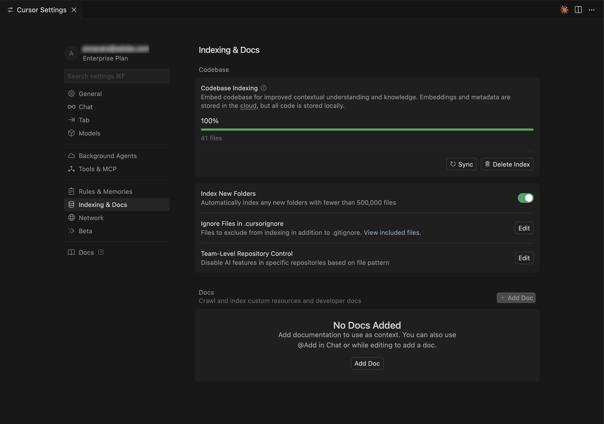
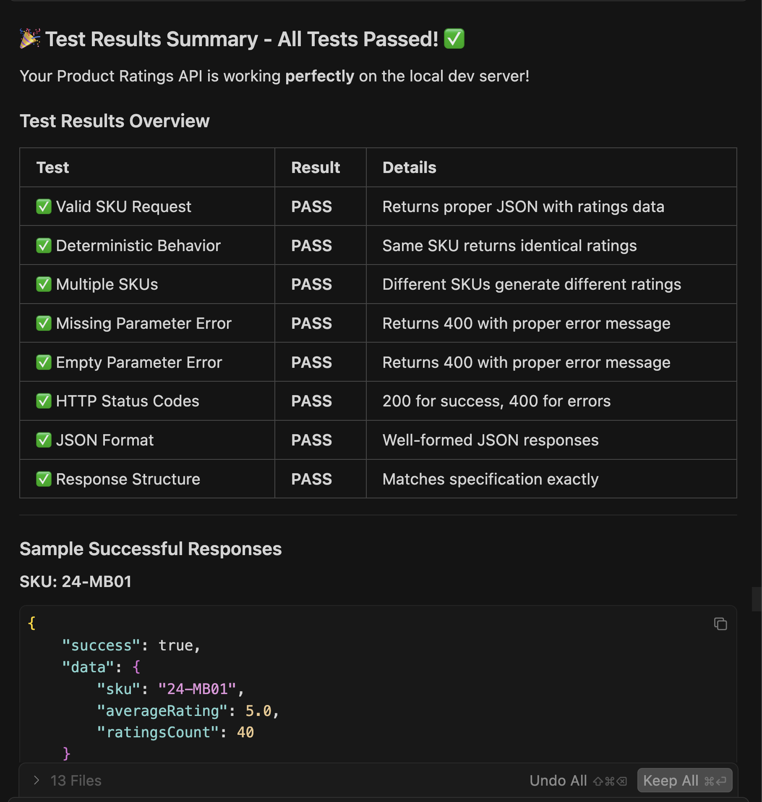

# 評等擴充功能教學課程

本教學課程會引導您使用[!DNL Adobe Commerce as a Cloud Service]和AI輔助開發工具，為[!DNL Adobe App Builder]建立產品評等延伸。

開始之前，請先完成[必要條件](./tutorial-prerequisites.md)。

## 驗證先決條件

確認已安裝下列先決條件：

```bash
# Check Node.js version (should be 22.x.x)
node --version

# Check npm version (should be 9.0.0 or higher)
npm --version

# Check Git installation
git --version

# Check Bash shell installation
bash --version
```

如果上述任何命令未傳回預期的結果，請參閱[必要條件](./tutorial-prerequisites.md)以取得指引。

## 擴充功能開發

本節將引導您使用AI輔助開發工具，為Adobe Commerce as a Cloud Service開發評等擴充功能。

1. 導覽至「**[!UICONTROL Cursor]** > **[!UICONTROL Settings]** > **[!UICONTROL Cursor Settings]** > **[!UICONTROL Tools & MCP]**」，並驗證「`commerce-extensibility`」工具集已啟用且沒有錯誤。 如果您看到錯誤，請關閉和開啟工具集。

   {width="600" zoomable="yes"}

   >[!NOTE]
   >
   >使用AI輔助開發工具時，代理程式產生的程式碼和回應會有自然變化。
   >如果您在程式碼上遇到任何問題，可以隨時要求代理程式協助您進行偵錯。

1. 停用Cursor內容中的任何檔案：

   * 導覽至「**[!UICONTROL Cursor]** > **[!UICONTROL Settings]** > **[!UICONTROL Cursor Settings]** > **[!UICONTROL Indexing & Docs]**」並刪除任何列出的檔案。

   {width="600" zoomable="yes"}

1. 產生產品評等擴充功能的程式碼：
   * 從Cursor聊天視窗中，選取&#x200B;**[!UICONTROL Agent]**&#x200B;模式。
   * 輸入下列提示：

   ```shell-session
   Implement an Adobe Commerce as a Cloud Service extension to handle Product Ratings.
   
   Implement a REST API to handle GET ratings requests.
   
   GET requests will have to support the following query parameters:
   
   sku -> product SKU
   ```

   >[!NOTE]
   >
   >如果代理程式要求搜尋檔案，請允許搜尋。

1. 請精確回答代理程式的問題，協助其產生最佳程式碼。

   {width="600" zoomable="yes"}

   {width="600" zoomable="yes"}

1. 使用下列範例文字來回答代理程式的問題，以設定隨機分級資料：

   ```shell-session
   Yes, this headless extension is for Adobe Commerce as a Cloud Service storefront,
   but we do not need any authentication for the GET API because guest users should be able to use it on the storefront.
   
   This extension is called directly from the storefront, no async invocation, such as events or webhooks, is required.
   
   Start with just the GET API for now, we will implement other CRUD operations at a later time.
   
   We do not need a DB or storage mechanism right now, just return random ratings data between 1 and 5 and a ratings count between 1 and 1000.
   
   The API should only return the average rating for the product and the total number of ratings.
   We do not need to add tests right now.
   ```

   代理程式會建立`requirements.md`檔案，做為實作的信任來源。

   由AI代理程式建立的{width="600" zoomable="yes"}

1. 檢閱`requirements.md`檔案並驗證計畫。

   如果一切看起來正確，請指示代理程式移至&#x200B;**階段2 — 架構規劃**。

1. 檢閱架構計畫。

1. 指示代理程式繼續產生程式碼。

   代理程式會產生必要的程式碼，並提供您後續步驟的詳細摘要。

   {width="600" zoomable="yes"}

   {width="600" zoomable="yes"}

   {width="600" zoomable="yes"}

### 在本機測試擴充功能

下列步驟說明在部署擴充功能之前，如何先驗證擴充功能的運作方式。

1. 請要求代理程式協助您在本機測試程式碼。

   ```shell-session
   Test the ratings API locally on a dev server using cURL.
   ```

1. 請依照代理程式的指示，並確認API是否在本機運作。

   {width="600" zoomable="yes"}

   {width="600" zoomable="yes"}）

### 部署擴充功能

使用代理程式將擴充功能部署至[!DNL Adobe I/O Runtime]。

1. 驗證產生的程式碼後，請使用以下提示來部署擴充功能：

   ```shell-session
   Deploy the ratings API.
   ```

   代理程式會在部署前執行部署前準備程度評估。

   {width="600" zoomable="yes"}

1. 當您對評估結果有信心時，請指示代理程式繼續進行部署。

   代理程式會使用MCP工具組來自動驗證、建置和部署。

   {width="600" zoomable="yes"}

### 驗證部署

在將API整合至店面之前先測試該API。 代理程式應提供新動作的位置和測試策略。

{width="600" zoomable="yes"}

您也可以在終端機中使用cURL手動測試API：

```bash
curl -s "https://<your-site>.adobeioruntime.net/api/v1/web/ratings/ratings?sku=TEST-SKU-123"
```

{width="600" zoomable="yes"}

### 整合Edge Delivery Services

若要整合評等API與由[!DNL Adobe Commerce]提供支援的[!DNL Edge Delivery Services]店面，請要求代理程式建立具有評等API需求的服務合約：

```shell-session
Create a service contract for the ratings api that I can pass on to the storefront agent. Name it RATINGS_API_CONTRACT.md
```

{width="600" zoomable="yes"}

{width="600" zoomable="yes"}

返回終端機，並在`extension`資料夾中執行以下命令，將合約檔案複製到`storefront`資料夾：

```bash
cp RATINGS_API_CONTRACT.md ../storefront
```

## 連線到店面

本節將引導您使用[!DNL Edge Delivery Services]和AI輔助開發工具來實作分級擴充功能的店面部分。

>[!NOTE]
>
>提供的提示是起點。 雖然您可以在不修改的情況下使用它們，但請考慮與代理進行自然交談。
>
>使用AI輔助開發工具時，代理程式產生的程式碼和回應一律會有自然變異。
>
>如果您遇到任何程式碼問題，請要求代理程式協助您進行偵錯。

### 店面必要條件

在開始店面整合之前，請確認您具備下列條件：

* 連線到您[!DNL Commerce]執行個體的店面專案
* 使用CLI安裝的Commerce storefront AI工具[&#128279;](./tutorial-prerequisites.md#install-the-storefront-ai-tools)

### 設定店面工作區

準備您的本機店面環境以進行開發。

1. 導覽至`storefront`資料夾：

   ```bash
   cd storefront
   ```

1. 在新的「游標」視窗中開啟店面資料夾。

   或者，如果您已安裝[Cursor CLI](https://cursor.com/docs/configuration/shell#installing-cli-commands)，請在終端機中使用下列命令開啟視窗：

   ```bash
   cursor .
   ```

1. 啟動本機開發伺服器：

   ```bash
   npm run start
   ```

1. 在瀏覽器中導覽至產品頁面：

   ```shell-session
   http://localhost:3000/products/llama-plush-shortie/adb336
   ```

1. 觀察樣板店面的產品詳細資料頁面(PDP)，並注意缺乏視覺化的產品評等。

### 整合評等API

使用代理程式，將評等API整合至店面產品詳細資料頁面。

1. 對您的代理程式使用以下提示：

   ```shell-session
   Integrate the ratings API into the PDP to show star ratings and a review count for products. Here's the service contract: @RATINGS_API_CONTRACT.md
   ```

1. 代理程式會評估任務複雜度並叫用分階段工作流程。 在&#x200B;**階段1 （需求收集）**&#x200B;期間，代理程式會建立需求檔案，並詢問下列問題：

   * PDP上應該顯示評等的位置？
   * 這應該是一個新的獨立區塊，還是現有PDP外掛程式元件內的插槽自訂？
   * 如果API無法使用或未傳回任何資料，則應該進行何種遞補？
   * 評等應該也出現在PLP （產品清單）上，還是僅出現在PDP上？
   * 是否有任何設計規格或模型？

   根據您的專案需求回答這些問題。 代理程式會更新需求檔案，並將階段標示為完成。

1. 在&#x200B;**階段2 （架構規劃）**&#x200B;期間，代理程式會先研究檔案和您的程式碼基底，再提出架構。 預期代理程式會：

   * 搜尋[!DNL Commerce]的PDP下拉式容器、槽和事件裝載檔案。
   * 掃描您的`blocks`目錄和`scripts/initializers/`資料夾以取得現有的PDP相關程式碼。
   * 探索可用容器和槽內容圖形的TypeScript定義。

   接著，代理程式會顯示架構選項，例如：

   * **選項A：**&#x200B;自訂現有的PDP插入式插槽，在產品標題附近插入評等 — 輕觸點，方便升級。
   * **選項B：**&#x200B;建立獨立從API擷取的新獨立`product-ratings`區塊 — 更靈活且分離。
   * **選項C：**&#x200B;建立同時聆聽產品SKU的PDP插入事件的新區塊 — 混合方法。

   該計畫還包括API整合、效能考量（延遲載入、快取）、安全性（輸入淨化）和測試方法的詳細資訊。

   檢閱架構計畫並指示代理程式繼續。

1. 在&#x200B;**階段3 （實作方法）**&#x200B;期間，代理程式會要求您選擇：

   * **選項A：**&#x200B;在程式碼產生之前先檢閱詳細的實作計畫（請先檢視所有檔案、模式和程式碼結構）。
   * **選項B：**&#x200B;直接進行程式碼產生。

   選取您偏好的方法。

1. 在&#x200B;**階段4 （實作）**&#x200B;期間，代理程式會根據選取的架構產生程式碼。 根據方法，代理程式會使用數種專門技能：

   * **內容模式：**&#x200B;如果需要新區塊，代理程式會設計適合作者的內容結構，例如具有API端點URL的設定表格。
   * **區塊開發：**&#x200B;代理程式會依照[!DNL Edge Delivery Services]慣例建立區塊檔案，包括JavaScript裝飾函式、設定範圍的CSS樣式、協助工具的ARIA標籤，以及載入和錯誤狀態處理。
   * **插入式自訂：**&#x200B;如果架構使用插槽自訂，代理程式會匯入正確的容器、使用產品標題附近的驗證插槽，以及訂閱目前SKU的產品資料事件。

   觀察產生的程式碼，如有需要，詢問問題或重新導向代理程式。 程式碼產生完成時，代理程式會產生生產整備摘要。

1. 在&#x200B;**階段4.5 （測試）**&#x200B;期間，代理程式提供測試實作的功能。 如果您接受，代理程式：

   * 使用適當的指令碼和樣式建立本機測試頁面。
   * 啟動開發伺服器。
   * 針對視覺呈現、互動性、回應式行為、協助工具和效能執行瀏覽器驗證。
   * 產生含有結果的結構化測試報告。

   在瀏覽器中關注以確認行為並報告任何問題。

1. 觀察程式碼基底中的變更，並觀看產品頁面以瞭解更新。

   您應該會在開發環境和瀏覽器中看到下列變更：

   * 系統會自動建立產品評等元件。
   * 元件已使用[插入式插槽](https://experienceleague.adobe.com/developer/commerce/storefront/dropins/customize/slots)整合到PDP中，或作為獨立區塊，視選擇的架構而定。
   * 根據API的評等值，星級會以適當的填色比例顯示。

   {width="600" zoomable="yes"}下方的星級評等

## 教學課程回顧

以下是本教學課程中涵蓋的主題摘要：

* **擴充功能開發：**&#x200B;瞭解如何使用[!DNL App Builder]向AI代理程式說明新功能並產生有效的REST API。
* **本機測試和部署：**&#x200B;正在本機測試API，並使用MCP工具組進行部署。
* **服務合約：**&#x200B;正在建立橋接後端擴充功能與店面實作的API合約。
* **分階段店面整合：**&#x200B;使用AI輔助的技能處理需求、架構和實作。
* **插入式整合：**&#x200B;正在使用[!DNL Adobe Commerce]插入式容器和槽。
* **元件可重複使用性：**&#x200B;正在建立跨多個區塊使用的共用元件。

## 後續步驟

使用下列建議來自訂您的分級延伸或建立您自己的修改：

### 變更星星顏色

對您的代理程式使用以下提示：

```shell-session
Change the star fill color to red.
```

**預期結果：**

星星會變紅。

{width="600" zoomable="yes"}

### 新增評等分佈模型

下列步驟顯示代理程式如何處理具有視覺參照的複雜UI功能。

1. **開始之前：**&#x200B;儲存下列模擬影像，並將其貼到與店面代理的聊天中。

   {width="600" zoomable="yes"}

1. 請依照下列步驟，使用參考影像作為指南來建立評等分佈強制回應視窗：

   * 更新API以傳回代表評等分佈的其他資料。
   * 更新API合約。
   * 更新店面程式碼基底中的合約。
   * 要求店面代理使用參考影像和更新的API合約，將評等發佈新增到PDP頁面。

1. 觀察程式碼基底中的下列變更，並觀看產品頁面以瞭解更新：

   * 代理程式如何解譯視覺化模型
   * 是否針對協助工具使用適當的HTML結構
   * 如何處理定位和互動狀態

#### 疑難排解發佈模組

如果強制回應視窗的行為與預期不符，請嘗試下列步驟：

* 如果強制回應視窗未顯示，請檢查瀏覽器主控台是否有錯誤。
* 如果定位功能已關閉，請要求代理程式使用以下格式加以修正：

  ```shell-session
  adjust the modal position to be...
  ```

{width="600" zoomable="yes"}
