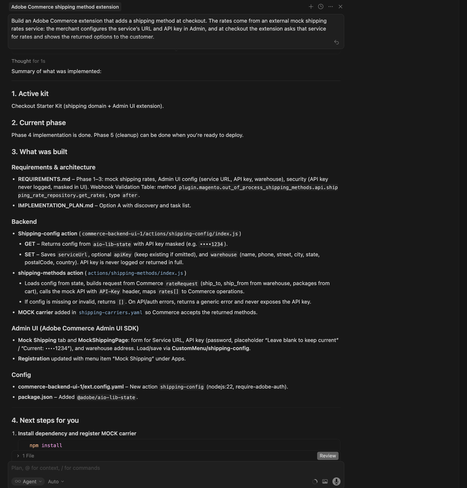
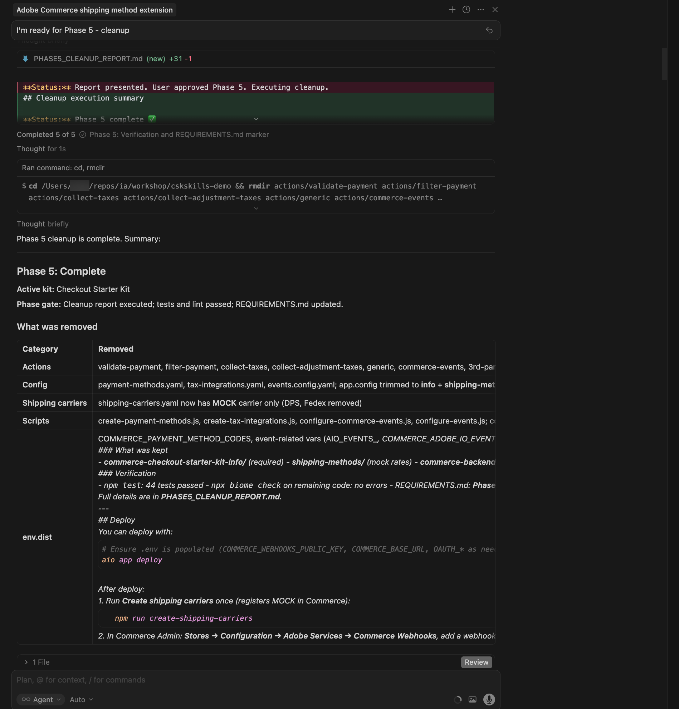
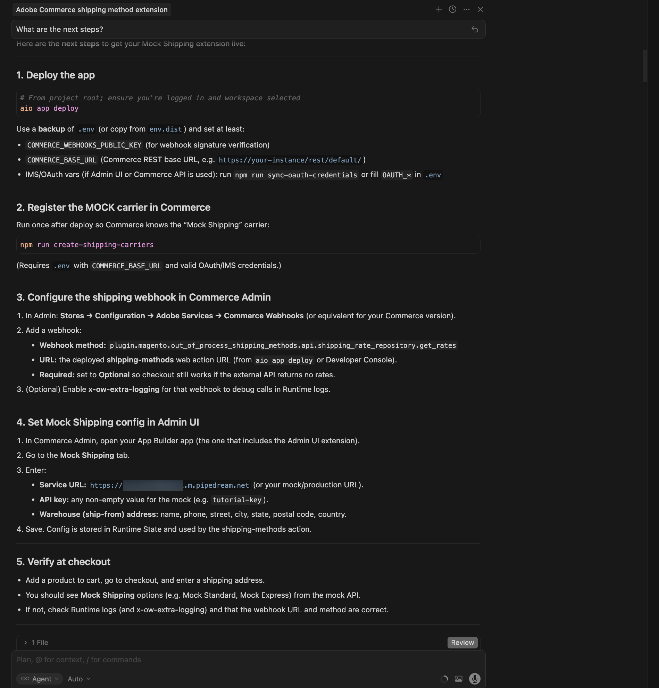
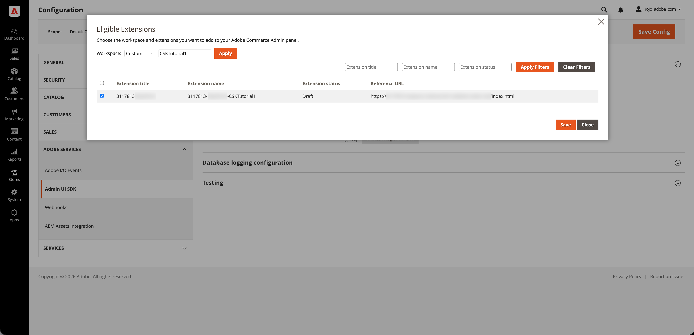

# 送貨方法擴充功能教學課程

本教學課程會使用[!DNL Adobe Commerce as a Cloud Service]、[!DNL Adobe App Builder]結帳入門套件[和AI輔助開發工具，引導您建立](https://developer.adobe.com/commerce/extensibility/starter-kit/checkout/){target="_blank"}的送貨方法延伸模組。

擴充功能會在結帳時新增可設定的送貨方法，讓運費來自外部模擬運費服務。 商戶會在Admin UI中設定服務URL、API金鑰和倉儲（出貨）地址，並在結帳時，擴充功能會要求該服務的費率，並向客戶顯示傳回的選項。

開始之前，請先完成[必要條件](./tutorial-prerequisites.md)。

## 驗證先決條件 {#tutorial-verify-prerequisites}

確認已安裝下列先決條件：

```bash
# Check Node.js version (should be 22.x.x)
node --version

# Check npm version (should be 9.0.0 or higher)
npm --version

# Check Git installation
git --version

# Check Bash shell installation
bash --version
```

如果上述任何命令未傳回預期的結果，請參閱[必要條件](./tutorial-prerequisites.md)以取得指引。

## 建立模擬運費API

完成[必要條件](./tutorial-prerequisites.md)之後，請建立模擬運費API，這樣當您在[!DNL Commerce Admin]中設定擴充功能時，就能準備好服務URL和API金鑰。 此擴充功能會呼叫外部運費API。 在本教學課程中，您會使用模型API，讓您在沒有實際電信業者帳戶的情況下執行流程。 您將使用[Pipedream](https://pipedream.com)建立模擬API （需要免費帳戶）。 模型API使用類似典型實際運費API的請求/回應合約，因此稍後將此擴充功能連線到真正的提供者應該相當簡單明瞭。

若要建立模擬API，請下載[模擬API規格檔案](../assets/mock-rates-api-spec.zip)、開啟該檔案，然後將`.md`檔案新增至您的專案（例如`docs/mock-rates-api-spec.md`）。

**時間：**&#x200B;建立模擬API大約需要&#x200B;**5到10分鐘**。

### 建立工作流程和HTTP觸發器

1. 前往[pipedream.com](https://pipedream.com)註冊或登入。
1. 按一下&#x200B;**新增工作流程** （或&#x200B;**新增工作流程**）。
1. 對於觸發器，請選取&#x200B;**HTTP / Webhook**。
1. 在觸發設定中，將&#x200B;**HTTP回應**&#x200B;設定為&#x200B;**從工作流程傳回自訂回應**。 如此可讓程式碼步驟傳送模擬JSON回應。
1. Pipedream顯示唯一的&#x200B;**HTTP端點URL**，例如`https://123456.m.pipedream.net`。
1. 在Commerce管理員中設定擴充功能時，**複製此URL**&#x200B;並當作&#x200B;**服務URL**&#x200B;使用。

   {width="600" zoomable="yes"}

您不需要在觸發程式上設定&#x200B;**授權**；模擬API會在程式碼步驟中驗證`API-Key`標頭。

### 新增程式碼步驟

1. 按一下&#x200B;**+**&#x200B;圖示以新增步驟。
1. 選擇&#x200B;**執行Node.js代碼** （代碼步驟）。
1. **使用下列JavaScript取代**&#x200B;預設程式碼。

   ```javascript
   export default defineComponent({
   async run({ steps, $ }) {
      const event = steps.trigger.event;
      const body = event.body ?? {};
      const headers = event.headers ?? {};
      const apiKey = headers["api-key"] ?? body.api_key ?? "";
   
      if (!apiKey || String(apiKey).trim() === "") {
         await $.respond({
         immediate: true,
         status: 401,
         headers: { "Content-Type": "application/json" },
         body: { error: "Missing or invalid API-Key header" },
         });
         return;
      }
   
      const shipment = body.shipment;
      if (!shipment || typeof shipment !== "object") {
         await $.respond({
         immediate: true,
         status: 400,
         headers: { "Content-Type": "application/json" },
         body: { error: "Missing or invalid shipment" },
         });
         return;
      }
   
      const rates = [
         {
         service_code: "mock_standard",
         service_name: "Mock Standard",
         carrier_friendly_name: "Mock Carrier",
         shipping_amount: { amount: 5.99 },
         shipment_cost: 5.99,
         cost: 5.99,
         },
         {
         service_code: "mock_express",
         service_name: "Mock Express",
         carrier_friendly_name: "Mock Carrier",
         shipping_amount: { amount: 12.99 },
         shipment_cost: 12.99,
         cost: 12.99,
         },
      ];
   
      await $.respond({
         immediate: true,
         status: 200,
         headers: { "Content-Type": "application/json" },
         body: { rates },
      });
   },
   });
   ```

1. 按一下&#x200B;**部署**。

   {width="600" zoomable="yes"}

針對包含非空白`API-Key`標頭和`shipment`物件的任何有效要求，模型會傳回兩個速率選項（Mock Standard和Mock Express）。 您將在本教學課程稍後的[!DNL Commerce Admin]中設定API金鑰。 您也將在相同的設定畫面上指定Pipedream工作流程URL，因此請加以注意。

## 擴充功能開發

本節將引導您使用[!DNL Adobe Commerce as a Cloud Service]結帳入門套件[和AI輔助開發工具，為](https://developer.adobe.com/commerce/extensibility/starter-kit/checkout/){target="_blank"}開傳送貨方法延伸模組。

1. 導覽至編碼代理程式中的MCP設定。 例如，在游標中，移至&#x200B;**[!UICONTROL Cursor]** > **[!UICONTROL Settings]** > **[!UICONTROL Cursor Settings]** > **[!UICONTROL Tools & MCP]**。 確認`commerce-extensibility`工具集已啟用且沒有錯誤。 如果您看到錯誤，請關閉和開啟工具集。

   {width="600" zoomable="yes"}

   >[!NOTE]
   >
   >使用AI輔助開發工具時，代理程式產生的程式碼和回應會有自然變化。
   >
   >如果您在程式碼上遇到任何問題，可以隨時要求代理程式協助您進行偵錯。

1. 如果您有任何檔案新增到Cursor的內容中，請將其停用。 瀏覽至&#x200B;[!UICONTROL **Cursor**] > [!UICONTROL **設定**] > [!UICONTROL **Cursor設定**] > [!UICONTROL **索引與檔案**]，並刪除列出的任何檔案。

   {width="600" zoomable="yes"}

1. 讓代理程式存取模擬速率API規格，以便正確實作使用者端。 如果您尚未這樣做，請下載[模擬匯率API規格檔案](../assets/mock-rates-api-spec.zip)，開啟該檔案，然後將`.md`檔案加入您的專案（例如`docs/mock-rates-api-spec.md`），然後在您的提示中參照該檔案。

1. 產生送貨方法延伸模組：

   - 在代理程式的聊天視窗中，選取&#x200B;**計畫**&#x200B;模式（如果可用）。 這可防止代理程式在沒有計畫的情況下繼續進行。
   - 輸入下列提示：

   ```shell-session
   Build an Adobe Commerce extension that adds a shipping method at checkout. The rates come from an external mock shipping rates service: the merchant configures the service's URL and API key in Admin, and at checkout the extension asks that service for rates and shows the returned options to the customer.
   
   External service (mock shipping rates API):
   - The service endpoint URL is configurable by the merchant (for example https://123456.m.pipedream.net).
   - The API is specified in ./docs/mock-rates-api-spec.md.
   
   The merchant must be able to configure the following in the Adobe Commerce Admin UI. Use the Adobe Commerce Admin UI SDK (or equivalent App Builder extensibility options for the Admin) to add a configuration screen where the merchant can set:
   - The service URL (where the extension sends rate requests).
   - An API key the service expects (any non-empty value for the mock). The API key is sensitive data: it must be stored securely and must never appear in logs, error messages, or in the UI in full (e.g. mask in the UI).
   - The warehouse (ship-from) address: name, phone, street, city, state, postal code, country. This is the origin used when requesting rates.
   ```

   >[!NOTE]
   >
   >如果代理程式要求搜尋檔案，請允許搜尋。

   {width="600" zoomable="yes"}

1. 請精確回答代理程式的問題，協助其產生最佳程式碼。 如果代理程式詢問要使用哪個套件或範本，請將其導向具有出貨網域和管理員UI SDK擴充功能的[結帳入門套件](https://developer.adobe.com/commerce/extensibility/starter-kit/checkout/){target="_blank"}，以便同時實作出貨webhook和商家設定畫面。

   代理程式可建立`requirements.md` （或同等專案）檔案，做為實作的信任來源。

1. 檢閱`requirements.md` （或同等專案）檔案並驗證計畫。 如果一切看起來正確，請指示代理程式移至架構規劃（或&#x200B;**階段2**）。 確認：

   - **shipping-methods**&#x200B;動作（或同等動作）會處理Commerce webhook並呼叫外部費率API。
   - **shipping-config** （或同等專案）動作支援GET （讀取設定、API金鑰已遮罩）和SET （儲存服務URL、API金鑰、倉儲位址），且設定儲存安全，例如在執行階段狀態。
   - 管理UI包含&#x200B;**Mock Shipping** （或類似）標籤，內含服務URL、API金鑰（密碼/遮罩）及倉儲位址的欄位。

   {width="600" zoomable="yes"}

1. 當代理程式提供架構計畫時，請加以檢閱。

   模擬運費延長的{width="600" zoomable="yes"}

1. 指示代理程式繼續產生程式碼。 代理程式應將&#x200B;**模型**&#x200B;電信業者新增至出貨電信業者設定，以允許Commerce接受傳回的方法，並使用webhook方法`plugin.magento.out_of_process_shipping_methods.api.shipping_rate_repository.get_rates` （webhook型別&#x200B;**after**，必要的&#x200B;**Optional**）。

   代理程式會產生必要的程式碼，並提供您後續步驟(包括安裝相依性、註冊模擬電信業者、設定Commerce webhook和部署)的詳細摘要。

   {width="600" zoomable="yes"}

   {width="600" zoomable="yes"}

### 部署前清理

在部署之前，請移除應用程式不需要的程式碼。 結帳入門套件可能包含未使用的網域（例如付款、稅金或事件）和支架。 請代理程式移除這些零件，並使用提示（例如）僅保留送貨和[!DNL Admin UI]零件：

```shell-session
Proceed with Phase 5 cleanup.
```

代理程式會產生清理報告、移除未使用的動作、設定和指令碼，並更新專案。 在部署之前完成此步驟。

{width="600" zoomable="yes"}

### 部署擴充功能

1. 驗證產生的程式碼後，請使用以下提示來部署擴充功能：

   ```shell-session
   Deploy the app.
   ```

   代理程式會執行預先部署整備程度評估(例如，如果使用Admin UI或Commerce API，請檢查`.env`、`COMMERCE_WEBHOOKS_PUBLIC_KEY`和OAuth/IMS變數的`COMMERCE_BASE_URL`)。

   Mock Shipping擴充功能的{width="600" zoomable="yes"}

1. 當您對評估結果有信心時，請指示代理程式繼續進行部署。 代理程式會使用MCP工具組來自動驗證、建置和部署。

   {width="600" zoomable="yes"}

### 部署後

部署後，請完成以下步驟以註冊模擬電信業者、設定webhook和[!DNL Admin UI]，並在結帳時驗證擴充功能。

1. **在Commerce中註冊模擬電信業者** （部署後執行一次）：

   ```bash
   npm run create-shipping-carriers
   ```

   請確認您的`.env`具有`COMMERCE_BASE_URL`和有效的OAuth/IMS認證，讓指令碼可以註冊電信業者。

1. **在[!DNL Commerce Admin]中設定送貨webhook：**

   - 移至&#x200B;**商店** >設定> **設定** > **Adobe服務** > **Commerce Webhooks**。
   - 新增webhook：
      - **Webhook方法：** `plugin.magento.out_of_process_shipping_methods.api.shipping_rate_repository.get_rates`
      - **Webhook型別：** **after**
      - **URL：**&#x200B;已部署的&#x200B;**shipping-methods** Web動作URL （來自部署輸出或[!DNL Adobe Developer Console]）。
      - **必要：** **選擇性** — 如果外部API未傳回任何費率，簽出仍可運作。

   模擬運費的{width="600" zoomable="yes"}

1. **設定[!DNL Admin UI SDK]延伸模組：**

   - 在[!DNL Commerce Admin]中，移至&#x200B;**商店** >設定> **設定**。
   - 開啟&#x200B;**Adobe Services** > **管理UI SDK**。
   - 將&#x200B;**啟用Admin UI SDK**&#x200B;設為&#x200B;**是**，如果尚未啟用，請按一下&#x200B;**儲存設定**。
   - 按一下&#x200B;**設定擴充功能**，選擇您的應用程式要部署的工作環境，然後按一下&#x200B;**套用**。 您也可以選取&#x200B;**自訂**&#x200B;選項並輸入工作區名稱。
   - 在清單中選取您的[!DNL App Builder]應用程式並儲存。 如果應用程式未出現，請按一下&#x200B;**重新整理註冊**，然後再試一次。

   {width="600" zoomable="yes"}

1. **在Adobe Commerce管理UI中設定Mock Shipping方法：**
   - 開啟&#x200B;**應用程式**&#x200B;並選取您的應用程式。
   - 開啟&#x200B;**Mock Shipping**&#x200B;標籤（或同等專案）。
   - 輸入下列明細：
      - **服務URL：**&#x200B;您複製的Pipedream工作流程URL （例如`https://123456.m.pipedream.net`）。
      - **API金鑰：**&#x200B;模擬的任何非空白值，例如`tutorial-key`。
      - **倉儲（出貨地點）地址：**&#x200B;名稱、電話、街道、城市、州、郵遞區號、國家/地區。
   - 按一下&#x200B;**儲存**。 組態儲存在「執行階段狀態」中，並由shipping-methods動作使用。

   {width="600" zoomable="yes"}

1. **結帳時驗證：**&#x200B;將產品加入購物車、前往結帳，然後輸入送貨地址。 您應該會看到模擬送貨選項，例如&#x200B;**Mock Standard**&#x200B;和&#x200B;**Mock Express**。

   {width="600" zoomable="yes"}

### 疑難排解

- **設定未儲存在管理員UI中：**&#x200B;如果您在儲存後看到「回應無效&#39;message/http&#39;」或值未更新，請使用類似下列的命令，檢查設定動作的執行階段啟用記錄檔：

  ```bash
  aio app logs --action CustomMenu/shipping-config --limit 20
  ```

  常見的原因包括閘道需要特定回應格式（例如字串本文和`Content-Type: application/json`）或狀態程式庫需要字串值 — 請確定動作將設定儲存為字串並在讀取時加以剖析，以及shipping-methods動作使用相同的剖析。 請檢閱代理程式聊天或記錄檔，以取得確切的原因和修正。

- **「回應必須至少包含一個作業」** （在webhook記錄中）： Commerce要求Shipping webhook至少傳回一個作業。 要求代理程式確保shipping-methods動作絕不會傳回空的作業陣列（例如，當外部API未傳回任何速率時傳回遞補速率）。

- **結帳時沒有運費：**&#x200B;請確認webhook URL和方法正確、模擬電信業者已註冊(`npm run create-shipping-carriers`)，且Mock Shipping設定已設定在[!DNL Admin UI]中。 檢查API或驗證錯誤之送貨方法動作的執行階段記錄，確定動作至少傳回一個作業，因此[!DNL Commerce]不會顯示「回應必須至少包含一個作業」。

### 教學課程回顧

以下是本教學課程中涵蓋的主題摘要：

- **必要條件與設定：**&#x200B;驗證工具並建立模擬運費API。
- **代理程式驅動開發：**&#x200B;使用commerce-extensibility工具集來產生shipping webhook和管理UI的需求、實作計畫和程式碼。
- **階段5清理：**&#x200B;在部署之前移除未使用的簽出入門套件網域和支架。
- **部署：**&#x200B;部署前評估和MCP工具組部署。
- **部署後設定：**&#x200B;正在註冊模擬電信業者、設定[!DNL Commerce] webhook、啟用[!DNL Admin UI SDK]延伸功能，並在[!DNL Admin UI]中設定Mock Shipping （服務URL、API金鑰、倉儲）。
- **驗證：**&#x200B;確認模擬送貨選項出現在結帳時。

### 後續步驟

如需進一步實驗本教學課程，請考量下列事項：

- 使用在[!DNL Commerce]中註冊模擬電信業者的掛接，並在每次部署後設定送貨webhook，自動化部署後設定。
- 變更[!DNL Admin UI]中的服務URL和API金鑰，將擴充功能指向實際運費API。
- 擴充[!DNL Admin UI]以顯示電信業者狀態或測試與費率服務的連線。
