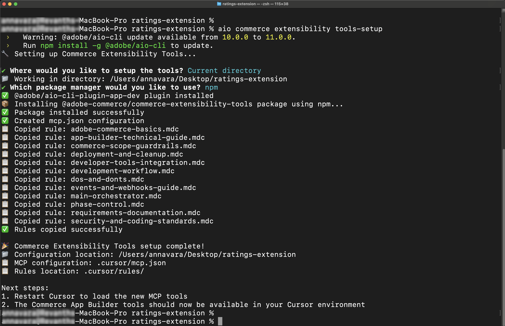

# 評等擴充功能教學課程的先決條件(Beta)

>[!NOTE]
>
>本教學課程中使用的AI工具目前在Beta中，可能包含錯誤或其他問題。

此頁面列出使用[!DNL Adobe Commerce as a Cloud Service]的教學課程的先決條件和設定步驟，例如[評等延伸教學課程](./ratings-extension.md)。

## Adobe Commerce as a Cloud Service必要條件

* 安裝[!DNL Adobe I/O CLI]

  ```bash
  npm install -g @adobe/aio-cli
  ```

* 安裝[Adobe I/O CLI Commerce](https://github.com/adobe-commerce/aio-cli-plugin-commerce)、[Adobe I/O CLI Runtime](https://github.com/adobe/aio-cli-plugin-runtime)和[App Builder CLI](https://github.com/adobe/aio-cli-plugin-app-dev)外掛程式：

  ```bash
  aio plugins:install https://github.com/adobe-commerce/aio-cli-plugin-commerce @adobe/aio-cli-plugin-app-dev @adobe/aio-cli-plugin-runtime
  ```

* 下載AI輔助的IDE，例如[Cursor](https://cursor.com/download) （建議），也支援其他IDE，例如Claude Code、Gemini CLI或Copilot，但可能需要修改提示和教學課程中的其他步驟。

### Adobe Developer Console必要條件

1. 導覽至[Adobe Developer Console](https://developer.adobe.com/console){target="_blank"}。
1. 使用您的電子郵件和密碼登入。

#### 建立新專案

1. 導覽至[Adobe Developer Console](https://developer.adobe.com/)。
1. 按一下&#x200B;[!UICONTROL **從範本建立專案**]。
1. 選取&#x200B;[!UICONTROL **App Builder**]&#x200B;範本。
1. 輸入&#x200B;[!UICONTROL **專案標題**]&#x200B;和&#x200B;[!UICONTROL **應用程式名稱**]。
1. 請確定已標示&#x200B;**[!UICONTROL Include Runtime]**&#x200B;核取方塊。

   {width="600" zoomable="yes"}

1. 按一下&#x200B;**儲存**。

#### 將API新增至工作區

1. 按一下&#x200B;[!UICONTROL **階段**]&#x200B;工作區，然後對每個API重複下列步驟。

   {width="600" zoomable="yes"}

1. 按一下&#x200B;[!UICONTROL **新增服務**]&#x200B;並選取&#x200B;[!UICONTROL **API**]。

1. 選取下列其中一個API。 您需要為下列每個API重複此程式：

   * [!UICONTROL **Adobe服務**]&#x200B;篩選器：
      * [!UICONTROL **I/O管理API**]
      * [!UICONTROL **I/O事件**] API
   * [!UICONTROL **Experience Cloud**]&#x200B;篩選器：
      * 適用於Adobe Commerce [!UICONTROL **API的**] Adobe I/O Events

1. 按一下&#x200B;[!UICONTROL **下一步**]。

1. 按一下&#x200B;[!UICONTROL **儲存設定的API**]。

1. 重複上述步驟，直到所有API新增至工作區為止。

   {width="600" zoomable="yes"}

### 設定Adobe I/O CLI

1. 清除任何現有設定：

   ```bash
   aio config clear
   ```

   使用[!DNL Adobe I/O CLI]登入：

   ```bash
   aio auth login -f
   ```

1. 使用下列每一個命令選取您的組織、專案和工作區：

   ```bash
   aio console org select
   ```

   ```bash
   aio console project select
   ```

   ```bash
   aio console workspace select
   ```

   {width="600" zoomable="yes"}

### 複製整合入門套件

複製Commerce整合入門套件存放庫，並準備您的專案：

```bash
git clone https://github.com/adobe/commerce-integration-starter-kit.git extension
cd extension
```

{width="600" zoomable="yes"}

### 建立.env檔案

建立您的環境設定檔：

```bash
cp env.dist .env
```

在文字編輯器中開啟`.env`檔案，並新增下列OAuth認證：

```text
OAUTH_CLIENT_ID=
OAUTH_CLIENT_SECRET=
OAUTH_TECHNICAL_ACCOUNT_ID=
OAUTH_TECHNICAL_ACCOUNT_EMAIL=
OAUTH_ORG_ID=
```

您可以按一下工作區上的「**[!UICONTROL Credential details]**」索引標籤，從[Developer Console](https://developer.adobe.com/)的「**[!UICONTROL OAuth Server-to-Server]**」頁面複製這些值。

{width="600" zoomable="yes"}

#### 新增Commerce設定

將下列Commerce執行個體詳細資料新增至您的`.env`檔案：

```text
COMMERCE_BASE_URL=
COMMERCE_GRAPHQL_ENDPOINT=
```

若要尋找這些值，請執行下列步驟：

1. 導覽至[Commerce Cloud服務執行個體](https://experience.adobe.com/#/@commerce/commerce/cloud-service/instances)。
1. 按一下執行個體旁的資訊圖示。
1. 將REST端點復製為`COMMERCE_BASE_URL`。
1. 將GraphQL端點復製為`COMMERCE_GRAPHQL_ENDPOINT`。

#### 設定事件前置詞

設定事件首碼的暫時值：

```text
EVENT_PREFIX=test
```

### 下載工作區設定

執行以下命令來下載工作區組態檔：

```bash
aio console workspace download workspace.json
```

將工作區組態檔複製到`scripts`目錄：

```bash
cp workspace.json scripts/
```

### 將本機工作區連線到遠端工作區

將您的本機專案連結至遠端工作區：

```bash
aio app use workspace.json -m
```

{width="600" zoomable="yes"}

### 安裝擴充性AI工具

更新Cursor rules檔案和MCP設定以包含`commerce-extensibility-tools`套件。

1. 使用以下命令在`extension`資料夾中設定AI輔助開發工具：

   ```bash
   cd extension
   ```

   ```bash
   aio commerce extensibility tools-setup
   ```

   {width="600" zoomable="yes"}
<!--
## Storefront prerequisites

The following items are required to complete the [storefront](./ratings-extension.md#connect-to-the-storefront) section of [this tutorial](./ratings-extension.md) and see the product ratings in your store.

* Install [!DNL Node.js] (version `22.x.x`) and npm (`9.0.0` or higher). Verify your installation:

   ```bash
   node --version
   npm --version
   ```

* Install [Git](https://git-scm.com) (Optional) - Required only if [cloning the repository directly](#option-a-clone-the-repository-recommended)(recommended), not needed if you [download the zip file](#option-b-download-the-zip-file). Verify your installation:

  ```bash
  git --version
  ```

* Bash shell
  * macOS/Linux: No installation required
  * Windows: Use [Git Bash](https://git-scm.com/install) or [Windows Subsystem for Linux (WSL)](https://learn.microsoft.com/en-us/windows/wsl/install)

* [Google Chrome](https://www.google.com/chrome/) - Required for testing the storefront

### Get the project files

You can obtain the project files using one of the following methods:

#### Option A: Clone the repository (recommended)

If you have [!DNL Git] installed, open your terminal and clone the repository:

```bash
git clone --branch agentic-dev https://github.com/hlxsites/aem-boilerplate-commerce.git storefront
cd storefront
```

#### Option B: Download the zip file

If you do not have [!DNL Git] installed:

1. Download the project zip file from: [https://github.com/hlxsites/aem-boilerplate-commerce/archive/refs/heads/agentic-dev.zip](https://github.com/hlxsites/aem-boilerplate-commerce/archive/refs/heads/agentic-dev.zip)
1. Extract the zip file to a folder on your machine.
1. Open your terminal and navigate into the unzipped folder:

   ```bash
   cd path/to/aem-boilerplate-commerce-agentic-dev
   ```

### Install root dependencies

Install the main project dependencies:

```bash
npm install
```

This will install all the necessary packages for the storefront application.

### Install MCP server dependencies

Navigate to the MCP server directory and install its dependencies:

```bash
cd mcp-server
npm install
cd ..
```

### Configure environment variables

The MCP server requires certain environment variables to connect to the RAG service.

Create an `.env` file in the `mcp-server` directory:

```bash
cd mcp-server
cp env.example .env
```

Edit the `.env` file and add the following values:

```env
RAG_MODE=worker
WORKER_RAG_URL=
```

### Enable MCP in Cursor

The Model Context Protocol (MCP) server provides AI agents with access to [!DNL Adobe Commerce] Storefront documentation.

#### Open Cursor MCP settings

{width="600" zoomable="yes"}

1. Open [!DNL Cursor].
1. Navigate to **[!UICONTROL Cursor]** > **[!UICONTROL Settings]** > **[!UICONTROL Cursor Settings]** > **[!UICONTROL Tools & MCP]**.

#### Enable and configure MCP features

The project includes an MCP configuration file at `.cursor/mcp.json`. This file should already be configured to use the local MCP server.

Verify the MCP configuration:

1. Ensure the "commerce-documentation-rag" server is listed and enabled

The configuration should look similar to this:

{width="600" zoomable="yes"}

>[!NOTE]
>
>The `start-mcp.sh` script will automatically load the environment variables from your `.env` file in the `mcp-server` directory.

#### Restart Cursor

After enabling MCP and configuring the server:

1. Quit [!DNL Cursor] completely.
1. Reopen [!DNL Cursor] and open the `aem-boilerplate-commerce` project.

#### Verify MCP connection

Check that the MCP server is running correctly:

1. Open a new chat in [!DNL Cursor].
1. Look for an indicator showing the MCP server is connected. This indicator is typically located in the chat interface.
1. Try entering a prompt like the following:

   ```text
   Search the storefront docs for information about slots
   ```

If the MCP server is working, you should see relevant documentation results.

{width="600" zoomable="yes"}

If this works, you are ready to continue with the [tutorial](./ratings-extension.md).
 -->
