# 使用案例

{{accs-early-access}}

下列使用案例示範[!DNL Adobe Commerce as a Cloud Service]支援的核心功能和業務案例，可讓您加速開發並啟動高影響力的體驗。

如果您遇到任何問題，請檢視[疑難排解](#troubleshooting)區段以取得指引。

## 先決條件

在嘗試任何這些使用案例之前，您必須先完成下列必要條件：

1. [使用下列選項建立您的Cloud Service執行個體](./getting-started.md#create-an-instance)：
   1. 在&#x200B;[!UICONTROL **環境**]&#x200B;下拉式清單中選取&#x200B;[!UICONTROL **沙箱**]。
   1. 在&#x200B;[!UICONTROL **測試資料**]&#x200B;下拉式清單中選取&#x200B;[!UICONTROL **Adobe存放區**]。
1. [登入您的Adobe Experience Cloud帳戶](https://experience.adobe.com)
1. [使用下列選項設定您的Cloud Service店面](./storefront.md)：
   1. 為範本選取[!UICONTROL `adobe-commerce/adobe-demo-store`]。
   1. 選取&#x200B;[!UICONTROL **選取可用的執行個體(Mesh -> SaaS)**]&#x200B;作為連線方法。

## 簽出工作流程

此工作流程示範客戶從店面購買產品的結帳程式，以及管理員如何確認訂單。

### 啟用付款服務

1. 在Commerce管理員中，瀏覽至&#x200B;[!UICONTROL **商店**] > [!UICONTROL Settings] > [!UICONTROL **設定**] > [!UICONTROL **付款方法**]。

1. 在&#x200B;[!UICONTROL **一般組態**]&#x200B;區段中，輸入您的`Payment Services Sandbox ID`和`Payment Services Sandbox Key`。 您可以依照[沙箱上線](../payment-services/sandbox.md#sandbox-onboarding)中所述的步驟來取得這些ID

1. 將&#x200B;[!UICONTROL **啟用**]&#x200B;下拉式清單設定為&#x200B;[!UICONTROL **是**]。

1. 按一下&#x200B;[!UICONTROL **儲存設定**]。

### 購買產品

1. 前往您在先決條件中建立的[店面](./storefront.md)。

1. 尋找並選取產品。 進行任何必要的自訂選擇。 然後按一下&#x200B;[!UICONTROL **加入購物車**]。

   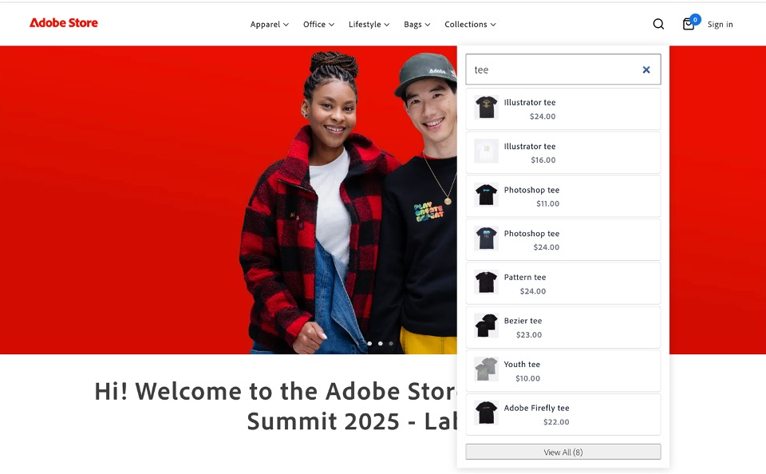{width="600" zoomable="yes"}

1. 選取購物車圖示以檢視您的購物車。

   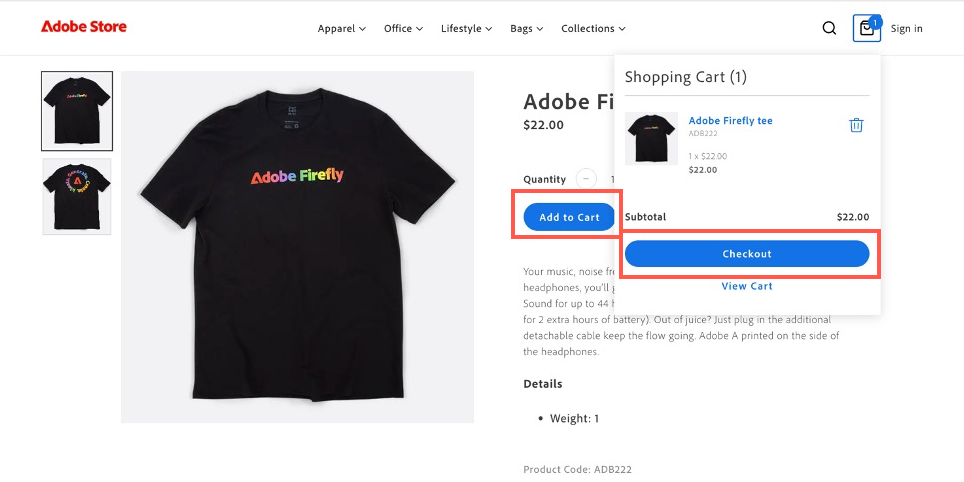{width="600" zoomable="yes"}

1. 按一下&#x200B;[!UICONTROL **簽出**]。

   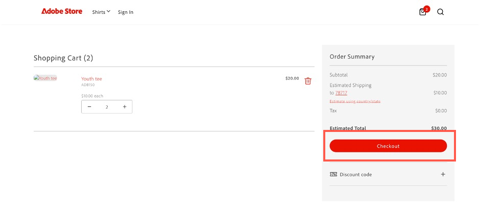{width="600" zoomable="yes"}

1. 輸入必要的聯絡詳細資料和送貨資訊。 您可以針對此訂單使用虛構的資訊。

1. 若要結帳，請選取&#x200B;[!UICONTROL **支票/匯票**]。 若要使用信用卡，請使用Paypal](https://developer.paypal.com/tools/sandbox/card-testing/#link-teststaticcardnumbers)提供的[測試卡之一。 您可以將其用於任何未來的到期日和任何CVC。

   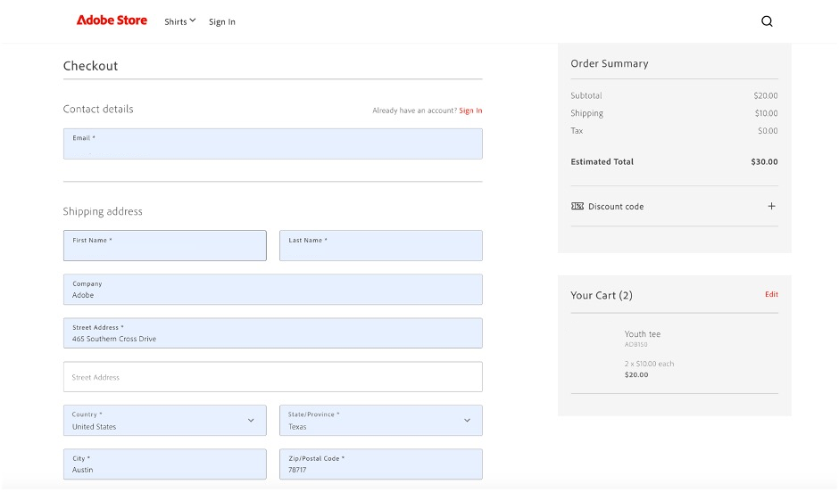{width="600" zoomable="yes"}

   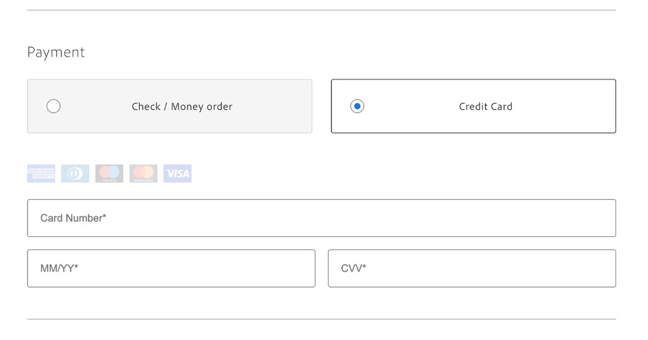{width="600" zoomable="yes"}

1. 按一下&#x200B;[!UICONTROL **下訂單**]。

### 確認訂單

1. 開啟Commerce管理員： `<your store URL>/admin`。

1. 使用您的Adobe ID登入。

1. 導覽至&#x200B;[!UICONTROL **銷售**] > [!UICONTROL **訂單**]。

   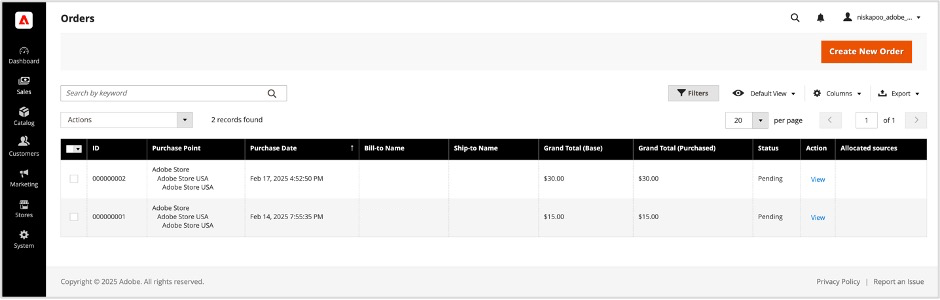{width="600" zoomable="yes"}

1. 尋找您所下訂單並確認詳細資料。

   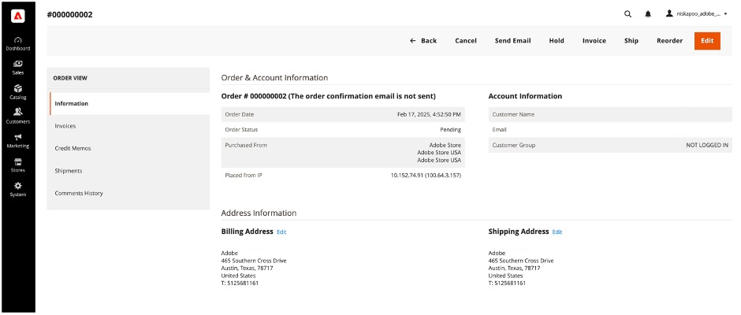{width="600" zoomable="yes"}

## 更新店面內容

直接建立、編輯和發佈內容到店面。

1. 開啟您在先決條件中建立的[店面](./storefront.md)。

1. 開啟店面建置器。 瀏覽至`https://da.live/#/<GitHub User Name>/<Repository Name>/main/da/index.md`。

1. 開啟&#x200B;[!UICONTROL **索引**]&#x200B;頁面。

1. 在「輪播」區塊下方，編輯「歡迎使用Adobe商店示範」行以輸入新標題。

1. 按一下傳送圖示並按一下&#x200B;[!UICONTROL **預覽**]。

1. 檢閱預覽頁面，然後按一下&#x200B;[!UICONTROL **發佈**]。

1. 重新整理店面頁面，並確認您的變更已上線。

## 內容實驗

Adobe Commerce的情境式實驗功能可讓您在店面建立和管理實驗，以測試不同的內容和設定。

### 先決條件

* 安裝[AEM Sidekick擴充功能](https://www.aem.live/docs/sidekick)

1. 在Storefront Builder中，選取您的索引頁面，然後按一下&#x200B;[!UICONTROL **複製**]。

1. 按一下&#x200B;[!UICONTROL **新增**]&#x200B;按鈕並選取&#x200B;[!UICONTROL **資料夾**]，在主資料夾下建立&#x200B;[!UICONTROL **實驗**]&#x200B;資料夾。

1. 在&#x200B;[!UICONTROL **實驗**]&#x200B;資料夾中建立名為&#x200B;**1234**&#x200B;的資料夾。

1. 將索引頁面的兩個復本貼到&#x200B;**1234**&#x200B;資料夾中。

1. 開啟每個頁面，並將它們重新命名為「homev1」和「homev2」。 這些是您的[挑戰者](https://www.aem.live/docs/experimentation#create-your-challenger-page)。

1. 修改每個頁面以包含不同的內容。 例如，變更主圖影像或文字。 您必須能識別每個頁面之間的差異。

1. 發佈您的每個挑戰者頁面。

1. 開啟控制頁，原始索引頁。

1. 新增標題為&#x200B;[!UICONTROL **中繼資料**]&#x200B;的新區塊。

1. 將下列資訊新增至中繼資料區塊的列

   * 標題 — Adobe Commerce
   * 說明 — 網站商店
   * 實驗 — 1234
   * 實驗變體
      * `https://<your-site>.aem.live/experiments/1234/indexv1`
      * `https://<your-site>.aem.live/experiments/1234/indexv2`

   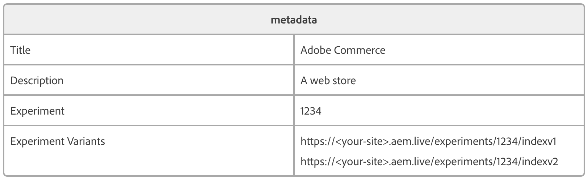{width="600" zoomable="yes"}

1. 開啟無痕瀏覽或私人瀏覽視窗，並導覽至您的首頁面。

1. 關閉私人瀏覽視窗並重複之前的步驟。 每次開啟頁面時，您都會看到已建立的隨機變體。

## 增強店面內容

透過AEM Assets、Adobe Express和Firefly，您現在可以透過簡單的自我導向工作流程，快速變更店面中顯示的影像。

### 先決條件

* 需要AEM Assets、Adobe Express和Adobe Firefly的存取權。

### 自訂影像的背景

假設您想快速修改產品影像的背景。 Adobe Commerce、AEM Assets和Adobe Express的組合可讓您透過幾個簡單步驟進行此變更。

1. 開啟您在先決條件中建立的[店面](./storefront.md)，並導覽至您要變更的專案。 記下專案SKU或產品代碼。

1. 在[Adobe Experience Cloud](https://experience.adobe.com/#/home)中選取[!UICONTROL AEM Assets]，以將其開啟。

   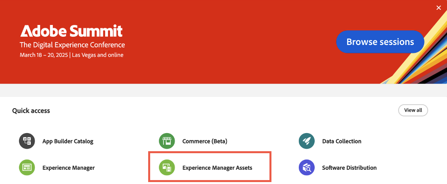{width="600" zoomable="yes"}

1. 按一下[!UICONTROL Assets]。

   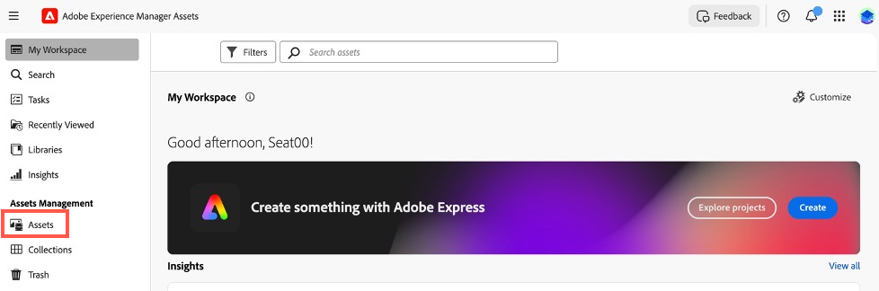{width="600" zoomable="yes"}

1. 依&#x200B;**SKU**&#x200B;或&#x200B;**產品代碼**&#x200B;搜尋專案。

1. 選取您要編輯的專案，然後按一下&#x200B;[!UICONTROL **在Adobe Express中開啟**]。

   在adobe express中開啟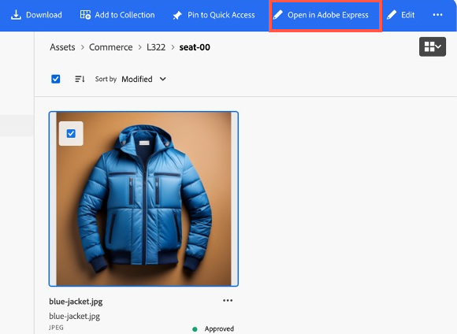{width="600" zoomable="yes"}

1. 在&#x200B;[!UICONTROL **影像**]&#x200B;面板中，選取&#x200B;[!UICONTROL **插入物件**]。

   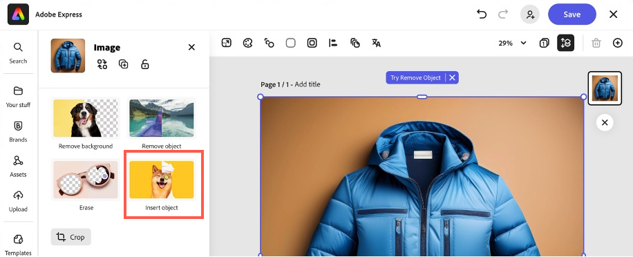{width="600" zoomable="yes"}

1. 在文字方塊中，說明您要新增的影像。 例如，「雪松樹」。

   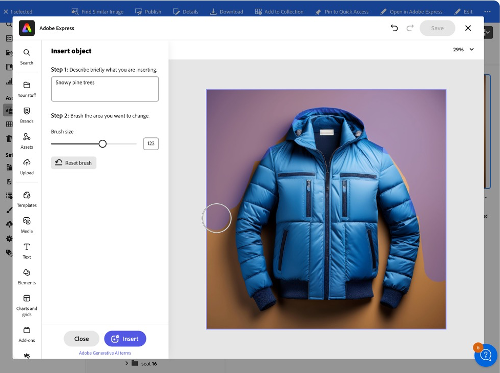{width="600" zoomable="yes"}

1. 調整[!UICONTROL Brush size]並繪製您想要新增產生影像的位置。 在此範例中，請圍繞現有物件繪製以選取背景。

1. 按一下&#x200B;[!UICONTROL **產生**]&#x200B;以檢視結果。

1. 選取想要的選項，然後按一下&#x200B;[!UICONTROL **保留**]，從不同的結果中選擇。

1. 按一下&#x200B;[!UICONTROL **您的內容**]&#x200B;以返回影像編輯器。

1. 按一下&#x200B;[!UICONTROL **儲存**]&#x200B;以指定影像型別。

1. 再按一下[儲存]儲存變更。[!UICONTROL ****]

1. 在&#x200B;[!UICONTROL **儲存資產**]&#x200B;對話方塊中，選取Commerce [!UICONTROL **目的地資料夾**]。

   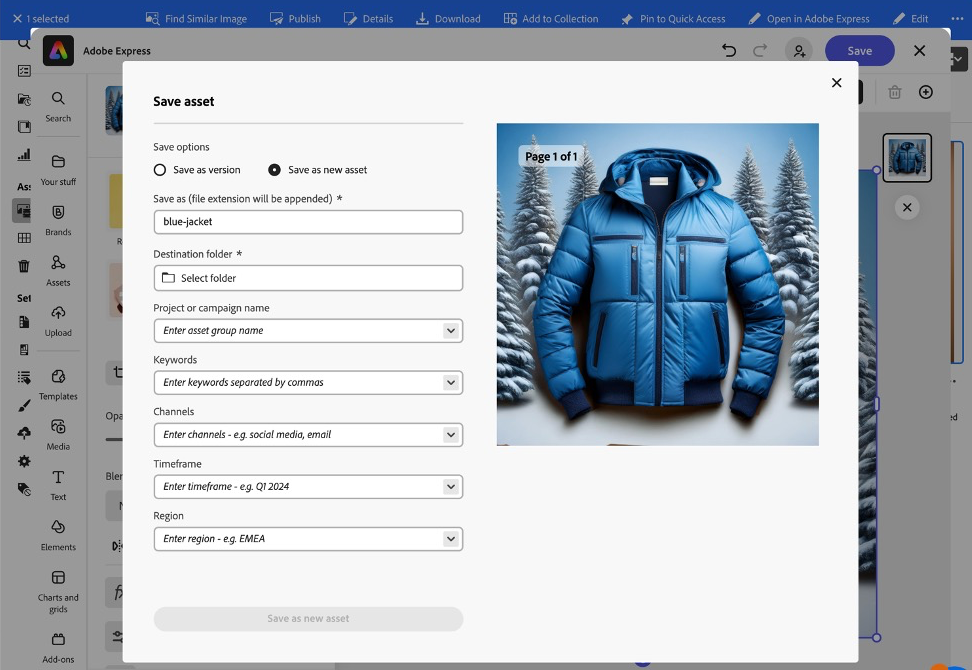{width="600" zoomable="yes"}

1. 按一下&#x200B;[!UICONTROL **另存為新資產**]&#x200B;以儲存影像。

#### 將影像新增至Commerce AEM Assets

1. 從AEM as a Cloud Service的[導覽面板](https://experienceleague.adobe.com/en/docs/experience-manager-cloud-service/content/sites/authoring/basic-handling#navigation-panel)，選取&#x200B;**Assets** > **檔案** > **Commerce**，然後按一下您在上一節建立的資產。

   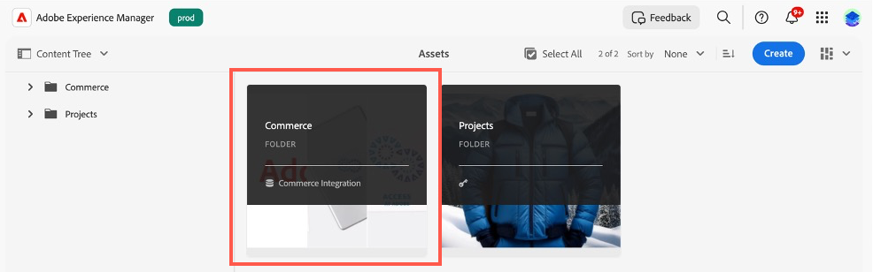{width="600" zoomable="yes"}

1. 按一下&#x200B;[!UICONTROL **屬性**]。

   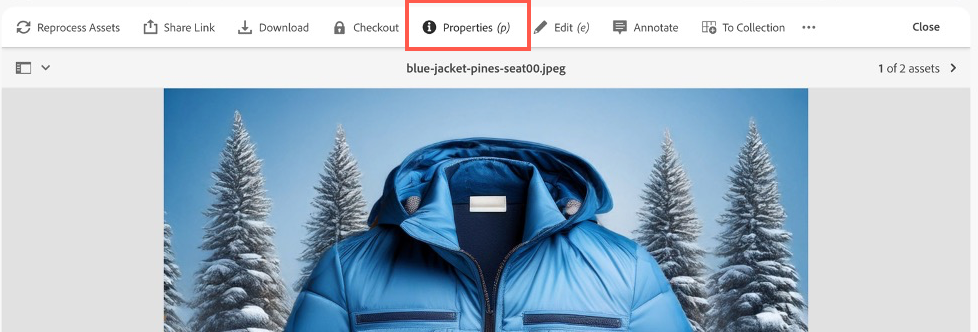{width="600" zoomable="yes"}

1. 選取&#x200B;[!UICONTROL **Commerce**]&#x200B;索引標籤。

   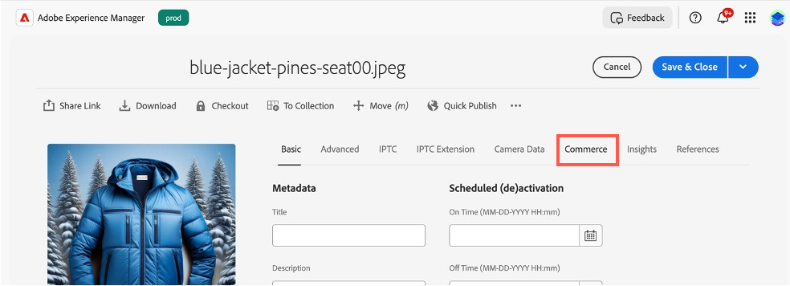{width="600" zoomable="yes"}

1. 確定&#x200B;[!UICONTROL **存在於Adobe Commerce中嗎？**]&#x200B;欄位已設定為&#x200B;[!UICONTROL **是**]。

1. 按一下「[!UICONTROL **新增**]」，然後輸入要新增資產的產品SKU。

   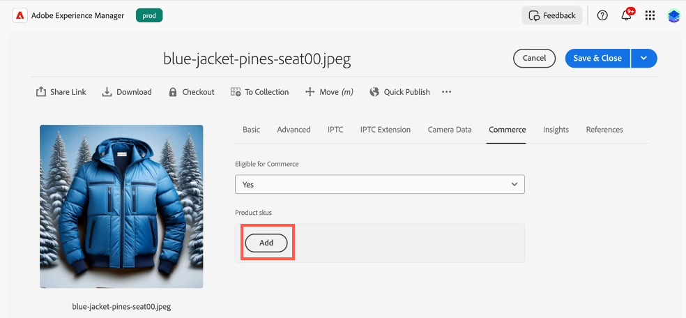{width="600" zoomable="yes"}

1. 選取資產的位置及資產型別。

1. 選取&#x200B;[!UICONTROL **基本**]&#x200B;索引標籤並將&#x200B;[!UICONTROL **檢閱狀態**]&#x200B;索引標籤變更為&#x200B;[!UICONTROL **已核准**]。

   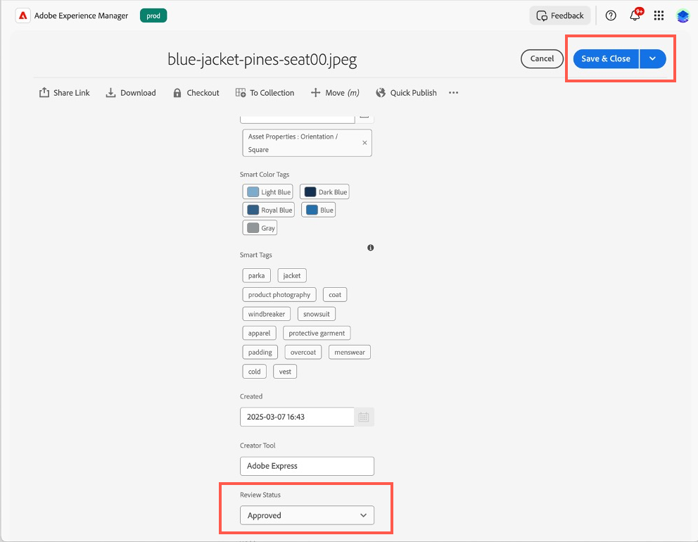{width="600" zoomable="yes"}

1. 按一下&#x200B;[!UICONTROL **儲存並關閉**]。

#### 在Commerce中確認影像

1. 在Adobe Commerce [!UICONTROL **管理員**]&#x200B;中，瀏覽至&#x200B;[!UICONTROL **目錄**] > [!UICONTROL **產品**]。

1. 選取您在上一節中新增影像的產品。

1. 展開&#x200B;[!UICONTROL **影像和影片**]&#x200B;區段。

   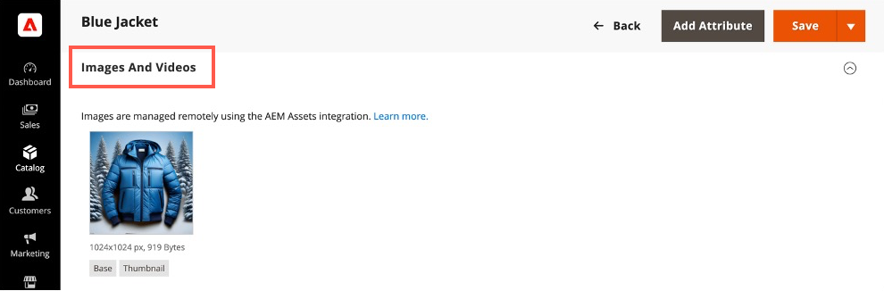{width="600" zoomable="yes"}

1. 確認您的影像現在可在影像清單中使用。

1. 返回您的店面，並瀏覽至已修改產品的頁面。

1. 確認新影像是否顯示。

   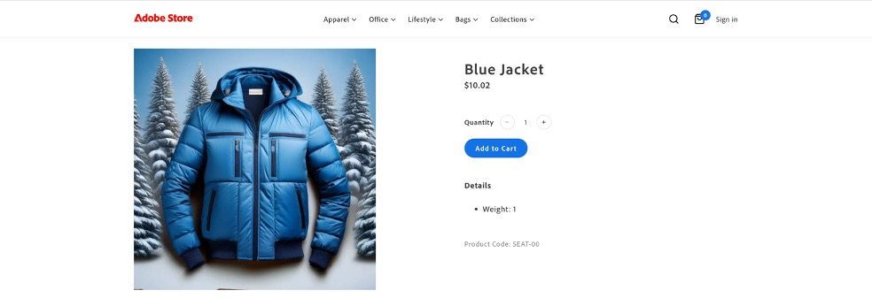{width="600" zoomable="yes"}

## 產生變數

Adobe Commerce的「產生變體」功能運用Generative AI來自動產生高品質的內容、微調訊息，並將資產順暢地發佈至店面。

### 產生文字

1. 使用[通用編輯器](https://experienceleague.adobe.com/en/docs/experience-manager-cloud-service/content/implementing/developing/universal-editor/introduction)開啟您的店面網站。

1. 選取您要編輯的文字區塊。

1. 在&#x200B;[!UICONTROL **屬性**]&#x200B;面板中，按一下&#x200B;[!UICONTROL **產生變數**]。

1. 按一下&#x200B;[!UICONTROL **產生**]&#x200B;按鈕。

1. 選取或自訂產生的文字。

1. 按一下&#x200B;[!UICONTROL **發佈**]&#x200B;以更新您的店面。

### 產生內容和影像

1. 開啟[產生變數](https://experienceleague.adobe.com/en/docs/experience-manager-cloud-service/content/generative-ai/generate-variations)

1. 選取&#x200B;[!UICONTROL **Hero Banner**]&#x200B;範本。

1. 在&#x200B;[!UICONTROL **說明使用者互動**]&#x200B;文字方塊中，輸入：「Adobe員工和合作夥伴購買Adobe品牌用具的體驗！」

1. 在網域知識&#x200B;**]的[!UICONTROL ** URL中，輸入&#x200B;**www.adobestore.com**。

1. 按一下&#x200B;[!UICONTROL **產生**]。

1. 選取內容變化並按一下&#x200B;[!UICONTROL **產生影像**]。

1. 從&#x200B;[!UICONTROL **影像大小**]&#x200B;下拉式清單中，選取&#x200B;[!UICONTROL **寬熒幕(16:9)**]。

1. 從&#x200B;[!UICONTROL **內容型別**]&#x200B;下拉式清單中，選取&#x200B;[!UICONTROL **像片**]。

1. 針對&#x200B;[!UICONTROL **樣式**]&#x200B;參考影像，選取現有的Adobe商店橫幅。

1. 選取您要使用的產生影像，然後按一下[儲存]。[!UICONTROL ****]

1. 對其他參照影像重複此程式以產生更多變化。

## 疑難排解

嘗試這些教學課程時，請使用下列建議來解決您遇到的任何問題。

* 如果您需要有關命令或旗標的指引：
   1. 執行`aio --help`以檢視所有可用的命令和旗標。
   1. 對於特定命令，請使用`--help`旗標。 例如：
      * `aio console --help`
      * `aio commerce –help`

* 如果您遇到無效的登入問題：
   1. 執行`aio config clear `。
   1. 執行`aio auth login –-force `。
   1. 登入您的瀏覽器。
   1. 選取您的設定檔。
   1. 切換回終端機以繼續。

* 如果您的`init`命令失敗：
   1. 執行`aio api-mesh delete`。
   1. 重新執行`aio commerce init`。

* 如果您在執行`init`命令之前選取了錯誤的組織、專案或工作區：
   1. 執行`aio console org select`。
   1. 執行`aio console project select`。
   1. 執行`aio console workspace select`。

* 如果您有無效的租使用者選取專案：
   1. 按&#x200B;**Ctrl-C**&#x200B;取消目前的CLI執行。
   1. 執行`aio commerce init`。

* 如果您遇到無效的API Mesh安裝：
   * 執行`aio api-mesh update mesh-config.json`。
