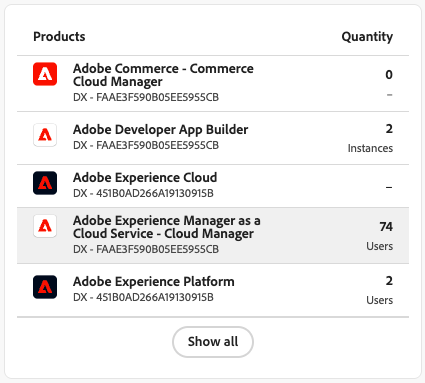
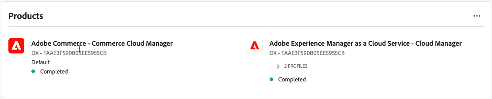

# 使用者與Identity Management

若要允許使用者在[!DNL Adobe Commerce as a Cloud Service]中存取Admin，請將他們新增為您組織中的使用者，並確定他們有權在[Adobe Admin Console](https://adminconsole.adobe.com){target="_blank"}中存取Cloud Service產品。

此程式需要IMS組織才能存取[!DNL Adobe Commerce as a Cloud Service]。 只有組織的系統管理員或產品管理員可以執行這些流程。

>[!TIP]
>
>若要同時新增多個使用者，您可以執行[大量CSV上傳](https://helpx.adobe.com/enterprise/using/bulk-upload-users.html){target="_blank"}。
>
> 您也可以建立[使用者群組](https://helpx.adobe.com/enterprise/using/user-groups.html){target="_blank"}，將多位使用者新增至角色。 然後您可以將&#x200B;[!UICONTROL **Adobe Commerce - Commerce Cloud Manager**]&#x200B;產品新增到使用者群組。

## 瞭解角色

下列角色適用於[!DNL Adobe Commerce as a Cloud Service]。 若要檢視或編輯這些角色，請在Commerce管理員中導覽至&#x200B;[!UICONTROL **系統**] > [!UICONTROL **許可權**] > [!UICONTROL **使用者角色**]。

* **使用者** — 使用者擁有Commerce管理員的管理員存取權，但無法在Admin Console中管理產品層級的存取權。 使用者也可以使用積分在[中](./getting-started.md#create-an-instance)建立執行個體[!DNL Commerce Cloud Manager]。

  >[!NOTE]
  >
  >所有Commerce使用者（包括開發人員和管理員）也必須獲指派使用者角色。 基本Commerce許可權需要此專案。

* [**開發人員**](https://helpx.adobe.com/enterprise/using/manage-developers.html#Adddevelopers){target="_blank"} — 開發人員擁有使用者許可權，並且已作為開發人員使用者新增至Commerce執行個體。 他們可以使用[[!DNL Admin UI SDK]](https://developer.adobe.com/commerce/extensibility/admin-ui-sdk/){target="_blank"}、[設定事件](https://developer.adobe.com/commerce/extensibility/events/){target="_blank"}和[建立Webhook](https://developer.adobe.com/commerce/extensibility/webhooks/){target="_blank"}。

* 管理員 — 管理員分為三種型別：
   * [系統管理員](https://helpx.adobe.com/enterprise/using/admin-roles.html){target="_blank"} — 系統管理員可以透過Admin Console存取組織中的所有產品和產品設定檔。
   * [產品管理員](#add-a-product-admin) — 產品管理員可以在[中](#add-users)管理產品的使用者、角色和許可權[!DNL Adobe Admin Console]，並在Commerce管理員中[管理使用者](https://experienceleague.adobe.com/en/docs/commerce-admin/systems/user-accounts/permissions-users-all#create-a-user){target="_blank"}。
   * [產品設定檔管理員](#add-developers-and-product-profile-admins) — 產品設定檔管理員無法存取Adobe Commerce管理員，但可以在[!DNL Adobe Admin Console]中管理產品的使用者。

如需授與Adobe Commerce中每個角色的許可權的詳細資訊，請參閱[使用者許可權](#user-permissions)。

## 新增產品管理員

>[!BEGINTABS]

>[!NOTE]
>
>將產品管理員新增為產品管理員之前，請先指派給[使用者角色](#add-users)。 基本Commerce許可權需要使用者角色。

>[!TAB GA （在2025年10月13日之後布建）]

1. 導覽至<https://adminconsole.adobe.com>並使用您的Adobe ID登入。

1. 選取您的組織。

1. 選取&#x200B;[!UICONTROL **使用者**]&#x200B;索引標籤。

1. 選取&#x200B;[!UICONTROL **管理員**]&#x200B;標籤。

1. 按一下&#x200B;[!UICONTROL **新增管理員**]。

1. 輸入您要新增為管理員之使用者的使用者名稱或電子郵件地址，然後按一下&#x200B;[!UICONTROL **下一步**]。

1. 選取&#x200B;[!UICONTROL **產品設定檔管理員**]&#x200B;角色。

1. 按一下&#x200B;[!UICONTROL **+**]&#x200B;以新增產品。

1. 選取要新增管理員的現有Commerce執行個體。 Commerce執行個體使用以下格式： `Adobe Commerce - <instance-name> - ACCS - <environment-type> - <tenant-id>`。

1. 選取產品設定檔。

1. 按一下&#x200B;[!UICONTROL **套用**]。

1. 按一下&#x200B;[!UICONTROL **儲存**]。

>[!TAB 搶先使用（2025年10月13日之前布建）]

1. 導覽至<https://adminconsole.adobe.com>並使用您的Adobe ID登入。

1. 選取您的組織。

1. 在「[!UICONTROL **產品**]」標籤的「[!UICONTROL **產品和服務**]」下，選取「[!UICONTROL **Adobe Commerce - Commerce Cloud管理員**]」產品。

   顯示Adobe Commerce Cloud Manager的Admin Console中的{width="600" zoomable="yes"}

1. 選取「[!UICONTROL **管理員**]」標籤。

1. 按一下&#x200B;[!UICONTROL **新增管理員**]。

1. 輸入您要新增為管理員的使用者使用者名稱或電子郵件地址，然後按一下[儲存]。[!UICONTROL **&#x200B;**]

>[!ENDTABS]

## 新增使用者

下列指示提供如何將使用者新增到[!DNL Commerce Cloud Manager]和Commerce管理員的資訊。 [!DNL Commerce Cloud Manager]介面可讓您建立和管理Commerce執行個體。 所有使用者（包括開發人員和管理員）都必須進行此程式。

>[!NOTE]
>
>只有產品管理員和系統管理員可以將使用者和開發人員新增到Adobe Commerce as a Cloud Service產品。

>[!BEGINTABS]

>[!TAB GA （在2025年10月13日之後布建）]

1. 導覽至<https://adminconsole.adobe.com>並使用您的Adobe ID登入。

1. 選取您的組織。

1. 選取「[!UICONTROL **產品**]」標籤。

1. 選取&#x200B;[!UICONTROL **Adobe Commerce**]&#x200B;產品。

1. 如果您想要將使用者新增到Commerce Cloud Manager介面(他們可以在此建立和管理Commerce執行個體)，請選取Manager產品，或選取要新增使用者的現有Commerce執行個體。 Commerce執行個體使用以下格式： `Adobe Commerce - <instance-name> - ACCS - <environment-type> - <tenant-id>`。

1. 選取&#x200B;[!UICONTROL **使用者**]&#x200B;索引標籤，然後按一下&#x200B;[!UICONTROL **新增使用者**]。

1. 輸入要新增的使用者使用者名稱或電子郵件地址，然後按一下[儲存]。[!UICONTROL **&#x200B;**]

1. 選取所需的產品設定檔。

1. 按一下&#x200B;[!UICONTROL **套用**]。

1. 按一下&#x200B;[!UICONTROL **儲存**]。

>[!TAB 搶先使用（2025年10月13日之前布建）]

1. 導覽至<https://adminconsole.adobe.com>並使用您的Adobe ID登入。

1. 選取您的組織。

1. 在「[!UICONTROL **產品**]」標籤的「[!UICONTROL **產品和服務**]」下，選取「[!UICONTROL **Adobe Commerce - Commerce Cloud管理員**]」產品。

   在Admin Console中{width="600" zoomable="yes"}

1. 按一下&#x200B;[!UICONTROL **預設 — Cloud Manager**]&#x200B;產品設定檔。

1. 選取&#x200B;[!UICONTROL **使用者**]&#x200B;索引標籤，然後按一下&#x200B;[!UICONTROL **新增使用者**]。

   {width="600" zoomable="yes"}

1. 輸入要新增的使用者使用者名稱或電子郵件地址，然後按一下[儲存]。[!UICONTROL **&#x200B;**]

>[!ENDTABS]

### 新增開發人員和產品設定檔管理員

若要新增開發人員和產品設定檔管理員，請重複[新增使用者](#add-users)程式，但選取&#x200B;[!UICONTROL **開發人員**]&#x200B;或&#x200B;[!UICONTROL **管理員**]&#x200B;標籤，而非&#x200B;[!UICONTROL **使用者**]&#x200B;標籤。

>[!NOTE]
>
>產品設定檔管理員無法存取Commerce管理員。 如需詳細資訊，請參閱[瞭解角色](#understanding-roles)。
>
>將開發人員新增為開發人員之前，先為其指派使用者角色。 基本Commerce許可權需要使用者角色。

在Admin Console中{width="600" zoomable="yes"}

## 角色資源

下列清單說明預設角色在[!DNL Adobe Commerce] Admin內有權存取的資源。 若要編輯每個角色的預設許可權，請瀏覽至Commerce管理員中的&#x200B;[!UICONTROL **系統**] > [!UICONTROL **許可權**] > [!UICONTROL **使用者角色**]。

**位使用者**

* 目錄
   * 詳細目錄
      * 產品
         * 讀取產品價格

**開發人員**

* 目錄
   * 詳細目錄
      * 產品
         * 讀取產品價格
* 系統
   * 資料傳輸
      * 匯入歷史記錄
* Adobe IO事件設定
   * 組態檢查
   * 建立事件提供者
   * 設定更新
   * 同步事件
   * 取得事件提供者清單
* 事件架構
   * 事件清單
   * 測試事件連線
   * 訂閱事件
   * 取消訂閱事件
   * 事件狀態
   * 取得事件訂閱的API
   * 檢視事件訂閱管理UI
   * 建立事件訂閱管理員UI
   * 請求新的事件管理員UI
* Webhooks
   * Webhooks數位簽名
      * Webhooks數位簽名設定
      * Webhooks數位簽名產生金鑰
   * Webhooks管理
      * Webhooks格線
      * Webhooks編輯
      * 測試Webhook
      * API訂閱webhook
      * API從webhook取消訂閱
      * Webhooks清單
      * 請求新Webhook
      * Webhooks記錄
      * 取得Webhook清單

**管理員**

管理員擁有所有許可權的存取權。

## 將使用者新增至[!DNL AEM Assets]或[!DNL Product Visuals]

[!DNL Adobe Experience Manager Assets]和[!DNL Product Visuals powered by AEM Assets]使用者需要下列設定。

如果您的帳戶可以存取[[!DNL Adobe Experience Manager as a Cloud Service]](https://experienceleague.adobe.com/en/docs/experience-manager-cloud-service)，而且您想要允許使用者存取[[!DNL AEM Assets]](https://experienceleague.adobe.com/en/docs/commerce/aem-assets-integration/overview){target="_blank"}與[!DNL Adobe Commerce as a Cloud Service]的進階功能，請完成下列程式：

>[!NOTE]
>
>沒有適當資產許可權的使用者將無法存取[!DNL AEM Assets]的進階功能，例如[AI影像產生](https://experienceleague.adobe.com/en/docs/experience-manager-cloud-service/content/generative-ai/generative-ai-in-aem){target="_blank"}、[產生的變數](https://experienceleague.adobe.com/en/docs/experience-manager-cloud-service/content/generative-ai/generate-variations-integrated-editor){target="_blank"}等等。

>[!TIP]
>
>若要同時新增多個使用者，您可以執行[大量CSV上傳](https://helpx.adobe.com/enterprise/using/bulk-upload-users.html){target="_blank"}。
>
>您也可以建立[使用者群組](https://helpx.adobe.com/enterprise/using/user-groups.html){target="_blank"}，將多位使用者新增至角色。 然後您可以將&#x200B;[!UICONTROL **Adobe Experience Manager as a Cloud Service - Cloud Manager**]&#x200B;產品新增到使用者群組。

1. 導覽至<https://adminconsole.adobe.com>並使用您的Adobe ID登入。

1. 選取您的組織。

1. 在「[!UICONTROL **產品**]」標籤的「[!UICONTROL **產品和服務**]」下，選取「[!UICONTROL **Adobe Experience Manager as a Cloud Service - Cloud Manager**]」產品。

   Admin Console中的{width="600" zoomable="yes"}

1. 選取&#x200B;[!UICONTROL **使用者**]&#x200B;索引標籤。

1. 按一下&#x200B;[!UICONTROL **新增使用者**]。

1. 輸入要新增的使用者使用者名稱或電子郵件地址。

1. 按一下&#x200B;[!UICONTROL **新增產品**]。

1. 選取下列產品設定檔，這些設定檔是將[!DNL AEM Assets]與Commerce整合的必要專案：

   * 業務負責人 — 建立和管理計畫所需。
   * 部署管理員 — 將計畫碼從您的存放庫部署到AEM時需要。

   如果您新增的開發人員不需要Cloud Manager或Experience Manager介面的存取權，您可以改為指派開發人員角色。

   >[!NOTE]
   >
   >如需這些許可權如何影響您存取[!DNL AEM Assets]的詳細資訊，請參閱[Cloud Manager產品設定檔](https://experienceleague.adobe.com/en/docs/experience-manager-cloud-service/content/onboarding/concepts/aem-cs-team-product-profiles#cloud-manager-product-profiles){target="_blank"}。

1. 按一下&#x200B;[!UICONTROL **套用**]。

1. 按一下&#x200B;[!UICONTROL **儲存**]。

若要確認使用者是否具有存取權，請按一下使用者的名稱以開啟其設定檔頁面。 在&#x200B;[!UICONTROL **產品**]&#x200B;區段中，在&#x200B;[!UICONTROL **Adobe Experience Manager as a Cloud Service - Cloud Manager**]&#x200B;產品底下應顯示&#x200B;[!UICONTROL **已完成**]。 新增使用者後，可能需要幾秒鐘才能看到其設定檔上的狀態更新。 重新整理頁面以檢視更新的狀態。

{width="600" zoomable="yes"}

## 存取Experience Manager介面

將使用者新增至[!DNL AEM Assets]後，他們可以導覽至[!DNL Experience Manager]https://experience.adobe.com/[以存取](https://experience.adobe.com/){target="_blank"}介面。

1. 在&#x200B;[!UICONTROL **快速存取**]&#x200B;區段中，按一下&#x200B;[!UICONTROL **Experience Manager**]，或按一下&#x200B;[!UICONTROL **檢視全部**] (如果您沒有看見&#x200B;[!UICONTROL **Experience Manager**])。 然後按一下&#x200B;[!UICONTROL **Cloud Manager**]&#x200B;或直接導覽至[https://my.cloudmanager.adobe.com](https://my.cloudmanager.adobe.com){target="_blank"}。

1. 從&#x200B;[!UICONTROL **Cloud Manager**]&#x200B;頁面，按一下&#x200B;[!UICONTROL **新增程式**]&#x200B;以開始。

1. [建立新程式](https://experienceleague.adobe.com/en/docs/experience-manager-cloud-service/content/onboarding/journey/create-program){target="_blank"}。

1. [建立新環境](https://experienceleague.adobe.com/en/docs/experience-manager-cloud-service/content/screens-as-cloud-service/onboarding-screens-cloud/creating-an-environment){target="_blank"}。

1. 建立環境之後，請返回[Admin Console](https://adminconsole.adobe.com){target="_blank"}並選取&#x200B;[!UICONTROL **Adobe Experience Manager as a Cloud Service**]。

1. 您現在應該會看到新的產品設定檔。 選取包含`- author -`的。 例如，`<environment-name> - author - <program-id> - <environment-id>`。

1. [將使用者新增至產品設定檔](https://experienceleague.adobe.com/en/docs/experience-manager-cloud-manager/content/requirements/users-and-roles){target="_blank"}。

* [設定 [!DNL AEM Assets] 以支援Commerce中繼資料](https://experienceleague.adobe.com/en/docs/commerce/aem-assets-integration/get-started/configure-aem)
* [整合 [!DNL AEM Assets] 與Commerce以進行資產同步](https://experienceleague.adobe.com/en/docs/commerce/aem-assets-integration/get-started/setup-synchronization)

{{aem-assets-instance-mapping}}

## 身分管理和單一登入設定

{{ims-identity-and-sso-config}}

