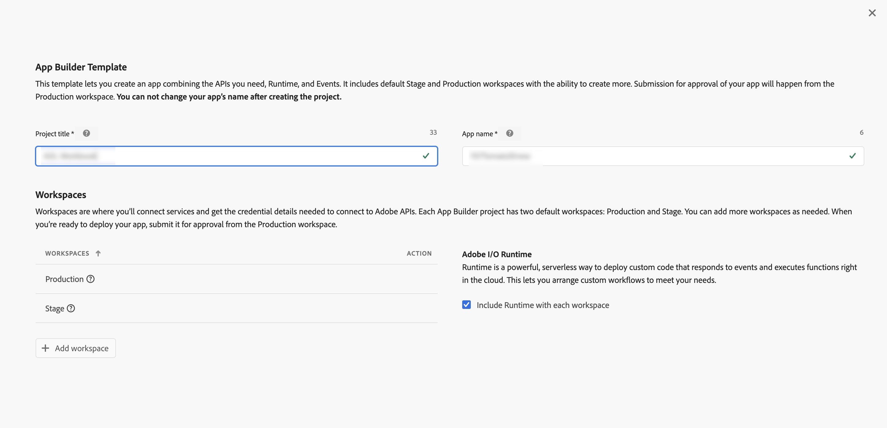
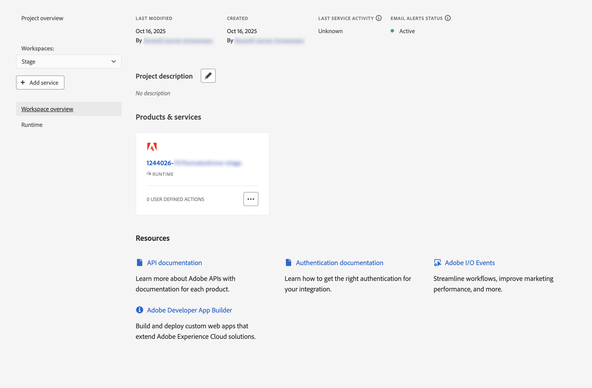
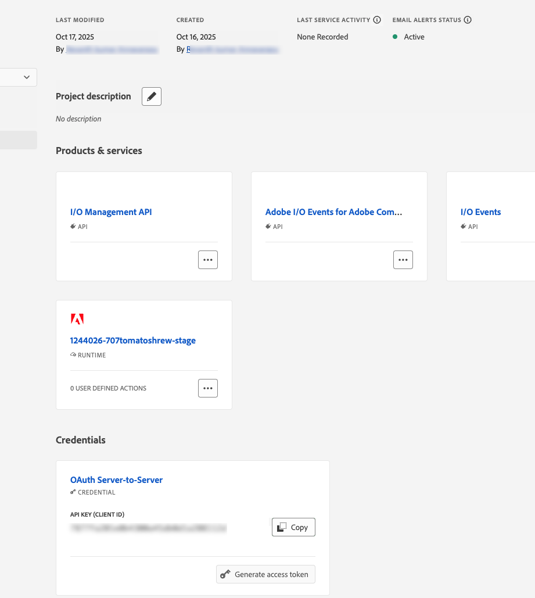
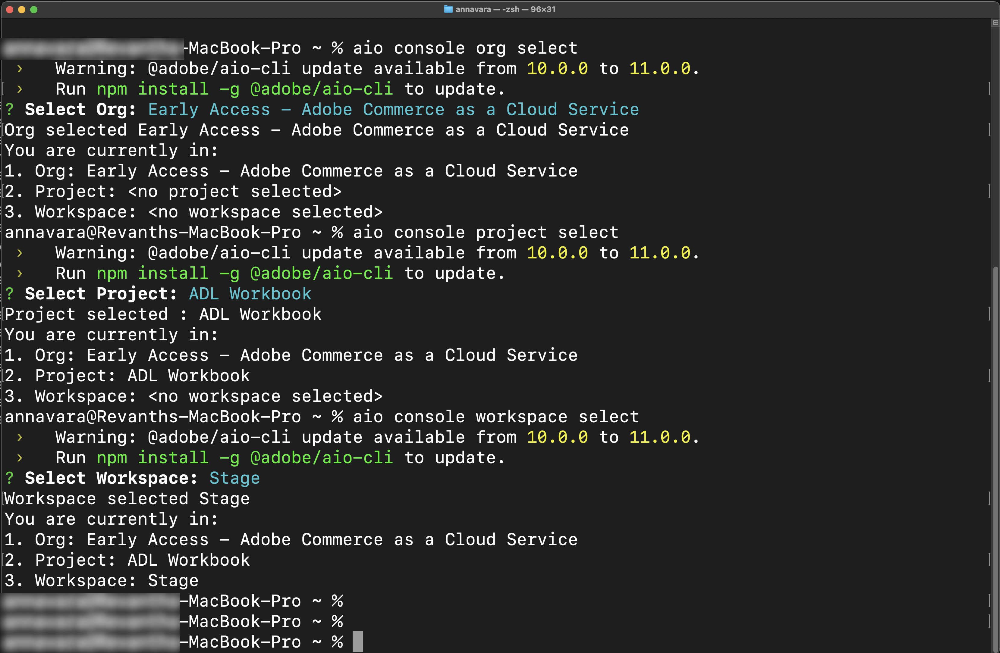
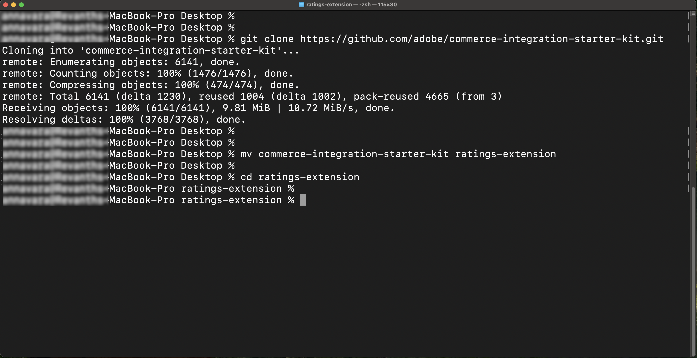
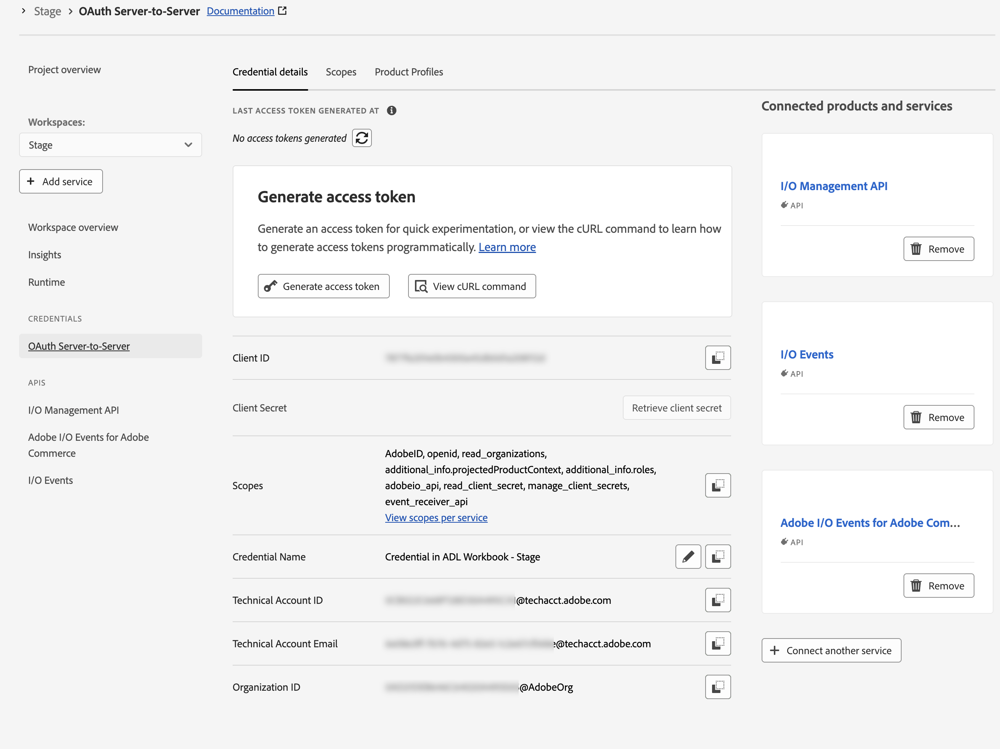
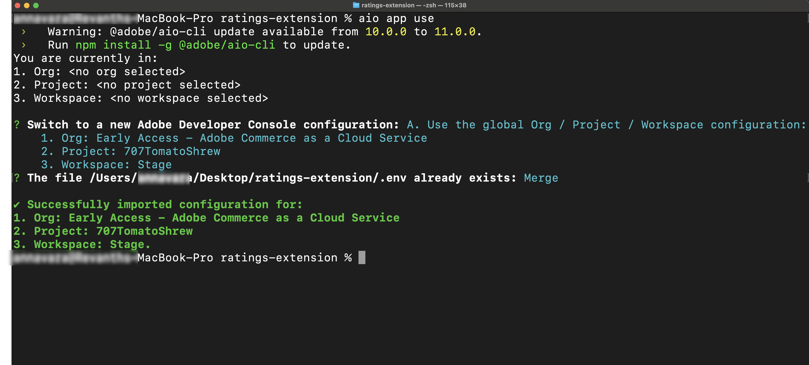
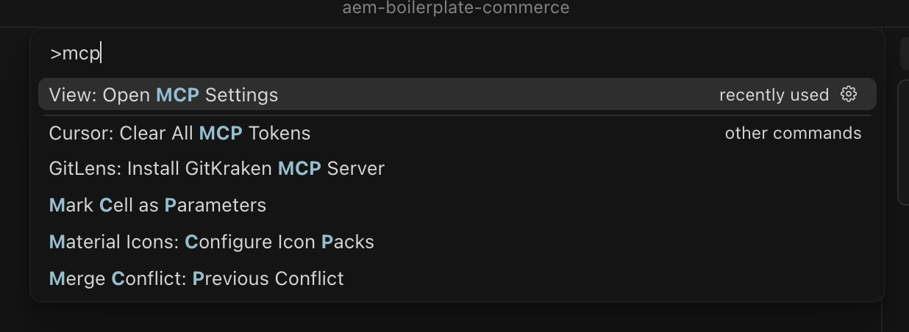
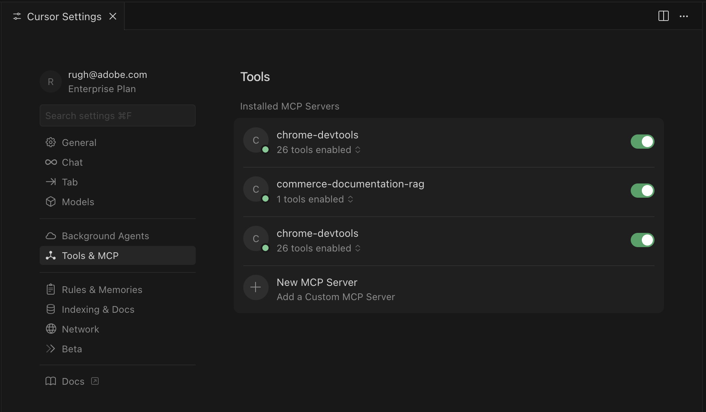
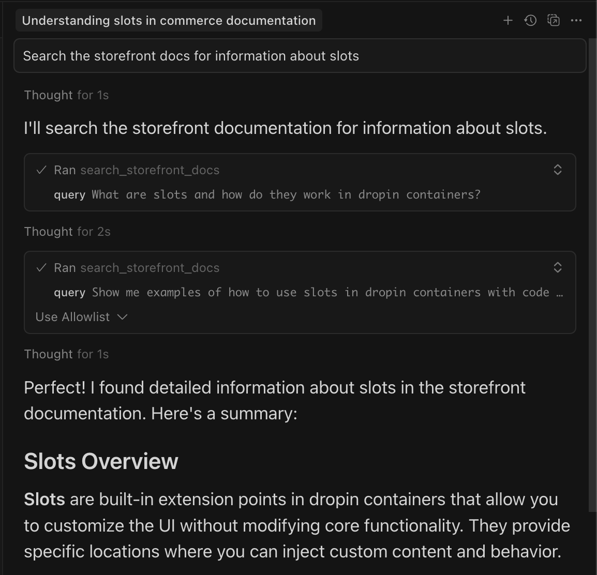

# Adobe Developers Live - Adobe Commerce實驗室必要條件

此頁面列出[評等擴充功能實驗室](./workbook.md)的先決條件及其他手動設定步驟。 實驗室也包含可自動化這些步驟大部份的指令碼。

## 擴充功能必備條件

開始之前，請先完成下列必要條件：

* 安裝[!DNL Adobe I/O CLI]

  ```bash
  npm install -g @adobe/aio-cli
  ```

* 安裝Commerce外掛程式

  ```bash
  aio plugins:install https://github.com/adobe-commerce/aio-cli-plugin-commerce
  ```

* 下載AI輔助的IDE，例如[Cursor](https://cursor.com/download) （建議），也支援其他IDE，例如Claude Code、Gemini CLI或Copilot，但可能需要修改本教學課程中的提示和其他步驟。
<!-- 
### Create a new project on Adobe Developer Console

1. Navigate to [Adobe Developer Console](https://developer.adobe.com/).
1. Click [!UICONTROL **Create project from a template**].
1. Select the [!UICONTROL **App Builder**] template.
1. Enter a [!UICONTROL **Project Title**] and [!UICONTROL **App Name**].
1. Ensure the **[!UICONTROL Include Runtime]** checkbox is marked.

   {width="600" zoomable="yes"}

1. Click **Save**.

### Add APIs to the workspace

1. Click the [!UICONTROL **Stage**] workspace and then repeat the following steps for each API.

   {width="600" zoomable="yes"}

1. Click [!UICONTROL **Add Service**] and select [!UICONTROL **API**].

1. Select the [!UICONTROL **Adobe Services**] filter and select one of the following APIs:

   * [!UICONTROL **I/O Management API**]
   * [!UICONTROL **I/O Events**]

1. Select the [!UICONTROL **Experience Cloud**] filter and select one of the following APIs:

   * [!UICONTROL **Adobe I/O Events for Adobe Commerce**]

1. Click [!UICONTROL **Next**].

1. Click[!UICONTROL **Save configured API**].

1. Repeat the previous steps until all APIs are added to the workspace.

   {width="600" zoomable="yes"} -->

### 設定AIO CLI

1. 清除現有設定：

   ```bash
   aio config clear
   ```

   使用AIO CLI登入：

   ```bash
   aio auth login -f
   ```

1. 使用下列每一個命令選取您的組織、專案和工作區：

   ```bash
   aio console org select
   ```

   ```bash
   aio console project select
   ```

   ```bash
   aio console workspace select
   ```

   {width="600" zoomable="yes"}

### 複製整合入門套件

複製Commerce整合入門套件存放庫，並準備您的專案：

```bash
git clone --branch adl https://github.com/adobe/commerce-integration-starter-kit.git extension
cd extension
```

{width="600" zoomable="yes"}

### 建立.env檔案

建立您的環境設定檔：

```bash
cp env.dist .env
```

<!-- Open the `.env` file in a text editor and add the following OAuth credentials:

```text
OAUTH_CLIENT_ID=
OAUTH_CLIENT_SECRET=
OAUTH_TECHNICAL_ACCOUNT_ID=
OAUTH_TECHNICAL_ACCOUNT_EMAIL=
OAUTH_ORG_ID=
```

You can copy these values from the **[!UICONTROL Credential details]** page in [Developer Console](https://developer.adobe.com/) by clicking the **[!UICONTROL OAuth Server-to-Server]** tab on your workspace.

{width="600" zoomable="yes"}

#### Add the Commerce configuration

Add the following Commerce instance details to your `.env` file:

```text
COMMERCE_BASE_URL=
COMMERCE_GRAPHQL_ENDPOINT=
```

To find these values:

1. Go to [Commerce Cloud Service instances](https://experience.adobe.com/#/@commerce/commerce/cloud-service/instances).
1. Click the information icon next to your assigned seat.
1. Copy the REST endpoint as `COMMERCE_BASE_URL`.
1. Copy the GraphQL Endpoint as `COMMERCE_GRAPHQL_ENDPOINT`.

#### Set event prefix

Set a temporary value for the event prefix:

```text
EVENT_PREFIX=test
```
 -->

### 下載工作區設定

執行以下命令來下載工作區組態檔：

```bash
aio console workspace download workspace.json
```

### 將本機工作區連線到遠端工作區

將您的本機專案連結至遠端工作區：

```bash
aio app use workspace.json -m
```

{width="600" zoomable="yes"}

## 店面必要條件

若要完成本教學課程的[storefront](#connect-to-the-storefront)區段，並檢視商店中的產品評等，必須執行下列專案。
<!-- 
* Install [!DNL Node.js] (version `22.x.x`) and npm (`9.0.0` or higher). Verify your installation:

   ```bash
   node --version
   npm --version
   ```

* Install [Git](https://git-scm.com) (Optional) - Required only if [cloning the repository directly](#option-a-clone-the-repository-recommended)(recommended), not needed if you [download the zip file](#option-b-download-the-zip-file). Verify your installation:

  ```bash
  git --version
  ```

* Bash shell
  * macOS/Linux: No installation required
  * Windows: Use [Git Bash](https://git-scm.com/install) or [Windows Subsystem for Linux (WSL)](https://learn.microsoft.com/en-us/windows/wsl/install).

* [Google Chrome](https://www.google.com/chrome/) - Required for testing the storefront -->

### 取得專案檔案

您可以透過下列兩種方式之一取得專案檔案：

<!-- 
#### Option A: Clone the repository (recommended) -->

如果您已安裝[!DNL Git]，請開啟您的終端機並複製存放庫：

```bash
git clone --branch agentic-dev https://github.com/hlxsites/aem-boilerplate-commerce.git storefront
cd storefront
```

<!-- #### Option B: Download the zip file

If you don't have [!DNL Git] installed:

1. Download the project zip file from: [https://github.com/hlxsites/aem-boilerplate-commerce/archive/refs/heads/agentic-dev.zip](https://github.com/hlxsites/aem-boilerplate-commerce/archive/refs/heads/agentic-dev.zip)
1. Extract the zip file to a folder on your machine.
1. Open your terminal and navigate into the unzipped folder:

   ```bash
   cd path/to/aem-boilerplate-commerce-agentic-dev
   ``` -->

### 安裝根相依性

安裝主要專案相依性：

```bash
npm install
```

這會安裝店面應用程式的所有必要套件。

### 安裝MCP伺服器相依性

瀏覽至MCP伺服器目錄並安裝其相依性：

```bash
cd mcp-server
npm install
cd ..
```

<!-- ### Configure environment variables

The MCP server requires certain environment variables to connect to the RAG service.

Create a `.env` file in the `mcp-server` directory:

```bash
cd mcp-server
cp env.example .env
```

Edit the `.env` file and add the following values (we'll provide the actual URL during the lab):

```env
RAG_MODE=worker
WORKER_RAG_URL=<provided-during-lab>
```

>[!NOTE]
>
>The actual value for `WORKER_RAG_URL` will be provided by the lab facilitator at the start of the session. -->

### 啟用游標中的MCP

模型內容通訊協定(MCP)伺服器可讓AI代理程式存取[!DNL Adobe Commerce]店面檔案。

#### 開啟游標MCP設定

{width="600" zoomable="yes"}

1. 開啟[!DNL Cursor]
1. 前往&#x200B;**[!UICONTROL Cursor]** > **[!UICONTROL Settings]** > **[!UICONTROL Cursor Settings]** > **[!UICONTROL Tools & MCP]**

#### 啟用和設定MCP功能

專案包含位於`.cursor/mcp.json`的MCP組態檔。 這個檔案應該已經設定為使用本機MCP伺服器。

驗證MCP設定：

1. 確保列出並啟用「commerce-documentation-rag」伺服器

設定應該看起來類似這樣：

{width="600" zoomable="yes"}

>[!NOTE]
>
>`start-mcp.sh`指令碼將自動從`.env`目錄中的`mcp-server`檔案載入環境變數。

#### 重新啟動游標

啟用MCP並設定伺服器之後：

1. 完全結束[!DNL Cursor]
1. 重新開啟[!DNL Cursor]並開啟`aem-boilerplate-commerce`專案

#### 驗證MCP連線

檢查MCP伺服器是否正確執行：

1. 在[!DNL Cursor]中開啟新的聊天
1. 尋找顯示MCP伺服器已連線的指標（通常在聊天介面中）
1. 請嘗試提出類似下列的問題：「搜尋店面檔案以取得位置的相關資訊」

如果MCP伺服器運作正常，您應該會看到相關的檔案結果。

{width="600" zoomable="yes"}

### 啟動開發伺服器

啟動本機開發伺服器：

```bash
npm run start
```

開發伺服器將在`http://localhost:3000`啟動。

瀏覽至`http://localhost:3000/apparel`的服飾頁面。

{width="600" zoomable="yes"}
