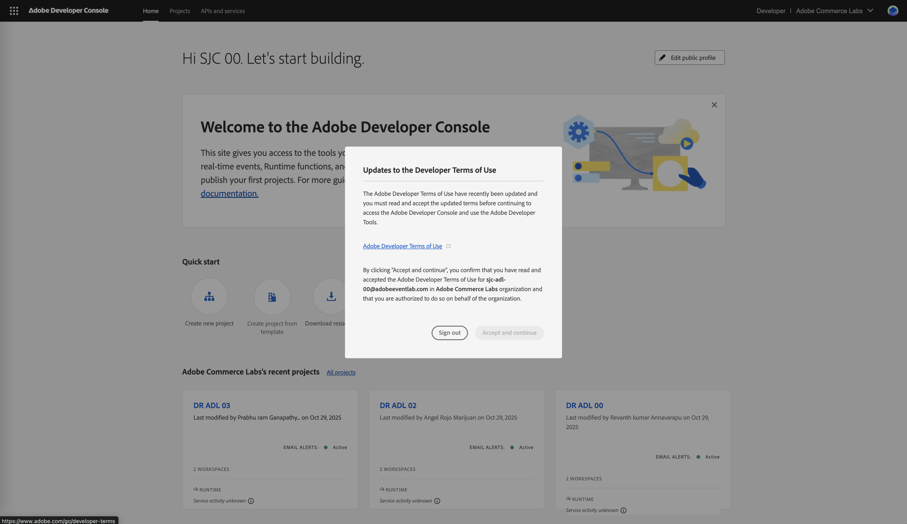
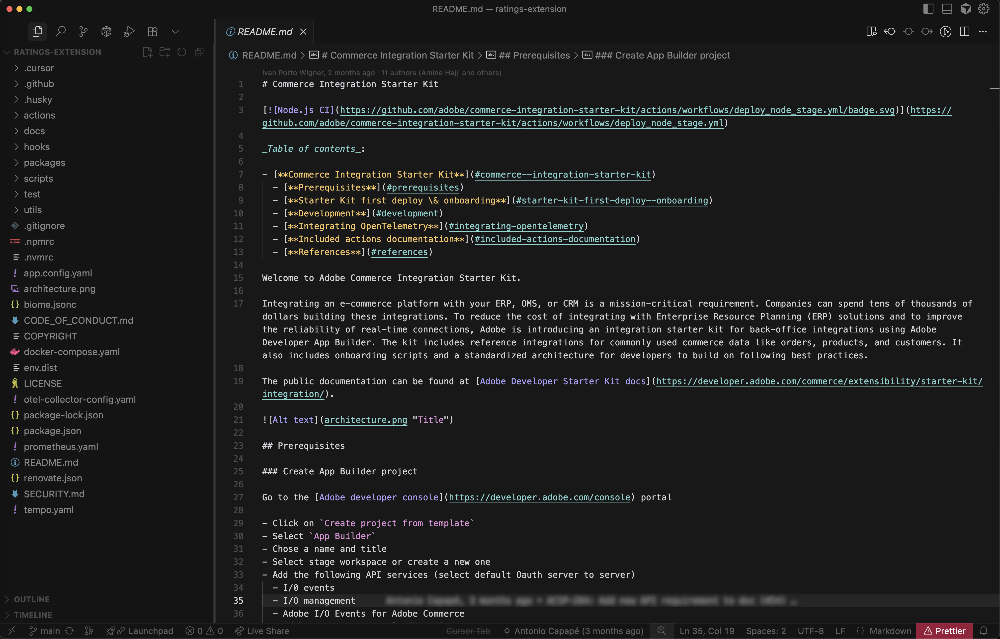

# Adobe Developers Live - Adobe Commerce實驗室活頁簿

本實驗會使用[!DNL Adobe Commerce as a Cloud Service]和AI輔助開發工具，引導您建立[!DNL Adobe App Builder]的產品評等延伸。

## 驗證先決條件

確認已安裝下列先決條件：

```bash
# Check Node.js version (should be 22.x.x)
node --version

# Check npm version (should be 9.0.0 or higher)
npm --version

# Check Git
git --version

# Check Bash
bash --version
```

## 登入Adobe Developer Console

1. 導覽至[Adobe Developer Console](https://developer.adobe.com/console){target="_blank"}。
1. 如果您已經登入，請按一下右上角的設定檔圖示，然後按一下&#x200B;**登出**&#x200B;按鈕。
1. 使用為您的座位提供的實驗室電子郵件ID和密碼登入。
1. 如果系統提示您新增次要電子郵件地址或電話號碼，請按一下&#x200B;**現在不要**。
1. 當系統提示您選取組織設定檔時，請選取&#x200B;**Adobe Commerce Labs**。

   {width="600" zoomable="yes"}

1. 如果系統提示您接受條款與條件，請按一下連結來閱讀條款，然後按一下[接受]並繼續&#x200B;**。**

   {width="600" zoomable="yes"}

## 執行安裝程式指令碼

如果已安裝[必要條件](#verify-prerequisites)，而且您已登入Adobe Developer Console，請下載並執行安裝程式指令碼。 或者，您可以按照[實驗室先決條件](workbook-prerequisites.md)步驟手動設定指令碼。

1. 複製包含設定指令碼的存放庫：

   ```bash
   git clone https://github.com/adobe-commerce/commerce-adl-2025.git
   ```

   >[!NOTE]
   >
   >如果指令碼失敗，請參考[必要條件](workbook-prerequisites.md)，並在指令碼發生錯誤時繼續。

1. 導覽至存放庫：

   ```bash
   cd commerce-adl-2025
   ```

1. 執行安裝程式指令碼：

   ```bash
   bash adl-setup.sh
   ```

   當指令碼執行時，系統會提示您輸入使用者名稱和密碼，這些將在實驗期間提供。 您的使用者名稱會反映您的位置與座位編號。 例如，如果您在加州的聖荷西，123號座位，則您的使用者名稱將是`sjc-adl-123@adobeeventlab.com`。

   此外，您應該選取與座位號碼和&#x200B;**階段**&#x200B;工作區對應的專案。 您的專案名稱將反映您的位置與座位編號。 例如，如果您在加州的聖荷西，123號座位，您的專案名稱將是`SJC ADL 123`。

## 擴充功能開發

本節將引導您使用AI輔助開發工具，為Adobe Commerce as a Cloud Service開發評等擴充功能的程式。

### 安裝擴充性AI工具

在`extension`資料夾中設定AI輔助開發工具：

```bash
cd extension
```

```bash
aio commerce extensibility tools-setup
```

{width="600" zoomable="yes"}

### 開啟游標

>[!NOTE]
>
>使用AI輔助開發工具時，代理程式產生的程式碼和回應會有自然的變化。
>如果您在程式碼上遇到任何問題，可以隨時要求代理程式協助您進行偵錯。

開啟[!DNL Cursor]應用程式並導覽至`extension`資料夾，或者如果您已安裝[Cursor CLI](https://cursor.com/docs/configuration/shell#installing-cli-commands)，請在終端機中輸入下列命令：

```bash
cursor .
```

{width="600" zoomable="yes"}

此時，所有[!DNL Cursor]規則都已安裝在`.cursor/rules`資料夾中。 您可以在&#x200B;**的** MCP設定[!DNL Cursor]中找到MCP工具。 確認`commerce-extensibility`工具集已啟用且沒有錯誤。 如果您看到錯誤，請關閉和開啟工具集。

{width="600" zoomable="yes"}

如果您有任何檔案新增至Cursor的內容，則需要加以停用。 瀏覽至&#x200B;[!UICONTROL **Cursor**] > [!UICONTROL **設定**] > [!UICONTROL **Cursor設定**] > [!UICONTROL **索引與檔案**]，並刪除列出的任何檔案。

{width="600" zoomable="yes"}

### 程式碼產生

本節示範如何使用AI輔助工具產生產品評等擴充功能的程式碼。

#### 定義需求

您將實作提供產品評等作為API的擴充功能。 [!DNL App Builder]擴充功能會回應指定SKU的評等詳細資料。

**初始提示：**

在[!DNL Cursor]中使用下列提示：

1. 在「游標」中開啟聊天視窗。
1. 選取&#x200B;**代理程式**&#x200B;模式。
1. 輸入下列提示：

   ```text
   Implement an Adobe Commerce as a Cloud Service extension to handle Product Ratings.
   Implement a REST API to handle GET ratings requests.
   GET requests will have to support the following query parameters:
   
   sku -> product SKU
   ```

1. 如果代理程式要求搜尋檔案，請允許搜尋。

{width="600" zoomable="yes"}中輸入提示

代理程式會研究需求並詢問澄清的問題。 請精確回答代理程式的問題，協助其產生最佳程式碼。

{width="600" zoomable="yes"}

**回應提示：**

使用以下回應來回答代理程式的問題：

```text
Yes, this headless extension is for Adobe Commerce as a Cloud Service storefront,
but we do not need any authentication for the GET API because guest users should be able to use it on the storefront.
This extension will be called directly from the storefront,
no async invocation, such as events or webhooks, is required.
Let's start with just the GET API for now,
we will implement other CRUD operations at a later time.
We do not need a DB or storage mechanism right now,
just return random ratings data between 1 and 5 and a ratings count between 1 and 1000.
The API should only return the average rating for the product and the total number of ratings.
We do not need to add tests right now.
```

代理程式會建立`requirements.md`檔案，做為實作的信任來源。

{width="600" zoomable="yes"}

#### 確認需求並規劃架構

1. 檢閱`requirements.md`檔案。
1. 如果一切看起來正確，請指示代理程式移至&#x200B;**階段2 — 架構規劃**。
1. 檢閱架構計畫。
1. 指示代理程式繼續產生程式碼。

{width="600" zoomable="yes"}

#### 產生代碼

代理程式會產生必要的程式碼，並提供您後續步驟的詳細摘要。

{width="600" zoomable="yes"}

{width="600" zoomable="yes"}

### 本機測試

請要求代理程式協助您在本機測試程式碼。

```text
Test the ratings API locally on a dev server using cURL.
```

請依照代理程式的指示，並確認API是否在本機運作。

{width="600" zoomable="yes"}

{width="600" zoomable="yes"}

### 部署擴充功能

驗證產生的程式碼後，您就可以準備使用下列提示來部署擴充功能：

```text
Deploy the ratings API.
```

#### 部署前評估

代理程式會在部署前執行部署前準備程度評估。

{width="600" zoomable="yes"}

#### 部署

當您對評估結果有信心時，請指示代理程式繼續進行部署。 代理程式會使用MCP工具組來自動驗證、建置和部署。

{width="600" zoomable="yes"}

### 測試API

您可以先測試API，再將其整合至店面。

代理程式會提供新動作的位置和測試策略。

{width="600" zoomable="yes"}

#### 使用cURL手動測試

在終端機中使用cURL手動測試API：

```bash
curl -s "https://<your-site>.adobeioruntime.net/api/v1/web/ratings/ratings?sku=TEST-SKU-123"
```

{width="600" zoomable="yes"}

### 整合Edge Delivery Services

若要整合評等API與由[!DNL Adobe Commerce]提供支援的[!DNL Edge Delivery Services]店面，請要求代理程式建立具有評等API需求的服務合約：

```text
Create a service contract for the ratings api that I can pass on to the storefront agent. Name it RATINGS_API_CONTRACT.md
```

{width="600" zoomable="yes"}

{width="600" zoomable="yes"}

返回終端機，並在`extension`資料夾中執行以下命令，以將檔案複製到`storefront`資料夾：

```bash
cp RATINGS_API_CONTRACT.md ../storefront
```

## 連線到店面

本節將協助您實作真正的店面功能，向您展示在使用[!DNL Adobe Commerce]拖放和[!DNL Edge Delivery Services]時如何與AI代理程式有效通訊。

>[!NOTE]
>
>提供的提示是起點，您應該可以隨時與代理程式進行自然交談。 使用AI輔助開發工具時，代理程式產生的程式碼和回應會有自然的變化。
>
>如果您遇到任何程式碼問題，隨時可以要求代理程式協助您進行偵錯。

### 實施評等星級和評論計數

1. 導覽至`storefront`資料夾：

   ```bash
   cd storefront
   ```

1. 在新的「游標」視窗中開啟店面資料夾。 如果您已安裝[Cursor CLI](https://cursor.com/docs/configuration/shell#installing-cli-commands)，請在終端機中輸入下列命令：

   ```bash
   cursor .
   ```

1. 啟動本機開發伺服器：

   ```bash
   npm run start
   ```

1. 在瀏覽器中導覽至「服飾」頁面：

   ```text
   http://localhost:3000/apparel
   ```

1. 觀察樣板店面UI配置。

1. 對您的代理程式使用以下提示：

   ```text
   Implement product ratings to the storefront.
   Add a 5-star rating display with a review count underneath each product name on the product list page, product details page, and product recommendations.
   Use the dropin slot system where available.
   
   Use the @RATINGS_API_CONTRACT.md to understand how to use the ratings api.
   ```

   >[!NOTE]
   >
   >如果系統提示您啟動本機開發伺服器，請通知代理程式它已在執行中。

1. 觀察程式碼基底中的變更，並檢視「服飾」頁面以瞭解更新。

**預期結果：**

* 系統會自動建立產品評等「元件」。
* 元件已使用插槽整合至產品詳細資訊、產品清單頁面和產品推薦區塊中。
* 星星會根據模擬評等值，以適當的填色比例顯示。

{width="600" zoomable="yes"}

### 變更星星顏色

使用下列提示通知您的代理程式：

```text
Change the star fill color to red.
```

**預期結果：**

星星變更為紅色。

{width="600" zoomable="yes"}

## 店面回顧

在本教學課程中，我們已涵蓋下列主題：

* **功能實作**：如何描述AI代理程式的新功能。
* **反複變更**：快速修改現有程式碼。
* **複雜的UI元件**：正在建立具有視覺參照的互動功能。
* **Dropin整合**：正在使用[!DNL Adobe Commerce]個Dropin容器和槽。
* **元件可重複使用**：正在建立跨多個區塊使用的共用元件。

## 後續步驟

如果時間允許，您可以新增下列功能，進一步自訂您的評等延伸：

### 新增評等分佈模型（選擇性）

下列步驟顯示代理程式如何處理具有視覺參照的複雜UI功能。

1. **開始之前：**&#x200B;儲存下列模擬影像，並將其貼到與店面代理的聊天中。

   {width="600" zoomable="yes"}

1. 請依照下列步驟，引導您根據參考影像建立評等分佈強制回應視窗：

   * 更新API以傳回代表評等分佈的其他資料。
   * 更新API合約。
   * 更新店面程式碼庫中的連絡人。
   * 要求店面代理使用參考影像和更新的API合約，將評等發佈新增到PDP頁面。

1. 觀察程式碼基底中的下列變更，並檢視「服飾」頁面以瞭解更新內容：

   * 代理程式如何解譯視覺化模型
   * 是否針對協助工具使用適當的HTML結構
   * 如何處理定位和互動狀態

**疑難排解：**

* 如果強制回應視窗未顯示，請檢查瀏覽器主控台是否有錯誤。
* 如果定位功能已關閉，您可以要求代理程式：

  ```text
  adjust the modal position to be...
  ```

{width="600" zoomable="yes"}
