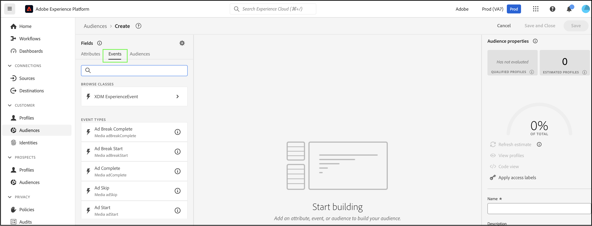
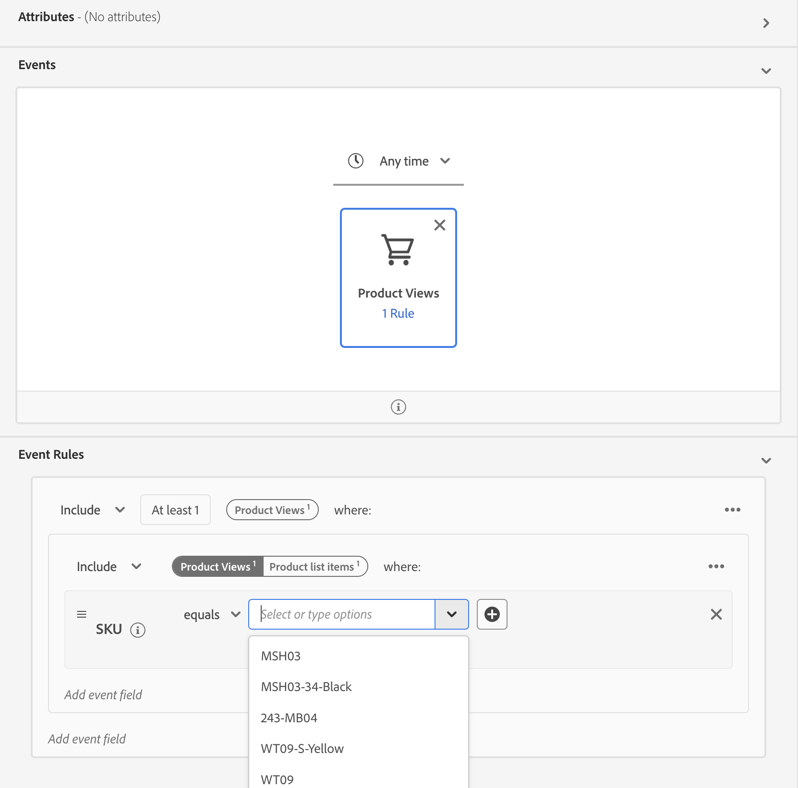

# 使用[!DNL Commerce]事件資料在Real-Time CDP中建立對象

使用從您的[!DNL Commerce]存放區擷取的事件資料，在Real-Time CDP中建立對象。 擷取的資料會根據瀏覽行為、過去的購買、設定檔屬性、轉換或流失的傾向、忠誠度狀態、高和低客戶價值等。

## 我應考慮使用哪些資料？

使用店面、後台和設定檔事件的資料，在Real-Time CDP中建立對象。

| 資料型別 | 店面資料（行為事件） | 後台資料（伺服器端事件） | 客戶設定檔和區段資料 |
|---|---|---|---|
| **定義** | 客戶在您網站上採取的點按或動作。 | 生命週期相關資訊和每個訂單（過去和目前）的詳細資訊。 | 您的購物者是誰，以及他們符合哪些區段的資格。 |
| 由Adobe Commerce擷取的&#x200B;**個事件** | `productPageView` `addToCart` | `placeOrder` `orderplaced` `orderLineItemRefunded` `order Canceled` `order history` | `createAccount` `editAccount` `Profile Record` |

## 其他客戶都取得了哪些成就？

Adobe [!DNL Commerce]客戶透過啟用Real-Time CDP中建置的受眾並將其部署至其[!DNL Commerce]執行個體，已取得顯著的業務影響。

retailer實現了全球性的多品牌服飾：

- 擁有數百萬個統一客戶設定檔的單一信任來源
- 建立40多個「高意圖客戶」的不重複受眾，以跨管道參與

一家全球飲料公司收集到：

- 來自100多個國家/地區的9,800萬個客戶設定檔

## 讓我們開始吧

在本文中，您將瞭解如何：

- 根據事件收集的[!DNL Commerce]資料在Real-Time CDP中建立對象
- 啟用您[!DNL Commerce]存放區的對象
- 在[!DNL Commerce]中使用對象來通知購物車價格規則

>[!IMPORTANT]
>
>使用您的[!DNL Commerce]沙箱環境完成本文所述的工作。 這可確保您傳送至Experience Platform的店面和後台事件資料不會稀釋您的生產事件資料。

### 先決條件

開始之前，請確定：

- 您已布建為可使用Real-Time CDP。 如果您不確定，請洽詢您的系統整合商或管理專案和環境的開發團隊。
- 您[已安裝](install.md)且[已設定](connect-data.md) [!DNL Commerce]中的[!DNL Data Connection]延伸模組。
- 您[已確認](connect-data.md#confirm-that-event-data-is-collected)您的[!DNL Commerce]事件資料已送達Experience Platform Edge。

### &#x200B;1. 建立對象

受眾是一組具有類似行為或特徵的客戶。 在本練習中，您會建立受眾，使對您商店中特定產品感興趣的人員符合資格。

若要簡化此練習，請使用`productPageView`事件的事件資料。 此事件會擷取有關已檢視產品的詳細資訊，例如產品名稱、SKU、價格等。

使用此事件資料可指定對象包含至少有一個「產品檢視」事件的個人，其中SKU （產品識別碼）等於網站上的特定產品，且該事件發生在前一天。 &#x200B;

1. 開啟Experience Platform，然後從左側導覽選單中選取&#x200B;**[!UICONTROL Audiences]**。

   

1. 按一下&#x200B;**[!UICONTROL Create Audience]**。

   

   The **Segment Builder** workspace displays.

1. In the **Segment Builder** workspace, select the **Build rule** creation method.

   

   The **Segment Builder** workspace is where you define the rules and conditions for your audience.&#x200B; These rules and conditions are based on event and profile data from your Commerce store and define the criteria that determine whether a user qualifies for the audience. For example, you might create a rule that includes users who have viewed a specific product, or users that have made a purchase within a certain time frame. Learn more about [Segment Builder](https://experienceleague.adobe.com/zh-hant/docs/experience-platform/segmentation/ui/segment-builder) and rules and conditions.

1. Select the [Events](https://experienceleague.adobe.com/zh-hant/docs/experience-platform/segmentation/ui/segment-builder#events) tab.

   

1. Search for the &quot;Product Views&quot; event type. Then, drag and drop it into the **Segment Builder** workspace.

1. Return to the **Events** tab and search for &quot;SKU&quot;, which is data field under the `productListItems` field. Drag and drop it to the **Segment Builder** workspace on top of the **Product View** event.

   The **Event Rules** section displays where you can specify the specific product you want to build your audience off of.

   

1. Set the time interval to one day by clicking on **Any Time** and selecting *In last* with a value of *1*.

   When building an audience, you can specify a time interval to capture recent activity. Setting a time interval allows you to target users based on their recent interactions or behaviors within a specific timeframe.

1. In the **Audience Properties** section on the right-hand side of the workspace, set the audience properties by providing a name, description, and evaluation method for the audience.

1. To save the audience, click **[!UICONTROL Save and Close]**.

   The details of your audience displays on the **Audience** dashboard.

### 2. Activate the audience to the [!DNL Commerce] destination

You make an audience available in [!DNL Commerce] by activating it for the [!DNL Commerce] destination.

>[!IMPORTANT]
>
>If you have not already set [!DNL Commerce] as an available destination to receive data, see the [Adobe [!DNL Commerce] Connection](https://experienceleague.adobe.com/zh-hant/docs/experience-platform/destinations/catalog/personalization/adobe-commerce) topic.

1. 在您對象的&#x200B;**詳細資料**&#x200B;標籤中，按一下&#x200B;**啟用至目的地**。

1. 選取您的[!DNL Commerce]目的地。 然後，按一下&#x200B;**下一步**。

1. 按一下&#x200B;**[!UICONTROL Finish]**&#x200B;完成啟動程式。

## &#x200B;3. 在對象控制面板中檢視對象

在[!DNL Commerce]中，您可以使用&#x200B;**Real-Time CDP Audiences**&#x200B;儀表板，檢視可為您的[!DNL Commerce]執行個體個人化的所有[作用中](https://experienceleague.adobe.com/zh-hant/docs/experience-platform/destinations/ui/activate/activate-edge-personalization-destinations)對象。

若要存取&#x200B;**Real-Time CDP Audiences**&#x200B;儀表板，請前往&#x200B;_管理員_&#x200B;側邊欄，然後前往&#x200B;**[!UICONTROL Customers]** > **[!UICONTROL Real-time CDP Audience]**。

在控制面板中，尋找您建立的對象。 請注意，購物車價格規則或動態區塊中並未使用它。 在下一節中，您會將對象連結至購物車價格規則。

### &#x200B;4. 根據對象建立購物車價格規則

本節說明如何根據新對象建立購物車價格規則。

1. 確認您的新對象顯示在&#x200B;**Real-Time CDP Audiences**&#x200B;儀表板中。
1. [建立購物車價格規則](https://experienceleague.adobe.com/zh-hant/docs/commerce-admin/marketing/promotions/cart-rules/price-rules-cart-create)。
1. [使用您的新對象設定購物車價格規則的條件](https://experienceleague.adobe.com/zh-hant/docs/commerce-admin/marketing/promotions/cart-rules/price-rules-cart-create#use-real-time-cdp-audiences-to-set-a-condition)。
1. [設定當產品加入購物車時要發生的動作](https://experienceleague.adobe.com/zh-hant/docs/commerce-admin/marketing/promotions/cart-rules/price-rules-cart-create#step-3-define-the-actions)。
1. 繼續設定購物車價格規則。
1. 前往沙箱執行個體的客戶檢視。
1. 將您根據對象的產品新增至購物車。 請注意，購物車價格規則已啟用。

## 總結

在本練習中，您已在Real-Time CDP中建立受眾，並將其啟動至[!DNL Commerce]目的地。 然後，在[!DNL Commerce]管理員中，您根據該對象建立了購物車價格規則，並在您的沙箱環境中啟用了規則。
