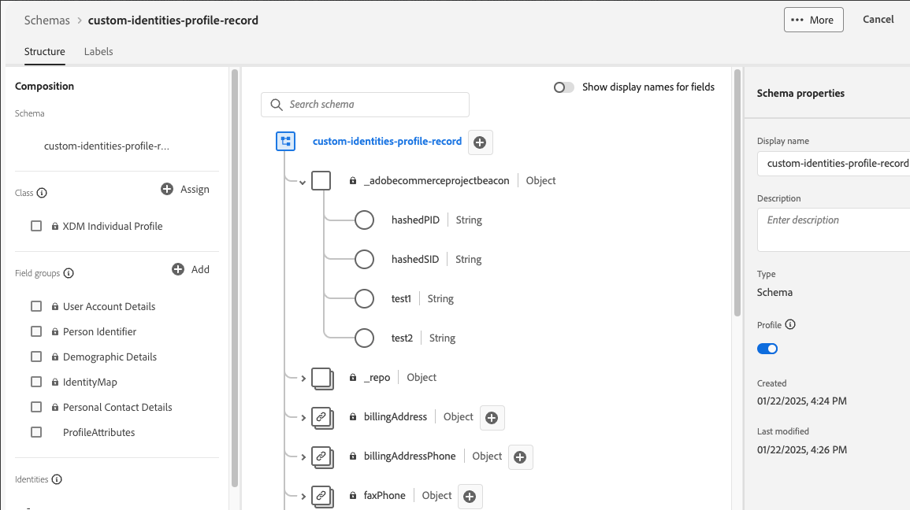

# 將自訂屬性新增到設定檔

自訂設定檔屬性可讓您使用預設`customerId`和`emailId`以外的其他識別碼，在Experience Platform中增強客戶設定檔識別。 這些額外的識別碼可讓客戶配對更精確，並改善Commerce平台與Experience Platform之間的資料整合。

>[!NOTE]
>
>瞭解如何[新增自訂屬性](custom-attributes.md)至訂單。

## 優點

- 使用多個識別碼以更符合客戶。
- 根據您的業務需求，將自訂欄位對應至身分屬性。
- 減少重複的設定檔，並改善客戶資料的準確性。
- 啟用更具針對性的客戶體驗。

## 先決條件

在實作自訂身分識別屬性之前，請確定您：

- [安裝資料連線擴充功能](install.md)
- [連線至Adobe Experience Platform](connect-data.md)
- [傳送客戶設定檔資料](connect-data.md#send-customer-profile-data)

## 步驟1：設定Experience Platform綱要

1. 登入Adobe Experience Platform並選取您的Commerce結構描述。
1. [在根層級新增自訂身分識別欄位](https://experienceleague.adobe.com/zh-hant/docs/experience-platform/xdm/ui/resources/schemas?lang=en#custom-fields-for-standard-groups)：
   - `hashedPID` （字串） — 主要身分雜湊
   - `hashedSID` （字串） — 次要身分雜湊
   - `primaryID` （字串） — 主要身分欄位名稱
   - `secondaryID` （字串） — 次要身分欄位名稱



>[!NOTE]
>
>您可以根據自己的需求，自訂確切的欄位名稱。 範例使用`hashedPID`和`hashedSID`做為身分欄位。

## 步驟2：建立處理器類別

在自訂模組中建立下列PHP處理器類別：

### AddressCustomHashedId類別

此處理器會針對客戶地址雜湊`parent_id`和`entity_id`。

```php
<?php declare(strict_types=1);

namespace Magento\AepCustomerCustomAttributes\Event;
use Magento\AdobeCommerceEventsClient\Event\Event;
use Magento\AdobeCommerceEventsClient\Event\Processor\EventDataProcessorInterface;

class AddressCustomHashedId implements EventDataProcessorInterface
{
    public function process(Event $event, array $eventData): array
    {
        $pid = $eventData['parent_id'] ?? '';
        $sid = $eventData['entity_id'] ?? '';

        $eventData['profileAttributes']['hashedPID'] = hash('sha256', (string)$pid);
        $eventData['profileAttributes']['hashedSID'] = hash('sha256', (string)$sid);
        return $eventData;
    }
}
```

### AddressCustomId類別

此處理器會設定位址事件的主要與次要ID欄位名稱。

```php
<?php declare(strict_types=1);

namespace Magento\AepCustomerCustomAttributes\Event;
use Magento\AdobeCommerceEventsClient\Event\Event;
use Magento\AdobeCommerceEventsClient\Event\Processor\EventDataProcessorInterface;

class AddressCustomId implements EventDataProcessorInterface
{
    public function process(Event $event, array $eventData): array
    {
        $eventData['profileAttributes']['primaryID'] = 'hashedPID';
        $eventData['profileAttributes']['secondaryID'] = 'hashedSID';

        // Ensure both IDs are present, otherwise, Commerce will default primary to customerId and secondary to emailId
        if (empty($eventData['profileAttributes']['primaryID']) || empty($eventData['profileAttributes']['secondaryID'])) {
            $eventData['profileAttributes']['primaryID'] = $eventData['customerId'] ?? '';
            $eventData['profileAttributes']['secondaryID'] = $eventData['email'] ?? '';
        }

        return $eventData;
    }
}
```

### CustomHashedId類別

此處理器會針對客戶設定檔雜湊`entity_id`和`email`。

```php
<?php declare(strict_types=1);

namespace Magento\AepCustomerCustomAttributes\Event;
use Magento\AdobeCommerceEventsClient\Event\Event;
use Magento\AdobeCommerceEventsClient\Event\Processor\EventDataProcessorInterface;

class CustomHashedId implements EventDataProcessorInterface
{
    public function process(Event $event, array $eventData): array
    {
        $pid = $eventData['entity_id'] ?? '';
        $sid = $eventData['email'] ?? '';

        $eventData['profileAttributes']['hashedPID'] = hash('sha256', (string)$pid);
        $eventData['profileAttributes']['hashedSID'] = hash('sha256', (string)$sid);
        return $eventData;
    }
}
```

### CustomId類別

此處理器會設定設定檔事件的主要與次要ID欄位名稱。

```php
<?php declare(strict_types=1);

namespace Magento\AepCustomerCustomAttributes\Event;
use Magento\AdobeCommerceEventsClient\Event\Event;
use Magento\AdobeCommerceEventsClient\Event\Processor\EventDataProcessorInterface;

class CustomId implements EventDataProcessorInterface
{
    public function process(Event $event, array $eventData): array
    {
        $eventData['profileAttributes']['primaryID'] = 'hashedPID';
        $eventData['profileAttributes']['secondaryID'] = 'hashedSID';

        // Ensure both IDs are present, otherwise, Commerce will default primary to customerId and secondary to emailId
        if (empty($eventData['profileAttributes']['primaryID']) || empty($eventData['profileAttributes']['secondaryID'])) {
            $eventData['profileAttributes']['primaryID'] = $eventData['customerId'] ?? '';
            $eventData['profileAttributes']['secondaryID'] = $eventData['email'] ?? '';
        }

        return $eventData;
    }
}
```

>[!NOTE]
>確定已在事件資料中傳送`primaryID`和`secondaryID`。 如果缺少其中一項，Commerce會預設為：
>
>- primaryID = customerId
>- secondaryID = emailId

>[!BEGINSHADEBOX]

完成這兩個步驟後：

- 您在Experience Platform中的Commerce結構描述可以正確擷取您設定檔事件資料的自訂身分。
- Commerce PHP程式碼中的處理器類別會從設定檔事件收集自訂識別資訊。

現在，從Commerce傳送的任何設定檔事件資料，都會包含您的自訂身分識別資訊。

>[!ENDSHADEBOX]

## 資料格式範例

下列範例示範自訂身分屬性的預期JSON結構，包括設定檔屬性和完整客戶設定檔資料格式。

### 設定檔屬性格式

```json
{
  "profileAttributes": {
    "hashedPID": "d80eae6e96d148b3b2abbbc6760077b66c4ea071f847dab573d507a32c4d99a5",
    "hashedSID": "fa7359e288ce3104bd4317a4fb75f08c4a5feec472de2e415b8260fb3567ebe6",
    "warehousecode": "1256",
    "method": "ina2354",
    "source": "commerce",
    "primaryID": "hashedPID",
    "secondaryID": "hashedSID"
  }
}
```

### 完成客戶設定檔結構

```json
{
  "id": 137,
  "entity_id": "137",
  "created_at": "2025-02-10 20:10:30",
  "updated_at": "2022-02-10 20:10:31",
  "email": "customer@example.com",
  "firstname": "John",
  "lastname": "Doe",
  "dob": "2007-10-01 00:00:00",
  "profileAttributes": {
    "hashedPID": "d80eae6e96d148b3b2abbbc6760077b66c4ea071f847dab573d507a32c4d99a5",
    "hashedSID": "fa7359e288ce3104bd4317a4fb75f08c4a5feec472de2e415b8260fb3567ebe6",
    "primaryID": "137",
    "secondaryID": "customer@example.com"
  },
  "_metadata": {
    "commerceEdition": "Adobe Commerce",
    "commerceVersion": "2.4.6",
    "eventsClientVersion": "1.9.0",
    "storeId": "1",
    "websiteId": "1",
    "storeGroupId": "1",
    "websiteCode": "base",
    "storeCode": "default",
    "storeViewCode": "main_website_store"
  }
}
```

## 疑難排解

### 缺少primaryID或secondaryID

- **症狀：**&#x200B;資料預設為customerId/emailId，而非自訂值。
- **解決方案：**&#x200B;確定`primaryID`和`secondaryID`皆已在`profileAttributes`物件中設定。

### 無效的雜湊值

- **症狀：**&#x200B;雜湊值為空白或格式錯誤。
- **解決方案：**&#x200B;在雜湊處理之前，請確認來源欄位(`parent_id`、`entity_id`、`email`)包含有效的資料。

### 處理器無法執行

- **症狀：**&#x200B;自訂屬性未出現在事件資料中。
- **解決方案：**&#x200B;檢查`events.xml`中的處理器是否已正確註冊，且模組已啟用。

### Experience Platform結構描述不相符

- **症狀：**&#x200B;資料未出現在Experience Platform或結構描述驗證錯誤中。
- **解決方案：**&#x200B;請確定Experience Platform結構描述包含具有正確資料型別的自訂身分識別欄位。
