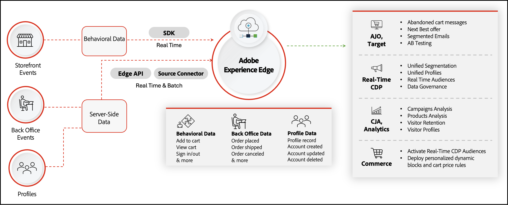

# [!DNL Data Connection]簡介

>[!IMPORTANT]
>
>Experience Platform聯結器已重新命名為[!DNL Data Connection]。

[!DNL Data Connection]擴充功能會將您的Adobe Commerce Web執行個體連線至Adobe Experience Platform和Edge Network。 對於行動應用程式開發人員而言，您可以搭配使用Adobe Experience Platform Mobile SDK與Commerce，擷取Commerce資料並將其傳送至Experience Platform。 [了解更多](./mobile-sdk-epc.md)。

多網站商戶可針對每個網站設定適用的[!DNL Data Connection]設定，包括Experience Platform沙箱選擇。 檢視全域與網站範圍欄位的[將Commerce資料連線至Adobe Experience Platform](connect-data.md#configuration-scope)。

您的Commerce商店包含豐富的資料。 有關您的購物者如何瀏覽、檢視及最終在您網站上購買產品的資訊，可揭示建立更個人化購物體驗的機會。 雖然這些資料可通知購物車價格規則等原生Commerce功能和動態區塊，但資料仍會定位於您的Commerce執行個體中。

Adobe Experience Platform提供了一套技術，可在與Commerce商店中的資料結合後，透過Edge Network將該資料發佈到其他Adobe DX產品，以解鎖有關購物者購買行為的洞察資訊。 透過這些深入分析，您可以跨所有管道建立更加個人化的購物體驗。

下圖顯示當已安裝並設定[!DNL Data Connection]擴充功能時，您的Commerce資料如何從您的商店傳輸至其他Adobe DX產品。

在上圖中，您的行為、後端辦公室和客戶設定檔資料會使用SDK、API和來源聯結器傳送至Experience Platform Edge。 您不需要完全瞭解這些元件的運作方式，因為擴充功能可處理資料共用的複雜性。 當事件資料位於邊緣時，您可以將其用於下游Adobe DX產品，例如[Real-Time CDP](https://experienceleague.adobe.com/docs/experience-platform/rtcdp/intro/rtcdp-intro/overview.html?lang=zh-Hant)、[Customer Journey Analytics](https://experienceleague.adobe.com/docs/analytics-platform/using/cja-overview/cja-overview.html?lang=zh-Hant)、[Adobe Analytics](https://experienceleague.adobe.com/docs/analytics/analyze/admin-overview/analytics-overview.html?lang=zh-Hant)和[Journey Optimizer](https://experienceleague.adobe.com/docs/journey-optimizer/using/get-started/get-started.html?lang=zh-Hant)。 如需引導式範例，請參閱[使用Adobe Journey Optimizer傳送放棄的購物車電子郵件](using-ajo.md)和[使用Commerce事件資料在Real-Time CDP中建立對象](create-audience.md)。

## 將Experience Platform資料提取回Commerce

使用[!DNL Data Connection]擴充功能將Commerce資料傳送至Experience Platform是Commerce資料共用功能的一面。 另一邊是選用的擴充功能，稱為[Audience Activation](https://experienceleague.adobe.com/docs/commerce-admin/customers/audience-activation.html?lang=zh-Hant)。 此擴充功能可讓您在Real-Time CDP中建立受眾，並將這些受眾部署至您的Commerce商店，以告知購物車價格規則、相關產品規則及動態區塊。

從高層面來看，從Commerce存放區到Experience Platform，然後透過Audience Activation擴充功能回頭的資料流程如下所示：

![[!DNL Data Connection]流量](assets/data-connection.png)

在您設定Commerce與Experience Platform以及Experience Platform與Commerce之間的連線後，資料會繼續流動。 除非升級時需要，否則您不需要重新連線。

## 概念

在這兩個系統之間共用資料需要您瞭解數個概念。

- **資料型別** — [!DNL Data Connection]會從瀏覽器收集&#x200B;**行為（店面）**&#x200B;資料、從Commerce伺服器收集&#x200B;**後台**&#x200B;資料，以及&#x200B;**設定檔**&#x200B;資料。 管理員標籤店面集合&#x200B;**店面活動**。 如需完整分類法，請參閱[Commerce資料型別](data-ingestion.md)。

- **行為（店面）資料** — 從網站上的購物者互動擷取，例如`addToCart`、`pageView`、`startCheckout`和`completeCheckout`。 檢視[店面活動](events.md#storefront-events)。

- **後台資料** — 已在Commerce伺服器上擷取，包括[訂單狀態](events-backoffice.md#order-status)事件，例如[`orderPlaced`](events-backoffice.md#orderplaced)和[`orderShipped`](events-backoffice.md#ordershipmentcompleted)。 檢視[後台活動](events-backoffice.md)。

- **設定檔記錄** — 在Commerce中建立購物者設定檔時傳送的快照資料。 檢視[設定檔記錄](events-profilerecord.md)和[更新設定檔記錄結構描述](profile-data.md)。

- **設定檔事件** — 伺服器上設定檔生命週期變更的時間序列事件。 檢視[客戶設定檔事件](events-backoffice.md#customer-profile-events)。

- **Experience Platform和Edge Network** — 大部分Adobe DX產品的資料倉儲。 傳送至Experience Platform的資料會透過Experience Platform Edge Network傳播至Adobe DX產品。 例如，您可以啟動Journey Optimizer、從邊緣擷取您的特定Commerce事件資料，以及在Journey Optimizer中建立捨棄的購物車電子郵件。 如果Commerce商店中有任何放棄的購物車，Journey Optimizer就可以傳送該電子郵件。 深入瞭解[Experience Platform和Edge Network](https://experienceleague.adobe.com/docs/platform-learn/data-collection/web-sdk/overview.html?lang=zh-Hant)。

- **結構描述** — 結構描述描述正在傳送的資料結構。 在Experience Platform可以擷取Commerce資料之前，您必須撰寫結構描述資料結構，並為每個欄位可包含的資料型別提供限制。 結構描述包含一個基底類別和零個或多個結構描述欄位群組。 此結構描述會使用XDM結構，所有Adobe DX產品都可以讀取此結構。 結構描述可確保所有DX產品都能瞭解傳送至Experience Platform的資料。 深入瞭解[結構描述](https://experienceleague.adobe.com/docs/experience-platform/xdm/home.html?lang=zh-Hant)。

- **資料集** — 資料集合的儲存和管理結構，通常是包含結構描述（欄）和欄位（列）的表格。 資料集也包含中繼資料，可說明其儲存資料的各個層面。 所有成功擷取至Adobe Experience Platform的資料都包含在資料集中。 深入瞭解[資料集](https://experienceleague.adobe.com/docs/experience-platform/catalog/datasets/overview.html?lang=zh-Hant)。

- **資料串流** — 可讓資料從Adobe Experience Platform流向其他Adobe DX產品的ID。 此ID必須與您特定Adobe Commerce執行個體中的特定網站相關聯。 當您建立此資料流時，請指定您在上面建立的XDM結構描述。 深入瞭解[資料串流](https://experienceleague.adobe.com/docs/experience-platform/datastreams/overview.html?lang=zh-Hant)。

## 支援的架構

[!DNL Data Connection]擴充功能適用於下列架構：

- PHP/Luma
- [PWA Studio](https://developer.adobe.com/commerce/pwa-studio/integrations/adobe-commerce/aep/)
- [AEM](https://experienceleague.adobe.com/docs/experience-manager-cloud-service/content/content-and-commerce/integrations/aep.html?lang=zh-Hant)

>[!BEGINSHADEBOX]

## 先決條件

若要使用[!DNL Data Connection]擴充功能，您必須具備下列條件：

- Adobe Commerce 2.4.4或更新版本
- Adobe ID和組織ID
- 收集店面事件資料所需的[Adobe使用者端資料層(ACDL)](https://experienceleague.adobe.com/docs/experience-platform/tags/extensions/client/client-data-layer/overview.html?lang=zh-Hant)
- 其他Adobe DX產品的權益。

>[!ENDSHADEBOX]

## 啟用擴充功能 {#enable-extension}

從高層面來看，啟用[!DNL Data Connection]擴充功能包含下列步驟：

1. [安裝](install.md) [!DNL Data Connection]延伸模組。
1. [登入](https://helpx.adobe.com/tw/manage-account/using/access-adobe-id-account.html)您的Adobe帳戶，並[檢視以確認](https://experienceleague.adobe.com/docs/core-services/interface/administration/organizations.html?lang=zh-Hant#concept_EA8AEE5B02CF46ACBDAD6A8508646255)您的組織識別碼。 組織ID是與已布建Experience Cloud公司相關聯的ID。 此ID是24個字元的英數字串，後面接著（而且必須包含） `@AdobeOrg`。
1. 確定您擁有Experience Platform[&#128279;](https://experienceleague.adobe.com/docs/experience-platform/collection/permissions.html?lang=zh-Hant)中資料收集的許可權。
1. 檢閱您可以收集及傳送的[資料型別](data-ingestion.md)。
1. 使用Commerce特定的欄位群組建立或更新您的[時間序列事件結構描述](update-xdm.md)或[設定檔記錄資料結構描述](profile-data.md)。
1. [根據您建立或更新的結構描述建立資料集](https://experienceleague.adobe.com/docs/platform-learn/implement-mobile-sdk/experience-cloud/platform.html?lang=zh-Hant#create-a-dataset)。 此資料集包含傳送至Experience Platform Edge的Commerce資料。
1. [建立資料流](https://experienceleague.adobe.com/docs/experience-platform/datastreams/overview.html?lang=zh-Hant)並選取包含Commerce特定欄位群組的XDM結構描述。
1. [連線到Commerce服務](../landing/saas.md)。
1. [連線到Adobe Experience Platform](connect-data.md)。

本指南的其餘部分將更詳細地引導您完成所有這些步驟，以便您快速入門，並開始在您的Commerce商店中使用Adobe DX產品的強大功能。

>[!NOTE]
>
>針對行動開發人員瞭解如何[整合](./mobile-sdk-epc.md) Adobe Experience Platform Mobile SDK與Commerce。

## HIPAA整備

[!DNL Data Connection]擴充功能可讓您與Experience Platform共用[!DNL Commerce]個後台資料，並維持HIPAA合規性。 [了解更多](hipaa-readiness.md)。

## 客群

本指南是專為想要豐富及個人化Commerce商店，以提升客戶購物體驗的Adobe Commerce商家所設計。

## 支援

如果您需要本指南未涵蓋的資訊或問題，請使用下列資源：

- [說明中心](https://experienceleague.adobe.com/docs/commerce-knowledge-base/kb/overview.html?lang=zh-Hant){target="_blank"}
- [支援票證](https://experienceleague.adobe.com/docs/commerce-knowledge-base/kb/help-center-guide/magento-help-center-user-guide.html?lang=zh-Hant#submit-ticket){target="_blank"} — 提交票證以接收其他說明。
