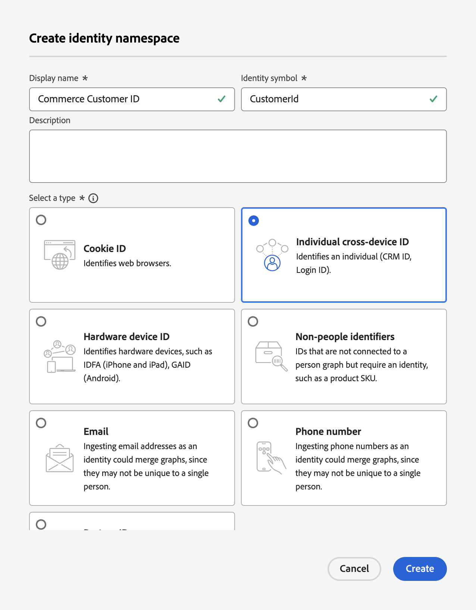

# 更新Commerce資料擷取的設定檔記錄結構描述

當您的購物者在您的Commerce網站中建立設定檔時，會建立設定檔記錄並擷取資料。 您必須先建立該設定檔記錄專屬的結構描述和資料集，才能將該設定檔資料串流至Experience Platform。

1. [建立](https://experienceleague.adobe.com/en/docs/experience-platform/xdm/ui/resources/schemas)結構描述，並將類別設定為&#x200B;**個別設定檔**。

1. [新增](https://experienceleague.adobe.com/en/docs/experience-platform/xdm/ui/resources/schemas)下列設定檔特定欄位群組：

   - identityMap
   - 人口統計細節
   - 個人聯絡詳細資訊
   - 使用者帳戶詳細資訊

1. [為設定檔啟用](https://experienceleague.adobe.com/en/docs/experience-platform/xdm/ui/resources/schemas)結構描述。

   為設定檔啟用結構描述時，從此結構描述建立的任何資料集都會參與Real-Time CDP，其會合併來自不同來源的資料，以建構每個客戶的完整檢視。

1. [根據您建立或更新的結構描述建立資料集](https://experienceleague.adobe.com/en/docs/platform-learn/implement-mobile-sdk/experience-cloud/platform)。

   資料集是資料集合的儲存和管理結構，通常是包含結構（欄）和欄位（列）的表格。 資料集也包含中繼資料，可說明其儲存資料的各個層面。

1. 使用以下值在Experience Platform中建立[自訂名稱空間](https://experienceleague.adobe.com/en/docs/experience-platform/identity/features/namespaces#create-namespaces)：

   - **顯示名稱**： _Commerce客戶ID_
   - **身分識別符號**： _CustomerId_
   - **型別**： _個別跨裝置識別碼_

   {width="700" zoomable="yes"}

   按一下&#x200B;**[!UICONTROL Create]**。 整合設定檔服務會使用自訂名稱空間來拼接設定檔片段。

針對客戶設定檔記錄資料設定的結構描述、資料集和自訂名稱空間後，您可以[設定](connect-data.md#data-collection)您的Commerce執行個體，以收集該資料並傳送至Experience Platform。

若要建立行為與後台事件資料的結構描述、資料集和資料流，請參閱[更新Commerce資料擷取的時間序列事件結構描述](update-xdm.md)。
