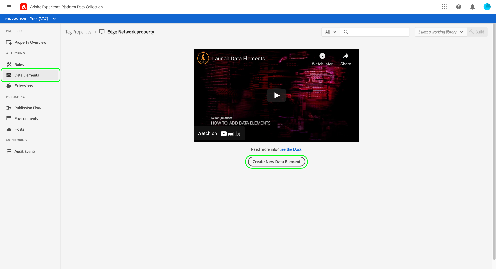
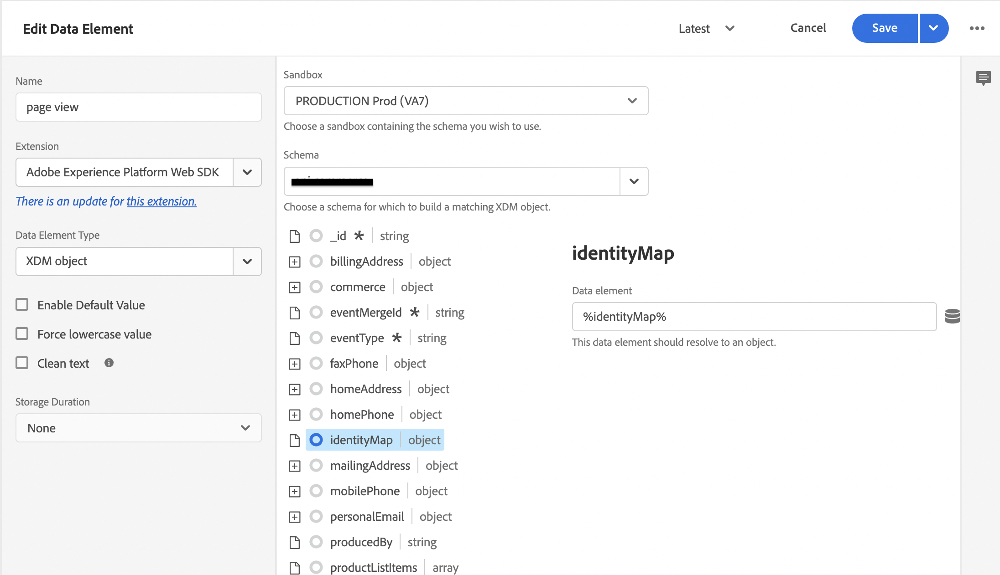

# 使用Adobe Experience Platform標籤收集Commerce資料

雖然您可以使用[!DNL Data Connection]擴充功能來發佈及訂閱店面活動，但有些商家可能已經在使用資料收集解決方案，例如[Adobe Experience Platform標籤](https://experienceleague.adobe.com/docs/platform-learn/data-collection/tags/create-a-property.html?lang=zh-Hant)。 對於這些商家，Adobe Commerce會在使用Adobe Commerce Event SDK的[!DNL Data Connection]擴充功能中提供僅發佈選項。

![[!DNL Data Connection]擴充功能資料流程](assets/tags-data-flow.png)
_[!DNL Data Connection]含標籤的擴充功能資料流程_

在本主題中，您將瞭解如何將[!DNL Data Connection]擴充功能提供的店面事件值，對應到您已在使用的Adobe Experience Platform標籤解決方案。

## 從Adobe Commerce收集事件資料

若要收集Commerce事件資料：

- 安裝[Adobe Commerce活動SDK](https://github.com/adobe/commerce-events/tree/main/packages/storefront-events-sdk)。 若為PHP店面，請參閱[安裝](install.md)主題。 如需PWA Studio店面資訊，請參閱[PWA Studio指南](https://developer.adobe.com/commerce/pwa-studio/integrations/adobe-commerce/aep/)。

  >[!NOTE]
  >
  > 請&#x200B;**不** [設定](connect-data.md)組織ID和資料流ID。

## 將Commerce店面資料對應至Adobe Experience Platform

若要將Commerce店面資料對應至Adobe Experience Platform，請從Adobe Experience Platform標籤中設定並安裝下列專案：

1. [在Adobe Experience Platform資料彙集中設定標籤屬性](https://experienceleague.adobe.com/docs/platform-learn/implement-in-websites/configure-tags/create-a-property.html?lang=zh-Hant)。

1. 在&#x200B;**製作**&#x200B;下，選取&#x200B;**擴充功能**，然後安裝並設定下列擴充功能：

   - [Adobe使用者端資料層](https://experienceleague.adobe.com/docs/experience-platform/tags/extensions/client/client-data-layer/overview.html?lang=zh-Hant)

   - [Adobe Experience Platform Web SDK](https://experienceleague.adobe.com/docs/experience-platform/edge/fundamentals/installing-the-sdk.html?lang=zh-Hant)

1. [發佈標籤](https://experienceleague.adobe.com/docs/experience-platform/tags/publish/overview.html?lang=zh-Hant)至您的開發環境。

1. 請依照下列&#x200B;**事件對應**&#x200B;步驟來設定特定事件的資料元素和規則。

### 事件對應

使用標籤進行資料收集與使用Adobe Commerce事件SDK不同，因此瞭解這兩個架構中使用的對等辭彙很重要。

| Adobe Experience Platform標籤辭彙 | Adobe Commerce事件SDK辭彙 |
|---|---|
| _個資料元素_ | 內容 |
| _規則_ | 事件 |
|  | _規則條件_ — 事件接聽程式（來自ACDL）<br><br>_規則動作_ — 事件處理常式(傳送至Adobe Experience Platform) |

使用Adobe Commerce專屬的事件資料更新Adobe Experience Platform標籤中的資料元素和規則時，建議您採取一些常見步驟。

例如，將Adobe Commerce `signOut`事件新增至Adobe Experience Platform標籤。 除了您設定的特定值外，以下概述的步驟會說明如何新增[資料元素](https://experienceleague.adobe.com/docs/experience-platform/collection/e2e.html?lang=zh-Hant#data-element)和[規則](https://experienceleague.adobe.com/docs/experience-platform/collection/e2e.html?lang=zh-Hant#create-a-rule)，這些規則會套用至您新增至標籤的所有Adobe Commerce事件。

1. 建立資料元素：

   
   _建立新資料元素_

1. 將&#x200B;**名稱**&#x200B;設為`sign out`。

1. 將&#x200B;**延伸模組**&#x200B;設為`Adobe Experience Platform Web SDK`。

1. 將&#x200B;**資料元素型別**&#x200B;設定為`XDM object`。

1. 選取您要更新的&#x200B;**沙箱**&#x200B;和&#x200B;**結構描述**。

1. 在&#x200B;**userAccount** > **登出**&#x200B;底下，將&#x200B;**訪客登出**&#x200B;中的&#x200B;**值**&#x200B;設定為`1`。

   
   _更新登出值_

1. 選取&#x200B;**儲存**。

1. 建立規則：

   
   _建立新規則_

1. 選取&#x200B;**EVENTS**&#x200B;下的&#x200B;**新增**。

1. 將&#x200B;**延伸模組**&#x200B;設為`Adobe Client Data Layer`。

1. 將&#x200B;**事件型別**&#x200B;設定為`Data Pushed`。

1. 選取&#x200B;**特定事件**&#x200B;並設定&#x200B;**事件/金鑰以註冊**&#x200B;至`sign-out`。

1. 選取&#x200B;**保留變更**&#x200B;以儲存新規則。

1. 新增動作。

1. 將&#x200B;**延伸模組**&#x200B;設為`Adobe Experience Platform Web SDK`。

1. 將&#x200B;**動作型別**&#x200B;設定為`Send Event`。

1. 將&#x200B;**執行個體**&#x200B;設定為`Alloy`。

1. 將&#x200B;**Type**&#x200B;設定為`userAccount.logout`。

1. 將&#x200B;**XDM資料**&#x200B;設為`%sign out%`。

1. 按一下&#x200B;**儲存**。

   您在結構描述中為Adobe Commerce的`signOut`事件建立了資料元素。 此外，您已建立具有特定動作的規則，當從Adobe Commerce店面引發該事件時，應該就會發生該規則。

針對底下所述的每個Adobe Commerce事件，在標籤中重複上述步驟。

## 可用事件

請依照上述步驟，針對下列各個事件，將Adobe Commerce事件對應至您的XDM。

- [&#39;登出&#39;](#signout)
- [&#39;登入&#39;](#signin)
- [&#39;createAccount&#39;](#createaccount)
- [&#39;editAccount&#39;](#editaccount)
- [&#39;頁面檢視&#39;](#pageview)
- [&#39;產品檢視&#39;](#productview)
- [&#39;searchRequestSent&#39;](#searchrequestsent)
- [&#39;searchResponseReceived&#39;](#searchresponsereceived)
- [&#39;addToCart&#39;](#addtocart)
- [&#39;openCart&#39;](#opencart)
- [&#39;檢視購物車&#39;](#viewcart)
- [&#39;removeFromCart&#39;](#removefromcart)
- [&#39;initiateCheckout&#39;](#initiatecheckout)
- [&#39;下單&#39;](#placeorder)

### 登出

購物者嘗試登出時觸發。

#### 資料元素

建立下列資料元素：

1. 登出：

   - **名稱**： `Sign out`
   - **副檔名**： `Adobe Experience Platform Web SDK`
   - **資料元素型別**： `XDM object`
   - **欄位群組**： `userAccount` > `logout`
   - **訪客登出**： **值** = `1`

#### 規則 

- **名稱**： `Sign out`
- **副檔名**： `Adobe Client Data Layer`
- **事件型別**： `Data Pushed`
- **特定事件**： `sign-out`

##### 動作

- **副檔名**： `Adobe Experience Platform Web SDK`
- **動作型別**： `Send event`
- **型別**： `userAccount.logout`
- **XDM資料**： `%sign-out%`

### 登入

購物者嘗試登入時觸發。

#### 資料元素

建立下列資料元素：

1. 帳戶電子郵件：

   - **名稱**： `account email`
   - **副檔名**： `Adobe Client Data Layer`
   - **資料元素型別**： `Data Layer Computed State`
   - **[選擇性]路徑**： `accountContext.emailAddress`

1. 帳戶型別：

   - **名稱**： `account type`
   - **副檔名**： `Adobe Client Data Layer`
   - **資料元素型別**： `Data Layer Computed State`
   - **[選擇性]路徑**： `accountContext.accountType`

1. 帳戶ID：

   - **名稱**： `account id`
   - **副檔名**： `Adobe Client Data Layer`
   - **資料元素型別**： `Data Layer Computed State`
   - **[選擇性]路徑***： `accountContext.accountId`

1. 登入：

   - **名稱**： `sign in`
   - **副檔名**： `Adobe Experience Platform Web SDK`
   - **資料元素型別**： `XDM object`
   - **欄位群組**： `person` > `accountID`
   - **帳戶識別碼**： **值** = `%account id%`
   - **欄位群組**： `person` > `accountType`
   - **帳戶型別**： **值** = `%account type%`
   - **欄位群組**： `person` > `personalEmailID`
   - **個人電子郵件地址**： **值** = `%account email%`
   - **欄位群組**： `personalEmail` > `address`
   - **位址**： **值** = `%account email%`
   - **欄位群組**： `userAccount` > `login`
   - **訪客登入**： **值** = `1`

#### 規則 

- **名稱**： `sign in`
- **副檔名**： `Adobe Client Data Layer`
- **事件型別**： `Data Pushed`
- **特定事件**： `sign-in`

##### 動作

- **副檔名**： `Adobe Experience Platform Web SDK`
- **動作型別**： `Send event`
- **型別**： `userAccount.login`
- **XDM資料**： `%sign in%`

### createAccount

購物者嘗試建立帳戶時觸發。

#### 資料元素

建立下列資料元素：

1. 帳戶電子郵件：

   - **名稱**： `account email`
   - **副檔名**： `Adobe Client Data Layer`
   - **資料元素型別**： `Data Layer Computed State`
   - **[選擇性]路徑**： `accountContext.emailAddress`

1. 帳戶型別：

   - **名稱**： `account type`
   - **副檔名**： `Adobe Client Data Layer`
   - **資料元素型別**： `Data Layer Computed State`
   - **[選擇性]路徑**： `accountContext.accountType`

1. 帳戶ID：

   - **名稱**： `account id`
   - **副檔名**： `Adobe Client Data Layer`
   - **資料元素型別**： `Data Layer Computed State`
   - **[選擇性]路徑**： `accountContext.accountId`

1. 建立帳戶：

   - **名稱**： `Create account`
   - **副檔名**： `Adobe Experience Platform Web SDK`
   - **資料元素型別**： `XDM object`
   - **欄位群組**： `person` > `accountID`
   - **帳戶識別碼**： **值** = `%account id%`
   - **欄位群組**： `person` > `accountType`
   - **帳戶型別**： **值** = `%account type%`
   - **欄位群組**： `person` > `personalEmailID`
   - **個人電子郵件地址**： **值** = `%account email%`
   - **欄位群組**： `personalEmail` > `address`
   - **位址**： **值** = `%account email%`
   - **欄位群組**： `userAccount` > `createProfile`
   - **帳戶設定檔建立**： **值** = `1`

#### 規則 

- **名稱**： `Create account`
- **副檔名**： `Adobe Client Data Layer`
- **事件型別**： `Data Pushed`
- **特定事件**： `create-account`

##### 動作

- **副檔名**： `Adobe Experience Platform Web SDK`
- **動作型別**： `Send event`
- **型別**： `userAccount.createProfile`
- **XDM資料**： `%create account%`

### editAccount

購物者嘗試編輯帳戶時觸發。

#### 資料元素

建立下列資料元素：

1. 帳戶電子郵件：

   - **名稱**： `account email`
   - **副檔名**： `Adobe Client Data Layer`
   - **資料元素型別**： `Data Layer Computed State`
   - **[選擇性]路徑**： `accountContext.emailAddress`

1. 帳戶型別：

   - **名稱**： `account type`
   - **副檔名**： `Adobe Client Data Layer`
   - **資料元素型別**： `Data Layer Computed State`
   - **[選擇性]路徑**： `accountContext.accountType`

1. 帳戶ID：

   - **名稱**： `account id`
   - **副檔名**： `Adobe Client Data Layer`
   - **資料元素型別**： `Data Layer Computed State`
   - **[選擇性]路徑**： `accountContext.accountId`

1. 編輯帳戶：

   - **名稱**： `Edit account`
   - **副檔名**： `Adobe Experience Platform Web SDK`
   - **資料元素型別**： `XDM object`
   - **欄位群組**： `person` > `accountID`
   - **帳戶識別碼**： **值** = `%account id%`
   - **欄位群組**： `person` > `accountType`
   - **帳戶型別**： **值** = `%account type%`
   - **欄位群組**： `person` > `personalEmailID`
   - **個人電子郵件地址**： **值** = `%account email%`
   - **欄位群組**： `personalEmail` > `address`
   - **位址**： **值** = `%account email%`
   - **欄位群組**： `userAccount` > `updateProfile`
   - **帳戶設定檔建立**： **值** = `1`

#### 規則

- **名稱**： `Edit account`
- **副檔名**： `Adobe Client Data Layer`
- **事件型別**： `Data Pushed`
- **特定事件**： `edit-account`

##### 動作

- **副檔名**： `Adobe Experience Platform Web SDK`
- **動作型別**： `Send event`
- **型別**： `userAccount.updateProfile`
- **XDM資料**： `%edit account%`

### pageView

任何頁面載入時觸發。

#### 資料元素

建立下列資料元素：

1. 頁面名稱：

   - **名稱**： `page name`
   - **副檔名**： `Adobe Client Data Layer`
   - **資料元素型別**： `Data Layer Computed State`
   - **[選擇性]路徑**： `pageContext.pageName`

#### 規則 

- **名稱**： `page view`
- **副檔名**： `Adobe Client Data Layer`
- **事件型別**： `Data Pushed`
- **特定事件**： `page-view`

##### 動作

- **副檔名**： `Adobe Experience Platform Web SDK`
- **動作型別**： `Send event`
- **型別**： `web.webPageDetails.pageViews`
- **XDM資料**： `%page view%`

### productView

任何產品頁面載入時觸發。

#### 資料元素

建立下列資料元素：

1. 產品名稱：

   - **名稱**： `product name`
   - **副檔名**： `Adobe Client Data Layer`
   - **資料元素型別**： `Data Layer Computed State`
   - **[選擇性]路徑**： `productContext.name`

1. 產品SKU：

   - **名稱**： `product sku`
   - **副檔名**： `Adobe Client Data Layer`
   - **資料元素型別**： `Data Layer Computed State`
   - **[選擇性]路徑**： `productContext.sku`

1. 產品影像URL：

   - **名稱**： `product image`
   - **副檔名**： `Adobe Client Data Layer`
   - **資料元素型別**： `Data Layer Computed State`
   - **[選擇性]路徑**： `productContext.mainImageUrl`

1. 產品貨幣：

   - **名稱**： `product currency`
   - **副檔名**： `Adobe Client Data Layer`
   - **資料元素型別**： `Data Layer Computed State`
   - **[選擇性]路徑**： `productContext.pricing.currencyCode`

1. 貨幣代碼：

   - **名稱**： `currency code`
   - **副檔名**： `Core`
   - **資料元素型別**： `Custom Code`
   - **開啟編輯器**：

   ```bash
   return _satellite.getVar('product currency') || _satellite.getVar('storefront').storeViewCurrencyCode
   ```

1. 特別價格：

   - **名稱**： `special price`
   - **副檔名**： `Adobe Client Data Layer`
   - **資料元素型別**： `Data Layer Computed State`
   - **[選擇性]路徑**： `productContext.pricing.specialPrice`

1. 一般價格：

   - **名稱**： `regular price`
   - **副檔名**： `Adobe Client Data Layer`
   - **資料元素型別**： `Data Layer Computed State`
   - **[選擇性]路徑**： `productContext.pricing.regularPrice`

1. 產品價格：

   - **名稱**： `product price`
   - **副檔名**： `Core`
   - **資料元素型別**： `Custom Code`
   - **開啟編輯器**：

   ```bash
   return _satellite.getVar('product regular price') || _satellite.getVar('product special price')
   ```

1. 產品檢視：

   - **名稱**： `product view`
   - **副檔名**： `Adobe Experience Platform Web SDK`
   - **資料元素型別**： `XDM object`
   - **欄位群組**： `productListItems`。 選取&#x200B;**提供個別專案**&#x200B;並按一下&#x200B;**新增專案**&#x200B;按鈕。 因為此檢視是用於PDP，所以您可以填入單一專案。
   - **欄位群組**： `productListItems` > `name`
   - **名稱**： **值** = `%product name%`
   - **欄位群組**： `productListItems` > `SKU`
   - **SKU**： **值** = `%product sku%`
   - **欄位群組**： `productListItems` > `priceTotal`
   - **總價**： **值** = `%product price%`
   - **欄位群組**： `productListItems` > `currencyCode`
   - **貨幣代碼**： **值** = `%currency code%`
   - **欄位群組**： `productListItems` > `ProductImageUrl`
   - **ProductImageUrl**： **值** = `%product image%`
   - **欄位群組**： `commerce` > `productViews` > `value`
   - **值**： **值** = `1`

#### 規則 

- **名稱**： `product view`
- **副檔名**： `Adobe Client Data Layer`
- **事件型別**： `Data Pushed`
- **特定事件**： `product-page-view`

##### 動作

- **副檔名**： `Adobe Experience Platform Web SDK`
- **動作型別**： `Send event`
- **型別**： `commerce.productViews`
- **XDM資料**： `%product view%`

### searchRequestSent

由「輸入時搜尋」彈出視窗中的事件以及搜尋結果頁面上的事件觸發。

#### 資料元素

建立下列資料元素：

1. 搜尋輸入

   - **名稱**： `search input`
   - **副檔名**： `Adobe Client Data Layer`
   - **資料元素型別**： `Data Layer Computed State`
   - **[選擇性]路徑**： `searchInputContext.units[0]`

1. 搜尋輸入字詞

   - **名稱**： `search input phrase`
   - **副檔名**： `Core`
   - **資料元素型別**： `Custom Code`
   - **開啟編輯器**：

   ```bash
   return _satellite.getVar('search input').phrase;
   ```

1. 搜尋輸入排序

   - **名稱**： `search input sort`
   - **副檔名**： `Core`
   - **資料元素型別**： `Custom Code`
   - **開啟編輯器**：

   ```bash
   const searchInput = _satellite.getVar('search input');
   const sortFromInput = searchInput ? searchInput.sort : [];
   const sort = sortFromInput.map((searchSort) => {
       return {
           attribute: searchSort.attribute,
           order: searchSort.direction,
       };
   });
   return sort;
   ```

1. 搜尋輸入篩選器

   - **名稱**： `search input filters`
   - **副檔名**： `Core`
   - **資料元素型別**： `Custom Code`
   - **開啟編輯器**：

   ```bash
   const searchInput = _satellite.getVar('search input');
   const filtersFromInput = searchInput ? searchInput.filter : [];
   const filters = filtersFromInput.map(
       (searchFilter) => {
           let value = [];
           let isRange = false;
           if (searchFilter.eq) {
               value.push(searchFilter.eq);
           } else if (searchFilter.in) {
               value = searchFilter.in;
           } else if (searchFilter.range) {
               isRange = true;
               value.push(String(searchFilter.range.from));
               value.push(String(searchFilter.range.to));
           }
           return {
               attribute: searchFilter.attribute,
               value,
               isRange,
           };
       }
   );
   
   return filters;
   ```

1. 搜尋請求：

   - **名稱**： `search request`
   - **副檔名**： `Adobe Experience Platform Web SDK`
   - **資料元素型別**： `XDM object`
   - **欄位群組**： `siteSearch` > `phrase`
   - **值**：尚未提供
   - **欄位群組**： `siteSearch` > `sort`。 選取&#x200B;**提供整個物件**。
   - **欄位群組**： `siteSearch` > `filter`。 選取&#x200B;**提供整個物件**。
   - **欄位群組**： `searchRequest` > `id`
   - **唯一識別碼**： **值** = `%search request ID%`
   - **欄位群組**： `searchRequest` > `value`
   - **值**： **值** = `1`

#### 規則 

- **名稱**： `search request sent`
- **副檔名**： `Adobe Client Data Layer`
- **事件型別**： `Data Pushed`
- **特定事件**： `search-request-sent`

##### 動作

- **副檔名**： `Adobe Experience Platform Web SDK`
- **動作型別**： `Send event`
- **型別**： `searchRequest`
- **XDM資料**： `%search request%`

### searchResponseReceived

當「即時搜尋」傳回「鍵入時搜尋」彈出視窗或搜尋結果頁面結果時觸發。

#### 資料元素

建立下列資料元素：

1. 搜尋結果：

   - **名稱**： `search results`
   - **副檔名**： `Adobe Client Data Layer`
   - **資料元素型別**： `Data Layer Computed State`
   - **[選擇性]路徑**： `searchResultsContext.units[0]`

1. 產品的搜尋結果編號：

   - **名稱**： `search result number of products`
   - **副檔名**： `Core`
   - **資料元素型別**： `Custom Code`
   - **開啟編輯器**：

   ```bash
   return _satellite.getVar('search result').products.length;
   ```

1. 搜尋結果產品：

   - **名稱**： `search result products`
   - **副檔名**： `Core`
   - **資料元素型別**： `Custom Code`
   - **開啟編輯器**：

   ```bash
   const searchResult = _satellite.getVar('search result');
   const productsFromResult = searchResult.products ? searchResult.products : [];
   const products = productsFromResult.map(
       (product) => {
           return { SKU: product.sku, name: product.name };
       }
   );
   return products;
   ```

1. 搜尋結果建議：

   - **名稱**： `search result products`
   - **副檔名**： `Core`
   - **資料元素型別**： `Custom Code`
   - **開啟編輯器**：

   ```bash
   const searchResult = _satellite.getVar('search result');
   const suggestionsFromResult = searchResult.suggestions ? searchResult.suggestions : [];
   const suggestions = suggestionsFromResult.map((suggestion) => suggestion.suggestion);
   return suggestions;
   ```

1. 產品影像URL：

   - **名稱**： `product image`
   - **副檔名**： `Adobe Client Data Layer`
   - **資料元素型別**： `Data Layer Computed State`
   - **[選擇性]路徑**： `productContext.mainImageUrl`

1. 搜尋回應：

   - **名稱**： `search response`
   - **副檔名**： `Adobe Experience Platform Web SDK`
   - **資料元素型別**： `XDM object`
   - **欄位群組**： `siteSearch` > `suggestions`。 選取&#x200B;**提供整個物件**。
   - **資料元素**： `%search result suggestions%`
   - **欄位群組**： `siteSearch` > `numberOfResults`
   - **值**： `%search result number of products%`
   - **欄位群組**： `productListItems`。 選取&#x200B;**提供整個物件**。
   - **欄位群組**： `productListItems` > `ProductImageUrl`
   - **ProductImageUrl**： **值** = `%product image%`
   - **資料元素**： `%search result products%`
   - **欄位群組**： `searchResponse` > `id`
   - **唯一識別碼**： **值** = `%search response ID%`
   - **欄位群組**： `searchResponse` > `value`
   - **值**： **值** = `1`

#### 規則 

- **名稱**： `search response received`
- **副檔名**： `Adobe Client Data Layer`
- **事件型別**： `Data Pushed`
- **特定事件**： `search-response-received`

##### 動作

- **副檔名**： `Adobe Experience Platform Web SDK`
- **動作型別**： `Send event`
- **型別**： `searchResponse`
- **XDM資料**： `%search response%`

### addToCart

將產品新增到購物車時或每次購物車中的產品數量增加時觸發。

#### 資料元素

建立下列資料元素：

1. 產品名稱：

   - **名稱**： `product name`
   - **副檔名**： `Adobe Client Data Layer`
   - **資料元素型別**： `Data Layer Computed State`
   - **[選擇性]路徑**： `productContext.name`

1. 產品SKU：

   - **名稱**： `product sku`
   - **副檔名**： `Adobe Client Data Layer`
   - **資料元素型別**： `Data Layer Computed State`
   - **[選擇性]路徑**： `productContext.sku`

1. 貨幣代碼：

   - **名稱**： `currency code`
   - **副檔名**： `Adobe Client Data Layer`
   - **資料元素型別**： `Data Layer Computed State`
   - **[選擇性]路徑**： `productContext.pricing.currencyCode`

1. 產品特價：

   - **名稱**： `product special price`
   - **副檔名**： `Adobe Client Data Layer`
   - **資料元素型別**： `Data Layer Computed State`
   - **[選擇性]路徑**： `productContext.pricing.specialPrice`

1. 產品影像URL：

   - **名稱**： `product image`
   - **副檔名**： `Adobe Client Data Layer`
   - **資料元素型別**： `Data Layer Computed State`
   - **[選擇性]路徑**： `productContext.mainImageUrl`

1. 產品正常價格：

   - **名稱**： `product regular price`
   - **副檔名**： `Adobe Client Data Layer`
   - **資料元素型別**： `Data Layer Computed State`
   - **[選擇性]路徑**： `productContext.pricing.regularPrice`

1. 產品  價格：

   - **名稱**： `product price`
   - **副檔名**： `Core`
   - **資料元素型別**： `Custom Code`
   - **開啟編輯器**：

   ```bash
   return _satellite.getVar('product regular price') || _satellite.getVar('product special price') 
   ```

1. 購物車：

   - **名稱**： `cart`
   - **副檔名**： `Adobe Client Data Layer`
   - **資料元素型別**： `Data Layer Computed State`
   - **[選擇性]路徑**： `shoppingCartContext`

1. 購物車ID：

   - **名稱**： `cart id`
   - **副檔名**： `Core`
   - **資料元素型別**： `Custom Code`
   - **開啟編輯器**：

   ```bash
   return _satellite.getVar('cart').id
   ```

1. 加入購物車：

   - **名稱**： `add to cart`
   - **副檔名**： `Adobe Experience Platform Web SDK`
   - **資料元素型別**： `XDM object`
   - **欄位群組**： `productListItems`。 選取&#x200B;**提供個別專案**&#x200B;並按一下&#x200B;**新增專案**&#x200B;按鈕。 因為此檢視是用於PDP，所以您可以填入單一專案。
   - **欄位群組**： `productListItems` > `name`
   - **名稱**： **值** = `%product name%`
   - **欄位群組**： `productListItems` > `SKU`
   - **SKU**： **值** = `%product sku%`
   - **欄位群組**： `productListItems` > `priceTotal`
   - **總價**： **值** = `%product price%`
   - **欄位群組**： `productListItems` > `currencyCode`
   - **欄位群組**： `productListItems` > `ProductImageUrl`
   - **ProductImageUrl**： **值** = `%product image%`
   - **貨幣代碼**： **值** = `%currency code%`
   - **欄位群組**： `commerce` > `cart` > `cartID`
   - **購物車識別碼**： **值** = `%cart id%`
   - **欄位群組**： `commerce` > `productListAdds` > `value`
   - **值**： **值** = `1`

#### 規則 

- **名稱**： `add to cart`
- **副檔名**： `Adobe Client Data Layer`
- **事件型別**： `Data Pushed`
- **特定事件**： `add-to-cart`

##### 動作

- **副檔名**： `Adobe Experience Platform Web SDK`
- **動作型別**： `Send event`
- **型別**： `commerce.productListAdds`
- **XDM資料**： `%add to cart%`

### openCart

建立新購物車時觸發，這發生在將產品新增到空購物車時。

#### 資料元素

建立下列資料元素：

1. 開啟購物車：

   - **名稱**： `open cart`
   - **副檔名**： `Adobe Experience Platform Web SDK`
   - **資料元素型別**： `XDM object`
   - **欄位群組**： `commerce` > `productListOpens` > `value`
   - **值**： **值** = `1`
   - **欄位群組**： `commerce` > `cart` > `cartID`
   - **購物車識別碼**： **值** = `%cart id%`
   - **欄位群組**： `productListItems`。 對於`productListItems`，可以預先計算多個專案。 選取&#x200B;**productListItems** > **提供整個陣列**。

#### 規則 

- **名稱**： `open cart`
- **副檔名**： `Adobe Client Data Layer`
- **事件型別**： `Data Pushed`
- **特定事件**： `open-cart`

##### 動作

- **副檔名**： `Adobe Experience Platform Web SDK`
- **動作型別**： `Send event`
- **型別**： `commerce.productListOpens`
- **XDM資料**： `%open cart%`

### viewCart

任何購物車頁面載入時觸發。

#### 資料元素

建立下列資料元素：

1. 店面：

   - **名稱**： `storefront`
   - **副檔名**： `Adobe Client Data Layer`
   - **資料元素型別**： `Data Layer Computed State`
   - **[選擇性]路徑**： `storefrontInstanceContext`

1. 產品影像URL：

   - **名稱**： `product image`
   - **副檔名**： `Adobe Client Data Layer`
   - **資料元素型別**： `Data Layer Computed State`
   - **[選擇性]路徑**： `productContext.mainImageUrl`

   1. 購物車：

   - **名稱**： `cart`
   - **副檔名**： `Adobe Client Data Layer`
   - **資料元素型別**： `Data Layer Computed State`
   - **[選擇性]路徑**： `shoppingCartContext`

1. 購物車ID：

   - **名稱**： `cart id`
   - **副檔名**： `Core`
   - **資料元素型別**： `Custom Code`
   - **開啟編輯器**：

   ```bash
   return _satellite.getVar('cart').id
   ```

1. 產品清單專案：

   - **名稱**： `product list items:`
   - **副檔名**： `Core`
   - **資料元素型別**： `Custom Code`
   - **開啟編輯器**：

   ```bash
   const storefrontContext = _satellite.getVar('storefront');
   const cart = _satellite.getVar('cart');
   
   const returnList = [];
   cart.items.forEach(item => {
       const selectedOptions = [];
       item.configurableOptions?.forEach(option => {
           selectedOptions.push({
               attribute: option.optionLabel,
               value: option.valueLabel,
           });
       });
   
       const productListItem = {
           SKU: item.product.sku,
           name: item.product.name,
           quantity: item.quantity,
           priceTotal: item.prices.price.value * item.quantity,
           currencyCode: item.prices.price.currency ? item.prices.price.currency : storefrontContext.storeViewCurrencyCode,
           selectedOptions: selectedOptions,
       };
   
       returnList.push(productListItem);
   });
   return returnList;
   ```

1. 檢視購物車：

   - **名稱**： `view cart`
   - **副檔名**： `Adobe Experience Platform Web SDK`
   - **資料元素型別**： `XDM object`
   - **欄位群組**： `productListItems`。 對於`productListItems`，可以預先計算多個專案。 選取&#x200B;**productListItems** > **填入整個陣列**。
   - **資料元素**： `%product list items%`
   - **欄位群組**： `productListItems` > `ProductImageUrl`
   - **ProductImageUrl**： **值** = `%product image%`
   - **欄位群組**： `commerce` > `cart` > `cartID`
   - **購物車識別碼**： **值** = `%cart id%`
   - **欄位群組**： `commerce` > `productListViews` > `value`
   - **值**： **值** = `1`

#### 規則

- **名稱**： `view cart`
- **副檔名**： `Adobe Client Data Layer`
- **事件型別**： `Data Pushed`
- **特定事件**： `shopping-cart-view`

##### 動作

- **副檔名**： `Adobe Experience Platform Web SDK`
- **動作型別**： `Send event`
- **型別**： `commerce.productListViews`
- **XDM資料**： `%view cart%`

### removeFromCart

從購物車中移除產品時或每次購物車中的產品數量減少時觸發。

#### 資料元素

建立下列資料元素：

1. 產品名稱：

   - **名稱**： `product name`
   - **副檔名**： `Adobe Client Data Layer`
   - **資料元素型別**： `Data Layer Computed State`
   - **[選擇性]路徑**： `productContext.name`

1. 產品SKU：

   - **名稱**： `product sku`
   - **副檔名**： `Adobe Client Data Layer`
   - **資料元素型別**： `Data Layer Computed State`
   - **[選擇性]路徑**： `productContext.sku`

1. 貨幣代碼：

   - **名稱**： `currency code`
   - **副檔名**： `Adobe Client Data Layer`
   - **資料元素型別**： `Data Layer Computed State`
   - **[選擇性]路徑**： `productContext.pricing.currencyCode`

1. 產品特價：

   - **名稱**： `product special price`
   - **副檔名**： `Adobe Client Data Layer`
   - **資料元素型別**： `Data Layer Computed State`
   - **[選擇性]路徑**： `productContext.pricing.specialPrice`

1. 產品正常價格：

   - **名稱**： `product regular price`
   - **副檔名**： `Adobe Client Data Layer`
   - **資料元素型別**： `Data Layer Computed State`
   - **[選擇性]路徑**： `productContext.pricing.regularPrice`

1. 產品  價格：

   - **名稱**： `product price`
   - **副檔名**： `Core`
   - **資料元素型別**： `Custom Code`
   - **開啟編輯器**：

   ```bash
   return _satellite.getVar('product regular price') || _satellite.getVar('product special price') 
   ```

1. 購物車：

   - **名稱**： `cart`
   - **副檔名**： `Adobe Client Data Layer`
   - **資料元素型別**： `Data Layer Computed State`
   - **[選擇性]路徑**： `shoppingCartContext`

1. 購物車ID：

   - **名稱**： `cart id`
   - **副檔名**： `Core`
   - **資料元素型別**： `Custom Code`
   - **開啟編輯器**：

   ```bash
   return _satellite.getVar('cart').id
   ```

1. 從購物車移除：

   - **名稱**： `remove from cart`
   - **副檔名**： `Adobe Experience Platform Web SDK`
   - **資料元素型別**： `XDM object`
   - **欄位群組**： `productListItems`。 選取&#x200B;**提供個別專案**&#x200B;並按一下&#x200B;**新增專案**&#x200B;按鈕。 因為此檢視是用於PDP，所以您可以填入單一專案。
   - **欄位群組**： `productListItems` > `name`
   - **名稱**： **值** = `%product name%`
   - **欄位群組**： `productListItems` > `SKU`
   - **SKU**： **值** = `%product sku%`
   - **欄位群組**： `productListItems` > `priceTotal`
   - **總價**： **值** = `%product price%`
   - **欄位群組**： `productListItems` > `currencyCode`
   - **貨幣代碼**： **值** = `%currency code%`
   - **欄位群組**： `commerce` > `cart` > `cartID`
   - **購物車識別碼**： **值** = `%cart id%`
   - **欄位群組**： `commerce` > `productListRemovals` > `value`
   - **值**： **值** = `1`

#### 規則 

- **名稱**： `remove from cart`
- **副檔名**： `Adobe Client Data Layer`
- **事件型別**： `Data Pushed`
- **特定事件**： `remove-from-cart`

##### 動作

- **副檔名**： `Adobe Experience Platform Web SDK`
- **動作型別**： `Send event`
- **型別**： `commerce.productListRemovals`
- **XDM資料**： `%remove from cart%`

### initiateCheckout

購物者按一下結帳按鈕時觸發。

#### 資料元素

建立下列資料元素：

1. 店面：

   - **名稱**： `storefront`
   - **副檔名**： `Adobe Client Data Layer`
   - **資料元素型別**： `Data Layer Computed State`
   - **[選擇性]路徑**： `storefrontInstanceContext`

1. 產品影像URL：

   - **名稱**： `product image`
   - **副檔名**： `Adobe Client Data Layer`
   - **資料元素型別**： `Data Layer Computed State`
   - **[選擇性]路徑**： `productContext.mainImageUrl`

1. 購物車：

   - **名稱**： `cart`
   - **副檔名**： `Adobe Client Data Layer`
   - **資料元素型別**： `Data Layer Computed State`
   - **[選擇性]路徑**： `shoppingCartContext`

1. 購物車ID：

   - **名稱**： `cart id`
   - **副檔名**： `Core`
   - **資料元素型別**： `Custom Code`
   - **開啟編輯器**：

   ```bash
   return _satellite.getVar('cart').id
   ```

1. 產品清單專案：

   - **名稱**： `product list items`
   - **副檔名**： `Core`
   - **資料元素型別**： `Custom Code`
   - **開啟編輯器**：

   ```bash
   const storefrontContext = _satellite.getVar('storefront');
   const cart = _satellite.getVar('cart');
   
   const returnList = [];
   cart.items.forEach(item => {
       const selectedOptions = [];
       item.configurableOptions?.forEach(option => {
           selectedOptions.push({
               attribute: option.optionLabel,
               value: option.valueLabel,
           });
       });
   
       const productListItem = {
           SKU: item.product.sku,
           name: item.product.name,
           quantity: item.quantity,
           priceTotal: item.prices.price.value * item.quantity,
           currencyCode: item.prices.price.currency ? item.prices.price.currency : storefrontContext.storeViewCurrencyCode,
           selectedOptions: selectedOptions,
       };
   
       returnList.push(productListItem);
   });
   return returnList;
   ```

1. 啟動簽出：

   - **名稱**： `initiate checkout`
   - **副檔名**： `Adobe Experience Platform Web SDK`
   - **資料元素型別**： `XDM object`
   - **欄位群組**： `productListItems`。 對於`productListItems`，可以預先計算多個專案。 選取&#x200B;**productListItems** > **填入整個陣列**。
   - **資料元素**： `%product list items%`
   - **欄位群組**： `productListItems` > `ProductImageUrl`
   - **ProductImageUrl**： **值** = `%product image%`
   - **欄位群組**： `commerce` > `cart` > `cartID`
   - **購物車識別碼**： **值** = `%cart id%`
   - **欄位群組**： `commerce` > `checkouts` > `value`
   - **值**： **值** = `1`

#### 規則 

- **名稱**： `initiate checkout`
- **副檔名**： `Adobe Client Data Layer`
- **事件型別**： `Data Pushed`
- **特定事件**： `initiate-checkout`

##### 動作

- **副檔名**： `Adobe Experience Platform Web SDK`
- **動作型別**： `Send event`
- **型別**： `commerce.checkouts`
- **XDM資料**： `%initiate checkout%`

### placeOrder

購物者下訂單時觸發。

#### 資料元素

建立下列資料元素：

1. 帳戶電子郵件：

   - **名稱**： `account email`
   - **副檔名**： `Adobe Client Data Layer`
   - **資料元素型別**： `Data Layer Computed State`
   - **[選擇性]路徑**： `accountContext.emailAddress`

1. 店面：

   - **名稱**： `storefront`
   - **副檔名**： `Adobe Client Data Layer`
   - **資料元素型別**： `Data Layer Computed State`
   - **[選擇性]路徑**： `storefrontInstanceContext`

1. 產品影像URL：

   - **名稱**： `product image`
   - **副檔名**： `Adobe Client Data Layer`
   - **資料元素型別**： `Data Layer Computed State`
   - **[選擇性]路徑**： `productContext.mainImageUrl`

1. 購物車：

   - **名稱**： `cart`
   - **副檔名**： `Adobe Client Data Layer`
   - **資料元素型別**： `Data Layer Computed State`
   - **[選擇性]路徑**： `shoppingCartContext`

1. 購物車ID：

   - **名稱**： `cart id`
   - **副檔名**： `Core`
   - **資料元素型別**： `Custom Code`
   - **開啟編輯器**：

   ```bash
   return _satellite.getVar('cart').id
   ```

1. 順序：

   - **名稱**： `order`
   - **副檔名**： `Adobe Client Data Layer`
   - **資料元素型別**： `Data Layer Computed State`
   - **[選擇性]路徑**： `orderContext`

1. Commerce順序：

   - **名稱**： `commerce order`
   - **副檔名**： `Core`
   - **資料元素型別**： `Custom Code`
   - **開啟編輯器**：

   ```bash
   const order = _satellite.getVar('order');
   const storefront = _satellite.getVar('storefront');
   
   if (order.payments && order.payments.length) {
       payments = order.payments.map(payment => {
           return {
               paymentAmount: payment.total,
               paymentType: payment.paymentMethodCode,
               transactionID: order.orderId.toString(),
           };
       });
   } else {
       payments = [
           {
               paymentAmount: order.grandTotal,
               paymentType: order.paymentMethodCode,
               transactionID: order.orderId.toString(),
           },
       ];
   }
   
   return {
       purchaseID: order.orderId.toString(),
       currencyCode: storefront.storeViewCurrencyCode,
       payments,
   };
   ```

1. 訂單送貨：

   - **名稱**： `order shipping`
   - **副檔名**： `Core`
   - **資料元素型別**： `Custom Code`
   - **開啟編輯器**：

   ```bash
   const order = _satellite.getVar('order');
   return {
       shippingMethod: order.shipping.shippingMethod,
       shippingAmount: order.shipping.shippingAmount || 0,
   }
   ```

1. 促銷活動ID：

   - **名稱**： `promotion id`
   - **副檔名**： `Core`
   - **資料元素型別**： `Custom Code`
   - **開啟編輯器**：

   ```bash
   return _satellite.getVar('order').appliedCouponCode
   ```

1. 產品清單專案：

   - **名稱**： `product list items`
   - **副檔名**： `Core`
   - **資料元素型別**： `Custom Code`
   - **開啟編輯器**：

   ```bash
   const storefrontContext = _satellite.getVar('storefront');
   const cart = _satellite.getVar('cart');
   
   const returnList = [];
   cart.items.forEach(item => {
       const selectedOptions = [];
       item.configurableOptions?.forEach(option => {
           selectedOptions.push({
               attribute: option.optionLabel,
               value: option.valueLabel,
           });
       });
   
       const productListItem = {
           SKU: item.product.sku,
           name: item.product.name,
           quantity: item.quantity,
           priceTotal: item.prices.price.value * item.quantity,
           currencyCode: item.prices.price.currency ? item.prices.price.currency : storefrontContext.storeViewCurrencyCode,
           selectedOptions: selectedOptions,
       };
   
       returnList.push(productListItem);
   });
   return returnList;
   ```

1. 下單：

   - **名稱**： `place order`
   - **副檔名**： `Adobe Experience Platform Web SDK`
   - **資料元素型別**： `XDM object`
   - **欄位群組**： `productListItems`。 對於`productListItems`，可以預先計算多個專案。 選取&#x200B;**productListItems** > **填入整個陣列**。
   - **資料元素**： `%product list items%`
   - **欄位群組**： `productListItems` > `ProductImageUrl`
   - **ProductImageUrl**： **值** = `%product image%`
   - **欄位群組**： `commerce` > `order`
   - **唯一識別碼**： **值** = `%commerce order%`
   - **欄位群組**： `commerce` > `shipping`
   - **唯一識別碼**： **值** = `%order shipping%`
   - **欄位群組**： `commerce` > `promotionID`
   - **促銷活動識別碼**： **值** = `%promotion id%`
   - **欄位群組**： `commerce` > `purchases` > `value`
   - **值**： **值** = `1`
   - **個人電子郵件地址**： **值** = `%account email%`
   - **欄位群組**： `personalEmail` > `address`
   - **位址**： **值** = `%account email%`

#### 規則 

- **名稱**： `place order`
- **副檔名**： `Adobe Client Data Layer`
- **事件型別**： `Data Pushed`
- **特定事件**： `place-order`

##### 動作

- **副檔名**： `Adobe Experience Platform Web SDK`
- **動作型別**： `Send event`
- **型別**： `commerce.order`
- **XDM資料**： `%place order%`

## 在店面活動中設定身分

店面事件包含以`personalEmail` （適用於帳戶事件）和`identityMap` （適用於所有其他店面事件）欄位為基礎的設定檔資訊。 [!DNL Data Connection]擴充功能會根據這兩個欄位加入及產生設定檔。 但是，每個欄位在建立設定檔時需要遵循的不同步驟：

>[!NOTE]
>
>如果您之前的設定依賴不同的欄位，您可以繼續使用這些欄位。

- `personalEmail` — 僅適用於帳戶事件。 請遵循上述[的步驟、規則和動作](#createaccount)
- `identityMap` — 適用於所有其他店面活動。 請參閱下列範例。

### 範例

下列步驟顯示如何在[!DNL Data Connection]擴充功能中使用`identityMap`設定`pageView`事件：

1. 使用ECID的自訂程式碼設定資料元素：

   
   _使用自訂程式碼設定資料元素_

1. 選取[!UICONTROL Open Editor]並新增下列自訂程式碼：

   ```javascript
   return alloy("getIdentity").then((result) => {
       var identityMap = {
           ECID: [
           {
               id: ecid,
               primary: true
           }
           ],
           email: [
           {
               id: email,
               primary: false
           }
           ]
       };
     _satelite.setVar("identityMap", identityMap);
   });
   ```

1. 以設為ECID的`identityMap`更新XDM結構描述：

   
   _將identityMap設為ECID_

1. 定義擷取ECID的規則動作：

   
   _擷取ECID_

## 在後台事件中設定身分

與使用ECID來身分識別及連結設定檔資訊的店面事件不同，後台事件資料以SaaS為基礎，因此沒有ECID可用。 對於後台活動，您必須使用電子郵件以唯一方式識別購物者。 在本節中，您將瞭解如何使用電子郵件將後台事件資料連結至ECID。

1. 建立身分對應元素。

   
   _建立後台身分對應_

1. 選取[!UICONTROL Open Editor]並新增下列自訂程式碼：

```javascript
const IdentityMap = {
  "ECID": [
    {
      id:  _satellite.getVar('ECID'),
      primary: true,
    },
  ],
};
 
if (_satellite.getVar('account email')) {
    IdentityMap.email = [
        {
            id: _satellite.getVar('account email'),
            primary: false,
        },
    ];
}
return IdentityMap;
```

1. 將此新元素新增至每個`identityMap`欄位。

   
   _更新每個identityMap_

## 設定同意

當您在Adobe Commerce中安裝[!DNL Data Connection]擴充功能時，預設會啟用資料彙集同意。 選擇退出是透過[`mg_dnt` Cookie](https://experienceleague.adobe.com/docs/commerce-admin/start/compliance/privacy/compliance-cookie-law.html?lang=zh-Hant)管理。 如果您選擇使用`mg_dnt`管理同意，可以依照這裡概述的步驟進行。 [Adobe Experience Platform Web SDK檔案](https://experienceleague.adobe.com/docs/experience-platform/edge/consent/supporting-consent.html?lang=zh-Hant)提供幾個管理同意的其他選項。

1. 為`mg_dnt` Cookie建立&#x200B;**核心自訂程式碼**&#x200B;資料元素(`%do not track cookie%`)：

   
   _建立不追蹤資料元素_

1. 建立&#x200B;**核心自訂程式碼**&#x200B;資料元素(`%consent%`)，如果設定Cookie，會傳回`out`，否則會傳回`in`：

   
   _建立同意資料元素_

1. 使用`%consent%`資料元素設定Adobe Experience Platform Web SDK擴充功能：

   
   _經同意更新SDK_

## 警告

- 未依照步驟關閉Experience Platform收集結果，事件會重複計算
- 如本主題所述，未設定對應/事件可能會影響Adobe Analytics展示板
- 如果停用資料收集，則無法透過[!DNL Data Connection]擴充功能設定Target
