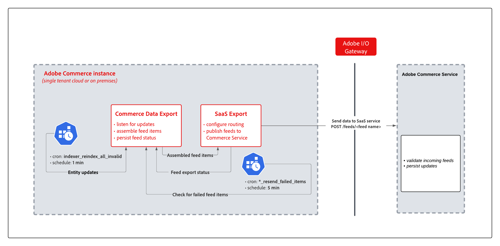

# 與SaaS資料匯出同步資料

當您安裝需要資料匯出的[!DNL Adobe Commerce]服務（例如Catalog Service、Live Search或Product Recommendations）時，將會安裝SaaS資料匯出模組的集合，以管理資料收集和同步處理程式。

SaaS資料匯出會持續將產品資料從Adobe Commerce執行個體移至Commerce Services平台，以保持資料在最新狀態。 例如，產品建議需要目前的目錄資訊，才能正確地傳回具有正確名稱、價格和可用性的建議。 如需監視同步處理程式的詳細資訊，請參閱[檢視和管理同步處理程式](data-sync-manage.md)。

下圖顯示SaaS資料匯出流程。

Adobe Commerce的{width="900" zoomable="yes"}

當[!DNL Adobe Commerce]中的目錄資料變更時，同步處理會經過這些階段。

1. **實體變更偵測** - Magento的Mview系統會偵測訂閱資料庫表格（例如`catalog_product_entity`）中的列變更，並將專案寫入變更記錄檔表格。
1. **摘要索引** — 摘要索引器會讀取變更記錄檔、從來源資料表載入實體資料，以及組合摘要專案。
1. **資料收集與轉換** — 在摘要結構描述[`et_schema.xml`](extensibility-and-customizations.md#feed-schema-overview)中註冊的提供者會收集欄位資料。
1. **雜湊重複資料刪除** — 已計算每個摘要專案的內容雜湊。 會略過自上次匯出後雜湊未變更的專案，因此只會傳輸修改過的資料。
1. **HTTP提交** — 摘要專案會以已驗證的HTTP POST批次形式傳送至Adobe SaaS摘要擷取服務。
1. **狀態持續存在** - API回應狀態會針對每個專案回寫至[摘要資料表](reference/feed-table-reference.md)。
1. **失敗重試** — 無法匯出的專案會由排程的cron工作自動重試。

>[!NOTE]
>
>對於[!DNL Adobe Commerce Optimizer Connector]部署，[!DNL SaaS Data Export]會處理實體變更偵測和摘要元件。 然後聯結器會將摘要對應至[!DNL Catalog Data Ingestion API]格式並將它們提交至[!DNL Adobe Commerce Optimizer]。 請參閱[聯結器同步管道](../aco-connector/connector-sync-pipeline.md)，以取得範圍控制、提交及錯誤處理。

>[!NOTE]
>
>為了確保順暢的排程並避免網站作業中斷，Adobe建議在開始任何資料摘要同步處理之前，先預估資料量和同步處理時間。 在計畫初始同步或大規模目錄更新（例如大量價格變更）時，此預估很重要。 如需詳細資訊，請參閱[估算資料同步處理的資料量和傳輸時間](estimate-data-volume-sync-time.md)

## 同步模式

SaaS資料匯出有兩種模式可處理實體摘要：

- **立即匯出模式** — 在此模式中，會收集資料並在單一反複專案中立即傳送至Commerce服務。 此模式可加快將實體更新傳送至Commerce服務的速度，並降低摘要表格的儲存大小。

- **舊版匯出模式** — 在此模式中，資料會以單一程式收集。 然後，cron作業會將收集的資料傳送至連線的商務服務。 在資料匯出記錄專案中，使用舊版模式的摘要會標示為`(legacy)`。

## 同步型別

SaaS資料匯出支援三種同步型別：完全同步、部分同步和重試失敗專案同步。

### 完全同步

將Adobe Commerce執行個體連線至Commerce服務後，執行完整同步以將實體摘要資料從Adobe Commerce傳送至連線的服務。

>[!NOTE]
>
>完全同步主要適用於上線階段。 請避免正常使用，以防止資料庫超過負荷。 初始同步後，會使用部分同步自動同步進行中的變更。

>[!NOTE]
>
>`saas:resync`命令只會傳輸新專案、更新的專案，以及先前無法匯出的專案。 會略過自上次匯出以來內容雜湊未變更的專案。

### 部分同步 {#partial-sync}

透過部分同步，SaaS資料匯出會自動從Commerce應用程式將更新（例如產品名稱變更或價格更新）傳送至連線的商務服務。
為了讓部分同步運作，Commerce應用程式需要下列設定：

- [已透過cron工作啟用工作排程](https://experienceleague.adobe.com/docs/commerce-operations/installation-guide/next-steps/configuration.html)
- 所有SaaS資料匯出索引子都是以`Update by Schedule`模式設定。

### 重試失敗的專案同步 {#retry-failed-items-sync}

「重試失敗的專案」同步會使用個別程式來重新傳送因同步處理期間發生錯誤（例如應用程式錯誤、網路中斷或SaaS服務錯誤）而無法同步的專案。 `resync_failed_feeds_data_exporter`群組中的`*_resend_failed_items` cron工作每5分鐘會自動處理一次。

## 排程的cron工作

以下cron群組會按照固定排程自動化管道。

| Cron群組 | Cron工作 | 用途 | 排程 |
|---|---|---|---|
| `index` | `indexer_update_all_views` | 處理Mview變更記錄檔並觸發部分摘要更新 | 每1分鐘 |
| `index` | `indexer_reindex_all_invalid` | 針對標示為「需要重新索引」的摘要索引執行完整重新同步 | 每1分鐘 |
| `resync_failed_feeds_data_exporter` | `*_resend_failed_items` | 偵測失敗的摘要專案並重新提交 | 每5分鐘 |
| `commerce_data_export` | `saas_data_exporter` | 為舊版模式摘要提交資料（訂單、範圍） | 每5分鐘 |
| `commerce_data_export` | `cleanup_deleted_feed_items` | 清除超過保留期間（7天）的同步刪除摘要專案 | 每天凌晨2:00 |

## 摘要提交和HTTP錯誤處理 {#feed-submission-and-http-error-handling}

摘要專案會透過HTTP POST以已驗證gzip壓縮的JSON批次形式提交。 下表顯示HTTP回應程式碼如何對應至匯出狀態和重試行為。

| 狀態代碼 | 再試一次？ | 含義 |
|-------------|--------|---------------------------------------------------------------------------------------------------------------------|
| 200 | 否 | 已成功接受 |
| 400 | 否 | 資料錯誤或驗證失敗 — 需要手動調查。 請檢視`var/log/saas-export-errors.log`以取得詳細資料。 |
| 429 | 是 | 達到速率限制 — 在[匯出處理設定](customize-export-processing.md)中減少`thread_count` |
| 5xx | 是 | SaaS端錯誤 — 自動重試 |
| 2 | 是 | 專案已排定重試 |

除了HTTP層級失敗之外，`*_resend_failed_items` cron工作也會排程應用程式層級錯誤（例如本機處理失敗或網路中斷）以進行自動重試。

從Commerce管理員的[[!UICONTROL Data Feed Sync Status]](https://experienceleague.adobe.com/en/docs/commerce-admin/systems/data-transfer/data-sync/data-feed-sync-status)頁面監視每個摘要的狀態。

>[!MORELIKETHIS]
>
> - [管理同步處理](data-sync-manage.md) — 確認同步處理狀態，並手動重新同步處理摘要。
> - [摘要資料表結構描述](reference/feed-table-reference.md) — 檢查專案層級的狀態和錯誤詳細資料。
> - [改善資料匯出效能](customize-export-processing.md) — 調整批次大小和執行緒計數。
