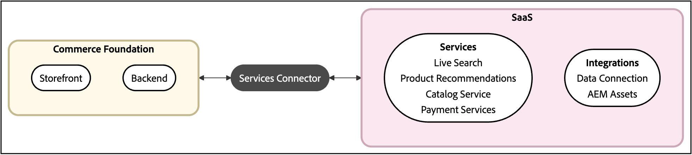

# Adobe Commerce Services指南

Adobe Commerce服務提供強大的功能，可擴充店面、簡化整合，以及最佳化資料管理。

## Commerce如何連線至服務？

所有Commerce服務都會透過[Commerce服務聯結器](saas.md)連線至您的Commerce執行個體。

設定Commerce服務聯結器後，您就可以存取下列功能：

- **店面服務** — 產品探索、建議和付款的AI支援功能
- **整合服務** — 連線至Adobe Experience Platform、AEM Assets和其他Adobe解決方案

這些服務可協助您提高轉換率、提供個人化體驗，以及在Adobe生態系統中更妥善地使用您的商務資料。

>[!NOTE]
>
>Adobe建議升級至所有Commerce服務的最新支援版本。 請參閱[發行說明](release-notes-all.md)。

除了這些功能以外，還有一些工具可讓您監視從Commerce執行個體到SaaS平台的資料流程。 這些資料工具可自動同步資料，並協助您最佳化效能。

## 可用的服務

>[!BEGINTABS]

>[!TAB 店面服務]

店面服務是一組AI支援的功能，可最佳化產品探索、個人化客戶互動，以及簡化付款處理，以提高參與度和轉換率。 透過店面服務，您可以提升購物體驗並推動業務成長。

<table style="table-layout:fixed">
<tr style="border: 0;">
   <td valign="top">
      
      

         <a href="../catalog-service/overview.md">
         <strong>目錄服務</strong>
         </a>
      

      

         <em>提供客戶最佳化的產品體驗，同時提升效能、改善擴充能力，並提高轉換率。</em>
      

   </td>
   <td valign="top">
      
      

         <a href="../live-search/overview.md">
         <strong>[!DNL Live Search]</strong>
         </a>
      

      

         <em>實作這個AI支援的搜尋工具，為B2C購物者提供更聰明、更快、更相關的結果。</em>
      

   </td>
   <td valign="top">
      
      

         <a href="../product-recommendations/overview.md">
         <strong>產品建議</strong>
         </a>
      

      

         <em>根據購物者行為、熱門趨勢、產品相似度等等，新增AI輔助建議。</em>
      

   </td>
   <td valign="top">
      
      

         <a href="../payment-services/guide-overview.md">
         <strong>付款服務</strong>
         </a>
      

      

         <em>透過多種付款方式提高客戶滿意度，包括免息分期付款，以及簡化付款處理、訂單及發票的檢視。</em>
      

   </td>
</tr>
</table>

>[!TAB 整合服務]

整合服務是指將您的Commerce執行個體連線到Adobe中其他產品或服務的功能。

<table style="table-layout:fixed">
<tr style="border: 0;">
   <td valign="top">
      
      

         <a href="../data-connection/overview.md">
         <strong>[!DNL Data Connection]</strong>
         </a>
      

      

         <em>利用Adobe Commerce與Adobe Experience Platform Edge之間的連線，將Commerce資料用於其他Adobe Experience Cloud產品，例如Adobe Analytics和Adobe Target。</em>
      

   </td>
   <td valign="top">
      
      

          <a href="../aem-assets-integration/overview.md">
         <strong>AEM Assets整合</strong>
         </a>
      

      

         <em>使用與Adobe Experience Manager整合的系統簡化數位資產管理，以管理多媒體內容。</em>
      

   </td>
</tr>
</table>

>[!TAB 資料工具]

資料工具可協助您管理並最佳化Commerce執行個體與連線服務之間的資訊流。 這些工具可確保有效率的資料同步化、監控同步作業，並藉由解除安裝資源密集的程式來改善效能。

<table style="table-layout:fixed">
<tr style="border: 0;">
   <td valign="top">
       
      

         <a href="../data-export/overview.md">
         <strong>[!DNL SaaS Data Export]</strong>
         </a>
      

      

         <em>自動將目錄、訂單及詳細目錄資料從Adobe Commerce同步至連線的服務。 使用Commerce CLI命令或<strong>資料管理儀表板</strong>來管理同步處理。</em>
      

   </td>
   <td valign="top">
      
      

          <a href="../price-index/price-indexing.md">
         <strong>SaaS價格索引器</strong>
         </a>
      

      

         <em>從Commerce應用程式解除安裝大量資源工作（例如索引和價格計算）至Adobe的雲端基礎結構，以最佳化網站效能。</em>
      

   </td>
   <td valign="top">
      
      

          <a href="https://experienceleague.adobe.com/zh-hant/docs/commerce-admin/systems/data-transfer/data-sync/data-dashboard" target="_blank">
         <strong>資料管理儀表板</strong>
         </a>
      

      

         <em>從Commerce管理員的統一儀表板輕鬆追蹤Commerce資料同步並觸發重新同步。 取得資料可用性的寶貴見解，以便及時向購物者顯示。</em>
      

   </td>
</table>

>[!NOTE]
>
>Commerce商戶可使用具有有效授權的產品建議v6.0.0、即時搜尋v4.1.0或目錄服務v1.17，不需額外付費，即可使用資料管理儀表板。 使用舊版服務的商家可以使用[目錄同步](../landing/catalog-sync.md)來管理和追蹤資料同步。

>[!ENDTABS]

## Commerce服務可以解決哪些問題？

無論您是想要擴展業務、改善客戶體驗，或做出資料導向式決策，Adobe Commerce服務都能提供解決方案，解決常見的Commerce挑戰：

| 問題 | 挑戰 | 解決方案 |
|---------|-----------|----------|
| 改善產品探索和轉換 | 購物者找不到想要的東西，導致高跳出率和銷售額下滑。 | 使用[即時搜尋](../live-search/overview.md)和[產品推薦](../product-recommendations/overview.md)，根據即時購物者行為，提供AI支援的搜尋功能，並具備拼寫錯誤容許度、即時「隨輸入搜尋」結果、動態多面向和個人化產品推薦。 |
| 建立全通道的個人化體驗 | 您的商務資料已設定為定址區，導致您無法跨管道提供個人化體驗。 | 使用[資料連線](../data-connection/overview.md)將行為、異動和設定檔資料傳送至Adobe Experience Platform。 建立複雜的客戶區段、建立捨棄的購物車行銷活動、鎖定相似對象，以及分析整個客戶歷程中的季節性趨勢。 |
| 簡化數位資產管理 | 跨多個系統管理產品影像和豐富媒體既費時又容易出錯。 | [AEM Assets整合](../aem-assets-integration/overview.md)將Adobe Commerce連線至Adobe Experience Manager Assets專案，簡化工作流程，並確保所有接觸點上的品牌體驗一致，藉此提供集中式資產管理。 |
| 最佳化付款處理 | 有限的付款選項和不良的付款體驗，影響了客戶的滿意度和轉換。 | [付款服務](../payment-services/guide-overview.md)提供多種付款方式，包括免息分期付款，並有一個統一的控制面板來管理付款、訂單及發票。 |
| 大規模管理資料同步 | 資源密集的索引正在減慢網站的速度，而且您無法輕鬆追蹤資料同步問題。 | [SaaS資料匯出](../data-export/overview.md)、[SaaS價格索引器](../price-index/price-indexing.md)和[資料管理儀表板](https://experienceleague.adobe.com/zh-hant/docs/commerce-admin/systems/data-transfer/data-sync/data-dashboard)會自動同步目錄、訂單和存貨資料，將價格計算解除安裝到Adobe的雲端基礎結構，並即時顯示同步處理狀態。 |
| 挽回失去的客戶，降低回報 | 高客戶流失率和產品回報率正影響獲利能力。 | 將[資料連線](../data-connection/overview.md)與Adobe Journey Optimizer和Real-Time CDP結合，以識別傳回模式、建立回饋行銷活動、依行為劃分客戶，並透過電子郵件和簡訊傳送個人化的重新參與行銷活動。 |
| 制定資料導向銷售決策 | 您不確定要促銷哪些產品或何時要執行促銷活動。 | [即時搜尋](../live-search/overview.md)提供搜尋效能見解和銷售工具，以存取關鍵量度、分析搜尋字詞，並使用智慧型銷售規則，根據真正的客戶行為和業務目標來提升或隱藏產品。 |
| 維持對敏感資料的合規性 | 您需要處理敏感的客戶資料，同時維護HIPAA合規性。 | [Data Connection](../data-connection/overview.md)已可使用HIPAA，可讓您與Experience Platform共用後台資料，同時保持合規性並系統地處理隱私權要求。 |

{{$include /help/_includes/templated/whats-new.md}}

<!-- Last updated from includes: 2025-12-10 17:14:24 -->
