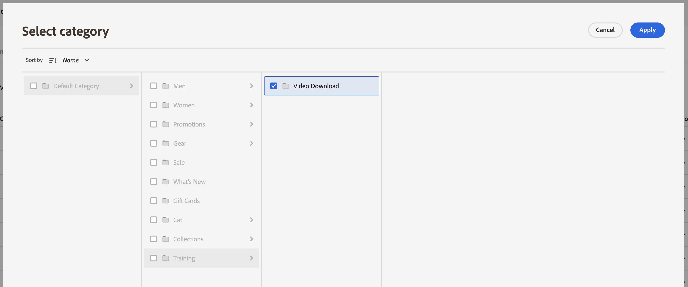

# 類別銷售

類別銷售可讓商店擁有者將[!DNL Live Search]智慧型排名[規則](rules.md)套用至產品類別和子類別。

這段影片將介紹類別銷售。

>[!VIDEO](https://video.tv.adobe.com/v/3424617)

此功能可在管理員的下列位置存取： **行銷** > SEO和搜尋> **[!DNL Live Search]** > **類別銷售**。

>[!NOTE]
>
>類別銷售可搭配[!DNL Live Search] [3.0.0或更新版本](release-notes.md)使用。 如果您看到類別銷售工作區，但其中未填入資料，請更新[!DNL Live Search]模組。

「類別銷售」檢視會顯示已定義的類別規則，其中包含下列專案的欄：

* 類別
* 排名策略
* 繼承的排名
* 上次更新時間
* 動作

您可以在「依類別搜尋」欄位中搜尋類別或子類別。

## 排名策略

類別銷售使用與[個別產品](rules-workspace.md)相同的排名型別。
有兩種排名：智慧型與手動。

**智慧型排名**&#x200B;利用[Adobe Sensei](https://www.adobe.com/sensei.html)的店面行為資料分析，以特定演演算法排序選定類別中的所有產品。 一旦選擇智慧型排名，由於Adobe Sensei會持續重新分析基礎資料，因此預期產品的特定訂單會隨著時間變更。 例如，熱門趨勢產品會隨著購物者偏好設定變更而自動隨時間變更。
智慧型排名方法為：

* 最多購買：依購物者過去七天購買的頻率來排名產品。
* 加入購物車次數最多：根據購物者過去七天加入購物車的頻率來排名產品。
* 檢視次數最多：依購物者前七天檢視產品的頻率排名產品。
* 為您建議：根據每位購物者之前和目前的站上行為，依購物者與每位購物者互動的可能性對產品進行排名。
* 趨勢：根據檢視次數，依人氣近期上升對產品進行排名。
* 無：依預設順序將產品排名。

**手動排名**&#x200B;可讓使用者定義手動圖釘、提升、隱藏和隱藏規則，以覆寫自動產品排序順序。

## 繼承的排名

身為銷售商，您可能希望能夠選取所有女裝類別，並依「趨勢」排序。 其中包括「女士褲子」、「女士襯衫」及「女士配飾」等子類別。 男士的類別不應受影響。 您可以使用繼承的排名來達成此目的。

為具有子類別的類別或子類別選取智慧排名方法時，您可以開啟&#x200B;**將智慧排名套用至子類別**&#x200B;選項。 這會將排名方法套用至所有子類別。

這些子類別現在會從父類別繼承該規則（「繼承的排名」欄中的「是」）。 在「動作」欄中，唯一可用的選項是&#x200B;**編輯規則**&#x200B;和&#x200B;**檢視詳細資料**。 已針對子類別的繼承規則停用&#x200B;**刪除**&#x200B;選項。 刪除子類別繼承需要從父類別復原繼承。

任何類別或子類別一次只能套用一個智慧型排名。 他們可能也會套用其他手動排名。

如果您將智慧型排名套用至類別，並開啟&#x200B;**將智慧型排名套用至子類別**&#x200B;選項，任何已套用至子類別的智慧型排名都會被覆寫。

{width="700"}

如果按一下[檢視全部]****，會開啟對話方塊，其中包含提議的變更詳細資料。

將智慧型排名直接新增至具有繼承智慧型排名的類別時，繼承會被新的智慧型排名覆寫。

從類別中刪除智慧型排名時，會重新建立繼承。
在這兩種情況下，都會維護任何手動排名。

如果您從類別中移除智慧型排名，且選取了子類別繼承，則只會從子類別中移除繼承的智慧型排名。 手動排名不受繼承限制，並將保留。

會出現一個對話方塊，說明哪些繼承的子類別會受您對較高層級類別所做的任何變更影響。

{width="1200"}

## 建立類別規則

若要建立分類規則，請執行下列動作：

1. 按一下&#x200B;**新增規則**&#x200B;按鈕。
1. 在&#x200B;_選取類別_&#x200B;檢視中，按一下類別和子類別。
1. 選取核取方塊以選取您要排名的類別。
1. 按一下&#x200B;**套用**。

   

1. 在&#x200B;_新增類別規則_檢視中，選取您要套用至類別的智慧型排名方法。
類別預覽頁面會使用您的即時搜尋資料，顯示所選排名的實際結果。
1. 按一下&#x200B;**儲存並發佈**&#x200B;以儲存規則。

[!DNL Live Search]服務處理規則，並在完成時在存放區上啟用它。

## 修改類別規則

若要修改現有規則，請執行下列動作：

1. 按一下[動作]資料欄中的&#x200B;**...**，然後選擇[編輯]****。
1. 在[編輯類別]規則檢視中，進行任何必要的變更，然後按一下[儲存並發佈]。****

當[!DNL Live Search]處理變更時，變更會反映在存放區上。

## 刪除類別規則

若要刪除分類規則，請執行下列動作：

1. 按一下[動作]資料欄中的&#x200B;**...**，然後選擇&#x200B;**刪除**。
1. 在&#x200B;_刪除規則_&#x200B;強制回應視窗中，選取&#x200B;**刪除**&#x200B;以移除規則，或選取&#x200B;**取消**&#x200B;以取消動作。

## 手動排名

手動排名可讓您覆寫智慧型排名規則（如有）所決定的產品訂單，並手動控制產品在結果中出現的位置。

事件是在符合定義的條件時修改搜尋結果的動作。 手動排名最多可包含25個事件。

* 提升：將產品在搜尋結果中移到較高的位置。
* 隱藏：將產品移至搜尋結果中的較低位置。
* 釘選產品：將產品移至結果中的特定位置。
* 隱藏產品：從搜尋結果中排除產品。

建立手動排名：

1. 如上所述，為類別設定智慧型排名規則。 查詢結果將顯示在預覽類別頁面檢視中。 這會使用您實際的即時搜尋資料來預覽結果。

1. 在預覽類別頁面檢視中，按一下並拖曳產品。 將其拖放到所需位置。 「產品」和「位置」欄位會自動填入「事件」窗格中。

您也可以按一下圖示將產品釘選至其目前位置。 使用省略符號快顯選單來「釘選至頂端」或「釘選至底部」。

若要手動新增事件：

1. 在「手動排名」底下，按一下&#x200B;**選取事件**&#x200B;功能表，然後選擇符合相關條件時要發生的事件。
1. 輸入您要影響的產品名稱。 建議您在輸入產品時一併輸入。
1. 對於多個事件，選擇符合條件時要觸發的任何其他事件。

>[!NOTE]
>
>在店面開啟特定類別且存在該類別的規則時，就會套用規則。 若為「類別銷售」規則，預設的排序順序為「排序依據：位置」。 如果購物者變更排序順序，則所有隱藏、釘選和隱藏的產品將不再排序。
