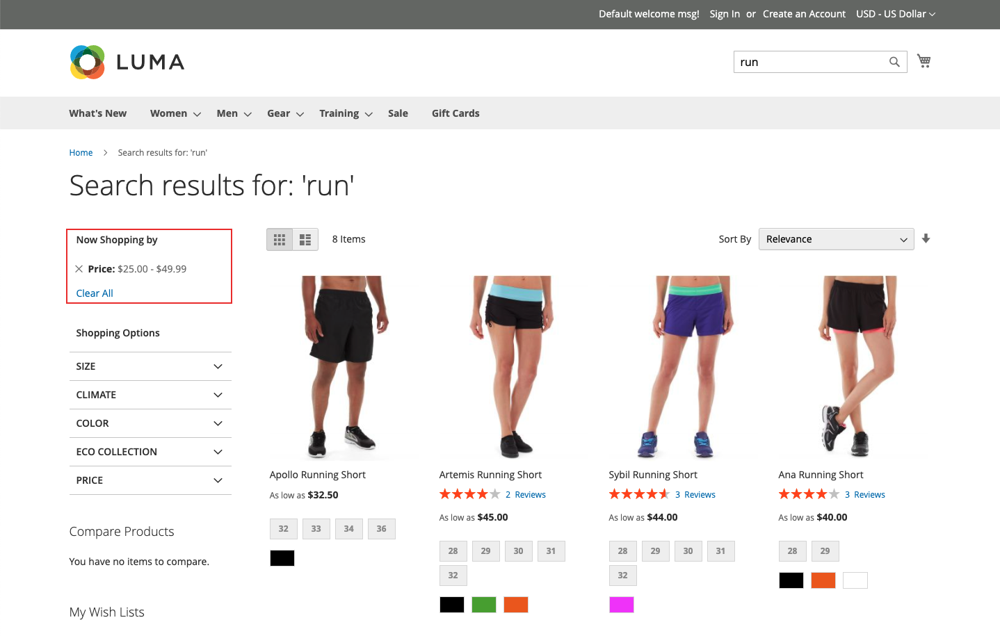

# 多面向型別

[!DNL Live Search]使用各種Facet型別，只有在相關時才會出現在&#x200B;*篩選器*&#x200B;清單中。 可用Facet清單會根據傳回的產品而變更。 下列特性會影響其顯示和行為：

* 釘選Facet — 最常用的Facet可以釘選到清單頂端。 其餘的Facet會在釘選Facet之後以&#x200B;*排序型別*&#x200B;順序列出。
* 動態Facet - [Adobe AI](https://business.adobe.com/tw/ai.html)找到與產品集和查詢最相關的產品屬性。 計算會考量整個目錄的屬性中繼資料，並在查詢時決定與查詢最相關的Facet。

  >[!NOTE]
  >
  >如果您在建立動態Facet後，注意到GraphQL查詢回應中出現逾時錯誤，請將所有Facet變更為釘選，以檢視這是否能解決效能問題。

* 熱門面向 — 最常出現在搜尋結果中的產品屬性。
* 價格Facet — 依價格範圍傳回產品。 您可以在&#x200B;[*設定*](settings.md)&#x200B;工作區中指定選取專案的數目和價格範圍間隔。

在查詢時，[!DNL Live Search]會在動態和常用多面向群組中產生搜尋結果。

## 店面與Headless選項

為[!DNL Commerce]店面轉譯的Facet會由搜尋配接卡處理，這會路由要求並轉譯店面中的結果。 所有[!DNL Commerce]店面多面都是使用單選選項依字母順序排序，無論指派給對應屬性的輸入型別為何。 店面中可用的多面會根據目前的主題來演算，並反映對分層導覽的呈現所做的任何自訂。

相反地，[headless](https://developer.adobe.com/commerce/php/architecture/technical-vision/web-api/)實作是由API處理並支援其他選項。 Headless Facet可依字母順序或計數排序，且可具有單選或多選選項。

### Facet標籤

針對[!DNL Commerce]個店面，Facet標籤是由&#x200B;[*屬性屬性*](https://experienceleague.adobe.com/docs/commerce-admin/catalog/product-attributes/create/attribute-product-create.html?lang=zh-Hant)所決定。 對於具有多個檢視的商店，可在&#x200B;*管理標籤*&#x200B;下定義其他標籤。 針對Headless實作，標籤是從[多面向工作區](faceting-workspace.md)中編輯。

### 排序型別

為店面演算的所有多面都會依字母順序排序。 針對Headless實作，Facet可依字母順序或計數排序。

| 排序型別 | 說明 |
|--- |--- |
| 字母 | 在店面&#x200B;*篩選器*&#x200B;清單中，Facet是以字母順序排序。 |
| 計數 | （僅限Headless）針對Headless實作，Facet也可依目前傳回產品集合中每個Facet的值數量排序。 |
