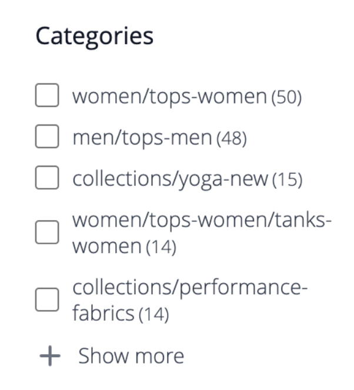

# Facet

多面向是一種高效能篩選方法，使用多個屬性值的維度作為搜尋條件。 多面搜尋類似，但比標準[分層導覽](https://experienceleague.adobe.com/docs/commerce-admin/catalog/catalog/navigation/navigation-layered.html)要「聰明」得多。 可用的篩選器清單是由搜尋結果中傳回之產品的[可篩選屬性](https://experienceleague.adobe.com/docs/commerce-admin/catalog/catalog/navigation/navigation-layered.html#filterable-attributes)所決定。

[!DNL Live Search]使用`productSearch`查詢，該查詢會傳回Faceting和特定於[!DNL Live Search]的其他資料。 如需程式碼範例，請參閱開發人員檔案中的[`productSearch`查詢](https://developer.adobe.com/commerce/webapi/graphql/schema/live-search/queries/product-search/)。

在一個Facet中，購物者可以選取多個選項，例如「樣式」下的「基本」和「緊貼」，而搜尋結果會更新以僅顯示這些樣式。 同樣地，如果購物者選取Facet間的選項，例如「樣式」下的「基本」和「氣候」下的「室內」，搜尋結果會更新以顯示所選樣式和所選氣候。

任何已定義的Facet都可以用作URL引數，而且會根據引數值篩選結果： `http://yourstore.com?brand=acme&color=red`。

## 多面向需求

多面的類別和產品屬性需求類似於用於分層導覽的可篩選屬性。 屬性的每個店面屬性都必須將「用於搜尋結果的分層導覽」值設定為「是」。 您可以從Admin的[!DNL Stores] > [!DNL Attribute]功能表檢閱及更新屬性設定。

>[!NOTE]
>
>如果您將產品類別定義為Facet，則Facet會顯示類別和子類別的`url_path`。
>
>

請參閱[界限和限制](./boundaries-limits.md#facets)以進一步瞭解[!DNL Live Search]中的Facet需求。

如果要與許多屬性競爭，請考慮將屬性合併為單一「meta-attribute」。 例如，鞋子通常有數字大小，而襯衫通常是「S/M/L/XL」大小。 這兩種大小型別可合併為單一可搜尋屬性。

| 設定 | 說明 |
|--- |--- |
| [類別顯示設定](https://experienceleague.adobe.com/docs/commerce-admin/catalog/categories/create/categories-display-settings.html) | 錨點 — `Yes` |
| [屬性屬性](https://experienceleague.adobe.com/docs/commerce-admin/catalog/product-attributes/create/attribute-product-create.html) | [目錄輸入型別](https://experienceleague.adobe.com/docs/commerce-admin/catalog/product-attributes/attributes-input-types.html) - `Yes/No`、`Dropdown`、`Multiple Select`、`Price`、`Visual swatch` （僅限Widget）、`Text swatch` （僅限Widget） |
| 屬性店面屬性 | 用於搜尋結果階層式導覽 — `Yes` |

## Facet彙總

多面向彙總的執行方式如下：如果店面有三個Facet （類別、顏色和價格），且購物者篩選全部三個（顏色=藍色，價格為$10.00-50.00，類別= `promotions`）。

* `categories`彙總 — 彙總`categories`，然後套用`color`和`price`篩選器，但不套用`categories`篩選器。
* `color`彙總 — 彙總`color`，然後套用`price`和`categories`篩選器，但不套用`color`篩選器。
* `price`彙總 — 彙總`price`，然後套用`color`和`categories`篩選器，但不套用`price`篩選器。
