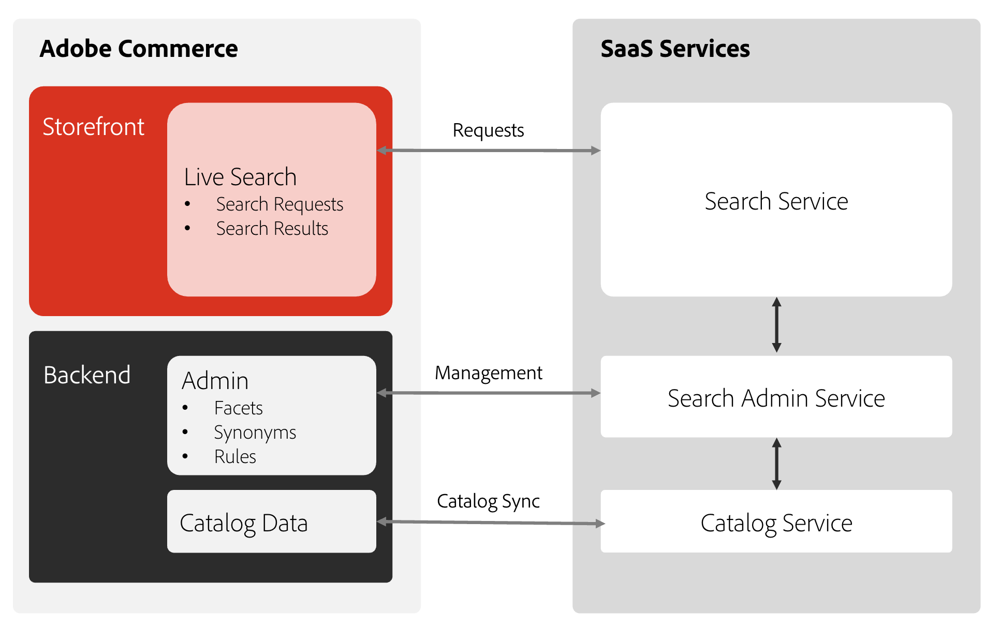
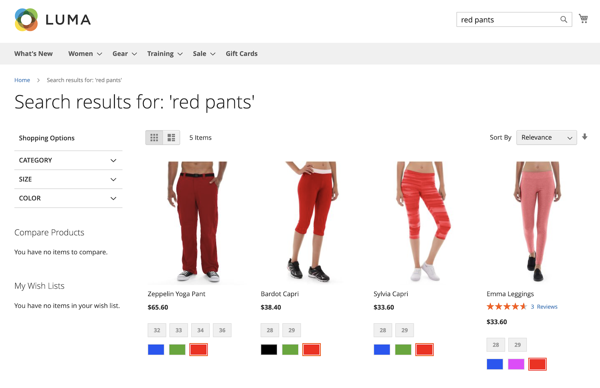

# 什麼是[!DNL Live Search]？

[!DNL Live Search]是一項功能，可取代Adobe Commerce中的標準搜尋功能。 當啟用並設定[!DNL Live Search]功能時，預設搜尋文字欄位會以[!DNL Live Search]文字欄位取代。 [!DNL Live Search]也包含產品清單頁面(PLP) Widget，可在瀏覽搜尋結果時提供強大的篩選功能。

透過[!DNL Live Search]，您可以：

- 建立有意義的搜尋體驗，協助購物者和買家儘可能輕鬆地找到他們想要的。
- 利用AI支援的動態多面向和重新排名搜尋結果，以回應工作階段中的購物者行為。
- 使用輕量型的SaaS服務，提供輕鬆的更新並包含在您的授權中，以降低總擁有成本。
- 啟用GraphQL API、Headless彈性、API沙箱環境和超快速SaaS，以取得技術優勢。

>[!IMPORTANT]
>
>在網站搜尋方面，Adobe Commerce會提供您選項。 在實作之前，請檢閱[界限和限制](boundaries-limits.md)資訊，以確定[!DNL Live Search]適合您的業務需求。

## 架構

架構的Adobe Commerce端包含主控搜尋&#x200B;*管理員*、同步目錄資料，以及執行查詢服務。 安裝及設定[!DNL Live Search]後，Adobe Commerce會開始與SaaS服務共用搜尋和目錄資料。 此時，管理員使用者可以設定、自訂及管理搜尋[面向](facets.md)、[同義字](synonyms.md)及[銷售規則](category-merch.md)。

## 快速導覽

[!DNL Live Search]著重於速度、相關性和易用性，對購物者和商家來說都是一個遊戲規則的改變者。 觀看以下影片，然後從店面快速瀏覽[!DNL Live Search]。

>[!VIDEO](https://video.tv.adobe.com/v/3418797?learn=on)

如需有關使用和設定Live Search的更深入影片，請參閱[在 [!DNL Live Search]](https://experienceleague.adobe.com/zh-hant/docs/commerce-learn/tutorials/getting-started/capabilities/live-search-full-demonstration)上的完整示範主題。

### 依輸入內容搜尋

當購物者在[!DNL Live Search]搜尋[方塊中輸入查詢時，](storefront-popover.md)在[彈出視窗](https://experienceleague.adobe.com/zh-hant/docs/commerce-admin/catalog/catalog/search/search)中以建議的產品和排名最前的搜尋結果縮圖影像回應。 當購物者按一下建議或精選的產品時，會顯示[產品詳細資料](https://experienceleague.adobe.com/zh-hant/docs/commerce-admin/start/storefront/storefront)頁面。 彈出視窗頁尾中的&#x200B;_檢視全部_&#x200B;連結會顯示搜尋結果頁面。

針對兩個或更多字元的查詢，[!DNL Live Search]傳回「鍵入時搜尋」結果。 若為部分相符，則每個字的字元數上限為20。 查詢中的字元數無法設定。 彈出視窗包含`name`、`sku`和`category_ids`欄位。

### 檢視所有搜尋結果

若要列出「輸入時搜尋」查詢傳回的所有產品，請按一下彈出視窗頁尾中的&#x200B;_檢視全部_。

### [!DNL Live Search]如何處理錯字

進行搜尋時，[!DNL Live Search]會執行非模糊搜尋，但不會說明任何拼寫錯誤。 如果找不到結果，[!DNL Live Search]會執行第二個模糊搜尋，這會考慮輕微的拼寫錯誤。 執行模糊搜尋時，最大編輯距離為1。 這個編輯距離使用[Levenshtein距離](https://en.wikipedia.org/wiki/Levenshtein_distance)的概念，並且允許三種型別的操作：

| 作業 | 說明 | 範例 |
|---|---|---|
| 插入 | 新增字元。 | &quot;cat&quot; -> &quot;cart&quot; |
| 刪除 | 移除字元。 | &quot;cart&quot; -> &quot;cat&quot; |
| 替代 | 將一個字元取代為另一個字元。 | 「購物車」 — > 「演員」 |

除了模糊搜尋邏輯外，也會考慮轉置，也就是交換一個字詞中兩個相鄰字元，例如「teh」而非「the」。 請注意，這些編輯限制是按字詞而定，而非整個片語。

### 使用Facet篩選的搜尋

篩選搜尋使用多個屬性值的維度或[多面向](facets.md)作為搜尋條件。 篩選器的選取專案由商家定義，並會根據傳回的產品而變更，而最常使用的多面向會釘選至清單頂端。

使用Facet做為URL引數： `http://yourwebsite.com?color=red`，且「即時搜尋」會根據這些屬性值篩選結果。

### 同義字

[同義字](synonyms.md)可包含購物者可能使用的字詞與目錄中的字詞，以擴大觸及範圍並強化查詢重點。 您可以微調同義字字典，讓購物者持續參與並前往購買路徑。

### 銷售規則

銷售[規則](rules.md)會使用if-then陳述式來將邏輯和事件加入搜尋，藉此塑造購物體驗。 您可以輕鬆提升或隱藏促銷活動、季節或其他時段之產品。

## Live Search元件

- [!DNL Live Search] [彈出視窗Widget](storefront-popover.md)是在包含搜尋結果的搜尋欄位下開啟的方塊。
- [產品清單頁面Widget](plp-styling.md) (PLP)提供具有Facet和同義字支援的可搜尋產品清單頁面。 Widget已安裝並在Live Search 4.0.0+中啟用，並取代搜尋配接器。
- （**已棄用**） Search Adapter是PLP Widget的前身，且已安裝Live Search &lt; 4.0.0。如果您使用的Live Search版本早於4.0.0，Commerce建議您升級以享受PLP Widget功能和未來改進的優點。 日後，搜尋配接卡只會更新以解決安全性問題。

## [!DNL Live Search]工作區

[!DNL Live Search] [工作區](workspace.md)是管理員中您設定[!DNL Live Search]功能（例如同義字、Facet和類別銷售）的區域。

## 活動

[!DNL Live Search]使用[事件](https://developer.adobe.com/commerce/services/shared-services/storefront-events/#live-search)計算[智慧型銷售](category-merch.md)和[效能](performance.md)儀表板。 事件會隨預設實施提供。 Headless店面事件應手動啟用。

## 目錄資料保留原則

如果您連續90天未提交測試環境中目錄資料的搜尋查詢，則目錄資料會設定為休眠模式，且任何搜尋查詢都不會傳回任何資料。 此原則不會影響生產環境中的目錄資料。

若要在您的測試環境中重新啟用目錄資料，請[提交標題為「重新啟用](https://experienceleague.adobe.com/zh-hant/docs/commerce-knowledge-base/kb/help-center-guide/magento-help-center-user-guide#experience-league-start-page)」的支援請求[!DNL Live Search]，並包含環境ID。 您測試環境中的目錄資料應在數小時內還原。
