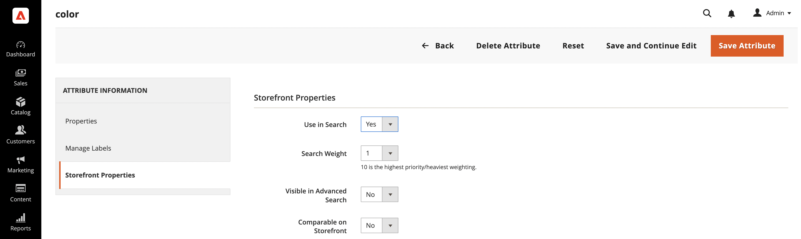

# 設定即時搜尋

工作區是您設定、管理和監視[!DNL Live Search]效能的地方。 頂端的功能表可讓您存取每個功能區域中的工具。 可用的功能會反映目前的選單選取範圍。

## 資料收集

為確保工作區上的每個功能區域都包含正確的資料，您需要根據所選的店面實作來設定資料收集：

1. Luma — 現成提供資料收集功能。
1. Headless — 視店面實作而定，必須手動設定資料收集。

如果您使用的是Headless店面，請參閱以下檔案以取得有關您需要新增的所需事件的詳細資訊：

- [即時搜尋儀表板的必要事件](events.md)。
- [需要新增為先決條件的Storefront事件收集器](https://developer.adobe.com/commerce/services/shared-services/storefront-events/collector/)。
- 事件結構的[範例](https://github.com/adobe/commerce-events/tree/main/examples)。

### 醫療保健客戶

如果您是醫療保健客戶，且已安裝[Data Services HIPAA擴充功能](../data-connection/hipaa-readiness.md#installation) （屬於[Data Connection](../data-connection/overview.md)擴充功能的一部分），則不會再擷取[!DNL Live Search]使用的店面事件資料。 這是因為店面事件資料是在使用者端產生。 若要繼續擷取和傳送店面事件資料，請重新啟用[!DNL Live Search]的事件收集。 請參閱[一般組態](https://experienceleague.adobe.com/en/docs/commerce-admin/config/general/general.html#data-services)以瞭解更多資訊。

## 設定範圍

所有[!DNL Live Search]設定的[領域](https://experienceleague.adobe.com/docs/commerce-admin/start/setup/websites-stores-views.html#scope-settings)最初設定為`Default Store View`。 如果您的[!DNL Commerce]安裝包含多個存放區檢視，請將&#x200B;**範圍**&#x200B;設定為您的Facet設定套用的[存放區檢視](https://experienceleague.adobe.com/docs/commerce-admin/start/setup/websites-stores-views.html)。

## 功能表選項

| 選項 | 說明 |
|--- |--- |
| [效能](performance.md) | 控制面板提供產品搜尋效能的深入分析。 |
| [多面向](facets.md) | 使用屬性值的多個維度來調整搜尋條件的高效能篩選。 |
| [同義字](synonyms.md) | 擴大搜尋範圍，納入購物者可能會用來尋找與目錄中不同產品的字詞。 |
| [搜尋銷售](rules.md) | 使用可觸發已排程動作的邏輯規則來塑造搜尋體驗。 提升、隱藏、釘選或隱藏產品，以校正搜尋結果，支援您的業務目標。 |
| [類別銷售](category-merch.md) | 在類別層級套用規則和智慧型銷售。 |
| [GraphQL](graphql.md) | 開發人員若已登入您商店的管理員，可使用實際目錄資料撰寫和測試查詢。 若要深入瞭解，請前往[!DNL Live Search]開發人員檔案中的[GraphQL概觀](https://developer.adobe.com/commerce/services/graphql/live-search/)。 |
| [設定](settings.md) | 決定如何在店面中依價格範圍分組價格方面值，並設定索引語言。 |

## 將屬性設定為可搜尋

若要產生高針對性的結果，請檢閱[可搜尋](https://experienceleague.adobe.com/docs/commerce-admin/catalog/product-attributes/product-attributes.html) (`searchable=true`)產品屬性集。 為確保關聯性，請讓屬性只有在包含具有清晰精簡含義的內容時才可供搜尋。 避免使用包含較不精確、長度較長的文字的屬性，例如`description`，雖然預設會啟用搜尋，但可能會降低搜尋結果的精確度。 例如，如果有人搜尋「短褲」，而且有描述包含「短袖」字樣的襯衫，則這些襯衫會包含在搜尋結果中。

若要允許搜尋屬性，請完成下列步驟：

1. 在管理員中，移至&#x200B;**商店** > *屬性* > **產品**。
1. 選取您要搜尋的屬性，例如`color`。
1. 選取&#x200B;**店面內容**&#x200B;並將&#x200B;**在搜尋中使用**&#x200B;設定為`yes`。

   

[!DNL Live Search]也會遵從產品屬性的[權重](https://experienceleague.adobe.com/docs/commerce-admin/catalog/catalog/search/search-results.html#weighted-search)，如在Adobe Commerce中所設定。 權重較高的屬性會顯示在搜尋結果中較高的位置。

下列屬性一律可供搜尋：

- `sku`
- `name`
- `categories`

[Facet](facets.md)是在[!DNL Live Search]中定義的可篩選產品屬性。 您可以在[!DNL Live Search]中將任何可篩選的屬性設定為Facet，但您一次可搜尋的Facet數目有[限制](boundaries-limits.md)。

[同義字](synonyms.md)是可定義的術語，可協助引導使用者使用正確的產品。 尋找褲子的使用者可能會輸入「trousers」或「slacks」。 您可以設定同義字，讓這些搜尋詞將使用者帶到「褲子」結果。

## Commerce組態設定

下節說明[!DNL Live Search]支援和不支援的Commerce組態設定。

### 支援的設定值

>[!IMPORTANT]
>
>強烈建議您使用在Live Search 4.0.0中預設為啟用的產品清單Widget。Widget的目標是完全取代未來版本中的介面卡實作。 請參閱[啟用產品清單Widget](install.md#enable-product-listing-widgets)以深入瞭解。

| Commerce組態設定 | 說明 | 由Popover支援 | 由介面卡支援 |
|---|---|---|---|
| 商店>設定>目錄>目錄>目錄搜尋>允許每頁所有產品 | 如果設為`Yes`，則在「每頁顯示」控制項中包含`ALL`選項。 | 是。 最多500種產品 | 是。 最多500種產品 |
| 儲存>設定>目錄>目錄>目錄搜尋>最小查詢長度 | 目錄搜尋中允許的最小字元數。 | 是 | 是 |
| 儲存>設定>目錄>目錄>目錄搜尋>每頁產品網格允許值 | 決定格線檢視中顯示的產品數目。 | 是 | 是 |
| 商店>設定>目錄>目錄>目錄搜尋>產品每頁格點預設值 | 決定網格檢視中預設每頁顯示的產品數目。 | 是。 最多500種產品 | 是。 最多500種產品 |
| 儲存>設定>目錄>庫存>顯示無庫存產品 | 顯示無庫存的產品。 | 是 | 是 |
| 儲存>組態>幣別>預設顯示幣別 | 用來顯示價格的主要貨幣。 | 是 | 是 |
| 儲存>組態>一般>貨幣設定>貨幣選項>基本貨幣 | 用於所有線上付款交易的主要幣別。 | 是 | 是 |

「Widget產品清單」頁面與「彈出視窗」中的價格會使用設定的幣別匯率，轉換為預設顯示幣別。

### 不支援的設定值

| Commerce組態設定 | 說明 | 附註 |
|---|---|---|
| 商店>設定>目錄>店面>清單模式 | 決定搜尋結果清單的格式。 | 正確轉譯，但部分頁面互動不會傳送事件 |
| 儲存>組態>目錄>目錄>目錄搜尋>查詢長度上限 | 目錄搜尋中允許的最大字元數。 | 未實作；搜尋服務接受最多255個字元 |
| 組態>銷售>稅捐>價格顯示設定>在目錄中顯示產品價格 | 決定目錄中所發佈的產品價格是否包含或排除稅捐，或顯示兩個版本的價格；一個含稅，另一個不含稅 |  |
| 商店>設定>目錄>店面>產品清單排序依據 | 決定搜尋結果清單的排序順序。 | 不適用於[!DNL Live Search] [產品清單頁面Widget](plp-styling.md) |

### 搜尋詞

在Adobe Commerce處理路由的實作上，[!DNL Live Search]支援[搜尋字詞重新導向](https://experienceleague.adobe.com/docs/commerce-admin/catalog/catalog/search/search-terms.html)，例如Luma和其他以php為基礎的主題。
