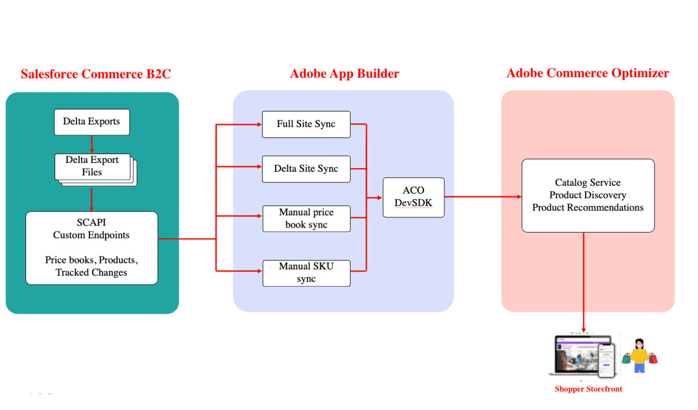
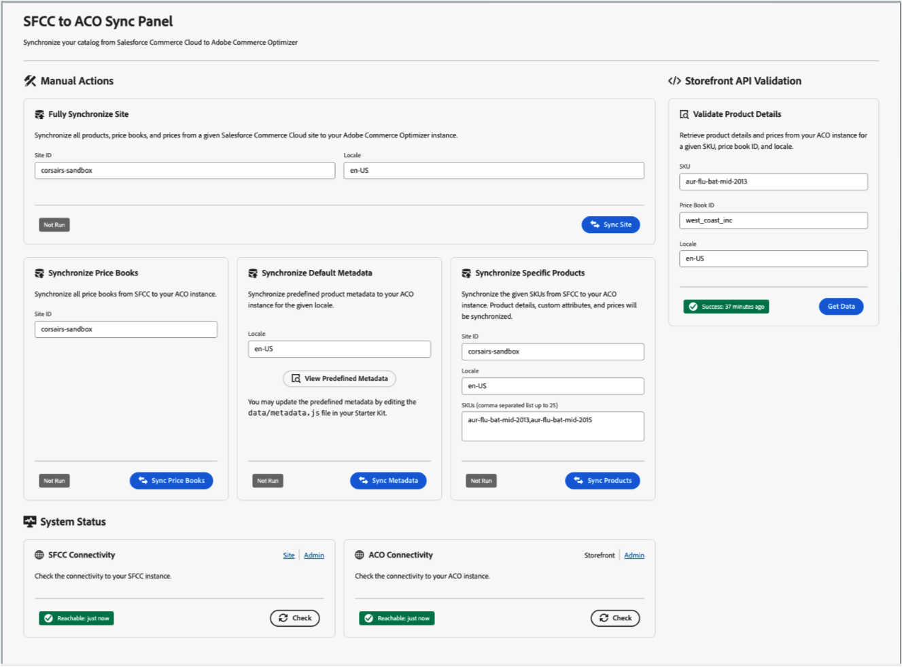

# Adobe Commerce Optimizer的Salesforce Commerce Connector

[!DNL Commerce Optimizer Salesforce Commerce Connector]以Adobe App Builder技術為基礎，可順暢地傳輸和管理從Salesforce Commerce Cloud B2C到[!DNL Adobe Commerce Optimizer]的目錄資料。 它可連線兩個平台，保持產品資訊、定價和更新的同步，而不需重新調整平台。

聯結器開箱即用，提供可靠的資料同步功能，並具備彈性可自訂工作流程，滿足您的業務需求。

如需端對端影片教學課程系列，請參閱[瞭解Salesforce Commerce雲端入門套件](https://experienceleague.adobe.com/en/docs/commerce-learn/tutorials/adobe-commerce-optimizer/sfcc-starter-kit/overview)。

## 主要功能

* **目錄資料同步：**&#x200B;將產品資料（包括變體、價格手冊和結構）從Salesforce Commerce B2C推送到Adobe Commerce Optimizer，以保持店面和體驗驅動的應用程式為最新狀態。
* **價格同步：**&#x200B;直接從Salesforce Commerce B2C匯入及管理價格資料。
* **支援多種資料型別：**&#x200B;同步產品、定價和目錄結構，以反映複雜的銷售設定。

* **彈性同步工作流程**
   * **排程同步：**&#x200B;使用cron工作排程自動化更新，不需要手動操作。
   * **隨選更新：**&#x200B;立即觸發SKU層級的更新，以取得緊急變更、更正或產品啟動。

* **為擴充性建置**
   * 使用自訂[Salesforce Commerce B2C API](https://developer.salesforce.com/docs/commerce/commerce-api/guide/get-started.html) (SCAPI)端點，以相容性及輕鬆適應獨特或進階使用案例。
   * 透過目錄和價格同步處理隨您的業務啟動進行擴充，然後擴充工作流程以支援其他整合或業務邏輯。
   * 設定和改進工作流程，而不需重建核心整合。

>[!NOTE]
>
>聯結器是專為Salesforce Commerce Cloud B2C而設計。 不支援建置在不同技術棧疊上的Salesforce B2B或D2C產品。

## Salesforce Connector的受益者是誰？

[!DNL Salesforce Commerce Connector]適用於：

* **現有的Salesforce Commerce Cloud B2C客戶**&#x200B;強化店面功能
* **需要跨多個店面進階銷售與個人化功能的多品牌組織**
* **尋求效能改善的企業**&#x200B;透過Adobe的Edge Delivery Services提供更快速的店面體驗
* **具有複雜定價結構的公司**&#x200B;同步處理複雜價格手冊與地區特定定價
* **AEM客戶**&#x200B;透過Edge Delivery Services使用Salesforce店面時，從Adobe Commerce Commerce B2C管理產品目錄
* **具有多重地區設定需求的零售商**&#x200B;同步不同市場和語言的本地化產品資訊

## 使用案例

聯結器支援幾個主要使用案例：

### 目錄資料擷取和店面顯示

此主要使用案例示範從Salesforce Commerce B2C到Adobe Commerce店面的完整資料流程：

1. **初始目錄擷取：**&#x200B;大量載入您的整個Salesforce商務目錄，包括包含變體、價格手冊和定價資訊的簡單產品。
1. **自動差異更新：**&#x200B;從Salesforce Commerce目錄管理UI將產品更新自動同步到[!DNL Commerce Optimizer]。
1. **店面整合：**&#x200B;使用[!DNL Commerce Optimizer]店面API，在您的Adobe Commerce Edge Delivery服務店面中顯示同步處理的目錄資料。
1. **即時更新：**&#x200B;在Salesforce中進行變更後，立即在您的店面檢視更新的產品資訊（名稱、價格、說明）。

### 多地區產品管理

善用Salesforce Commerce B2C本地化功能：

* 針對不同地區設定，從Salesforce Commerce B2C同步本地化版本的產品文字欄位（名稱、說明）。
* 將Salesforce地區設定概念1:1與[!DNL Commerce Optimizer]地區設定對應。
* 針對不同的本地化支援多個產品擷取週期。
* 維持全球產品目錄的一致性。

## 架構與元件

[!DNL SFCC Connector]在Salesforce Commerce B2C執行個體和[!DNL Commerce Optimizer]之間提供強大的整合層。 聯結器會透過一系列同步動作運作，這些同步動作會轉移您的目錄資料、價格手冊和產品資訊。

1. **資料擷取** — 使用您的Salesforce Commerce B2C執行個體進行驗證，並使用自訂SCAPI擷取目錄資料。
1. **資料轉換** — 轉換產品資料以符合[!DNL Commerce Optimizer]資料模型和結構描述需求。
1. **資料擷取** — 使用ACO TypeScript SDK將轉換後的資料安全地傳輸至[!DNL Commerce Optimizer]。
1. **店面整合** — 透過[!DNL Commerce Optimizer]個店面體驗的API取得同步資料。

下圖說明整合的高階資料流程：

{zoomable="yes"}

### 主要元件

[!DNL Commerce Optimizer SFCC Connector]包含數個主要元件：

* **ACO SFCC Starter Kit App Builder應用程式** — 提供無伺服器功能，可處理SFCC與Adobe Commerce Optimizer之間的資料同步。
* **自訂SFCC Cartridge** — 使用資料擷取所需的API擴充您的Salesforce Commerce Cloud執行個體的必要卡匣。
* **管理UI** — 用於監視同步狀態和管理聯結器操作的Web介面。

### 同步處理過程

聯結器支援多種同步模式。

| 同步模式 | 說明 |
|-----------|-------------|
| **完整網站同步** | 針對您設定的Salesforce Commerce Cloud網站和區域設定，執行所有產品、價格手冊和價格的完整同步處理。 其中包括 <ul><li>產品中繼資料和屬性</li><li>目錄結構和類別</li><li>價格簿</li><li>定價資訊</li><li>多地區設定產品資料</li></ul> |
| **差異同步** | 僅擷取並同步自上次同步以來Salesforce產品和價格資料中所做的變更，確保有效率且及時的更新。 差異同步會自動以排程方式執行（預設值：每小時），以維持資料的時效性。 |
| **目標同步選項** | 提供精細的同步功能： <ul><li>**價格簿同步**&#x200B;僅同步價格簿資訊</li><li>**中繼資料同步**&#x200B;更新產品中繼資料和屬性定義</li><li>**特定產品同步處理**&#x200B;會依SKU同步處理個別產品</li></ul> |

## 重要考量

規劃實施時，請考量下列關鍵因素：

### 資料對應和屬性

* **可搜尋屬性：** Salesforce Commerce B2C透過UI設定可搜尋屬性，而API不會公開這些屬性。 使用[[!DNL Catalog Data Ingestion metadata APIs]](https://developer.adobe.com/commerce/services/optimizer/data-ingestion/#metadata)在Adobe Commerce Optimizer中手動設定這些可搜尋的屬性。
* **屬性對應：**&#x200B;根據您的業務需求，規劃Salesforce Commerce B2C產品屬性與[!DNL Commerce Optimizer]中繼資料的對應。
* **預設可搜尋欄位：**&#x200B;聯結器會自動讓核心屬性(`name`、`description`、`ID`)預設為可搜尋。

### 同步範圍

* **網站選擇：** Salesforce Commerce B2C有一個目錄附加至的網站概念。 在完整同步期間，選取要同步的Salesforce網站。
* **地區設定管理：**&#x200B;每個Salesforce Commerce地區設定會在[!DNL Commerce Optimizer]中產生個別的產品擷取週期。
* **資料量：**&#x200B;規劃實作時，請考慮目錄大小和同步處理頻率。

## 監控與管理

安裝及設定之後，[!DNL Commerce Optimizer SFCC Connector]會從[!DNL SFCC to ACO Sync Panel]提供完整的監視及管理功能：

{width="700" zoomable="yes"}

在您將[!DNL Commerce Optimizer SFCC Connector Starter Kit]部署到App Builder專案後，就會提供此介面的URL。

主要功能包括：

* **同步處理狀態追蹤：**&#x200B;監視所有同步處理作業的狀態和時間戳記。
* **連線驗證：**&#x200B;測試與Salesforce Commerce Cloud和Adobe Commerce Optimizer的連線。
* **產品資料驗證：**&#x200B;確認已同步的產品資料正確顯示在店面。
* **錯誤記錄與疑難排解：**&#x200B;疑難排解的錯誤記錄可透過App Builder CLI存取。
* **狀態管理：**&#x200B;追蹤同步處理進度並防止與內建狀態管理衝突。

## Source程式碼和開發資源

[!DNL Commerce Optimizer SFCC Connector]是開放原始碼，可供自訂。 主要存放庫包括：

* **[ACO SFCC Starter Kit](https://github.com/adobe-commerce/aco-sfcc-starter-kit)** — 主要聯結器應用程式和檔案。
* **[ACO SFCC墨水匣](https://github.com/adobe-commerce/aco-sfcc-cartridges)** - API整合所需的SFCC墨水匣。
* **[ACO TypeScript SDK](https://github.com/adobe-commerce/aco-ts-sdk)** — 用於Adobe Commerce Optimizer整合的SDK。

這些存放庫提供完整的原始程式碼、詳細檔案，以及實施和自訂聯結器的範例。

## 後續步驟

準備好將您的Salesforce Commerce Cloud資料與Adobe Commerce Optimizer整合了嗎？ 首先，請檢閱[ACO SFCC Starter Kit存放庫](https://github.com/adobe-commerce/aco-sfcc-starter-kit)中的詳細實作指南，並確定您具備必要的必要條件。
