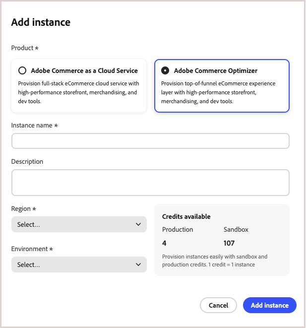
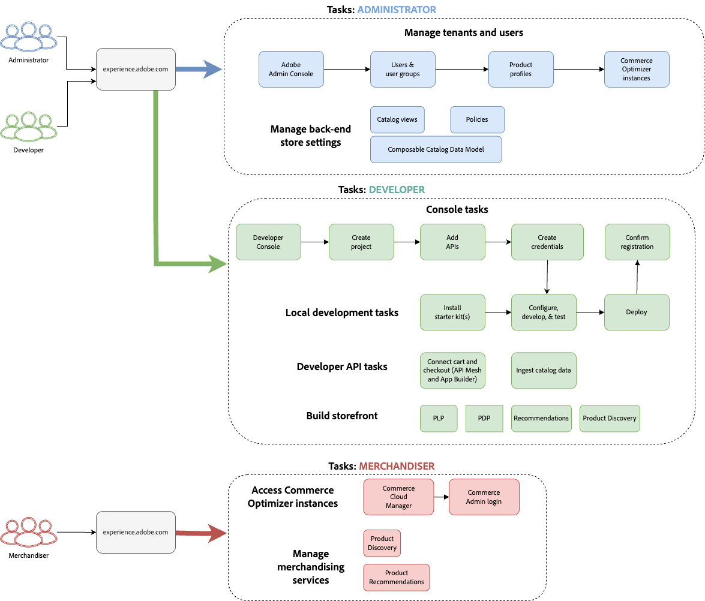
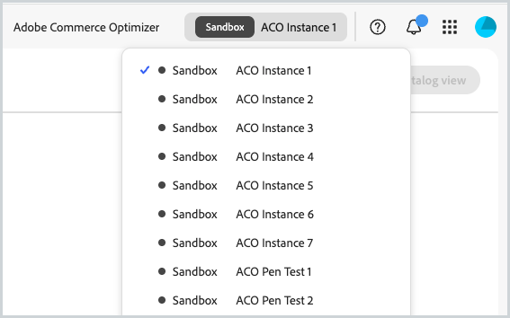
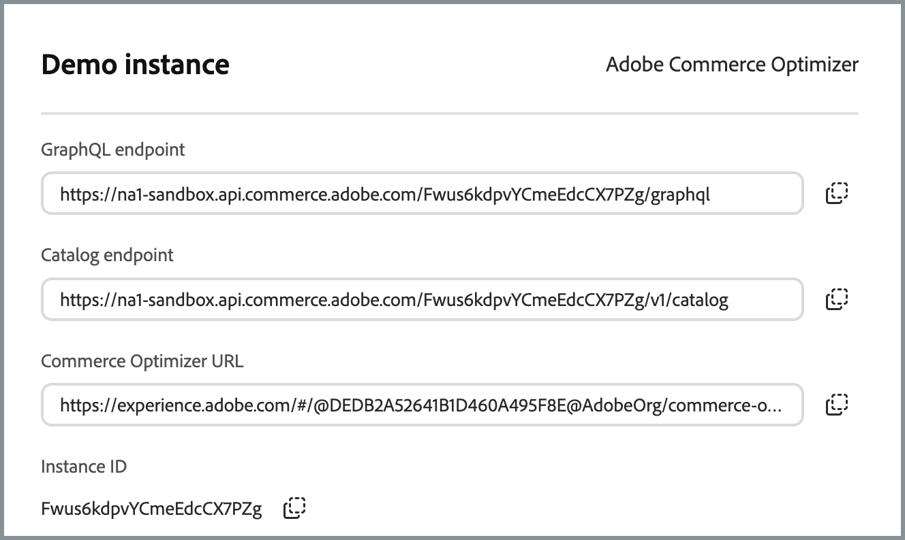

# 開始使用

本指南會逐步引導您完成設定[!DNL Adobe Commerce Optimizer]。 雖然本指南涵蓋所有角色，但如需開發人員特定內容的詳細資訊，請參閱[開發人員檔案](https://developer.adobe.com/commerce/services/optimizer/)。

## 先決條件

開始之前，請確定您已：

- 具有&#x200B;**權益的** Adobe Experience Cloud帳戶[!DNL Adobe Commerce Optimizer]
- **組織管理員存取權**&#x200B;以建立執行個體和管理使用者
- **GitHub帳戶** （用於載入範例資料和店面開發）
- **基本瞭解**&#x200B;電子商務概念

## 快速入門手冊

請依照下列基本步驟執行[!DNL Adobe Commerce Optimizer]環境：

### 步驟1. 建立執行個體

1. 登入[Adobe Experience Cloud](https://experience.adobe.com/)。
1. 導覽至&#x200B;**Commerce** > **Commerce Cloud管理員**。
1. 按一下&#x200B;**新增執行個體** > **Commerce Optimizer**。

   {width="60%" zoomable="yes"}

1. 設定執行個體設定：
   - **名稱**：描述性名稱（例如「My Company Sandbox」）
   - **描述**：用途的簡短描述
   - **地區**：選取您偏好的地區
   - **環境型別**：從測試的&#x200B;**沙箱**&#x200B;環境開始

1. 按一下&#x200B;**新增執行個體**。

   Cloud Manager會更新以包含您的新執行個體。 如需存取和管理它的詳細資訊，請參閱[管理執行個體](#manage-an-instance)。

>[!NOTE]
>
>沙箱例項僅限北美區域使用。 建立後即無法變更區域。

### 步驟2. 設定您的環境

建立執行個體後：

1. 從Commerce Cloud Manager [管理您的執行個體](#manage-an-instance)。
1. 使用[使用者管理指南](./user-management.md)設定使用者存取權。

### 步驟3. 新增範例資料（可選）

若要進行測試和學習，請依照[載入範例資料](#add-sample-data)的指示進行。

## 角色型工作流程

[!DNL Adobe Commerce Optimizer]設定和管理依賴三個關鍵角色。 每個角色都有特定的任務和責任：

{zoomable="yes"}

### 管理員任務

管理員可管理執行個體、使用者和組織設定。

| 任務 | 說明 | 連結 |
|---|---|---|
| **管理使用者** | 新增使用者、開發人員和管理員 | [使用者管理](./user-management.md) |
| **建立執行個體** | 設定沙箱和生產環境 | [建立執行個體](#create-an-instance) |
| **設定存取權** | 設定目錄檢視和原則 | [目錄檢視](./setup/catalog-view.md) |

### 開發人員工作

開發人員負責技術實作和資料整合，包括平台架構工作。

| 任務 | 說明 | 連結 |
|---|---|---|
| **存取Developer Console** | 建立專案並產生認證 | [Developer Console](https://developer.adobe.com/developer-console/docs/guides/getting-started) |
| **擷取目錄資料** | 從現有系統匯入產品資料 | [資料擷取API](https://developer.adobe.com/commerce/services/optimizer/data-ingestion/) |
| **設定店面** | 設定Edge Delivery Services店面 | [店面設定](./storefront.md) |

### 銷售商任務

銷售人員透過產品探索和推薦，最佳化並個人化購物體驗。 他們也會使用購物者資料和分析，針對店面的產品放置、定價和促銷活動進行策略決策。

| 任務 | 說明 | 連結 |
|---|---|---|
| **產品探索** | 設定搜尋和篩選 | [銷售概述](./merchandising/overview.md) |
| **建議** | 設定AI支援的產品推薦 | [產品建議](./merchandising/recommendations/overview.md) |
| **效能追蹤** | 監視成功量度 | [成功量度](./manage-results/success-metrics.md) |

## 管理執行個體

1. 登入[Adobe Experience Cloud](https://experience.adobe.com/)。

1. 開啟Commerce Cloud Manager：
   - 在&#x200B;**快速存取**&#x200B;底下，按一下&#x200B;**Commerce**。
   - 檢視您可用的執行個體。

1. 存取您的執行個體：

   按一下執行個體名稱以開啟[!DNL Adobe Commerce Optimizer]應用程式。 在應用程式中，您可以使用頁面頂端的下拉式清單，在不同的[!DNL Adobe Commerce Optimizer]執行個體之間切換：

   {zoomable="yes"}

   顯示的所有執行個體都屬於相同組織。 您可以在執行個體之間切換以檢視每個執行個體的資料和設定，例如在沙箱和生產環境之間。

1. 取得執行個體詳細資訊：
   - 按一下執行個體名稱旁的資訊圖示。
   - 記下GraphQL端點、資料擷取的目錄服務端點以及執行個體ID （也稱為`tenant ID`）。

   {width="60%" zoomable="yes"}

   端點與例項ID （租使用者ID）詳細資訊是整合前端應用程式和後端系統所必需。 此處也提供存取[!DNL Adobe Commerce Optimizer]應用程式的URL。

   並非所有Adobe Commerce Optimizer使用者都能存取Cloud Manager和執行個體詳細資訊。 存取權取決於指派給使用者帳戶的角色和許可權。 如果您沒有存取權，請聯絡您的組織管理員以取得執行個體詳細資訊。

1. 編輯執行處理名稱和描述：
   - 按一下執行個體名稱旁的&#x200B;**編輯**&#x200B;圖示。
   - 視需要更新名稱和說明。
   - 按一下&#x200B;**儲存**。

   您也可以使用搜尋和篩選選項來快速尋找特定執行個體。

## 新增範例資料

Adobe提供GitHub存放庫和範例資料與工具，協助您學習及測試[!DNL Adobe Commerce Optimizer]功能。
範例資料是以[Carvelo商業案例](./use-case/admin-use-case.md)為基礎，包含：

- 含汽車零件的產品目錄
- 多重價格簿與訂價案例
- 不同經銷商的目錄檢視和原則
- 完成端對端工作流程範例

**載入範例資料：**

1. 存取[範例目錄資料擷取](https://github.com/adobe-commerce/aco-sample-catalog-data-ingestion) GitHub存放庫。

1. 請依照存放庫的README檔案中的設定指示，完成下列工作：

   - 設定您的環境
   - 完成資料擷取程式
   - 使用範例資料建立目錄檢視和原則
   - 檢查[資料同步](./setup/data-sync.md)頁面上的目錄服務資料，以驗證資料擷取

## 後續步驟

完成設定後：

1. 設定您的店面：
   - 設定[Edge Delivery Services店面](./storefront.md)
   - 連線到您的目錄資料

1. 探索Carvelo使用案例：
   - 遵循[端對端工作流程](./use-case/admin-use-case.md)
   - 在真實情境中實作

1. 設定銷售：
   - 設定[產品探索](./merchandising/overview.md)
   - 建立[建議](./merchandising/recommendations/overview.md)

1. 監視效能：
   - 追蹤[成功量度](./manage-results/success-metrics.md)
   - 分析[搜尋效能](./manage-results/search-performance.md)

## 疑難排解

### 常見問題

| 問題 | 解決方案 |
|---|---|
| **無法建立執行個體** | 確認您擁有[!DNL Adobe Commerce Optimizer]權益和管理員許可權。 |
| **執行個體未出現** | 檢查您的Adobe IMS組織並重新整理頁面。 |
| **無法存取執行個體** | 確定您已新增為Admin Console中的使用者。 |
| **範例資料未載入** | 驗證您的執行個體憑證和API端點。 |

### 取得協助

- **開發人員資源**： [開發人員檔案](https://developer.adobe.com/commerce/services/optimizer/)
- **店面資源**： [Commerce店面檔案](https://experienceleague.adobe.com/developer/commerce/storefront/?lang=zh-Hant)
- **支援**： [Adobe Commerce支援資源](https://experienceleague.adobe.com/zh-hant/docs/commerce-knowledge-base/kb/overview)
