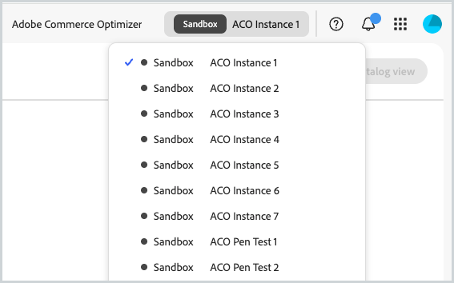

# 開始使用

本指南會逐步引導您完成設定[!DNL Adobe Commerce Optimizer]。 雖然本指南涵蓋所有角色，但如需開發人員特定內容的詳細資訊，請參閱[開發人員檔案](https://developer.adobe.com/commerce/services/optimizer/)。

## 執行個體型別和環境隔離

Adobe Commerce Optimizer針對不同的環境使用個別的執行個體，例如&#x200B;**沙箱**&#x200B;和&#x200B;**生產**。 每個執行個體都有自己的執行個體ID和獨立的資料，包括目錄檢視、原則、搜尋設定和產品建議。

與Adobe Commerce as a Cloud Service、協力廠商商務平台或Edge Delivery Services店面整合時，請一律比對環境：

- 將&#x200B;**Sandbox Optimizer執行個體**&#x200B;連線到非生產商業和店面環境。
- 將&#x200B;**production Optimizer執行個體**&#x200B;連線到生產商務和店面環境。

將沙箱環境與生產環境混合會導致目錄資料不一致、未預期的搜尋和銷售行為以及不可靠的量度。 設定整合時，請在Commerce Cloud Manager中使用執行個體型別和執行個體ID作為您的真實來源。

## 先決條件

開始之前，請確定您已：

- 具有[!DNL Adobe Commerce Optimizer]許可權的&#x200B;**Adobe Experience Cloud帳戶**
- **組織管理員存取權**&#x200B;以建立執行個體和管理使用者
- **GitHub帳戶**，用於載入範例資料和店面開發
- **基本瞭解**&#x200B;電子商務概念

## 快速入門手冊

請依照下列基本步驟執行[!DNL Adobe Commerce Optimizer]環境：

### 步驟1. 建立例項

1. 登入[Adobe Experience Cloud](https://experience.adobe.com/)。
1. 導覽至&#x200B;**Commerce** > **Commerce Cloud管理員**。
1. 按一下&#x200B;**新增執行個體** > **Commerce Optimizer**。

   {width="60%" zoomable="yes"}

1. 設定執行個體設定：
   - **執行個體名稱**：描述性名稱（例如「My Company Sandbox」）
   - **描述**：用途的簡短描述
   - **環境型別**：從測試的&#x200B;**沙箱**&#x200B;環境開始
   - **地區**：選取您偏好的地區

1. 按一下&#x200B;**新增執行個體**。

   Cloud Manager會更新以包含您的新執行個體。 如需存取和管理它的詳細資訊，請參閱[管理執行個體](#manage-instances)。

>[!NOTE]
>
>您只能在北美地區建立沙箱環境。 一旦建立例證，您就無法變更區域。

### 步驟2. 設定您的環境

建立執行個體後：

1. 從Commerce Cloud Manager [管理您的執行個體](#manage-instances)。
1. 使用[使用者管理指南](./user-management.md)設定使用者存取權。

### 步驟3. 新增範例資料（可選）

若要進行測試和學習，請依照[載入範例資料](#add-sample-data)的指示進行。

## 角色型工作流程

[!DNL Adobe Commerce Optimizer]設定和管理依賴三個關鍵角色。 每個角色都有特定的任務和責任：

![&#x200B; [!DNL Adobe Commerce Optimizer]安裝程式的角色型工作流程，顯示管理員、開發人員和使用者工作](./assets/high-level-workflow.png){zoomable="yes"}

### 管理員任務

管理員可管理執行個體、使用者和組織設定。

| 任務 | 說明 | 連結 |
|---|---|---|
| **管理使用者** | 新增使用者、開發人員和管理員 | [使用者管理](./user-management.md) |
| **建立執行個體** | 設定沙箱和生產環境 | [建立執行個體](#step-1-create-an-instance) |
| **管理執行個體** | 檢查狀態、更新執行個體名稱和說明，並取得應用程式和API存取的金鑰URL | [管理執行個體](#manage-instances) |
| **設定存取權** | 設定目錄檢視和原則 | [目錄檢視](./setup/catalog-view.md) |

### 開發人員工作

開發人員負責技術實作和資料整合，包括平台架構工作。

| 任務 | 說明 | 連結 |
|---|---|---|
| **存取Developer Console** | 建立專案並產生認證 | [Developer Console](https://developer.adobe.com/developer-console/docs/guides/getting-started) |
| **擷取目錄資料** | 從現有系統匯入產品資料 | 若要將資料直接內嵌至Adobe Commerce Optimizer，請參閱[資料內嵌API](https://developer.adobe.com/commerce/services/optimizer/data-ingestion/){target="_blank"}。  若要在雲端或內部部署環境或其他協力廠商系統上從Commerce內嵌資料，請參閱[整合](./integrations/integrations-overview.md){target="_blank"}主題。 |
| **設定店面** | 設定Edge Delivery Services店面 | [店面設定](./storefront.md) |

### 銷售商任務

銷售人員透過產品探索和推薦，最佳化並個人化購物體驗。 他們也會使用購物者資料和分析，針對店面的產品放置、定價和促銷活動進行策略決策。

| 任務 | 說明 | 連結 |
|---|---|---|
| **產品探索** | 設定搜尋和篩選 | [銷售概述](./merchandising/overview.md) |
| **搜尋設定** | 管理語意搜尋（預設為啟用）和選擇性調整 | [設定 — 進階搜尋](./settings.md#advanced-search)和[語意搜尋](./setup/semantic-search.md) |
| **建議** | 設定AI支援的產品推薦 | [產品建議](./merchandising/recommendations/overview.md) |
| **效能追蹤** | 監視成功量度 | [成功量度](./manage-results/success-metrics.md) |

## 管理執行個體

從Commerce Cloud Manager管理執行個體。

>[!NOTE]
>
>並非所有[!DNL Adobe Commerce Optimizer]使用者都可以存取Cloud Manager。 存取權取決於指派給使用者帳戶的角色和許可權。

1. 登入[Adobe Experience Cloud](https://experience.adobe.com/)。

1. 開啟Commerce Cloud Manager：

   - 在&#x200B;**快速存取**&#x200B;底下，按一下&#x200B;**Commerce**。
   - 檢視您可用的執行個體。

### 搜尋和篩選執行個體

登入後，控制面板會顯示組織中可用的所有Commerce產品例項。
「產品」欄會指出為哪個Commerce應用程式布建了執行個體。

{zoomable="yes"}

使用篩選和搜尋工具，依建立日期、區域、建立者、產品型別、環境或狀態快速尋找特定例項。

### 存取[!DNL Adobe Commerce Optimizer Studio]管理介面

應用程式開啟後，可在沙箱和生產環境等環境之間輕鬆切換，以便檢視每個環境的資料和設定，而無需返回Commerce Cloud Manager。

1. 在Commerce Cloud管理員中，按一下執行個體名稱以開啟[!DNL Adobe Commerce Optimizer Studio]。

1. 在不離開應用程式的情況下在[!DNL Adobe Commerce Optimizer]個執行個體之間切換。

   - 按一下執行處理下拉式清單，以檢視組織中可用的所有Optimizer執行處理。

     用於選取[!DNL Adobe Commerce Optimizer]環境的{zoomable="yes"}

- 選取要檢視的執行個體。

>[!NOTE]
>
>若要返回Commerce Cloud管理員以檢視執行個體詳細資料或管理執行個體，請按一下Commerce Optimizer頂端導覽左上角的 （應用程式）圖示。

### 取得執行個體詳細資訊

按一下執行處理名稱旁的資訊圖示，即可檢視執行處理的詳細資訊。

顯示端點和執行個體識別碼的![[!DNL Adobe Commerce Optimizer]執行個體詳細資料面板](./assets/aco-instance-details.png){width="60%" zoomable="yes"}

請注意下列重要資訊：

- **GraphQL端點** GraphQL端點您的店面會使用[銷售服務API](https://developer.adobe.com/commerce/services/optimizer/merchandising-services/){target=_blank}，從此執行個體查詢目錄和銷售資料
- **目錄端點** REST API端點，用來從您的商務或PIM系統擷取產品和價格到Adobe Commerce Optimizer。 檢視[資料擷取API](https://developer.adobe.com/commerce/services/optimizer/data-ingestion/)
- **Commerce Optimizer URL**&#x200B;開啟[Adobe Commerce Optimizer Studio](overview.md)管理UI以設定和管理目錄檢視、原則及銷售。
- **執行個體識別碼**：此Adobe Commerce Optimizer執行個體的唯一識別碼（租使用者ID），由店面、API和工具用來連線到正確的環境。

如果您是開發人員，您需要這些詳細資料來設定您的開發環境並連線到[!DNL Adobe Commerce Optimizer] API。

>[!NOTE]
>
>若要存取執行個體詳細資訊，您必須在Adobe IMS組織中擁有必要許可權。 如果您看不到執行個體詳細資訊或無法存取應用程式，請聯絡您的組織管理員。

### 編輯執行個體名稱和說明

視需要更新執行個體名稱和說明。

1. 按一下執行個體名稱旁的&#x200B;**編輯**&#x200B;圖示。
1. 視需要更新&#x200B;**執行個體名稱**&#x200B;和&#x200B;**描述**。
1. 按一下&#x200B;**儲存**。

## 新增範例資料

Adobe提供GitHub存放庫和範例資料與工具，協助您學習及測試[!DNL Adobe Commerce Optimizer]功能。
範例資料是以[Carvelo商業案例](./use-case/admin-use-case.md)為基礎，並包含：

- 含汽車零件的產品目錄
- 多重價格簿與訂價案例
- 不同經銷商的目錄檢視和原則
- 完成端對端工作流程範例

**載入範例資料：**

1. 存取[範例目錄資料擷取](https://github.com/adobe-commerce/aco-sample-catalog-data-ingestion) GitHub存放庫。

1. 請依照存放庫的README檔案中的設定指示，完成下列工作：

   - 設定您的環境
   - 完成資料擷取程式
   - 使用範例資料建立目錄檢視和原則
   - 檢查[資料同步](./setup/data-sync.md)頁面上的目錄服務資料，以驗證資料擷取

## 後續步驟

完成設定後：

1. 設定您的店面：
   - 設定[Edge Delivery Services店面](./storefront.md)
   - 連線到您的目錄資料

1. 探索Carvelo使用案例：
   - 遵循[端對端工作流程](./use-case/admin-use-case.md)
   - 在真實情境中實作

1. 設定銷售：
   - 設定[產品探索](./merchandising/overview.md)
   - 建立[建議](./merchandising/recommendations/overview.md)

1. 監視效能：
   - 追蹤[成功量度](./manage-results/success-metrics.md)
   - 分析[搜尋效能](./manage-results/search-performance.md)

## 疑難排解

### 常見問題

| 問題 | 解決方案 |
|---|---|
| **無法建立執行個體** | 確認您擁有[!DNL Adobe Commerce Optimizer]權益和管理員許可權。 |
| **執行個體未出現** | 檢查您的Adobe IMS組織並重新整理頁面。 |
| **無法存取執行個體** | 確定您已新增為Admin Console中的使用者。 |
| **範例資料未載入** | 驗證您的執行個體憑證和API端點。 |

### 取得協助

- **開發人員資源**： [開發人員檔案](https://developer.adobe.com/commerce/services/optimizer/)
- **店面資源**： [Commerce店面檔案](https://experienceleague.adobe.com/developer/commerce/storefront/?lang=zh-Hant)
- **教學課程**： [Commerce Optimizer教學課程](https://experienceleague.adobe.com/zh-hant/docs/commerce-learn/tutorials/adobe-commerce-optimizer/overview)
- **支援**： [Adobe Commerce支援資源](https://experienceleague.adobe.com/zh-hant/docs/commerce-knowledge-base/kb/overview)
