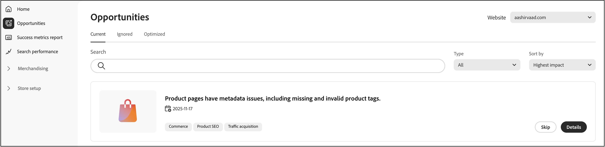
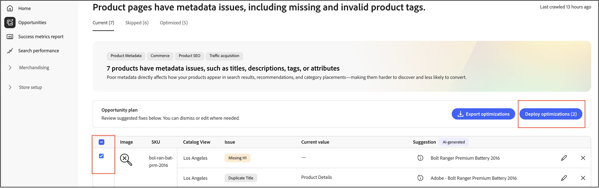
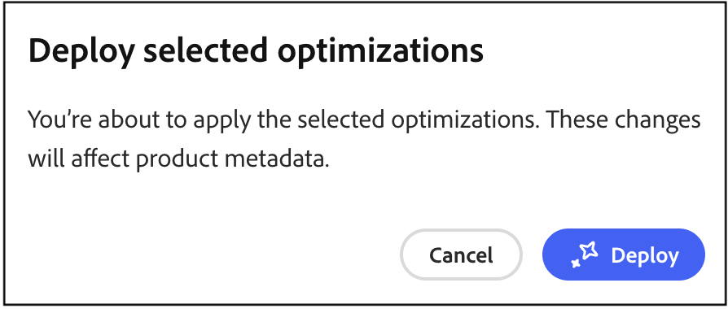
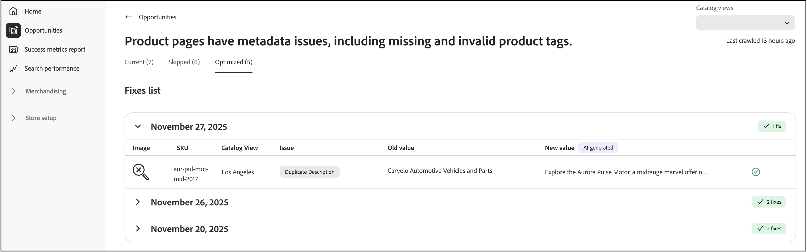
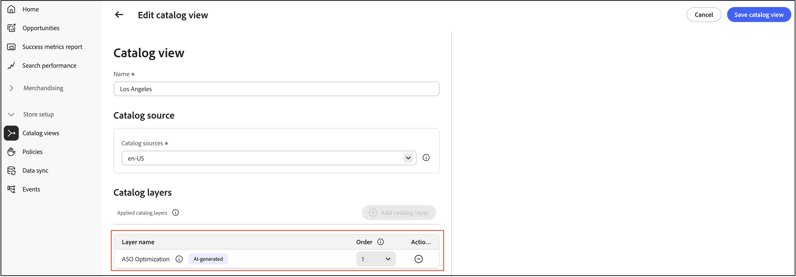

# 機會

**機會**&#x200B;頁面可協助您識別並實作最佳化，以透過與Adobe Sites Optimizer整合來改善網站流量、使用者參與和轉換率。

## 什麼是機會？

[機會](https://experienceleague.adobe.com/zh-hant/docs/experience-manager-sites-optimizer/content/documentation/opportunities/overview)是AI支援的建議，可協助銷售人員識別並解決影響其商務網站效能的問題。 這些建議由[Adobe Experience Manager Sites Optimizer](https://experienceleague.adobe.com/zh-hant/docs/experience-manager-sites-optimizer/content/home)提供支援，這是一項雲端型服務，可分析和改善網站效能。

## 主要功能

- **自動問題偵測**—Sites Optimizer會持續掃描產品目錄、搜尋記錄檔及建議資料，以識別影響探索的問題。
- **AI驅動的建議** — 接收智慧型建議以解決偵測到的問題。
- **影響分類** — 問題依業務影響（搜尋、建議、瀏覽/導覽、產品資料品質）進行分類。
- **儀表板報告** — 檢視問題趨勢、最常受影響的產品或查詢，以及隨著時間推移的改善專案。

## 開始使用

若要在Commerce Optimizer中啟用商機，請聯絡您的客戶成功案例經理(CSM)。 **Ultima** Adobe Sites Optimizer授權提供商機。

## 快速導覽

「機會」頁面會組織為三個索引標籤，協助您管理最佳化建議：

- **目前（作用中）** — 顯示新偵測到的需要檢閱和動作的機會。 這些是可能會影響您網站效能的現用問題。
- **已略過** — 包含您已選擇解除或延期的機會。 如果商機與您目前的業務目標無關，您可以在此處移動商機。
- **最佳化（完成）** — 顯示已透過自動修正部署成功處理的機會。 任何手動處理的機會都不會顯示在此標籤上。 此索引標籤可協助您追蹤一段時間內的自動修正商機。

## 自動偵測工作流程

自動偵測工作流程會使用AI支援的分析，自動識別整個產品目錄中的最佳化機會。 此自動化掃描程式會持續監控您的產品資料、搜尋記錄檔和建議效能，以偵測可能影響網站效能、SEO和客戶參與的問題。

### 運作方式

自動偵測運用Adobe Experience Manager Sites Optimizer來：

- **分析產品頁面** — 系統會檢查產品詳細資料頁面的前200個頁面和篩選器，以識別最佳化目標。
- **擷取中繼資料** — 會從每個頁面擷取Meta標籤（標題、說明、H1標題）以供分析。
- **產生AI建議** — 透過Adobe的AI工作流程處理擷取的資料，以建立可採取行動的最佳化建議。
- **填入商機** — 自動偵測的建議會顯示在&#x200B;**目前（作用中）**&#x200B;標籤中，以供您檢閱。

### 先決條件

在自動偵測可以產生建議之前，您的目錄資料必須同步並處於最新狀態，以確保建議準確。

### 後續步驟

自動偵測識別最佳化機會後，您可以：

- 檢閱&#x200B;**目前（作用中）**&#x200B;標籤中的建議最佳化。
- 使用[自動修正工作流程](#auto-fix-workflow)自動部署修正（針對支援的[機會型別](#supported-opportunity-types)）。
- 在您的Commerce管理員中手動實作變更。
- 忽略不符合您業務目標的機會。

## 自動修正工作流程

自動修正工作流程可讓您按一下即可快速部署AI產生的最佳化。 當您套用自動修正時，系統會建立目錄最佳化層，該層會覆寫特定產品屬性而不修改原始產品資料。 您的原始產品資料會維持不變，可讓您隨時安全地套用最佳化及還原變更。 請參閱[目錄圖層如何與自動修正](#how-catalog-layers-work-with-auto-fix)搭配使用，以瞭解更多資訊。

### 支援的機會型別

以下列出支援的機會型別：

- 標題太長
- 標題太短
- 重複的標題
- 缺少標題
- 空白標題
- 說明太長
- 說明太短
- 缺少說明
- 空白說明
- 複製說明
- 缺少H1
- 複製H1
- H1太長

>[!NOTE]
>
>目前不支援頁面上的多個H1。

### 先決條件

在使用自動修正之前，請確定：

- 您的產品目錄已完全內嵌至Commerce Optimizer。
- 機會型別支援自動修正（某些最佳化型別需要手動實施）。
- 您擁有適當的許可權可建立和管理目錄圖層。

>[!IMPORTANT]
>
>自動修正功能需要完全內嵌的產品目錄。 如果您的目錄尚未內嵌，您仍然可以使用提供的CSV檔案手動檢視商機並實作修正。 請注意，不會在&#x200B;**最佳化（完成）**&#x200B;索引標籤中追蹤手動實作。

### 部署自動修正最佳化

請依照下列步驟實作AI建議的最佳化：

1. 瀏覽至&#x200B;**管理結果** > **機會**。

1. 在&#x200B;**目前（作用中）**&#x200B;索引標籤中，檢閱可用的最佳化建議。

1. 選取商機。

   

   >[!NOTE]
   >
   >**部署最佳化**&#x200B;按鈕僅適用於[支援的建議型別](#supported-opportunity-types)。 對於不支援的型別，此核取方塊已停用，您必須在目錄中手動套用修正。

1. 按一下&#x200B;**部署最佳化**，然後按一下&#x200B;**部署**&#x200B;以觸發自動修正程式。

   

   系統會在背景執行下列動作：

   - 為產品建立新的目錄層（如果尚未存在）。
   - 根據AI建議更新相關屬性（例如中繼標題、說明或H1）。
   - 指定新圖層為目錄檢視中的最高優先順序（順序1）。
   - 透過目錄店面服務驗證變更。

1. 監視部署狀態。 驗證完成後，系統會自動更新建議狀態。

1. 最佳化後，建議會移至具有狀態指標的&#x200B;**最佳化（完成）**&#x200B;標籤：

   - **綠色核取記號** — 最佳化圖層已設定為優先順序，並主動套用至您的店面。
   - **警告圖示** — 圖層存在，但不是最高優先順序，表示它可能被其他圖層覆寫。

   

>[!NOTE]
>
>自動修正支援任何語言網站的中繼資料最佳化。 Sites Optimizer會以其原始語言分析產品詳細資料頁面、產生當地語系化的AI建議，以及根據目錄檢視中設定的來源地區設定來建立目錄圖層。

### 目錄圖層與自動修復的搭配方式

如果目錄檢視中不存在Adobe Sites Optimizer圖層，自動修正會自動建立一個圖層，並為其指定順序1 （最高優先順序）。 如果您刪除此圖層，則會在下次自動修復執行時重新建立該圖層，並將現有圖層移至較低順序的數字。 如果Adobe Sites Optimizer層已存在於其他訂單編號，自動修正不會變更其優先順序。 如果要保留自動修復圖層，但不立即使用，您可以停用圖層。 深入瞭解如何管理[目錄層](../setup/catalog-layer.md#activate-or-deactivate-layers)。

此圖表顯示名為&#x200B;**ASO最佳化**&#x200B;的單一資料列。 此專案代表您選擇自動修正的所有商機。 無論您是自動修正單一商機還是多個商機，它們都會出現在這單一&#x200B;**ASO最佳化**&#x200B;列中。 圖層是每個目錄檢視所專屬，因此此處顯示的&#x200B;**Los Angeles**&#x200B;目錄檢視只有在作用中檢視時，才會套用其&#x200B;**ASO最佳化**&#x200B;圖層。

### 重要考量

使用自動修正時，請記住下列事項：

- 針對每個建議顯示的狀態會反映自動修正背景工作程式執行時的狀態。 如果您之後手動重新排序型錄圖層，則狀態不會動態更新。

- 為確保您的最佳化保持作用中，請避免在部署自動修正建議後手動變更目錄層優先順序。

### 疑難排解

如果最佳化似乎未套用至您的店面：

1. 檢查&#x200B;**最佳化（完成）**&#x200B;索引標籤中的狀態指示器。
1. 如果您看到警告圖示，請確認目錄層優先順序設定。
1. 確認最佳化圖層在目錄檢視中設為順序1 （最高優先順序）。
1. 確認目錄資料同步處理作用中且為最新狀態。
1. 允許有時間傳播變更。 即使訂單1有正確設定的圖層，變更仍可能需要一段時間才會出現在您的店面上，類似於發佈新產品時的延遲。

## Sites Optimizer和成功量度如何搭配運作

成功量度會監控關鍵績效指標，例如產品探索和目錄業務效率，而Sites Optimizer中的機會則可讓您瞭解如何提升SEO、載入速度、協助工具和參與度。 銷售商和行銷人員可以一起改善營運效率，以最少的IT支援提供更快的端對端效能和轉換增益。 若要瞭解如何運用這兩種技術來改善店面效能和體驗，請參閱[將成功量度和Sites Optimizer搭配使用](./success-metrics.md#using-success-metrics-and-sites-optimizer-together)。

## 進一步瞭解Sites Optimizer

如需Sites Optimizer功能與功能的詳細資訊，請參閱[Adobe Experience Manager Sites Optimizer檔案](https://experienceleague.adobe.com/zh-hant/docs/experience-manager-sites-optimizer/content/home)。

其他資源：

- [機會型別](https://experienceleague.adobe.com/en/docs/experience-manager-sites-optimizer/content/opportunities) — 瞭解可用的最佳化機會。
- [Sites Optimizer功能](https://experienceleague.adobe.com/en/docs/experience-manager-sites-optimizer/content/capabilities) — 探索Sites Optimizer的功能。

## 更多相關資訊

- [成功量度](success-metrics.md) — 監視關鍵績效指標。
- [搜尋效能](search-performance.md) — 分析搜尋辭彙並最佳化關聯性。
- [建議效能](recommendation-performance.md) — 監視建議有效性。
