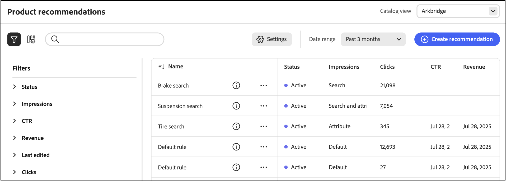
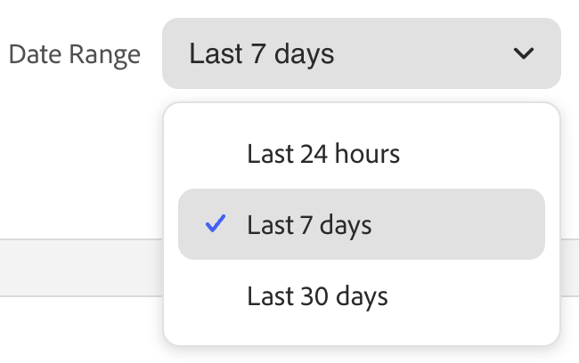

# Recommendations效能

「Recommendations效能」頁面會顯示已設定建議的清單，以及可幫助您評估其效能的關鍵測量結果。 您可以設定檢視以顯示過去一天、一週或月的量度。 這些見解會顯示每個建議單位被檢視或點按的頻率，可幫助您評估效能並識別最佳化機會。

>[!INFO]
>
>建議單位是包含建議產品&#x200B;_專案_&#x200B;的Widget。

{zoomable="yes"}

## 檢視報告

1. 選擇您的建議套用的&#x200B;**目錄來源**，例如`en-US`。

1. 按一下&#x200B;**[!UICONTROL Date Range]**&#x200B;並選取下列範圍之一：

   

   建議表格會更新，顯示該日期範圍的量度。

## 自訂表格

1. 在左上角，按一下圖示以自訂表格。

   可見欄有核取記號。

1. 在功能表中，執行下列任一項作業：

   - 若要顯示隱藏的欄，請按一下任何沒有核取記號的欄名稱。
   - 若要隱藏可見欄，請按一下帶有核取記號的欄名稱。

   表格會重新整理以僅包含所選欄。

## 檢視詳細資料

1. 在表格中，按一下您要檢查的建議旁的（）圖示。

1. 若要變更建議狀態，請按一下[啟用] **&#x200B;**&#x200B;或[停用] **&#x200B;**。

## 建立或管理建議

瞭解如何[建立新的或管理現有的](../merchandising/recommendations/create.md)建議。

## Workspace控制項

| 控制 | 說明 |
|---|---|
|  | 決定用於量度計算的時間範圍。 |
|  | 決定顯示在Recommendations表格中的欄。 |
| 建立推薦 | 開啟[建立新建議](../merchandising/recommendations/create.md)頁面。 |

## 欄說明

| 欄 | 說明 |
|---|---|
| 名稱 | 建議的名稱。 |
| 頁面 | 建議出現的頁面。 |
| 型別 | 建議型別。 |
| 狀態 | 建議狀態。 選項：非作用中/作用中/草稿 |
| 已建立 | 建立建議的日期。 |
| 上次編輯時間 | 上次編輯建議的日期。 |
| 曝光數 | 在頁面上載入及轉譯建議單位的次數。 位於瀏覽器檢視區摺頁下方的建議單位會呈現在頁面上，即使購物者並未檢視該單位亦然。 在此情況下，演算後的單位會計為曝光，但只有購物者將單位捲動進入檢視時，才會計入檢視。 |
| 曝光數 | （可檢視的曝光數）至少註冊一個檢視的建議單位數。 例如，如果推薦單位有兩行，每行有兩個產品，而購物者看不到最後兩個產品，但前兩個產品是，則活動仍會計為曝光。 |
| 檢視 | 顯示在購物者瀏覽器檢視區中的建議單位數量。 如果購物者向上或向下捲動頁面多次，事件會引發多次，而每次都可以檢視單位。 |
| 點按次數 | 購物者點按建議單位中專案的次數總和，以及購物者點按建議單位中&#x200B;**加入購物車**&#x200B;按鈕的次數 |
| 收入 | 目前時間範圍之建議所驅動的收入。 |
| Lt收入 | （期限收入）由建議驅動的期限收入。 |
| 可檢視度 | 註冊檢視的建議單位百分比。 |
| CTR | （點進率）註冊點按之建議的單位曝光次數百分比。 CTR會計算所有曝光數，即使單位未進入購物者的檢視。 如果未檢視建議單位，就不太可能被點按。 但是，這些看不見的曝光數會計入CTR分數，並減少整體CTR百分比。 |
| vCTR | （可檢視點進率）只會根據可檢視的曝光數（實際出現在購物者熒幕可見部分的建議）來測量點按，以更準確地衡量購物者參與度。 |
