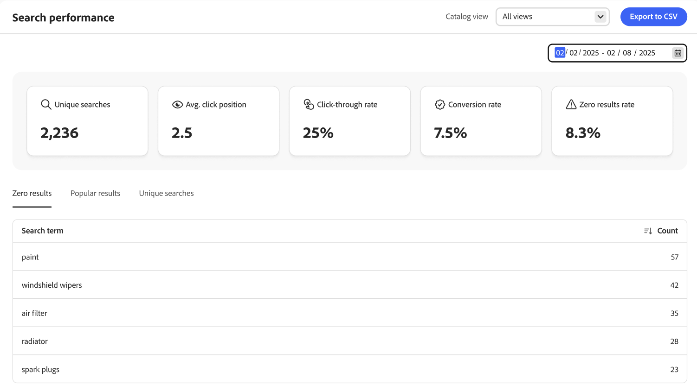
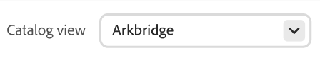

# 搜尋效能

*搜尋效能*&#x200B;頁面可讓insight掌握購物者使用的搜尋辭彙。 此資訊可用於識別趨勢、增加點進和提高轉換率。 「搜尋效能」頁面提供特定日期範圍的搜尋測量結果快照，包括下列報表：

- 不重複搜尋
- 平均點按位置
- 點進率
- 轉換率
- 零結果率

{zoomable="yes"}

>[!IMPORTANT]
>
>如果您沒有看到任何搜尋效能測量結果，請確定正在[收集搜尋事件資料](../setup/events/overview.md)。

## 選擇&#x200B;**目錄檢視**

選取[目錄檢視](../setup/catalog-view.md)以檢視特定的搜尋效能結果。

## 檢視報告

按一下行事曆，然後執行下列任一項作業：

- 若要指定單一日期，請連按兩下行事曆上的日期。
- 若要指定日期範圍，請按一下行事曆上的第一個和最後一個日期。

>[!NOTE]
>
>日期範圍不能超過一年。

按一下&#x200B;**[!UICONTROL Export to CSV]**&#x200B;產生搜尋效能的CSV檔案。

## 如何改善搜尋效能

下節提供可用來增強網站搜尋功能的策略，確保購物者獲得順暢而有效的體驗，最大化轉換率。

有幾個關鍵因素可決定搜尋結果的相關性和成效：

- 結構良好的產品資料可確保搜尋演演算法能夠有效地將產品與查詢比對。 低品質的產品資料會導致搜尋結果的相關性降低。 若要直接影響銷售策略的成功：
   - 將正確的[屬性設定為可搜尋](https://developer.adobe.com/commerce/services/reference/rest/#operation/createProductMetadata)及其對應的權重。
   - 請確定這些屬性中的資料具有相關性。
- 精心設計的搜尋體驗能建立客戶信任，並灌輸他們找到所需內容的信心。
- 搜尋規則至關重要，因為它們可以根據熱門程度、新到訪次數、促銷條件或任何其他銷售策略，提升特定產品的可見度，以滿足您的業務需求。
- 多面嚮導覽可讓購物者調整搜尋範圍，並快速取得相關結果。

### 監視搜尋結果

若要使用[!DNL Adobe Commerce Optimizer]最佳化搜尋結果，請監視相關的關鍵績效指標(KPI)，例如唯一查詢、平均點按位置、點進率、轉換率和零結果率，以瞭解購物者如何與您的搜尋功能互動。 此資料可引導您定期更新並調整搜尋規則。

- **不重複搜尋** — 在您的[!DNL Adobe Commerce Optimizer]網站上執行的不同搜尋查詢計數。 每個不重複搜尋只會計算一次，即使同一購物者或不同購物者重複多次搜尋亦同。 此量度可協助您瞭解客戶使用的搜尋字詞多樣性，並深入分析購物者想要哪些產品或資訊。 追蹤唯一搜尋可讓您：

   - 識別熱門搜尋趨勢和經常搜尋的專案。
   - 偵測您的產品目錄或內容中的潛在間隙。
   - 新增[同義字](../merchandising/synonyms/overview.md)、建立或更新[搜尋規則](../merchandising/rules/overview.md)，以最佳化搜尋功能。

- **平均點按位置** — 表示購物者在您的網站上執行搜尋查詢後，點選的搜尋結果平均位置。 此量度可讓您深入瞭解搜尋結果的相關性和成效。

  較低的平均點按位置（接近1）表示購物者可快速找到相關結果，表示您的搜尋策略有效。 它可協助您瞭解購物者的行為，以及他們願意捲動多遠才能找到想要的產品。 如果平均點按位置很高，可能表示最相關的結果沒有出現在頂端，這要求對您的搜尋策略進行審查和最佳化。

- **點進率(CTR)** — 測量在執行搜尋查詢後點選搜尋結果的購物者百分比。 高CTR表示搜尋結果對購物者而言具有相關性和吸引力，因為他們會按一下找到的結果。 監控CTR有助於找出需要改善的領域。 低CTR可能表示搜尋結果不符合購物者意圖，提示需要調整搜尋規則、增強產品資料或改善結果呈現。

- **轉換率** — 表示搜尋功能在推動銷售及達成業務目標方面的成效。 它反映了搜尋功能的整體效能，可滿足購物者的需求並促進順暢的購物體驗。 高轉換率表示您的搜尋結果高度相關且具有說服力，可引導購物者完成購買。 如果轉換率很低，可能會建議搜尋關聯性、產品可用性或購物者從搜尋到購買的整體歷程等問題。

- **零結果率** — 測量您[!DNL Adobe Commerce Optimizer]網站上未傳回結果的搜尋查詢百分比。 此量度對於瞭解購物者搜尋失敗的頻率至關重要，可讓您深入分析產品目錄或搜尋設定中的潛在差距。 高零結果率會讓購物者感到沮喪，導致不良購物體驗和潛在的客戶流失。 它可以指出目錄中缺少的產品或購物者正在搜尋的類別，以指導存貨和產品清單決策。

  若要降低零結果率，您可以：

   - 找不到完全相符的專案時，提供替代或相關的搜尋字詞，例如[同義字](../merchandising/synonyms/overview.md)。
   - 定期檢視零結果查詢以識別模式，並對產品目錄和搜尋設定進行必要的調整。

您可以使用此量度資料，透過下列方式將搜尋功能最佳化：

- 實作規則以自動在搜尋結果中將熱門產品排名較高。 經常點按或購買的產品可優先顯示在頂端。 手動整理特定搜尋查詢的熱門產品清單，並確保這些專案會醒目顯示。
- 反白標示目前趨勢或最近人氣飆升的產品。 這在季節性活動、假期或促銷期間特別有效。 若要達到此目的，請在設定搜尋規則時，使用更符合您的使用案例和業務需求的智慧型排名。
- 反白標示熱門篩選器或Facet （如果購物者經常依特定品牌或價格範圍進行篩選），釘選這些Facet並據此排序，讓這些選項更加顯眼。
- 當搜尋產生零個結果時，使用熱門結果資料來建議具有高購物者參與度的替代產品或相關類別。
- 分析熱門搜尋字詞和產品資料以識別重要關鍵字。 使用這些關鍵字最佳化您的產品可搜尋屬性，以改善搜尋關聯性。
- 定期分析您的結果資料，以瞭解不斷變化的趨勢、購物者偏好設定和行為、識別熱門搜尋字詞以及偵測問題。 使用此回饋迴路，持續精簡及改善您的搜尋規則和產品方案

## 最佳化您的搜尋功能

若要最佳化您的搜尋功能，請使用[同義字和拼字](../merchandising/synonyms/overview.md)，確保即使購物者使用不同的字詞和[面向](../merchandising/facets/overview.md)，購物者也能找到產品，以縮小搜尋結果的範圍。

## 改善搜尋結果關聯性

若要改善搜尋結果關聯性，請實作有效的[搜尋規則](../merchandising/rules/overview.md)，並使用產品中繼資料來確保精確且詳細的[屬性可搜尋](https://developer.adobe.com/commerce/services/reference/rest/#operation/createProductMetadata)。

### 影像

請確定可設定產品的子產品具有含有正確角色的影像。 擁有父項或子項產品可能會導致搜尋結果沒有影像。

>[!NOTE]
>
>搜尋結果中的影像可能會因搜尋字詞而異。 如果搜尋字詞判斷子產品更相關，則會使用子產品的影像，而非父產品的影像。

### 利用產品中繼資料

確定正確且詳細的產品[屬性已設定為可搜尋，且具有指派的權重](https://developer.adobe.com/commerce/services/reference/rest/#operation/createProductMetadata)。 請注意，SKU、名稱和類別屬性預設為可搜尋，且無法從搜尋中排除。 為達到最佳效果，請勿在SKU中使用空格。

若要增加搜尋關聯性，請為每個可搜尋的屬性指定加權。 權重較高的屬性在搜尋結果中應會顯示得較高。 依關聯性排序會受到多個條件影響，例如搜尋權重。 這表示有時候搜尋權重較低的屬性仍可以比搜尋權重較高的屬性有更多的關聯性。 其他條件可包含任何指定屬性中的相符專案數、找到的搜尋字詞位置，以及搜尋字詞前後的整體文字結構。

確保每個產品在每個可搜尋屬性內都有相關內容。 如果屬性包含大量內容，會降低搜尋結果的相關性，不建議將屬性設為可搜尋。

## 欄位說明

| 快照集資料 | 說明 |
|--- |--- |
| 不重複搜尋 | 指定日期範圍的唯一搜尋總數。 如果間隔超過一小時，則由同一購物者進行的多次搜尋（即使針對相同的查詢進行搜尋）會被視為唯一。 |
| 點進率 | 以購物者點選產品結尾的搜尋百分比。 例如，如果購物者搜尋「褲子」和「襯衫」，然後按一下「襯衫」搜尋中的一個結果，則點進率為50%。 |
| 轉換率 | 購物者在指定日期範圍內購買的產品佔購物者點按的產品數的百分比。 例如，如果購物者在彈出視窗中檢視六個產品、按一下其中一個產品併購物，則互動的轉換率為100%。   轉換率不受指定產品的檢視次數影響。 例如，如果購物者使用搜尋，但未按一下任何產品，則轉換率會維持不變。 |
| 零結果率 | 在指定日期範圍內未傳回任何結果的唯一搜尋百分比。 例如，如果購物者搜尋「fjjjjfjf」兩次（沒有結果）和「pants」一次（有結果），則零結果率為66.67%。 |
| 平均 按一下位置 | 根據指定日期範圍的不重複搜尋的平均點進率的相對位置。 |

| 報表 | 說明 |
|--- |--- |
| 零個結果 | 列出未傳回結果的搜尋查詢，以及在指定日期範圍內使用的次數。 報表限制：前500個詞語 |
| 常見結果 | 列出在指定日期範圍內檢視次數最多的產品名稱。 熱門結果僅根據曝光次數計算，不受點按次數或產生收入的影響。 報表限制：前500個詞語 |
| 不重複搜尋 | 列出指定日期範圍內使用的唯一搜尋查詢。 報表資料的計算方式與不重複搜尋快照資料相同。 如果購物者輸入相同的搜尋查詢兩次，但間隔超過一小時，則搜尋被視為兩個不重複搜尋。 報表限制：前500個詞語 |

## 預設非系統屬性屬性

下表顯示非系統屬性的預設搜尋和可篩選特性。 將&#x200B;*Use in Search*&#x200B;屬性屬性設定為`Yes`可讓屬性在[!DNL Adobe Commerce Optimizer]中可搜尋。

| 屬性代碼 | 可搜尋 |
|--- |--- |
| 活動 | 是 |
| attributes_brand | 是 |
| 品牌 | 是 |
| 氣候 | 是 |
| 項圈 | 是 |
| 顏色 | 是 |
| 成本 | 是 |
| eco_collection |  |
| 性別 | 是 |
| 製造商 | 是 |
| 材質 | 是 |
| 用途 | 是 |
| strap_bag | 是 |
| style_general | 是 |

## 預設系統屬性屬性

下表顯示系統屬性的預設搜尋和可篩選特性。

| 屬性代碼 | 可搜尋 |
|--- |--- |
| allow_open_amou | 是 |
| 說明 | 是 |
| 名稱 | 是 |
| 價格 | 是 |
| short_description | 是 |
| sku | 是 |
| 狀態 | 是 |
| tax_class_id | 是 |
| url_key | 是 |
| 權重 | 是 |
