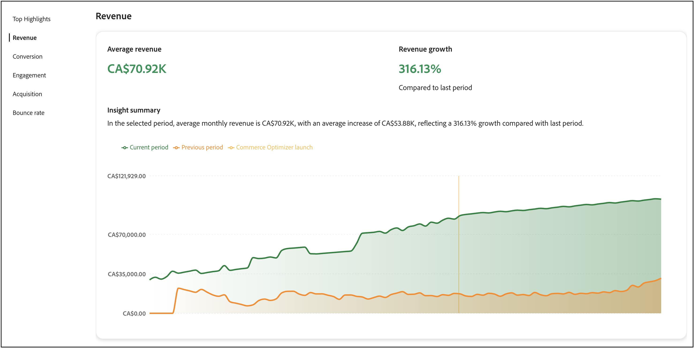
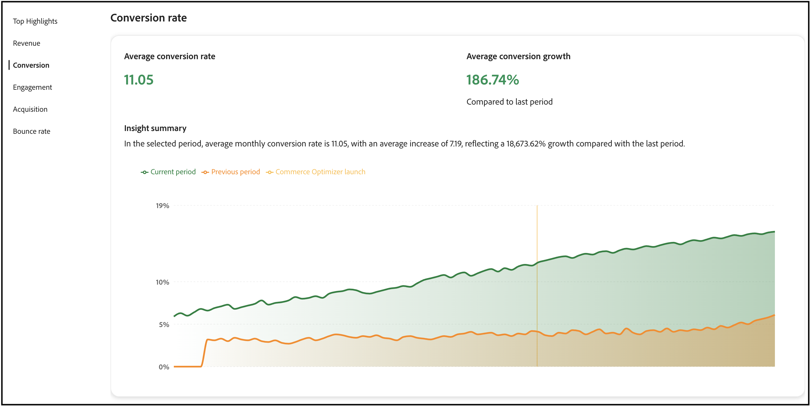
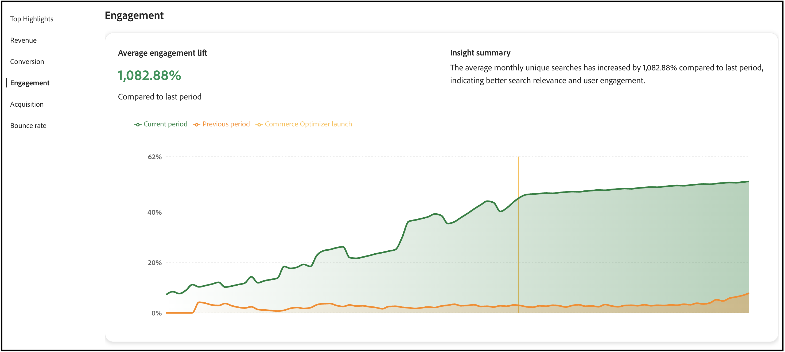
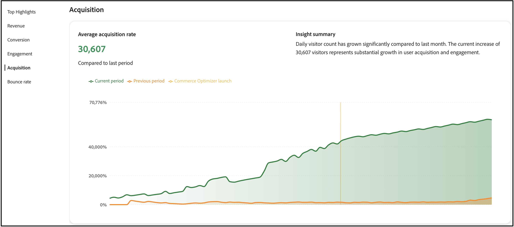
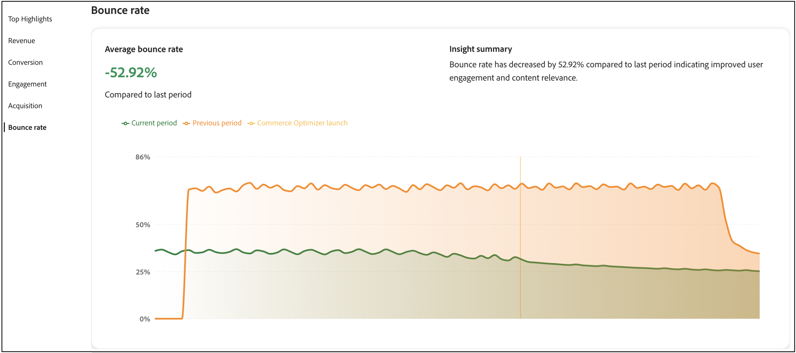

# 成功量度

此頁面提供您[!DNL Adobe Commerce Optimizer]存放區關鍵績效量度的概觀。 目標是讓您快速瞭解實作[!DNL Adobe Commerce Optimizer]的結果，然後協助您和您的團隊找出成長機會，並強調最佳化領域。

報告中的量度是從店面事件資料中提取。 [進一步瞭解](../setup/events/overview.md)所收集的事件資料。

## 瞭解您的量度

成功量度報錶針對直接影響業務結果的五個關鍵效能領域提供可操作的深入分析。 每個量度都會顯示客戶行為和商店績效的模式，協助您發掘機會並解決挑戰。 利用這些見解推動更聰明的決策，並最佳化您的商務體驗。

**熱門焦點**&#x200B;摘要每個效能區域的關鍵量度。 使用此區段來快速找出您的最大改善機會。

關鍵績效指標包括：

- **收入** — 您顯示總銷售績效的主要財務量度。
- **轉換** — 完成購買的訪客百分比。
- **參與** — 使用者與您的網站互動的積極程度。
- **贏取** — 客戶贏取工作的有效性。
- **跳出率** — 僅檢視一個頁面後離開的訪客百分比。

## 產生報表

1. 從左側邊欄中，選取&#x200B;**成功量度**。
1. 在&#x200B;**報表組態**&#x200B;下，根據您的地區設定指定&#x200B;**日期範圍**、**目錄來源**&#x200B;和&#x200B;**貨幣**。
1. 按一下&#x200B;**[!UICONTROL Apply]**。

   **熱門焦點**、**收入**、**轉換**、**參與**、**贏取**&#x200B;和&#x200B;**跳出率**&#x200B;都根據您的報告設定更新。

1. 按一下「**[!UICONTROL Export]**」以將報表儲存為PDF。

## 後續步驟和最佳化策略

使用您的成功量度資料來找出改善的機會並實施目標式最佳化策略。 以下章節提供每個量度區域的特定可操作指引。

### 收入最佳化

針對收入，您的目標是增加總銷售和平均訂單值。

#### 策略

- **實作AI支援的建議**：使用最佳化處理程式的建議引擎，呈現可推動更高轉換率的相關產品。 部署&#x200B;*瀏覽過此專案的客戶也瀏覽了*&#x200B;和&#x200B;*購買了此專案，但購買了那*&#x200B;個推薦型別以增加交叉銷售機會。

- **建立銷售規則**：使用[銷售規則](../merchandising/rules/overview.md)提升搜尋結果中的高利潤產品。 將最暢銷商品釘選到高流量查詢的搜尋結果頂端。

- **最佳化產品探索**：使用[智慧型Facet](../merchandising/facets/overview.md)協助客戶更有效率地尋找產品，進而提高轉換率並增加收入。

- **利用季節性商機**：建立時間型銷售規則，在尖峰購物期間促銷季節性或促銷專案。

### 轉換率改善

若要改善轉換率，您的目標是將更多訪客轉化為客戶。

#### 策略

- **最佳化搜尋關聯性**：實作[同義字](../merchandising/synonyms/overview.md)，以確保客戶找到他們想要的，即使搜尋字詞不同。 使用動態多面向來提供相關的篩選選項。

- **策略建議位置**：在高流量頁面（例如產品詳細資料頁面和類別頁面）上部署建議單位。 使用&#x200B;*檢視次數最多*&#x200B;和&#x200B;*購買次數最多*&#x200B;的建議來建立信任和緊急性。

- **提升產品可見度**：使用銷售規則來確保最暢銷和轉換率高的產品會出現在搜尋結果的顯眼位置。

- **A/B測試建議型別**：實驗不同的建議型別和位置，以找出最適合您對象的專案。

### 參與增強功能

若要提高參與度，您的目標是增加客戶互動和網站逗留時間。

#### 策略

- **分散建議型別**：避免重複顯示相同的建議。 混合使用&#x200B;*為您推薦的*、*趨勢*&#x200B;和&#x200B;*最近檢視的專案*，讓內容保持新鮮、吸引人。

- **實作智慧型搜尋**：使用AI驅動的動態多面向和結果重新排名，根據購物者行為即時調整搜尋結果。

- **建立個人化體驗**：在首頁和整個客戶歷程中部署「為您推薦」的單元，以提供個人化的產品建議。

- **最佳化搜尋體驗**：使用同義字來改善搜尋關聯性，並確保客戶能快速找到他們想要的。

### 收購成長

若要獲得更多成長，您的目標是吸引更多新客戶，並提升贏取效率。

#### 策略

- **利用搜尋效能資料**：使用[搜尋效能](../manage-results/search-performance.md)報告來識別趨勢產品與熱門搜尋詞。 建立銷售規則以反白顯示這些專案。

- **最佳化建議效能**：監視[建議效能](../manage-results/recommendation-performance.md)量度，以識別哪些建議型別帶來最多流量和轉換。

- **強調新的和促銷專案**：使用銷售規則來提升搜尋結果中的新產品或促銷專案，以吸引新訪客的注意。

- **追蹤流量來源**：使用事件資料來瞭解哪些管道帶來最有價值的流量，並據此最佳化您的行銷工作。

### 跳出率降低

若要降低跳出率，您的目標是讓訪客持續參與並減少單頁造訪。

#### 策略

- **改善搜尋關聯性**：使用同義字和智慧型多面向來確保客戶快速找到相關產品。 搜尋結果不佳，是造成高跳出率的主要原因。

- **實作建議單位**：在類別和搜尋結果頁面上部署建議單位，以提供其他產品選項並保持訪客參與。

- **最佳化產品探索**：使用銷售規則，確保最相關且最受歡迎的產品會先出現在搜尋結果中。

- **建立吸引人的首頁體驗**：在首頁上使用「為您推薦」和「趨勢」建議型別，以立即與訪客互動相關的內容。

## 疑難排解和最佳化

### 當量度下降時

**收入下降**：

- 檢查建議單位是否仍然有效且執行良好
- 檢閱銷售規則，確保高利潤的產品能夠進行促銷
- 分析搜尋效能，以識別熱門產品是否仍然排名良好

**轉換率下降**：

- 確認已維持搜尋關聯性（檢查同義字和Facet）
- 確保建議單位正確顯示
- 檢閱任何衝突或問題的銷售規則

**高跳出率**：

- 檢查搜尋結果關聯性，並視需要實作同義字
- 確定建議單位已正確載入
- 檢閱產品資料品質和可用性

**低參與度**：

- 分散建議型別，避免客戶疲勞
- 實作更個人化的推薦策略
- 使用更好的Facet和同義字來最佳化搜尋體驗

## 欄位說明

### 報告設定

| 欄位 | 說明 |
|---|---|
| 日期範圍 | 選項包括&#x200B;**過去3個月**、**過去7天**、**過去30天**、**過去6個月**、**過去12個月**&#x200B;以及&#x200B;**年初至今**。 使用較短的範圍可獲得立即的最佳化前瞻分析，並使用較長的範圍進行趨勢分析。 |
| 國家 | 根據為您的[目錄檢視](../setup/catalog-view.md)指定的目錄來源。 選取適當的市場，以進行精確的效能分析。 |
| 貨幣 | 為您的目錄檢視指定的貨幣。 請確保這符合您的目標市場，以取得準確的收入報表。 |
| 匯出 | 將報告儲存為PDF，以便與利害關係人共用或離線分析。 |

## 更多相關資訊

- [搜尋效能](../manage-results/search-performance.md) — 分析搜尋字詞並最佳化搜尋關聯性
- [建議效能](../manage-results/recommendation-performance.md) — 監視和最佳化建議有效性
- [Recommendations概述](../merchandising/recommendations/overview.md) — 瞭解AI支援的產品推薦
- [銷售規則](../merchandising/rules/overview.md) — 提升、隱藏、釘選或隱藏搜尋結果中的產品
- [Facet](../merchandising/facets/overview.md) — 使用智慧型篩選功能增強搜尋
- [同義字](../merchandising/synonyms/overview.md) — 改善搜尋關聯性和客戶體驗
- [事件總覽](../setup/events/overview.md) — 瞭解為您的量度提供支援的資料
