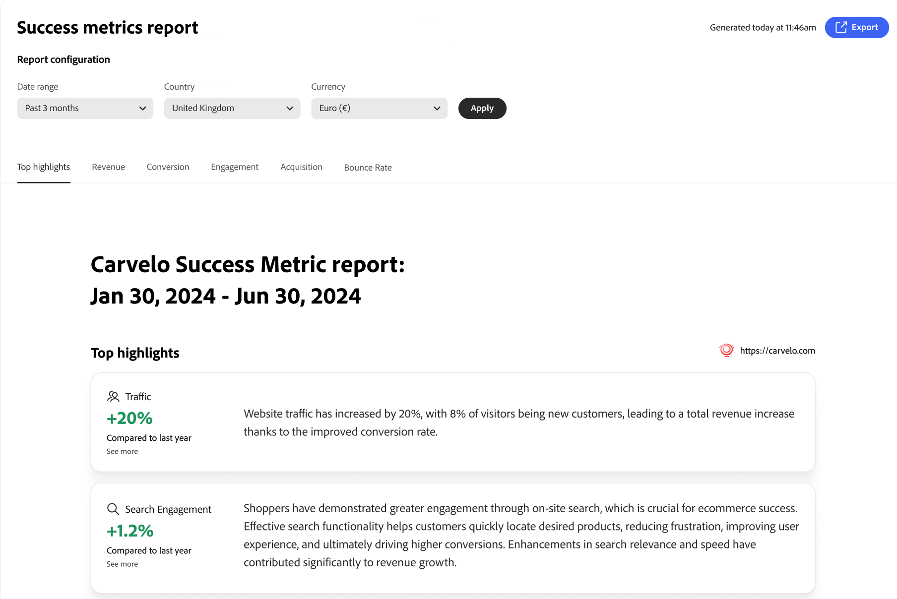

# 成功量度報表

此頁面提供您[!DNL Adobe Commerce Optimizer]存放區關鍵績效量度的概觀。 目標是讓您快速瞭解實作[!DNL Adobe Commerce Optimizer]的結果，然後協助您和您的團隊找出成長機會，並強調最佳化領域。

報告中的量度是從店面事件資料中提取。 [進一步瞭解](../setup/events/overview.md)所收集的事件資料。

## 產生報表

1. 從左側邊欄選取&#x200B;_管理結果_ > **成功量度**。
1. 在頁面頂端，選取要從中產生報表的目錄檢視。 在上面的範例影像中，選取的目錄檢視是名為&#x200B;**Carvelo**&#x200B;的虛構汽車企業集團。
1. 在&#x200B;**報表組態**&#x200B;下，根據您的地區設定指定&#x200B;**日期範圍**、**國家**&#x200B;和&#x200B;**貨幣**。
1. 按一下&#x200B;**[!UICONTROL Apply]**。

   **熱門焦點**、**收入**、**轉換**、**參與度**、**贏取**&#x200B;以及&#x200B;**跳出率**&#x200B;都根據您的報告設定更新。

1. 按一下「**[!UICONTROL Export]**」以將報表儲存為PDF。

## 欄位說明

| 欄位 | 說明 |
|---|---|
| 日期範圍 | 選項包括&#x200B;**過去3個月**、**過去7天**、**過去30天**、**過去6個月**、**過去12個月**&#x200B;以及&#x200B;**年初至今**。 |
| 國家 | 根據為您的[目錄檢視](../setup/catalog-view.md)指定的目錄來源。 |
| 貨幣 | 為您的目錄檢視指定的貨幣。 |
| 匯出 | 將報表儲存為PDF。 |
| 上方高光 | 摘要列出其他各標籤的量度。 |
| 收入 | 從銷售交易產生的總金額。 這是顯示您的企業從客戶購買中獲得多少利潤的主要財務量度。 |
| 轉換 | 您的網站完成購買的訪客百分比。 此量度會指出您的網站將瀏覽器轉換為購買者的效率。 |
| 參與度 | 測量使用者與您網站互動的積極程度，包括網站逗留時間、每個工作階段頁面數、點進率及社互動動等量度。 參與度越高，通常表示使用者覺得您的內容很有價值，而且轉換的可能性也越大。 |
| 贏取 | 指取得新客戶的程式與成本。 這包括客戶贏取成本(CAC)、流量來源等量度，以及行銷管道在將新訪客吸引到您的網站方面的成效。 |
| 跳出率 | 僅檢視一個頁面後離開您網站的訪客百分比。 高跳出率（通常高於50-60%）表示使用者找不到所尋找的內容，或頁面不符合預期，這可能對轉換和收入造成負面影響。 |
