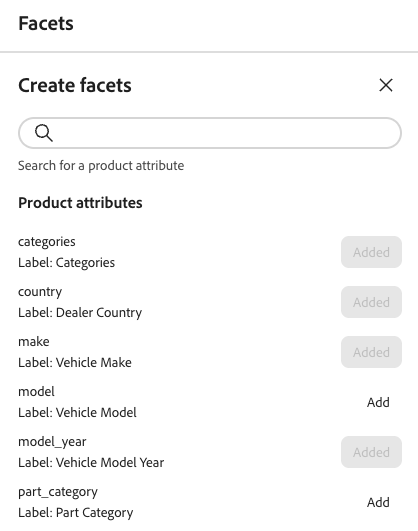

# 建立和管理Facet

任何可篩選的產品屬性都可以當作Facet使用。 Facet可協助客戶更輕鬆地在您的商店中篩選及尋找產品。 本文說明如何在店面中新增、管理和設定Facet。

## 建立Facet

1. 在左側邊欄中，選取&#x200B;_銷售_ > **多面向**，然後按一下&#x200B;**建立Facet**。
1. 在&#x200B;*建立Facet*&#x200B;清單中，每個可用屬性都有個別的。 完成下列任一項作業：

   - 在&#x200B;*Facets屬性*&#x200B;清單中，選擇您要用作Facet的產品屬性，然後按一下&#x200B;**新增**。
   - 若要尋找特定的產品屬性，請在&#x200B;*搜尋*&#x200B;方塊中輸入屬性名稱的前幾個字元。 然後，按一下&#x200B;**新增**。

   Facet已新增至&#x200B;*動態Facet*&#x200B;清單底部，且&#x200B;*發佈變更*&#x200B;按鈕可供使用。

1. 如果找不到您要新增的Facet，請使用[中繼資料API](https://developer.adobe.com/commerce/services/reference/rest/#tag/Metadata)設定`filterable`引數：

   `"filterable": true`

   下次目錄與[!DNL Adobe Commerce Optimizer]同步時，Facet便可在店面中使用。 如果兩小時後無法使用Facet，請參閱[資料同步](../../setup/data-sync.md)。

## 編輯Facet屬性（選擇性）

1. 尋找您要編輯的Facet。
1. 按一下（）更多選擇器。
1. 在功能表上，按一下&#x200B;**編輯**。 接著，視需要調整下列屬性：

   - 標籤 — 輸入您要使用的多面標籤。
   - 排序型別 — 選擇下列其中一項：
      - 依字母順序 — 依字母順序排序多面向
      - Count — 根據找到的相符數來排序Facet
   - 最大值 — 輸入店面中顯示的多面值數目上限。 有效專案： 0 - 100；預設： 8。

1. 完成時，按一下&#x200B;**儲存**。

## 釘選/取消釘選Facet

圖釘在按一下時會變更顏色，可用來將多面向移動至&#x200B;*釘選多面向*&#x200B;或&#x200B;*動態多面向*&#x200B;區段。

1. 若要將Facet釘選到&#x200B;*篩選器*&#x200B;清單的頂端，請在&#x200B;*動態Facet*&#x200B;清單中尋找Facet，然後按一下灰色圖釘（）。

   圖釘會變成藍色，而Facet會移至&#x200B;*釘住Facet*&#x200B;區段。

1. 若要取消釘選Facet，請在&#x200B;*釘選Facet*&#x200B;清單中尋找Facet，然後按一下藍色圖釘（）。

   圖釘會變成灰色，而多面會移至&#x200B;*動態Facet*&#x200B;區段。

>[!NOTE]
>
>如果有兩個標籤具有相同名稱，則釘選Facet排序可能會不一致。

## 刪除Facet

1. 在清單中尋找Facet，然後按一下（）更多選取器。
1. 按一下&#x200B;**刪除**。
1. 提示確認時，按一下&#x200B;**刪除Facet**。
多面在變更發佈後會從店面中移除。

## 發佈變更

1. 若要以您的變更更新店面，請按一下&#x200B;**[!UICONTROL Publish]**。
1. 請等候約15分鐘，讓更新出現在您的商店中。

## 其他資訊

- 若要設定價格多面向間隔與群組，請參閱[設定](../../settings.md)。
- 深入瞭解Facet的[型別](type.md)。
