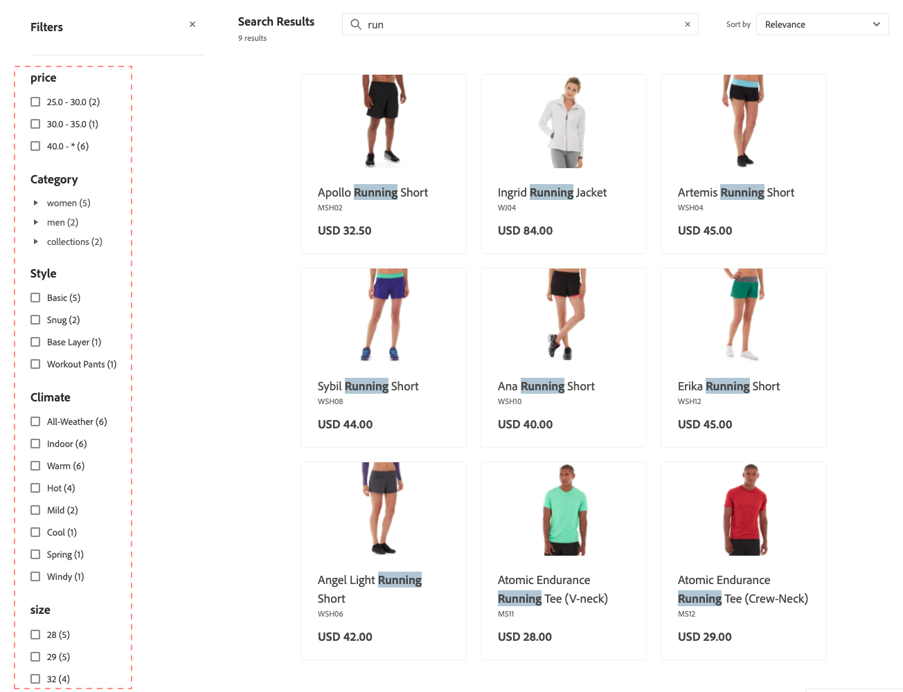

# Facet

Facet是一種高效能篩選方法，使用多個屬性值的維度做為搜尋條件。

在一個Facet中，購物者可以選取多個選項，例如「樣式」下的「基本」和「緊貼」，而搜尋結果會更新以僅顯示這些樣式。 同樣地，如果購物者選取Facet間的選項，例如「樣式」下的「基本」和「氣候」下的「室內」，搜尋結果會更新以顯示所選樣式和所選氣候。

任何已定義的Facet都可以用作URL引數，而且會根據引數值篩選結果： `http://yourstore.com?brand=acme&color=red`。

## Facet彙總

多面向彙總的執行方式如下：如果店面有三個Facet （類別、顏色和價格），且購物者篩選全部三個（顏色=藍色，價格為$10.00-50.00，類別= `promotions`）。

- `categories`彙總 — 彙總`categories`，然後套用`color`和`price`篩選器，但不套用`categories`篩選器。
- `color`彙總 — 彙總`color`，然後套用`price`和`categories`篩選器，但不套用`color`篩選器。
- `price`彙總 — 彙總`price`，然後套用`color`和`categories`篩選器，但不套用`price`篩選器。

## 預設屬性值

下列產品屬性由[!DNL Adobe Commerce Optimizer]使用且預設為啟用。

| 屬性 | 說明 | 屬性 |
|---|---|---|
| 可排序 | 用於產品清單中的排序 | `price` |
| 可搜尋 | 用於搜尋 | `price`  `sku` `name` |

請參閱[資料擷取中繼資料API](https://developer.adobe.com/commerce/services/optimizer/data-ingestion/#metadata)，進一步瞭解產品屬性及其屬性。

## 預設非系統屬性屬性

下表顯示非系統屬性的預設搜尋和可篩選特性。 將&#x200B;*Use in Search*&#x200B;屬性屬性設定為`Yes`可讓屬性在[!DNL Adobe Commerce Optimizer]中可搜尋。

| 屬性代碼 | 可搜尋 |
|--- |--- |
| 活動 | 是 |
| attributes_brand | 是 |
| 品牌 | 是 |
| 氣候 | 是 |
| 項圈 | 是 |
| 顏色 | 是 |
| 成本 | 是 |
| eco_collection |
| 性別 | 是 |
| 製造商 | 是 |
| 材質 | 是 |
| 用途 | 是 |
| strap_bag | 是 |
| style_general | 是 |

## 預設系統屬性屬性

下表顯示系統屬性的預設搜尋和可篩選特性。

| 屬性代碼 | 可搜尋 |
|--- |--- |
| allow_open_amou | 是 |
| 說明 | 是 |
| 名稱 | 是 |
| 價格 | 是 |
| short_description | 是 |
| sku | 是 |
| 狀態 | 是 |
| tax_class_id | 是 |
| url_key | 是 |
| 權重 | 是 |
