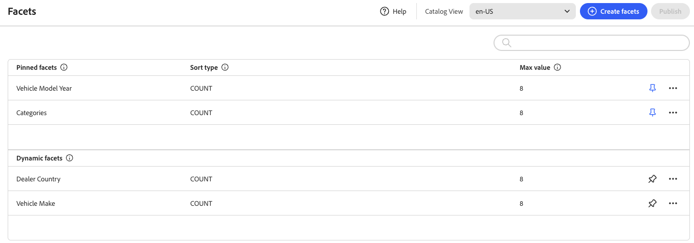

# Facet Workspace

*Facets*&#x200B;工作區會列出目前可用的所有Facet，並可讓您存取設定和管理Facet所需的工具。 釘選多面會先出現在現有多面的清單中，然後是動態多面。 您可以搜尋Facet清單。

## 欄位說明

| 欄位 | 說明 |
|--- |--- |
| 建立Facet | 開啟[面向編輯器](add.md)。 |
| 標籤 | 可編輯店面中可見的[Facet標籤](type.md#facet-labels)，使其與您的品牌保持一致。 |
| 排序型別 | 用於[排序](type.md#sort-type)多面向的方法。 所有[!DNL Adobe Commerce Optimizer]店面都會依字母順序和`Count`排序Facet。 選項： 依字母順序 — 依字母順序排序多面向。 計數 — 根據找到的相符數來排序Facet。 |
| 最大值 | 可在店面中針對每個多面顯示的最大值數量。 代表值範圍的多面會平均分佈。 有效專案： 0 - 100；預設： 8。 |

## 控制項

| 控制 | 說明 |
|--- |--- |
|  | 將Facet釘選或取消釘選到&#x200B;*篩選器*&#x200B;清單的頂端。 |
|  | 顯示可套用至所選Facet的其他動作功能表。 選項：編輯、刪除 |
