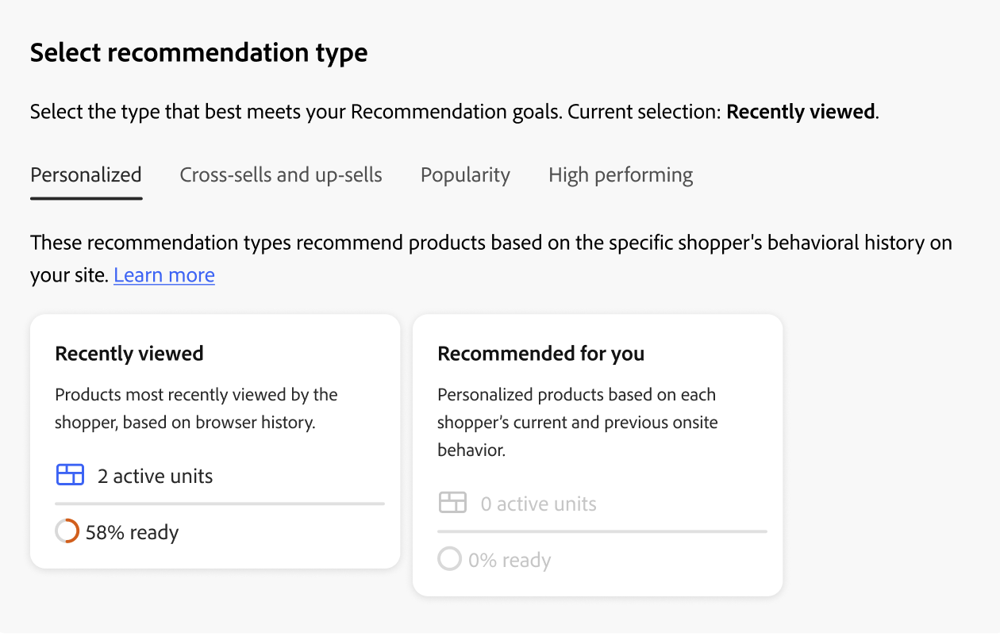

# 建立和管理建議

當您建立建議時，您會建立包含建議產品&#x200B;_專案_&#x200B;的&#x200B;_建議單位_&#x200B;或Widget。

_建議單位_

當您啟用建議單位時，Adobe Commerce會開始[收集資料](../../manage-results/recommendation-performance.md)以測量曝光數、檢視數、點按數等。 「建議」表格會顯示每個建議單位的量度，以協助您做出明智的業務決策。

1. 在&#x200B;_Adobe Commerce Optimizer_&#x200B;側邊欄上，前往&#x200B;_銷售_ > **建議**&#x200B;以顯示&#x200B;_建議_&#x200B;工作區。

1. 按一下&#x200B;**建立建議**。

1. 在&#x200B;_為您的建議命名_&#x200B;區段中，輸入描述性名稱以供內部參考，例如`Home page most popular`。

1. 在&#x200B;_選取建議型別_&#x200B;區段中，根據您的策略指定您想要的[建議型別](types.md)。

1. 在&#x200B;_店面顯示標籤_&#x200B;區段中，輸入購物者可見的[標籤](best-practice.md#recommendation-labels)，例如「最暢銷商品」。

1. 在&#x200B;_選擇產品數目_&#x200B;區段中，使用滑桿來指定您要顯示在建議單位中的產品數目。

   預設值為`5`，最大值為`20`。

1. （選擇性）在&#x200B;_篩選器_&#x200B;區段中，[套用篩選器](filters.md)以控制哪些產品出現在建議單位中。

1. 完成後，按一下下列其中一項：

   - **儲存為草稿**&#x200B;以便稍後編輯建議單位。 您無法修改處於草稿狀態的建議單位的建議型別。

   - **啟動**&#x200B;以啟用店面上的推薦單位。

1. 出現提示時，複製建議ID。 使用此ID可協助您識別在Edge Delivery Services店面的建議下拉式清單中使用的建議單位。

>[!IMPORTANT]
>
>有些瀏覽器可能會封鎖導致Recommendations無法如預期運作的重要指令碼。

## 管理現有的建議

您可以編輯、停用或刪除現有的建議。

1. 在&#x200B;_Adobe Commerce Optimizer_&#x200B;側邊欄上，前往&#x200B;_銷售_ > **建議**。

1. 選取您要修改的建議。

1. 按一下（）更多選擇器。

1. 在功能表中，您可以&#x200B;**停用**、**刪除**&#x200B;或&#x200B;**編輯**&#x200B;建議。 如果您選取&#x200B;**編輯**，您可以視需要調整下列設定：

   - 建議名稱
   - 店面標籤
   - 產品數量
   - 篩選產品

   您無法變更建議型別。

1. 完成時，按一下&#x200B;**儲存變更**。

## 整備程度指標

整備程度指標會根據可用的目錄和行為資料，顯示哪些建議型別的效能最佳。 您也可以使用整備程度指標來判斷您是否有[事件集合](../../setup/events/overview.md)的問題，或您是否沒有足夠的流量填入建議型別。

整備程度指標可歸類為[靜態型](#static-based)或[動態型](#dynamic-based)。 靜態式只會使用目錄資料，而動態式則會使用購物者的行為資料。 該行為資料用於[訓練機器學習模型](../../setup/events/overview.md)，以建置個人化建議並計算其整備分數。

### 如何計算整備程度指標

整備程度指示器會指出接受多少模型訓練。 指標取決於收集的事件型別、互動的產品廣度以及目錄大小。

整備程度指標百分比是透過計算得出，該計算可指出根據建議型別可能建議的產品數量。 統計資料會根據目錄的整體大小、互動數量（例如檢視、點按、新增至購物車）以及在特定時間範圍內註冊這些事件的SKU百分比，套用至產品。 例如，在假期旺季的流量中，整備程度指標顯示的值可能會高於正常流量時的值。

由於這些變數，整備程度指標百分比可能會波動。 這說明了為何您可能會看到建議型別在「準備部署」時進出。

整備程度指標的計算基礎為兩個因素：

- 足夠的結果集大小：大多數案例中傳回的結果是否足夠避免使用[備份建議](../../setup/events/overview.md#backuprecs)？
- 足夠的結果集變化：傳回的產品是否代表目錄中的各種產品？ 此因素的目標是避免少數產品成為整個網站唯一建議的專案。

系統會根據上述因素計算整備度值，並顯示如下：

- 75%或以上表示為該建議型別建議的將高度相關。
- 至少50%表示為該建議型別建議的建議將較不相關。
- 少於50%表示為該建議型別建議的建議可能無關緊要。 在此情況下，會使用[備份建議](../../setup/events/overview.md#backuprecs)。

深入瞭解[為何整備程度指標可能較低](#what-to-do-if-the-readiness-indicator-percent-is-low)。

### 以靜態為基礎

下列建議型別是以靜態為基礎，因為它們只需要目錄資料。 未使用行為資料。

- _更多類似專案_

### 動態型

下列建議型別是以動態為基礎，因為它們使用店面行為資料。

過去六個月店面行為資料：

- _已檢視此專案，已檢視該專案_
- _已檢視此專案，已購買該專案_
- _已購買此專案，已購買該專案_
- _為您推薦_

過去七天的店面行為資料：

- _檢視次數最多_
- _購買次數最多_
- _最多新增到購物車_
- _趨勢_
- _檢視購買轉換_
- _檢視到購物車轉換_

最近購物者行為資料（僅限檢視）：

- _最近檢視的專案_

### 視覺化進度

為了協助您視覺化每個建議型別的訓練進度，_選取建議型別_&#x200B;區段會顯示每個型別的整備程度。

_建議型別_

>[!NOTE]
>
>指標可能永遠不會達到100%。

相依於目錄資料的建議型別的整備程度指標百分比不會經常變更，因為商家的目錄不會經常變更。 但根據購物者行為資料的建議型別整備程度指標百分比會隨著每日購物者活動而經常變更。

#### 如果整備程度指標百分比很低，該怎麼辦

低整備百分比表示您的目錄中沒有許多產品符合納入此建議型別之建議中的資格。 這表示，如果仍要部署此建議型別，很可能傳回[備份建議](../../setup/events/overview.md#backuprecs)。

>[!IMPORTANT]
>
>不支援&#x200B;_套件_、_群組_&#x200B;和自訂產品型別。 如果您的目錄包含大量這類產品型別，可預期會有一個低整備分數。 此外，任何含有空格的SKU可能會降低建議的相關性，應加以避免。

以下列出常見低整備分數的可能原因和解決方案：

- **以靜態為基礎** — 這些指示器的低百分比可能是因為遺失可顯示產品的目錄資料所造成。 如果低於預期值，完整同步可以修正此問題。
- **以動態為基礎的指標** — 以下原因可能導致以動態為基礎的指標百分比低：

   - 個別建議型別（requestId、產品內容等）的必要[storefront事件](../../setup/events/overview.md)中缺少欄位。
   - 商店流量低，因此我們收到的行為事件數量低。
   - 商店中不同產品的店面行為事件多樣性很低。 例如，如果大部分時間都只檢視或購買您產品的10%，則各自的整備程度指標將會很低。

## 預覽建議

>[!IMPORTANT]
>
>此功能尚無法使用。

_建議產品預覽_&#x200B;面板總是隨建議單位部署至店面時可能顯示的產品範例選項一起提供。

若要在非生產環境中工作時測試建議，您可以從不同的來源擷取建議資料。 這可讓商家在部署至生產環境之前，先體驗規則並預覽建議。

| 欄位 | 說明 |
|---|---|
| 名稱 | 產品的名稱。 |
| SKU | 指派給產品的庫存單位 |
| 價格 | 產品的價格。 |
| 結果型別 | 主要 — 表示收集到的訓練資料足夠顯示建議。 備份 — 表示未收集足夠的訓練資料，所以使用備份建議來填滿位置。 移至[行為資料](../../setup/events/overview.md)以進一步瞭解機器學習模型和備份建議。 |

當您建立建議單位時，請嘗試使用建議型別和篩選器，以取得即將包含之產品的即時即時回饋。 當您開始瞭解顯示的產品時，可以設定建議單位以符合您的業務需求。

[!DNL Adobe Commerce Optimizer] [篩選器](filters.md)建議，以避免在單一頁面上部署多個建議單位時顯示重複的產品。 因此，預覽面板中顯示的產品可能與店面中顯示的產品不同。
