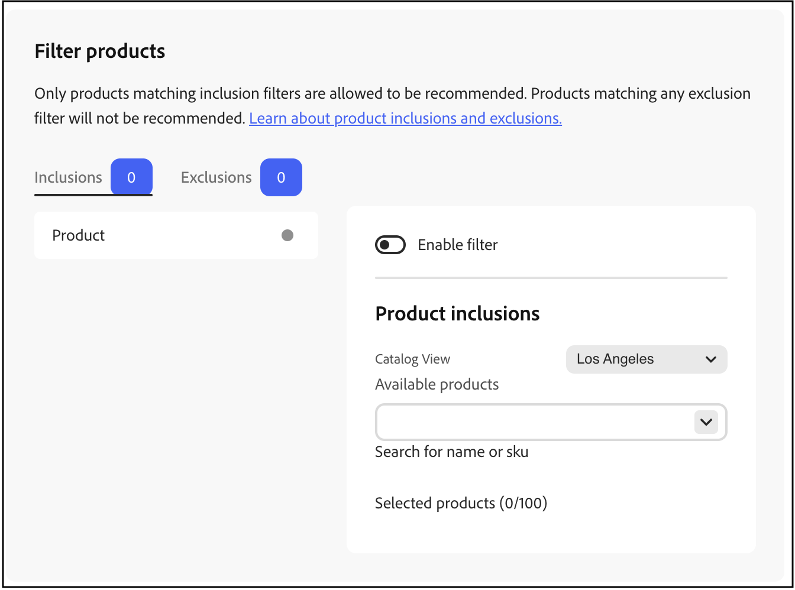

# 篩選產品

[!DNL Adobe Commerce Optimizer]會自動將無法設定的預設篩選器套用至建議單位。 如果您將多個建議單位部署至一個頁面，[!DNL Adobe Commerce Optimizer]會篩選掉單位中重複的任何產品。 系統只會使用重複產品的第一次參考，以便給其他建議的產品騰出空間。 [!DNL Adobe Commerce Optimizer]也會篩選掉任何先前購買過的產品以及購物車中的產品。

當您[建立](create.md)建議單位時，您可以定義篩選器來控制哪些產品可以顯示在建議中。 這些篩選器是根據您定義的一組包含或排除條件。 只有符合所有包含條件的產品才會出現在建議中。 不建議使用符合任何排除條件的產品。

您可以設定多個篩選器，並只啟用您想要的篩選器，方法是選取每個篩選器頁面上的切換按鈕。 這可讓您建立篩選草稿以供日後使用。 每個標籤上會顯示已啟用的篩選器的數目。

## 條件

條件可以是靜態或動態。

- 靜態條件會使用現有的產品屬性來決定哪些產品可以出現在單位中。 例如，您可以指定只有價格超過$25的庫存產品才會出現在單位中。

- 一個動態條件可關閉購物者目前的內容，例如目前檢視的類別或產品。 例如，建立要在產品詳細資料頁面上部署的產品建議時，您可以建立條件，以僅建議目前檢視之產品相對價格範圍內的產品。

### 邏輯運運算元

邏輯運運算元`AND`和`OR`用於聯結多個條件。 如果同時使用包含和排除篩選器，系統會先評估包含專案，以判斷所有可能的建議產品，然後從清單中移除符合任何排除篩選器的產品。

- `AND` — 加入兩個包含篩選條件
- `OR` — 加入兩個排除篩選條件

## 篩選器型別

### 產品

產品篩選器會指定哪些特定產品符合或不符合條件，以便顯示在建議中。 您無法選取已停用或無法個別顯示的產品，因為這些產品永遠無法出現在建議中。

>[!NOTE]
>
>可設定產品的子產品不會顯示在建議單位中，因為這些子產品具有&#x200B;_不個別顯示_&#x200B;的可見性。

### 價格

根據產品價格的篩選器會使用最終價格來執行比較。 最終價格包含匿名購物者可使用的任何折扣或特殊價格。

<!--### Attribute

You can filter products based on attribute criteria, including attribute values. Selected values use OR logic to either include or exclude products when any of the specified values are found.-->
